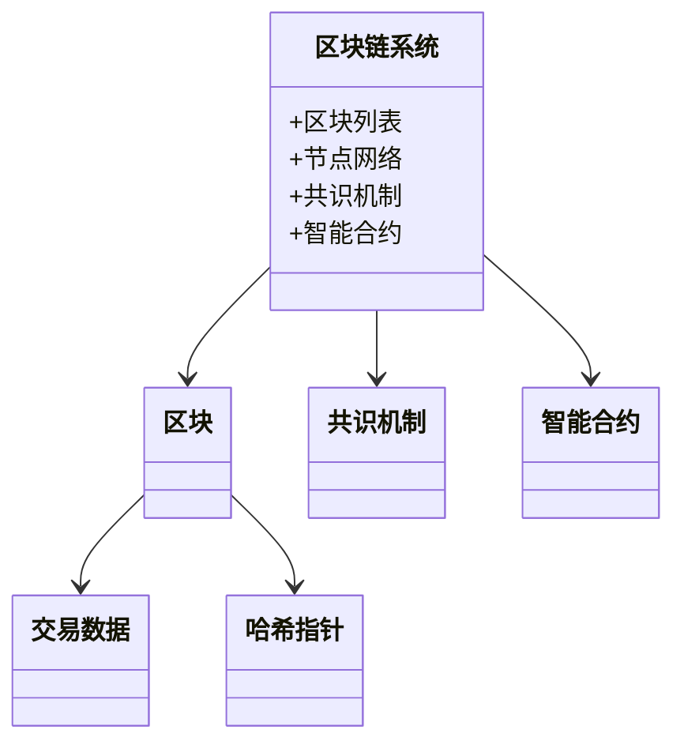
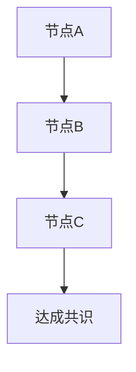
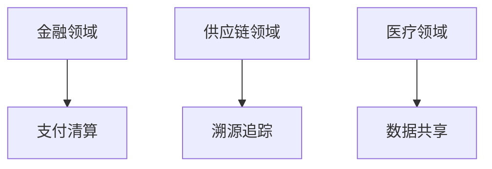

                 

# 巴菲特-芒格看区块链：技术创新与投资机会

> 关键词：巴菲特、芒格、区块链、投资、技术创新、经济模型

> 摘要：本文从巴菲特和芒格的投资哲学出发，结合区块链技术的核心概念与应用场景，分析了区块链技术对传统金融的颠覆性影响以及投资机会。通过对比区块链与传统金融体系的特点，探讨了巴菲特和芒格对区块链技术的评价与投资策略。最后，结合实际案例，总结了区块链投资的核心逻辑与未来发展趋势。

---

## 第二章：区块链技术的核心概念

### 2.1 区块链的基本原理

#### 2.1.1 区块链的定义与技术架构

区块链是一种去中心化的分布式账本技术，通过密码学和分布式网络实现数据的不可篡改性和安全性。其技术架构主要包括以下几个核心组件：

1. **数据结构**：区块链由一个个区块组成，每个区块包含交易数据和哈希指针（用于指向前一个区块）。
2. **共识机制**：通过共识算法（如比特币的PoW、以太坊的PoS）确保所有节点达成一致。
3. **节点网络**：区块链网络由多个节点组成，每个节点都存储完整的账本副本。
4. **智能合约**：一种基于区块链的自动化执行程序，用于实现复杂的业务逻辑。

区块链的技术架构可以用以下类图表示：

#### 2.1.2 区块链的核心特征：去中心化、不可篡改、透明性

区块链的核心特征可以用以下对比表展示：

| 特征       | 传统金融体系 | 区块链技术 |
|------------|--------------|------------|
| 中心化     | 高           | 低         |
| 数据可篡改 | 高           | 低         |
| 透明性     | 低           | 高         |

#### 2.1.3 区块链的共识机制与激励机制

区块链的共识机制是确保网络中所有节点达成一致的核心算法。常见的共识机制包括：

1. **工作量证明（PoW）**：比特币采用的共识机制，节点通过解决哈希难题来验证交易。
2. **权益证明（PoS）**：以太坊计划采用的共识机制，节点通过持有代币数量来决定记账权。
3. **实用拜占庭容错（PBFT）**：一种适用于联盟链的共识机制，能够在部分节点故障或攻击的情况下达成共识。

共识机制的流程可以用以下流程图表示：

激励机制则是通过代币发行来激励节点参与网络的维护。例如，比特币网络中，矿工通过解决哈希难题获得比特币奖励。

### 2.2 区块链的分类与应用场景

#### 2.2.1 公链、私链与联盟链的区别

区块链可以分为以下几种类型：

1. **公链（Public Blockchain）**：完全去中心化的区块链，任何人都可以参与，例如比特币、以太坊。
2. **私链（Private Blockchain）**：仅限于特定组织或机构内部使用的区块链，例如企业内部的供应链管理。
3. **联盟链（ Consortium Blockchain）**：由多个机构共同组成的区块链网络，例如金融行业的跨境支付系统。

不同类型区块链的对比可以用以下表格表示：

| 类型       | 特点                           | 适用场景             |
|------------|--------------------------------|----------------------|
| 公链       | 开放性高，去中心化程度高       | 去中心化金融（DeFi）等 |
| 私链       | 封闭性高，去中心化程度低       | 企业内部管理         |
| 联盟链     | 半去中心化，由联盟内机构共同管理 | 跨机构协作           |

#### 2.2.2 区块链在金融、供应链、医疗等领域的应用

区块链技术在多个领域的应用可以用以下流程图表示：

---

## 第三章：巴菲特与芒格视角下的区块链投资机会

### 3.1 区块链技术对传统金融的颠覆性影响

#### 3.1.1 区块链如何降低金融交易成本

区块链技术通过去中心化和自动化技术，大幅降低了传统金融体系中的交易成本。例如，传统的跨境支付需要通过多个中间银行，而区块链可以直接点对点完成交易，减少中间环节的费用。

#### 3.1.2 区块链如何提高金融系统的透明度

区块链的透明性和不可篡改性使得金融系统的透明度大幅提高。例如，区块链上的每笔交易都可以被追踪和验证，从而减少金融欺诈和舞弊行为。

#### 3.1.3 区块链如何改变传统金融机构的角色

区块链技术的普及可能改变传统金融机构的角色，例如银行可能从交易中介转变为区块链上的智能合约执行者。

### 3.2 巴菲特与芒格对区块链技术的评价

#### 3.2.1 巴菲特对区块链技术的谨慎态度

巴菲特对区块链技术的态度可以用以下表格表示：

| 投资者   | 态度       | 原因                     |
|----------|------------|--------------------------|
| 巴菲特   | 谨慎       | 技术不成熟，市场波动大    |
| 芒格     | 乐观       | 技术潜力巨大，长期看好    |

#### 3.2.2 芒格对区块链技术的乐观看法

芒格认为区块链技术具有巨大的潜力，尤其是在去中心化和信任建立方面。他指出，区块链技术可以降低交易成本并提高金融系统的效率。

#### 3.2.3 两人对区块链投资机会的共识与分歧

虽然巴菲特和芒格在区块链技术的短期投资价值上存在分歧，但他们一致认为区块链技术具有长期的潜力，并可能对传统金融体系产生深远影响。

---

## 第四章：区块链投资的核心逻辑与策略

### 4.1 区块链项目的估值与分析

#### 4.1.1 区块链项目的评估维度

区块链项目的评估可以从以下几个维度进行：

1. **技术维度**：项目的技术实现是否成熟，是否存在技术瓶颈。
2. **团队维度**：团队的经验和能力是否足以支撑项目的发展。
3. **市场维度**：项目的市场需求是否足够大，是否有明确的商业模式。
4. **社区维度**：项目的社区活跃度和参与度是否足以支撑项目的长期发展。

#### 4.1.2 区块链项目的市场定位与竞争分析

通过分析区块链项目的市场定位和竞争环境，可以更好地判断项目的投资价值。例如，以太坊在智能合约领域的市场定位使其成为DeFi领域的主导平台。

#### 4.1.3 区块链项目的长期价值判断

长期价值判断需要结合技术发展、市场需求和团队能力等多个因素。例如，以太坊的Layer 2解决方案（如Rollup）可以显著提高交易效率，从而增强其长期价值。

### 4.2 巴菲特与芒格的投资策略在区块链领域的应用

#### 4.2.1 价值投资在区块链项目中的体现

价值投资的核心是寻找具有长期竞争优势的项目。在区块链领域，这意味着选择技术领先、市场需求明确、团队能力强的项目。

#### 4.2.2 长期持有与区块链项目的成长性

区块链项目的成长性是长期投资的核心考虑因素。例如，比特币的总量有限，且其去中心化特性使其具有长期的存储价值。

#### 4.2.3 风险管理在区块链投资中的重要性

区块链投资的风险较高，因此风险管理尤为重要。投资者可以通过分散投资、选择优质项目等方式来降低投资风险。

---

## 第五章：区块链投资的风险与挑战

### 5.1 区块链投资的主要风险

#### 5.1.1 技术风险

技术风险是区块链投资的主要风险之一。例如，技术不成熟可能导致项目失败，或者技术漏洞可能导致安全性问题。

#### 5.1.2 市场风险

市场风险主要体现在价格波动和市场泡沫上。区块链项目的市场价格可能因市场炒作而大幅波动，投资者需要警惕市场风险。

#### 5.1.3 法律风险

区块链项目的法律风险主要体现在政策监管和合规性问题上。例如，各国对区块链技术的监管政策不一，可能影响项目的合规性。

### 5.2 如何应对区块链投资的风险

#### 5.2.1 建立全面的风险管理体系

投资者可以通过建立全面的风险管理体系来降低投资风险。例如，制定详细的投资策略、定期评估投资项目的风险。

#### 5.2.2 选择优质项目与团队

选择优质项目和团队是降低投资风险的重要手段。例如，选择技术领先、团队能力强、市场需求明确的项目。

#### 5.2.3 保持长期视角与耐心

区块链技术的发展需要时间，投资者需要保持长期视角和耐心，避免因短期波动而盲目决策。

---

## 第六章：区块链的未来发展趋势与投资机会

### 6.1 区块链技术的未来发展方向

#### 6.1.1 技术创新

技术创新是区块链发展的核心驱动力。例如，Layer 2解决方案和跨链技术的发展将显著提高区块链的性能和适用性。

#### 6.1.2 应用扩展

区块链的应用场景将不断扩展。例如，区块链在DeFi、NFT等领域的深化应用将推动技术的进一步发展。

#### 6.1.3 行业融合

区块链技术将与实体经济深度融合。例如，区块链技术在供应链、医疗等领域的广泛应用将推动行业的数字化转型。

### 6.2 巴菲特与芒格视角下的未来投资机会

#### 6.2.1 区块链在金融领域的长期潜力

区块链在金融领域的潜力主要体现在去中心化金融（DeFi）和跨境支付等方面。例如，DeFi的市场规模可能在未来几年内达到数千亿美元。

#### 6.2.2 区块链在实体经济中的广泛应用

区块链技术将逐步渗透到实体经济的各个领域，例如供应链、医疗、教育等。这将为投资者提供更多的投资机会。

#### 6.2.3 新兴技术与区块链的结合

新兴技术（如人工智能、物联网）与区块链的结合将带来新的投资机会。例如，AI驱动的智能合约将提高区块链的自动化能力。

---

## 第七章：总结与展望

### 7.1 巴菲特与芒格对区块链投资的核心观点总结

#### 7.1.1 价值投资在区块链领域的适用性

价值投资的核心是寻找具有长期竞争优势的项目。在区块链领域，这意味着选择技术领先、市场需求明确、团队能力强的项目。

#### 7.1.2 技术创新与市场应用的平衡

技术创新是区块链发展的核心驱动力，但市场应用同样重要。投资者需要关注技术与市场的结合，选择具有实际应用场景的项目。

#### 7.1.3 长期投资与风险

区块链投资具有较高的风险，但长期来看，区块链技术的潜力巨大。投资者需要保持长期视角，同时注重风险管理。

---

## 作者：AI天才研究院/AI Genius Institute & 禅与计算机程序设计艺术 /Zen And The Art of Computer Programming

---

以上是《巴菲特-芒格看区块链：技术创新与投资机会》的技术博客文章的详细内容。

