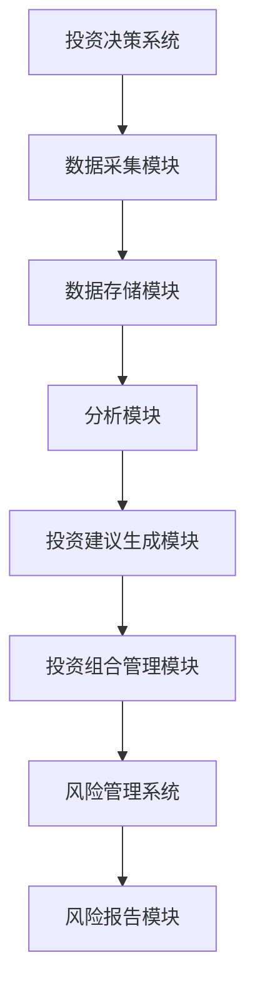

                 

# 巴菲特-芒格策略在不同市场环境下的表现

## 关键词：巴菲特, 芒格, 价值投资, 市场环境, 投资策略, 系统性分析

## 摘要：  
巴菲特和芒格的价值投资策略是投资领域的重要理论，本文通过分析其在不同市场环境下的表现，探讨如何根据市场变化调整投资策略，结合数学模型和系统架构，提供深度的策略分析和实际案例，最终总结出在不同市场环境下的最佳投资实践。

---

## 第一部分：巴菲特-芒格策略的基础

### 第1章：巴菲特-芒格投资策略概述

#### 1.1 投资策略的背景与核心理念

##### 1.1.1 价值投资的起源与发展
价值投资起源于20世纪初，由本杰明·格雷厄姆和戴维·多德提出。巴菲特早期深受格雷厄姆的影响，后来发展出自己的价值投资体系。芒格则带来了多元思维模型，强调独立思考和长期视角。

##### 1.1.2 巴菲特与芒格的投资理念
- **巴菲特**：注重企业的基本面分析，寻找具有持续竞争优势和良好管理团队的企业，坚持安全边际和长期投资。
- **芒格**：强调多元思维模型，关注企业的内在价值和市场情绪，避免情绪化决策。

##### 1.1.3 价值投资的核心原则
1. **安全边际**：买入价格低于内在价值的企业。
2. **长期视角**：关注企业的长期盈利能力，而非短期波动。
3. **集中投资**：将资金集中在少数具有竞争优势的企业上。

#### 1.2 巴菲特-芒格策略的关键要素

##### 1.2.1 财务分析的重要性
- 资产负债表：关注企业的资产质量、负债情况和股东权益。
- 利润表：分析企业的收入、成本和利润情况。
- 现金流量表：评估企业的现金流健康状况。

##### 1.2.2 安全边际的概念
安全边际 = 内在价值 - 市场价格。巴菲特建议以低于内在价值的价格买入股票，以确保投资的安全性。

##### 1.2.3 股东权益与企业价值评估
企业价值 = 股东权益 + 债务价值 - 现金储备。巴菲特通过ROE（净资产收益率）来评估企业的盈利能力。

#### 1.3 投资策略的框架与策略

##### 1.3.1 股票估值模型
- **DCF模型**：通过现金流折现法评估企业价值。
- **相对估值法**：比较市盈率、市净率等指标。

##### 1.3.2 投资组合的构建与优化
- **集中投资**：将资金分配给少数优质企业。
- **分散风险**：通过不同行业的配置降低风险。

##### 1.3.3 风险管理与策略调整
- 定期审视投资组合，根据市场变化调整策略。
- 保持足够的流动资金应对市场波动。

---

### 第2章：市场环境的分类与分析

#### 2.1 不同市场环境的特征

##### 2.1.1 牛市环境
- 特征：市场情绪乐观，股价上涨，估值偏高。
- 投资机会：高增长企业的股票可能被高估，但仍需寻找具有竞争优势的企业。

##### 2.1.2 熊市环境
- 特征：市场情绪悲观，股价下跌，估值偏低。
- 投资机会：寻找被市场低估的企业，安全边际增大。

##### 2.1.3 经济周期波动
- 特征：经济周期分为复苏、繁荣、衰退、萧条四个阶段，影响企业盈利和股价。

#### 2.2 不同市场环境下的策略调整

##### 2.2.1 牛市中的投资策略
- 选择具有强大竞争优势的企业，避免追高。
- 保持适当的仓位，避免过度集中。

##### 2.2.2 熊市中的防御策略
- 选择估值低、财务健康的股票。
- 增加现金储备，等待更好的投资机会。

##### 2.2.3 经济周期中的资产配置
- 在经济复苏阶段，投资周期性股票。
- 在经济繁荣阶段，投资成长型企业。
- 在经济衰退阶段，寻找价值股。

---

### 第3章：巴菲特-芒格策略在不同市场环境下的表现

#### 3.1 牛市环境中的策略表现

##### 3.1.1 高增长企业的投资机会
- 巴菲特在牛市中选择具有持续增长能力的企业，如可口可乐和苹果。
- 芒格强调多元思维模型，避免情绪化投资。

##### 3.1.2 安全边际的调整
- 在牛市中，安全边际缩小，需要更谨慎地选择股票。
- 巴菲特通过ROE和现金流分析，寻找低估的企业。

##### 3.1.3 投资组合的优化
- 保持集中投资，但需动态调整持仓。
- 定期审视投资组合，确保符合市场变化。

#### 3.2 熊市环境中的策略表现

##### 3.2.1 价值陷阱的识别
- 避免投资于基本面不佳的股票，即使估值低。
- 通过财务分析和行业研究，识别真正的价值股。

##### 3.2.2 安全边际的扩大
- 在熊市中，安全边际增大，可以买入被市场低估的股票。
- 巴菲特和芒格在1987年股灾后买入大量股票，取得了长期收益。

##### 3.2.3 投资组合的防御性调整
- 增加现金储备，减少高风险资产。
- 选择防御性行业，如公用事业和消费品行业。

#### 3.3 经济周期波动中的策略表现

##### 3.3.1 不同周期阶段的策略选择
- **复苏阶段**：投资于经济敏感型股票。
- **繁荣阶段**：投资于成长型企业。
- **衰退阶段**：寻找价值股和防御性股票。

##### 3.3.2 资产配置的动态调整
- 根据经济周期变化，动态调整股票和债券的比例。
- 在经济衰退阶段，增加债券配置，降低投资组合的风险。

##### 3.3.3 风险管理的强化
- 设置止损点，避免重大损失。
- 定期审视投资组合，确保符合经济周期变化。

---

### 第4章：巴菲特-芒格策略的系统性分析

#### 4.1 投资决策的系统性框架

##### 4.1.1 投资目标的设定
- 明确投资目标：长期收益、风险承受能力。
- 设定合理的收益目标，避免过度追求短期收益。

##### 4.1.2 数据收集与分析
- 通过财务报表分析企业的基本面。
- 使用DCF模型和相对估值法评估企业价值。

##### 4.1.3 策略制定与执行
- 根据市场环境制定投资策略。
- 通过投资组合优化实现收益和风险的平衡。

#### 4.2 投资组合的动态管理

##### 4.2.1 组合构成的调整
- 根据市场变化，动态调整持仓。
- 保持足够的分散性，降低风险。

##### 4.2.2 风险管理的机制
- 设置止损点，避免重大损失。
- 定期审视投资组合，确保符合市场变化。

##### 4.2.3 性能评估与反馈
- 定期评估投资组合的收益和风险。
- 根据评估结果，调整投资策略。

#### 4.3 系统性分析的数学模型

##### 4.3.1 价值评估模型
$$ 企业价值 = \sum_{t=1}^{\infty} \frac{\text{现金流}_t}{(1 + r)^t} $$
其中，r为折现率，现金流为企业未来产生的现金流。

##### 4.3.2 投资组合优化的数学公式
$$ \text{最大化 } \mu - \lambda \sigma $$
其中，μ为投资组合的预期收益，σ为投资组合的风险，λ为风险厌恶系数。

##### 4.3.3 风险管理的数学模型
$$ \text{VaR} = \text{损失的极限值} $$
VaR表示在一定置信水平下的潜在损失。

---

## 第5章：项目实战——巴菲特-芒格策略的应用

#### 5.1 项目背景与目标
- 项目目标：根据市场环境，应用巴菲特-芒格策略构建投资组合。
- 项目背景：当前市场处于牛市，但部分行业存在泡沫。

#### 5.2 系统功能设计

##### 5.2.1 投资决策系统
- 功能：根据市场环境和企业基本面，生成投资建议。
- 输入：市场数据、企业财务数据。
- 输出：投资组合建议。

##### 5.2.2 风险管理系统
- 功能：实时监控投资组合的风险。
- 输入：投资组合数据、市场数据。
- 输出：风险评估报告。

#### 5.3 系统架构设计

##### 5.3.1 系统架构图

#### 5.4 系统接口设计

##### 5.4.1 数据接口
- 输入接口：市场数据接口、企业财务数据接口。
- 输出接口：投资建议接口、风险报告接口。

##### 5.4.2 用户接口
- 用户界面：投资组合管理界面、风险监控界面。

#### 5.5 系统交互流程

##### 5.5.1 投资决策流程
1. 数据采集模块获取市场和企业数据。
2. 分析模块进行企业估值和风险评估。
3. 投资建议生成模块根据分析结果生成投资建议。
4. 投资组合管理模块根据建议调整持仓。
5. 风险管理系统实时监控投资组合风险。

---

## 第6章：总结与展望

#### 6.1 经验与教训
- 在不同市场环境下，巴菲特-芒格策略表现各异，需根据市场变化灵活调整。
- 价值投资需结合系统性分析和风险管理，避免情绪化决策。

#### 6.2 最佳实践
- 定期审视投资组合，根据市场变化调整策略。
- 保持足够的现金储备，应对市场波动。
- 注重企业的基本面分析，寻找具有竞争优势的企业。

#### 6.3 未来展望
- 结合人工智能技术，提升投资决策的效率和准确性。
- 开发更复杂的数学模型，优化投资组合的风险收益比。

---

## 附录

#### 附录A：工具与资源
- 数据分析工具：Python、Excel、Tableau。
- 财务分析工具：Morningstar、FactSet。
- 书籍推荐：《巴菲特传》、《芒格的投资思想》。

#### 附录B：术语表
- 价值投资：通过买入低于内在价值的股票，实现长期收益。
- 安全边际：买入价格低于内在价值的部分。
- ROE：净资产收益率，衡量企业的盈利能力。

---

## 参考文献
1. 巴菲特，沃伦·E. (2008). 《巴菲特致股东的信：投资者的思想》.
2. 芒格，查理. (2007). 《芒格的投资思想：理性思维的百家企业案例》.
3. 格雷厄姆，本杰明. (2005). 《价值投资入门》.

---

## 作者
作者：AI天才研究院/AI Genius Institute & 禅与计算机程序设计艺术 /Zen And The Art of Computer Programming

---

以上为完整的技术博客文章，涵盖了巴菲特-芒格策略在不同市场环境下的表现，结合了背景介绍、核心概念、算法原理、数学模型、系统架构和项目实战等多方面的内容，旨在为读者提供深度的策略分析和实际应用指导。

