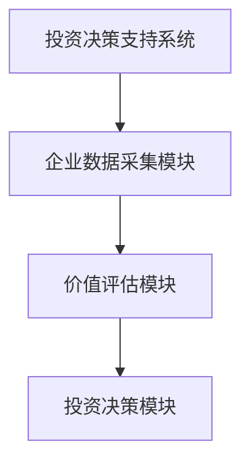

                 

# 巴菲特-芒格策略：长期投资的成功之道

## 关键词：
- 巴菲特
- 芒格
- 价值投资
- 长期投资
- 安全边际

## 摘要：
本文系统地介绍巴菲特和芒格的投资策略，探讨长期投资的成功之道。文章从背景介绍、核心概念、算法原理、数学模型、系统架构、项目实战到最佳实践，全面解析巴菲特-芒格策略的精髓，为投资者提供深度的理论支持和实践指导。

---

# 第一部分: 巴菲特-芒格投资策略的背景与核心理念

# 第1章: 巴菲特与芒格的投资哲学

## 1.1 巴菲特的生平与投资理念
### 1.1.1 巴菲特的早年经历与投资启蒙
沃伦·巴菲特（Warren Buffett）于1930年出生在美国堪萨斯州，早年展现出对投资的浓厚兴趣。他通过阅读格雷厄姆的《证券分析》奠定了价值投资的基础，并在职业生涯中不断完善自己的投资理念。

### 1.1.2 巴菲特的核心投资哲学
巴菲特强调“价格是买入的好机会”，即注重企业的内在价值而非市场波动。他倡导集中投资，选择具有持续竞争优势的企业，并长期持有。

### 1.1.3 巴菲特的风格与特点
巴菲特以稳健、保守的投资风格著称，注重企业的财务健康、管理层素质以及行业地位。他的投资策略强调安全边际，即买入价格低于企业内在价值，以降低风险。

## 1.2 芮格的生平与投资哲学
### 1.2.1 芮格的早年经历与投资理念
查理·芒格（Charlie Munger）是巴菲特的长期合作伙伴，两人共同创立了伯克希尔哈撒韦公司。芒格注重多元思维模型，主张跨学科思考，强调理性决策和避免认知偏差。

### 1.2.2 芮格的核心投资哲学
芒格倡导“反人性”投资，即在市场恐慌时保持冷静，在市场狂热时保持理性。他强调安全边际和企业竞争优势，主张投资那些能够持续创造价值的企业。

## 1.3 巴菲特与芒格合作的投资理念
### 1.3.1 价值投资的定义与核心要素
价值投资是指以低于企业内在价值的价格买入优质股票，长期持有并分享企业成长的收益。

### 1.3.2 长期投资的成功之道
长期投资的核心在于选择具有持续竞争优势的企业，并耐心等待其成长。巴菲特和芒格的成功证明了长期投资的可持续性和盈利能力。

### 1.3.3 巴菲特与芒格策略的差异与统一
尽管巴菲特和芒格在具体操作上有所不同，但他们都坚持价值投资和长期持有的核心理念，强调安全边际和企业竞争优势。

## 1.4 本章小结
本章通过介绍巴菲特和芒格的生平、投资哲学及合作理念，揭示了他们成功投资策略的核心要素：价值投资、安全边际、长期持有和企业竞争优势。这些要素共同构成了巴菲特-芒格策略的基础框架，为后续的分析提供了理论支撑。

---

# 第二部分: 巴菲特-芒格策略的核心概念与联系

# 第2章: 价值投资的核心概念

## 2.1 价值投资的定义与核心要素
### 2.1.1 价值投资的定义
价值投资是一种以低于企业内在价值的价格买入优质股票的投资策略，强调安全边际和长期持有。

### 2.1.2 价值投资的核心要素
- **内在价值**：企业未来现金流的现值，是投资决策的核心依据。
- **安全边际**：买入价格低于内在价值，以降低投资风险。
- **竞争优势**：企业具备持续盈利的能力，通常表现为高ROE、强大的品牌和市场地位。

### 2.1.3 价值投资与其它投资策略的对比
价值投资与趋势投资、技术分析等策略的对比，强调其注重基本面和长期持有的特点。

## 2.2 安全边际的概念与应用
### 2.2.1 安全边际的定义
安全边际是指买入价格与企业内在价值之间的差距，用于降低市场波动和估值错误带来的风险。

### 2.2.2 安全边际的计算方法
安全边际 = 内在价值 - 市场价格

### 2.2.3 安全边际在投资决策中的应用
在选择投资标的时，优先考虑具有较大安全边际的企业，以确保投资的稳健性。

## 2.3 核心竞争力与竞争优势
### 2.3.1 核心竞争力的定义
核心竞争力是指企业在市场中能够持续保持竞争优势的关键能力，如技术创新、成本优势和品牌影响力。

### 2.3.2 核心竞争力的评估方法
通过分析企业的财务表现、行业地位和管理团队等因素，评估其核心竞争力。

### 2.3.3 核心竞争力在投资中的应用
选择具备强大核心竞争力的企业，能够确保长期的投资收益。

## 2.4 价值评估与市场定价
### 2.4.1 价值评估的定义
价值评估是通过分析企业的财务数据和市场环境，估算其内在价值。

### 2.4.2 市场定价的定义
市场价格是市场参与者对企业的估值，受市场情绪和短期因素的影响。

### 2.4.3 价值评估与市场定价的关系
内在价值是市场定价的基础，而市场价格围绕内在价值波动。价值投资者关注内在价值与市场价格的差异，寻找低估的投资机会。

## 2.5 本章小结
本章详细阐述了价值投资的核心概念，包括内在价值、安全边际、竞争优势等，揭示了这些概念在投资决策中的重要性。通过对比和分析，进一步明确了巴菲特-芒格策略的理论基础和实践意义。

---

# 第三部分: 巴菲特-芒格策略的算法原理与数学模型

# 第3章: 投资决策的算法原理

## 3.1 巴菲特-芒格投资策略的算法框架
### 3.1.1 投资策略的输入与输出
- **输入**：企业基本面数据、市场环境、财务指标等。
- **输出**：投资决策（买入、持有、卖出）。

### 3.1.2 投资策略的算法流程
1. 企业筛选：根据财务指标和竞争优势筛选潜在投资标的。
2. 价值评估：估算企业的内在价值。
3. 安全边际分析：比较市场价格与内在价值，确定安全边际。
4. 投资决策：根据安全边际和竞争优势决定是否买入或持有。

### 3.1.3 投资策略的优化与改进
通过历史数据验证和实证分析，不断优化投资策略，提高决策的准确性。

## 3.2 价值评估的数学模型
### 3.2.1 股票内在价值的计算公式
$$ \text{内在价值} = \sum_{t=1}^{\infty} \frac{\text{现金流}_t}{(1 + r)^t} $$
其中，\( r \) 为折现率，\( \text{现金流}_t \) 为第 \( t \) 年的自由现金流。

### 3.2.2 市场价值的计算公式
$$ \text{市场价值} = \text{股价} \times \text{股数} $$

### 3.2.3 安全边际的计算公式
$$ \text{安全边际} = \text{内在价值} - \text{市场价格} $$

## 3.3 核心竞争力的评估模型
### 3.3.1 核心竞争力的评估指标
- **ROE**：$$ \text{ROE} = \frac{\text{净利润}}{\text{平均股东权益}} $$
- **ROA**：$$ \text{ROA} = \frac{\text{净利润}}{\text{平均总资产}} $$
- **净利率**：$$ \text{净利率} = \frac{\text{净利润}}{\text{营业收入}} $$

### 3.3.2 核心竞争力的评估流程
1. 分析企业的财务指标，评估其盈利能力。
2. 考察企业的行业地位和竞争优势。
3. 综合评估企业的核心竞争力。

## 3.4 本章小结
本章通过构建数学模型和算法流程，详细解释了巴菲特-芒格策略的科学性和系统性。价值评估的数学公式和安全边际的计算方法为投资者提供了具体的决策依据。

---

# 第四部分: 巴菲特-芒格策略的系统架构与实践

# 第4章: 投资决策支持系统的架构设计

## 4.1 系统功能设计
### 4.1.1 系统目标
构建一个支持巴菲特-芒格策略的投资决策系统，帮助投资者进行企业筛选、价值评估和投资决策。

### 4.1.2 系统功能模块
- 企业数据采集模块：获取企业的财务数据和市场信息。
- 价值评估模块：计算内在价值和安全边际。
- 投资决策模块：根据评估结果生成投资建议。

### 4.1.3 系统功能流程
1. 数据采集：获取企业基本面数据。
2. 价值评估：计算内在价值和安全边际。
3. 投资决策：根据评估结果生成投资建议。

## 4.2 系统架构设计
### 4.2.1 系统架构图

### 4.2.2 系统接口设计
- 数据接口：与财务数据库对接，获取企业数据。
- 用户接口：提供友好的操作界面，显示评估结果和投资建议。

### 4.2.3 系统交互流程
1. 用户输入企业名称。
2. 系统采集企业数据。
3. 系统进行价值评估。
4. 系统生成投资建议。
5. 用户根据建议进行投资决策。

## 4.3 本章小结
本章通过系统架构设计，展示了如何将巴菲特-芒格策略应用于实际投资决策中。系统功能模块和架构设计为投资者提供了高效的工具支持。

---

# 第五部分: 巴菲特-芒格策略的项目实战

# 第5章: 巴菲特-芒格策略的实战案例

## 5.1 项目环境与工具
### 5.1.1 数据来源
使用公开的财务数据和市场信息，可以通过金融数据平台获取。

### 5.1.2 工具选择
使用Excel或Python进行数据处理和分析，利用相关库（如pandas、numpy）进行计算。

## 5.2 项目核心实现
### 5.2.1 企业数据采集与处理
通过网络爬虫或API接口获取企业的财务数据，清洗和整理数据。

### 5.2.2 价值评估与安全边际计算
使用数学模型计算企业的内在价值和安全边际，评估投资价值。

### 5.2.3 投资决策与结果分析
根据评估结果生成投资建议，分析投资的可行性和潜在收益。

## 5.3 实际案例分析
### 5.3.1 案例选择
选择可口可乐和苹果作为案例，分析其财务数据和市场表现。

### 5.3.2 案例分析与解读
1. **可口可乐**：具有强大的品牌和稳定的现金流，内在价值较高，适合长期投资。
2. **苹果**：作为科技巨头，具备强大的研发能力和市场地位，内在价值和安全边际均较高。

### 5.3.3 投资建议
根据评估结果，建议投资者长期持有可口可乐和苹果，享受企业的成长收益。

## 5.4 本章小结
本章通过实战案例分析，验证了巴菲特-芒格策略的有效性。通过对具体企业的分析，展示了如何应用价值评估和安全边际分析进行投资决策。

---

# 第六部分: 巴菲特-芒格策略的最佳实践

# 第6章: 最佳实践与注意事项

## 6.1 投资策略的小结
巴菲特-芒格策略的核心在于价值投资和长期持有，注重安全边际和企业竞争优势。

## 6.2 投资实践中的注意事项
### 6.2.1 风险控制
- 设置止损点，避免重大损失。
- 分散投资，降低风险集中度。

### 6.2.2 市场环境的适应
- 根据市场环境调整投资策略，避免盲目跟风。
- 关注宏观经济和行业趋势，及时调整投资组合。

## 6.3 拓展阅读与学习资源
### 6.3.1 经典书籍
- 《穷查理宝典》（The Charlie Munger Treasury）
- 《巴菲特写给股东的信》（The Letters to Shareholders）

### 6.3.2 网络资源
- 伯克希尔哈撒韦的年度报告
- 投资论坛和社区，如雪球、股吧等。

## 6.4 本章小结
本章总结了巴菲特-芒格策略的最佳实践，强调风险控制和市场适应的重要性，并提供了丰富的学习资源，帮助投资者深入理解和应用这一策略。

---

# 结语

巴菲特-芒格策略的成功不仅在于其科学的投资方法，更在于其长期坚持的价值投资理念。通过系统的理论学习、数学模型的构建、系统的架构设计和实际案例的分析，我们能够更好地理解和应用这一策略。无论是个人投资者还是机构投资者，都可以从中汲取宝贵的经验，实现稳健的投资收益。

---

# 作者：AI天才研究院 & 禅与计算机程序设计艺术

