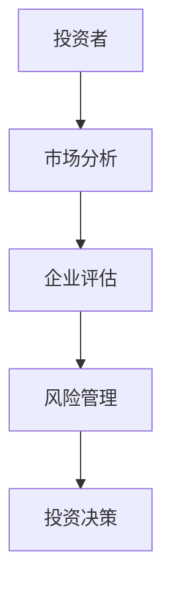
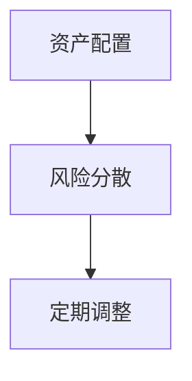

                 


# 巴菲特与芒格：'二营长'的价值投资搭档之道

## 关键词：巴菲特，芒格，价值投资，投资策略，投资搭档，投资哲学

## 摘要：本文深入分析了巴菲特和芒格这对价值投资搭档的成功之道，探讨了他们的投资策略、决策框架、系统分析方法，并通过实际案例展示了如何将这些理念应用于投资实战。文章结构清晰，内容详实，适合投资领域的专业人士和爱好者阅读。

---

## # 第一部分：引言

## # 第1章：巴菲特与芒格的背景介绍

### 1.1 巴菲特与芒格的生平简介

沃伦·巴菲特（Warren Buffett）是全球最著名的职业投资者之一，被誉为“奥马哈的神”。他出生于1930年，从小就展现出对投资的兴趣。1956年，巴菲特创立了合伙公司，开始了他的投资生涯。他以价值投资著称，强调寻找具有持续竞争优势的企业，长期持有，避免短期波动。

查理·芒格（Charlie Munger）是巴菲特的长期合作伙伴，担任伯克希尔·哈撒韦公司副董事长。芒格拥有法律背景，擅长哲学思考，他的智慧和理性思维为巴菲特的投资决策提供了重要的支持。两人共同构建了伯克希尔·哈撒韦的投资帝国，成为价值投资领域的典范。

### 1.2 价值投资的定义与核心理念

价值投资是一种投资策略，强调以低于内在价值的价格购买优质资产。其核心理念包括：

1. **安全边际**：买入价格低于内在价值，以降低风险。
2. **竞争优势**：投资具有强大护城河的企业，确保长期盈利能力。
3. **长期视角**：关注企业的长期价值，而非短期波动。

### 1.3 本书的目的与结构

本书旨在深入探讨巴菲特和芒格的价值投资方法，分析他们的成功经验，并提供实用的策略和工具。文章结构如下：

1. 引言：介绍巴菲特和芒格的背景。
2. 价值投资概述：解释核心概念。
3. 投资策略：详细分析安全边际、护城河等策略。
4. 投资决策框架：探讨企业评估和风险管理。
5. 投资组合管理：讨论系统架构和接口设计。
6. 项目实战：提供案例分析和代码示例。
7. 总结：总结经验，展望未来。

---

## # 第二部分：价值投资概述

## # 第2章：价值投资

### 2.1 价值投资的定义与核心要素

#### 核心概念解释：

价值投资的核心在于寻找市场价格低于内在价值的证券。内在价值是基于企业基本面分析得出的合理估值。投资的关键是找到具有持续竞争优势的企业，长期持有，避免频繁交易。

#### 核心要素对比表格：

| 概念         | 描述                                                                 |
|--------------|----------------------------------------------------------------------|
| 内在价值     | 企业未来现金流的现值，基于基本面分析                                       |
| 安全边际     | 购买价格低于内在价值，以降低风险                                           |
| 竞争优势     | 企业特有的竞争优势，如品牌、技术、市场准入等                               |

#### ER实体关系图：

```mermaid
erd
    左右对齐
    左边：投资者
    中间：企业
    右边：市场
    左边->中间：投资
    中间->右边：市场价值反映
```

### 2.2 投资哲学：巴菲特定律与芒格智慧

#### 巴菲特定律：

巴菲特定律强调安全边际的重要性。他提出的“ Margin of Safety ”概念，即购买价格低于内在价值，确保投资的安全性。

#### 芒格智慧：

芒格的智慧体现在他的“心智模型”概念，强调跨学科思考，构建多维度的决策框架。

### 2.3 投资策略：巴菲特定律与芒格智慧的结合

#### 巴菲特定律的应用：

巴菲特的“安全边际”策略通过计算企业的内在价值，选择低于该价值的企业进行投资。例如，假设某企业的内在价值为100美元，巴菲特可能会以80美元的价格买入，确保安全边际。

#### 芒格智慧的应用：

芒格的“心智模型”帮助投资者全面分析企业，避免认知偏差，做出更理性的决策。

---

## # 第三部分：投资策略与数学模型

## # 第3章：投资策略

### 3.1 安全边际：巴菲特定律的数学模型

#### 投资策略流程：

1. 评估企业的内在价值。
2. 确定安全边际（内在价值与市场价格的差额）。
3. 选择具有足够安全边际的企业进行投资。

#### 数学模型：

企业内在价值（V）的计算可以使用DCF模型：

$$ V = \frac{CF}{r} $$

其中，CF为未来现金流，r为贴现率。

#### 安全边际计算：

$$ \text{安全边际} = V - P $$

其中，P为市场价格。

### 3.2 护城河与竞争优势：芒格的长期视角

#### 护城河分析：

企业竞争优势的来源包括品牌、技术、市场准入等。护城河越宽，企业越能抵御竞争，长期盈利能力越强。

#### 投资决策流程：

1. 识别企业的竞争优势。
2. 分析护城河的宽度和深度。
3. 选择具有强大护城河的企业。

---

## # 第四部分：系统分析与架构设计

## # 第4章：系统分析

### 4.1 投资决策流程系统架构

#### 系统架构图：



### 4.2 投资组合管理

#### 投资组合管理：

投资组合管理包括资产配置、风险分散和定期调整。系统架构图如下：



---

## # 第五部分：项目实战

## # 第5章：项目实战

### 5.1 案例分析：伯克希尔·哈撒韦的投资策略

#### 实战案例：

分析伯克希尔·哈撒韦的投资决策，如购买可口可乐公司股票，识别其竞争优势和安全边际。

### 5.2 技术实现：Python代码示例

#### 代码示例：

```python
import pandas as pd

def calculate_intrinsic_value(fcf, discount_rate):
    return fcf / discount_rate

def calculate_margin_of_safety(intrinsic_value, market_price):
    return intrinsic_value - market_price

# 示例数据
fcf = 100000000
discount_rate = 0.1
market_price = 80000000

# 计算内在价值
iv = calculate_intrinsic_value(fcf, discount_rate)
# 计算安全边际
mos = calculate_margin_of_safety(iv, market_price)

print(f"内在价值: {iv}")
print(f"安全边际: {mos}")
```

---

## # 第六部分：总结与展望

## # 第6章：总结与展望

### 6.1 总结：巴菲特与芒格的成功经验

总结巴菲特和芒格的成功经验，强调价值投资的核心理念：安全边际、竞争优势和长期视角。

### 6.2 展望：未来投资趋势

展望未来，价值投资将继续在市场中发挥重要作用。技术的进步，如大数据分析和AI工具，将为投资者提供更强大的工具和数据支持。

---

## 作者：AI天才研究院/AI Genius Institute & 禅与计算机程序设计艺术 /Zen And The Art of Computer Programming

---

这篇文章系统地介绍了巴菲特和芒格的价值投资策略，通过理论分析和实际案例，帮助读者理解并应用这些投资理念。文章结构清晰，内容详实，适合投资领域的专业人士和爱好者阅读。

