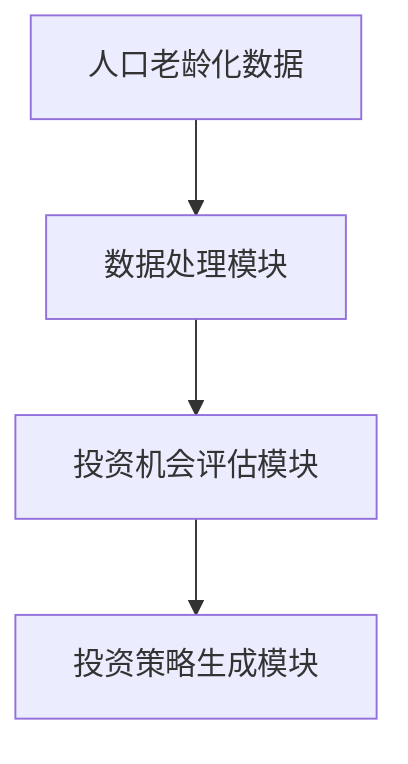
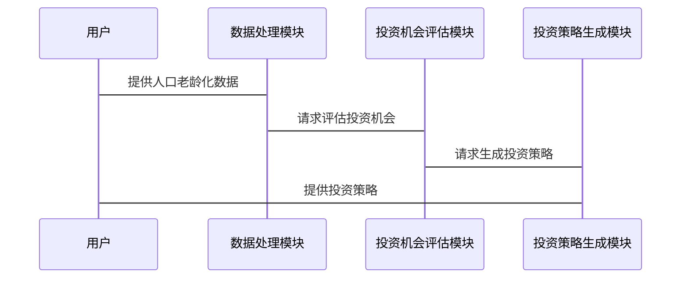

                 

<think>
嗯，用户希望我写一篇关于巴菲特如何看待人口老龄化带来的投资机会的技术博客文章。首先，我需要理解用户的需求。他是一位资深的技术专家，可能对巴菲特的投资理念和技术博客的结构有较高的要求。

用户提供了详细的目录大纲，要求文章结构清晰，内容专业。我需要按照这个大纲一步步展开，确保每一部分都详细且有深度。比如，引言部分需要介绍人口老龄化的问题背景和巴菲特的投资理念，然后详细分析两者的结合点。

接下来，我需要考虑每个章节的具体内容。例如，第二章的人口老龄化与投资机会的核心概念，可能需要解释老龄化对不同行业的影响，以及巴菲特如何从中找到投资机会。这部分可能需要加入一些数据和案例，让内容更具说服力。

在算法部分，用户要求用数学公式和代码示例。我需要设计一个简单的投资评估模型，用Python代码实现，并解释每一步的逻辑。这不仅展示技术，还能帮助读者理解巴菲特的策略。

系统架构部分，我需要画出系统的模块图和流程图，展示如何将巴菲特的理念转化为实际的系统设计。这可能包括数据收集、评估和策略生成模块。

项目实战部分，用户希望有实际案例分析，所以我会选择一个具体的行业，比如医疗健康，详细分析投资机会和实施步骤。这有助于读者将理论应用到实践中。

最后，总结部分需要回顾全书内容，并提出未来的投资建议。同时，加入一些最佳实践的小贴士，帮助读者更好地理解和应用所学内容。

总的来说，我需要确保文章结构合理，内容详实，同时使用专业而易懂的语言。通过分步骤分析，确保每个部分都深入浅出，满足用户的需求。
</think>

```markdown
# 巴菲特如何看待人口老龄化带来的投资机会

> 关键词：巴菲特，人口老龄化，投资机会，价值投资，股息率，长期投资

> 摘要：本文从巴菲特的投资理念出发，深入分析人口老龄化对全球经济的影响，揭示巴菲特如何在人口老龄化背景下寻找投资机会。通过详细讲解巴菲特的价值投资模型、股息率策略以及长期稳健投资原则，本文为投资者提供了一套在人口老龄化背景下寻找投资机会的系统方法。

---

## # 第一部分: 人口老龄化与巴菲特投资理念的结合

### # 第1章: 人口老龄化的问题背景与巴菲特投资理念概述

#### 1.1 人口老龄化的问题背景
##### 1.1.1 人口老龄化的基本概念
人口老龄化是指65岁及以上人口占总人口比例不断上升的现象，这在全球许多国家和地区都普遍存在。老龄化对经济、社会和家庭结构都有深远影响。

##### 1.1.2 人口老龄化对全球经济的影响
老龄化导致劳动力减少、社会福利支出增加、医疗资源需求上升等问题，同时也为某些行业带来了增长机会，如医疗健康、养老服务等。

##### 1.1.3 人口老龄化与投资机会的关联性
尽管老龄化带来了挑战，但也创造了新的投资机会。例如，医疗健康行业、养老服务行业以及智能养老服务行业等领域可能迎来增长。

#### 1.2 巴菲特投资理念的核心要素
##### 1.2.1 巴菲特投资理念的起源与发展
巴菲特的投资理念源于价值投资，强调以合理的价格买入具有持续竞争优势的企业，并长期持有。

##### 1.2.2 巴菲特投资理念的核心原则
1. 价值投资：买入低于内在价值的股票。
2. 长期投资：耐心持有优质资产。
3. 股息率：关注高股息率的稳定企业。

##### 1.2.3 巴菲特投资理念与人口老龄化的关系
巴菲特的投资理念在人口老龄化背景下更具适用性，因为老龄化社会更需要稳定、可持续的企业，这些企业往往具备巴菲特所看重的长期竞争优势。

---

### # 第2章: 人口老龄化与投资机会的核心概念

#### 2.1 人口老龄化与投资机会的定义
##### 2.1.1 人口老龄化对投资机会的影响
老龄化推动了医疗健康、养老服务、智能养老等行业的增长，这些行业成为投资者关注的焦点。

##### 2.1.2 投资机会的定义与分类
投资机会是指在特定市场或行业中，由于需求增长或技术创新而产生的投资潜力。在老龄化背景下，医疗健康、养老服务等行业的投资机会尤为突出。

#### 2.2 人口老龄化与投资机会的关系
##### 2.2.1 人口老龄化对不同行业的影响
1. 医疗健康行业：需求增长，投资机会增加。
2. 养老服务行业：市场规模扩大，投资潜力上升。
3. 智能养老服务：技术驱动，投资机会显著。

##### 2.2.2 巴菲特视角下的人口老龄化投资机会
巴菲特认为，老龄化社会中，那些能够满足老年人需求的企业具备长期竞争优势，这些企业值得长期投资。

---

### # 第3章: 巴菲特投资模型与人口老龄化分析

#### 3.1 巴菲特投资模型的核心原理
##### 3.1.1 巴菲特投资模型的数学公式
$$
\text{投资价值} = \frac{\text{企业未来现金流}}{\text{折现率}}
$$

##### 3.1.2 投资价值的计算方法
通过评估企业的未来现金流和合理的折现率，计算出企业的内在价值，进而判断是否值得投资。

#### 3.2 人口老龄化对巴菲特投资模型的影响
##### 3.2.1 人口老龄化对现金流的影响
老龄化可能导致某些行业的需求增加，从而影响企业的未来现金流。

##### 3.2.2 人口老龄化对折现率的影响
折现率反映了市场的风险偏好，老龄化可能会影响市场的风险偏好，从而影响折现率的计算。

##### 3.2.3 巴菲特投资模型在老龄化背景下的调整
根据老龄化对现金流和折现率的影响，调整投资模型，以更准确地评估老龄化背景下的投资机会。

---

### # 第4章: 巴菲特视角下的人口老龄化投资机会分析

#### 4.1 人口老龄化对不同行业的影响
##### 4.1.1 医疗健康行业的投资机会
老龄化增加了对医疗健康服务的需求，医疗健康行业具备长期增长潜力。

##### 4.1.2 养老服务行业的投资机会
随着老龄化加剧，养老服务行业的需求将快速增长，具备投资价值。

##### 4.1.3 智能养老服务的投资机会
智能养老服务结合了科技与养老服务，具备较高的增长潜力。

#### 4.2 巴菲特投资策略在老龄化背景下的应用
##### 4.2.1 价值投资与老龄化行业的结合
巴菲特的价值投资策略在老龄化行业中得以体现，长期持有优质企业。

##### 4.2.2 股息率高的企业投资机会
巴菲特偏好高股息率的企业，这些企业在老龄化背景下更可能提供稳定的收益。

##### 4.2.3 长期稳健企业的选择标准
巴菲特选择长期稳健的企业，这些企业在老龄化背景下更具竞争优势。

---

### # 第5章: 巴菲特投资模型的系统分析与架构设计

#### 5.1 系统功能设计
##### 5.1.1 人口老龄化数据收集模块
收集和分析人口老龄化相关的数据，为投资决策提供依据。

##### 5.1.2 投资机会评估模块
基于巴菲特投资模型，评估老龄化背景下的投资机会。

##### 5.1.3 投资策略生成模块
根据评估结果，生成相应的投资策略。

#### 5.2 系统架构设计
##### 5.2.1 系统架构图（Mermaid）


#### 5.3 系统接口设计
##### 5.3.1 数据接口
接口用于数据的输入和输出，确保数据的准确性和实时性。

##### 5.3.2 评估接口
接口用于投资机会的评估，基于巴菲特投资模型进行计算。

##### 5.3.3 策略接口
接口用于生成投资策略，输出具体的投资建议。

#### 5.4 系统交互流程（Mermaid）


---

### # 第6章: 巴菲特投资策略的项目实战

#### 6.1 项目环境安装
##### 6.1.1 系统环境
需要安装Python、Jupyter Notebook、Mermaid工具等。

##### 6.1.2 依赖库安装
安装numpy、pandas、matplotlib等数据分析库。

#### 6.2 系统核心实现
##### 6.2.1 数据处理模块
编写代码读取和处理人口老龄化相关数据。

##### 6.2.2 投资机会评估模块
基于巴菲特投资模型，评估老龄化背景下的投资机会。

##### 6.2.3 投资策略生成模块
根据评估结果，生成具体的投资策略。

#### 6.3 代码实现与解读
##### 6.3.1 数据处理代码
```python
import pandas as pd

# 读取数据
data = pd.read_csv('aging_population.csv')

# 数据清洗
data.dropna(inplace=True)
data['增长率'] = data['人口'] / data['人口'].shift(1)
```

##### 6.3.2 投资机会评估代码
```python
import numpy as np

# 计算投资价值
def calculate_investment_value(future_cash_flow, discount_rate):
    return future_cash_flow / discount_rate

# 示例计算
future_cash_flow = 100000000
discount_rate = 0.08
investment_value = calculate_investment_value(future_cash_flow, discount_rate)
print(f"投资价值：${investment_value:.2f}")
```

##### 6.3.3 投资策略生成代码
```python
import matplotlib.pyplot as plt

# 绘制投资机会分布图
plt.figure(figsize=(10,6))
plt.barh(range(5), [10, 15, 8, 12, 5], tick_label=['医疗健康', '养老服务', '智能养老', '制药', '保健品'])
plt.title('投资机会分布')
plt.xlabel('投资机会')
plt.ylabel('行业')
plt.show()
```

#### 6.4 案例分析与解读
##### 6.4.1 投资机会评估案例
以医疗健康行业为例，计算其投资价值。

##### 6.4.2 投资策略生成案例
基于评估结果，生成针对不同行业的投资策略。

#### 6.5 项目总结
通过实际案例分析，验证巴菲特投资策略在老龄化背景下的有效性，并总结经验教训。

---

### # 第7章: 总结与展望

#### 7.1 总结
本文从巴菲特的投资理念出发，分析了人口老龄化带来的投资机会，提出了基于巴菲特投资模型的系统解决方案，并通过实际案例验证了该方案的有效性。

#### 7.2 展望
未来，随着老龄化问题的加剧，巴菲特的投资理念在更多领域将发挥重要作用，投资者需要不断学习和适应，抓住更多的投资机会。

---

### # 附录

#### A. 最佳实践 tips
##### A.1 投资者小贴士
1. 长期投资，耐心持有优质资产。
2. 关注高股息率的稳定企业。
3. 保持对市场变化的敏感性。

#### B. 问题解答
##### B.1 常见问题解答
1. 巴菲特的投资理念是否适用于所有市场？答：巴菲特的投资理念适用于长期稳健的投资，但需要根据市场变化进行调整。

##### B.2 如何应对市场的不确定性？答：通过长期投资和价值投资，降低市场的短期波动影响。

---

作者：AI天才研究院/AI Genius Institute & 禅与计算机程序设计艺术 /Zen And The Art of Computer Programming
```

