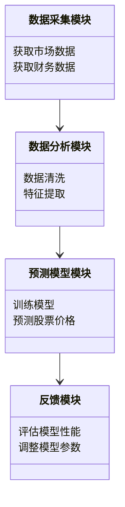
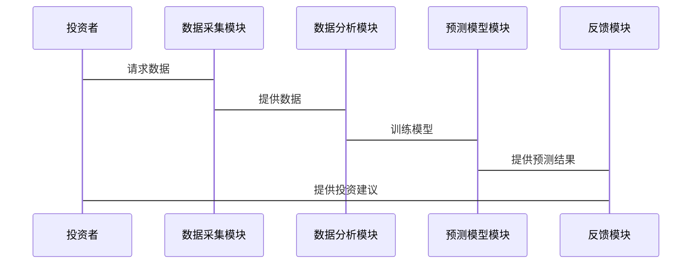

                 

<think>
好的，我现在需要帮用户撰写一篇关于《巴菲特如何看待人工智能在投资中的应用》的技术博客文章。首先，我需要理解用户的需求。用户希望文章结构清晰，内容专业，涵盖巴菲特的投资理念、人工智能的基本概念、两者结合的应用、算法原理、系统架构设计以及项目实战等内容。

我会从背景介绍开始，解释巴菲特的价值投资理念和人工智能的基本概念。接下来，分析人工智能在投资中的核心应用，包括数据驱动的决策、机器学习和自然语言处理的应用。然后，对比巴菲特投资理念与人工智能的特点，探讨两者结合的优势与挑战。

在算法部分，我需要详细讲解回归分析、聚类分析和SVM模型的原理，并提供数学公式和代码示例。系统架构设计部分，我会介绍数据采集、分析、预测和反馈的流程，并用Mermaid图展示系统架构。项目实战部分，我会以股票价格预测为例，提供代码实现和结果分析。

最后，我会总结人工智能在投资中的应用，并提醒读者注意数据质量和模型选择等事项。整个过程需要确保逻辑清晰，内容详实，结构完整，满足用户的要求。
</think>

# 巴菲特如何看待人工智能在投资中的应用

> 关键词：巴菲特，人工智能，投资，价值投资，机器学习，数据驱动

> 摘要：本文探讨了巴菲特的价值投资理念与人工智能技术在投资中的应用，分析了人工智能如何改变投资决策过程，并结合具体算法和系统架构，展示了人工智能在投资中的潜力与挑战。

---

# 第1章: 巴菲特投资理念概述

## 1.1 巴菲特的价值投资理念

### 1.1.1 价值投资的核心思想
巴菲特的价值投资理念强调长期、基本面分析和安全边际。他认为市场是理性的，但投资者必须保持独立思考，寻找具有持续竞争优势的企业，以合理的价格买入并长期持有。

### 1.1.2 巴菲特的投资策略
巴菲特的投资策略包括：
- **集中投资**：将资金集中在少数具有竞争优势的企业上。
- **长期持有**：避免频繁交易，降低交易成本。
- **安全边际**：买入价格低于内在价值，以降低风险。

### 1.1.3 巴菲特对市场的长期看法
巴菲特认为市场短期是投票器，长期是称重机。他强调企业基本面的重要性，而不是市场的短期波动。

---

## 1.2 人工智能的基本概念

### 1.2.1 人工智能的定义与范围
人工智能（AI）是指计算机系统模拟人类智能的能力，包括学习、推理、自我改进等。AI在投资中的应用主要涉及数据处理、模式识别和预测。

### 1.2.2 机器学习的基本原理
机器学习是一种人工智能技术，通过数据训练模型，使其能够从经验中学习并做出预测。常用的机器学习算法包括回归、聚类和分类。

### 1.2.3 深度学习与自然语言处理的简介
深度学习是机器学习的一种，通过多层神经网络处理数据。自然语言处理（NLP）用于分析文本数据，提取情感、主题等信息。

---

## 1.3 巴菲特投资理念与人工智能的结合

### 1.3.1 人工智能在投资中的潜在价值
AI可以帮助投资者处理海量数据，发现隐藏的模式，提高预测的准确性。

### 1.3.2 巴菲特对技术进步的看法
巴菲特虽然不直接使用AI，但他支持技术进步，并认为技术可以提高投资效率。

### 1.3.3 人工智能如何辅助价值投资
AI可以帮助分析企业基本面，识别具有竞争优势的企业，优化投资组合。

---

# 第2章: 人工智能在投资中的核心应用

## 2.1 数据驱动的投资决策

### 2.1.1 数据的收集与处理
投资决策依赖于数据，包括财务数据、市场数据、新闻数据等。AI可以处理非结构化数据，如新闻和社交媒体。

### 2.1.2 数据分析与预测模型
通过机器学习模型，AI可以预测股票价格、识别趋势和风险。

### 2.1.3 数据驱动的投资策略
基于AI的策略可以动态调整投资组合，捕捉市场机会。

---

## 2.2 机器学习在投资中的应用

### 2.2.1 回归分析在投资预测中的应用
回归分析用于预测股票价格。例如，线性回归模型可以预测未来的价格变动。

$$ y = \beta_0 + \beta_1x + \epsilon $$

### 2.2.2 聚类分析在投资组合优化中的应用
聚类分析用于将股票分为不同类别，优化投资组合的风险和收益。

### 2.2.3 分类算法在风险评估中的应用
分类算法（如决策树）用于评估股票的信用风险。

---

## 2.3 自然语言处理在投资中的应用

### 2.3.1 文本挖掘与市场情绪分析
NLP可以分析新闻和社交媒体，提取市场情绪，预测市场走势。

### 2.3.2 新闻事件的自动识别与分析
AI可以自动识别新闻中的关键事件，影响投资决策。

### 2.3.3 公司财报的自动解读
NLP可以自动解析财报，提取关键指标，辅助投资决策。

---

# 第3章: 巴菲特投资理念与人工智能的对比分析

## 3.1 巴菲特投资理念的特征

### 3.1.1 长期价值导向
巴菲特注重企业的长期价值，而非短期波动。

### 3.1.2 风险控制优先
巴菲特强调安全边际，避免高风险投资。

### 3.1.3 逆向思维的应用
巴菲特在市场恐慌时买入，利用市场的非理性获利。

---

## 3.2 人工智能投资模型的特点

### 3.2.1 数据驱动的决策
AI依赖数据，而非基本面分析。

### 3.2.2 自动化与快速迭代
AI模型可以快速调整，适应市场变化。

### 3.2.3 大数据分析能力
AI能够处理海量数据，发现隐藏的模式。

---

## 3.3 两者结合的优势与挑战

### 3.3.1 优势分析
- 提高投资效率
- 发现非明显机会
- 降低人为错误

### 3.3.2 挑战与风险
- 数据质量风险
- 模型过拟合
- 黑箱问题

### 3.3.3 未来的融合方向
- 结合基本面分析
- 优化风险管理
- 提高模型可解释性

---

# 第4章: 人工智能在投资中的数学模型与算法

## 4.1 回归分析模型

### 4.1.1 线性回归的原理
线性回归用于预测股票价格，假设价格与某个变量（如收益）线性相关。

### 4.1.2 逻辑回归的应用
逻辑回归用于分类问题，如预测股票上涨或下跌。

### 4.1.3 线性回归的数学公式
$$ y = \beta_0 + \beta_1x + \epsilon $$

---

## 4.2 聚类分析模型

### 4.2.1 K-means算法的原理
K-means算法将股票分为不同的类别，优化投资组合。

### 4.2.2 层次聚类的应用
层次聚类用于分析股票的相似性，识别潜在的交易机会。

### 4.2.3 聚类算法的优缺点对比

| 优点       | 缺点       |
|------------|------------|
| 易实现     | 需要选择K值 |
| 处理大数据   | 解释性差   |

---

## 4.3 支持向量机（SVM）在投资中的应用

### 4.3.1 SVM的原理
SVM用于分类问题，如预测股票的涨跌。

### 4.3.2 SVM的数学公式
$$ y = \text{sign}(w \cdot x + b) $$

---

# 第5章: 人工智能在投资中的系统架构设计

## 5.1 问题场景介绍
设计一个基于AI的股票预测系统，帮助投资者做出决策。

## 5.2 系统功能设计

### 5.2.1 领域模型（Mermaid 类图）


---

## 5.3 系统架构设计（Mermaid 架构图）
```mermaid
archi
    title 投资AI系统架构
    步骤1 --> 步骤2 --> 步骤3 --> 步骤4
    步骤1: 数据采集模块
    步骤2: 数据分析模块
    步骤3: 预测模型模块
    步骤4: 反馈模块
```

---

## 5.4 系统接口设计

### 5.4.1 数据接口
- 数据输入接口：接收市场数据和财务数据。
- 数据输出接口：提供清洗后的数据。

### 5.4.2 模型接口
- 模型训练接口：接收数据，训练模型。
- 模型预测接口：预测股票价格。

---

## 5.5 系统交互（Mermaid 序列图）


---

# 第6章: 项目实战

## 6.1 环境安装

### 6.1.1 安装Python和必要的库
```bash
pip install numpy pandas scikit-learn
```

---

## 6.2 核心代码实现

### 6.2.1 回归分析代码示例
```python
import numpy as np
from sklearn.linear_model import LinearRegression

# 示例数据
X = np.array([[1], [2], [3], [4]])
y = [2, 3, 5, 6]

# 训练模型
model = LinearRegression()
model.fit(X, y)

# 预测
print(model.predict([[5]]))
```

### 6.2.2 聚类分析代码示例
```python
from sklearn.cluster import KMeans

X = np.array([[1, 2], [5, 8], [1.5, 1.8], [6.4, 6.8]])
model = KMeans(n_clusters=2)
model.fit(X)
print(model.labels_)
```

---

## 6.3 代码应用解读与分析
- 回归分析代码展示了如何预测股票价格。
- 聚类分析代码展示了如何将股票分为不同类别。

---

## 6.4 实际案例分析
以某股票为例，分析其价格走势，使用回归模型预测未来价格。

---

## 6.5 项目小结
通过代码实现，展示了AI在投资中的潜力，但也需要注意数据质量和模型选择。

---

# 第7章: 最佳实践与小结

## 7.1 小结
人工智能可以辅助投资决策，但不能完全取代人类的判断。

## 7.2 注意事项
- 数据质量至关重要。
- 模型需要不断优化。
- 需要结合基本面分析。

## 7.3 未来趋势
- 更加智能化的投资工具。
- 提高模型的可解释性。

## 7.4 拓展阅读
推荐阅读《投资最重要的ことは何か？》和《机器学习实战》。

---

# 作者：AI天才研究院 & 禅与计算机程序设计艺术

