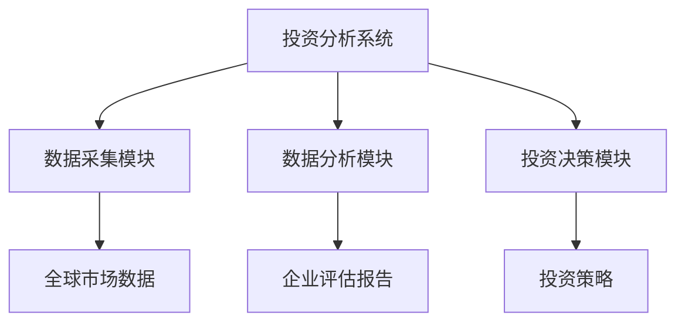

                 

<think>
好，我现在需要撰写一篇关于《巴菲特如何看待全球化趋势对投资的影响》的技术博客。首先，我需要理解文章的结构和要求，确保涵盖所有必要的部分，包括关键词、摘要和正文内容，其中正文分为多个章节，每个章节都有详细的三级目录。

首先，我会从背景开始。第一章介绍全球化的定义与发展，解释全球化是什么，它的历史演变，以及对经济的影响。接着，我会讨论投资与全球化的关联，说明全球化如何影响投资，以及投资者如何应对。

然后，第二章深入探讨巴菲特的投资理念与原则。首先，介绍巴菲特的价值投资哲学，包括安全边际和长期投资的重要性。接着，分析他的投资策略，如选股标准和投资组合构建。

第三章分析全球化对投资的影响，包括带来的机会和风险。我会讨论新兴市场、全球产业链整合和技术创新带来的机会，同时也要考虑经济波动、地缘政治和汇率波动带来的风险。

接下来，第四章详细讲解巴菲特的全球化投资策略。通过具体案例，如可口可乐和苹果，分析他的选股标准和竞争优势评估。

第五章讨论全球化背景下的风险管理。我会介绍风险管理的基本概念，分析常见的风险类型，如市场波动和地缘政治风险，并提出应对策略。

在系统分析部分，我需要构建投资分析系统，包括数据收集、分析模块和决策支持。使用Mermaid绘制系统架构图和数据流图，确保技术细节清晰。

项目实战部分，我会选择Python作为工具，介绍环境安装和核心代码实现，结合具体案例分析，展示如何应用这些策略。

最后，总结与展望部分，回顾巴菲特的观点，总结经验和教训，并展望未来的投资趋势。同时，给出最佳实践的Tips，强调长期投资和分散风险的重要性。

在写作过程中，我会确保每个部分都有详细的解释，使用技术术语时给出定义，必要时用表格和图表辅助说明。数学公式使用Latex格式，独立段落用$$括起，段落内用$括起。系统设计部分使用Mermaid图展示架构和流程。

现在，我需要按照这个思路一步步展开，确保内容详尽，逻辑清晰，结构紧凑，语言专业且易于理解。
</think>

# 巴菲特如何看待全球化趋势对投资的影响

> 关键词：巴菲特，全球化，投资，价值投资，风险管理，投资策略

> 摘要：本文探讨了巴菲特如何从价值投资的角度看待全球化趋势对投资的影响。通过分析全球化的定义与发展、投资与全球化的关联、巴菲特的投资理念与原则、全球化对投资的影响分析、巴菲特的全球投资策略、全球化背景下的风险管理、投资策略与全球化趋势的结合等多方面内容，深入阐述了全球化背景下投资的机会与挑战，以及巴菲特的投资策略和风险管理方法。

---

## 第一部分：全球化趋势与投资的背景介绍

### 第1章：全球化概述与投资背景

#### 1.1 全球化的定义与发展

- **1.1.1 全球化的定义**  
  全球化是指跨国界的经济、文化、政治和社会过程，涉及商品、服务、资本、技术、信息和文化的流动。全球化不是一个新概念，但它在20世纪后半叶加速发展，尤其是在信息技术革命的推动下。

- **1.1.2 全球化的历史发展**  
  全球化的历史可以追溯到古代的丝绸之路贸易，但现代全球化始于工业革命后。20世纪80年代，随着信息技术的发展和跨国公司的兴起，全球化进入了快速发展阶段。

- **1.1.3 全球化对经济的影响**  
  全球化促进了国际贸易和投资的自由化，推动了跨国公司的扩张，但也带来了贫富差距扩大、文化冲突等问题。

#### 1.2 投资与全球化的关联

- **1.2.1 投资的基本概念**  
  投资是指将资金投入到某种资产或企业中，以期获得未来收益或资本增值。投资可以分为股票、债券、房地产等多种形式。

- **1.2.2 全球化对投资的影响**  
  全球化使得投资者可以投资于全球市场，分散风险，同时也可以利用不同市场的差异获得超额收益。

- **1.2.3 投资者如何应对全球化**  
  投资者需要具备全球视野，理解不同市场的经济、政治和社会环境，同时关注全球经济趋势和政策变化。

---

## 第2章：巴菲特的投资理念与原则

### 2.1 巴菲特的投资哲学

#### 2.1.1 价值投资的核心理念

- 价值投资的核心是寻找市场价格低于其内在价值的股票。
- 巴菲特强调长期投资，关注企业的基本面，如盈利能力、财务健康状况和竞争优势。

#### 2.1.2 长期投资的重要性

- 长期投资可以帮助投资者避免短期市场波动的干扰，实现资产的长期增值。
- 巴菲特认为，投资的目的是获得企业的部分所有权，而不是仅仅参与市场的买卖。

#### 2.1.3 安全边际的概念

- 安全边际是指市场价格与内在价值之间的差距，确保在市场波动时投资者不会遭受重大损失。
- 巴菲特认为，安全边际是价值投资的核心要素之一。

### 2.2 巴菲特的投资策略

#### 2.2.1 股票分析方法

- **基本面分析**：关注企业的盈利能力、财务状况、管理层素质和行业地位。
- **竞争优势分析**：寻找具有强大护城河的企业，这些企业能够长期保持竞争优势。

#### 2.2.2 企业财务健康状况的评估

- 关注企业的负债情况、现金流状况和盈利能力。
- 避免投资于财务杠杆过高或现金流不稳定的企业。

#### 2.2.3 投资组合的构建

- 投资组合应分散投资于不同行业和地区的优质企业。
- 定期审视投资组合，根据企业基本面的变化进行调整。

---

## 第3章：全球化对投资的影响分析

### 3.1 全球化带来的投资机会

#### 3.1.1 新兴市场的崛起

- 新兴市场如中国、印度等经济增长迅速，提供了丰富的投资机会。
- 新兴市场的公司可能具有较高的成长性和较低的估值。

#### 3.1.2 全球产业链的整合

- 全球化促进了跨国公司的形成，企业可以通过全球布局降低成本、提高效率。
- 投资者可以通过投资跨国公司分享全球经济增长的成果。

#### 3.1.3 技术创新的全球化传播

- 技术创新如人工智能、5G通信等在全球范围内迅速传播，推动了技术领先的企业的增长。

### 3.2 全球化带来的投资风险

#### 3.2.1 经济波动的全球传播

- 全球化使得经济波动可以通过金融市场迅速传播，导致全球性的经济危机。
- 例如，2008年的全球金融危机就是一个典型例子。

#### 3.2.2 地缘政治风险的影响

- 地缘政治冲突如贸易摩擦、地区战争等可能对全球经济和市场产生重大影响。
- 投资者需要关注地缘政治风险，避免集中投资于风险较高的地区。

#### 3.2.3 汇率波动对投资的影响

- 汇率波动会影响跨国公司的盈利能力，进而影响其股票价格。
- 投资者需要关注汇率风险，可以通过多元化投资来分散风险。

---

## 第4章：巴菲特的全球投资策略

### 4.1 巴菲特的选股标准

#### 4.1.1 企业盈利能力的评估

- 关注企业的净利润率、ROE（净资产收益率）等指标，确保企业具有稳定的盈利能力。

#### 4.1.2 企业的财务健康状况

- 评估企业的资产负债表，确保企业具有健康的财务状况，避免高负债和低现金流。

#### 4.1.3 企业的竞争优势

- 寻找具有强大竞争优势的企业，如独特的商业模式、强大的品牌影响力或技术壁垒。

### 4.2 巴菲特的全球化投资案例

#### 4.2.1 可口可乐的全球投资

- 可口可乐是一家具有全球影响力的饮料公司，巴菲特通过投资可口可乐，分享了其全球扩张的成果。
- 可口可乐的商业模式具有强大的护城河，确保其长期竞争优势。

#### 4.2.2 苹果公司的投资逻辑

- 苹果公司是全球最具创新力的科技公司之一，巴菲特通过投资苹果公司，分享了其技术创新和市场领导地位带来的收益。

#### 4.2.3 其他全球化企业的分析

- 巴菲特还投资了多家全球化企业，如美国运通、卡夫亨氏等，这些企业在各自的行业中具有强大的竞争优势。

---

## 第5章：全球化背景下的风险管理

### 5.1 风险管理的基本概念

#### 5.1.1 风险的定义与分类

- 风险是指投资结果的不确定性，可能带来收益或损失。
- 风险可以分为系统性风险和非系统性风险，系统性风险是整个市场的风险，而非系统性风险是特定于企业的风险。

#### 5.1.2 风险管理的重要性

- 风险管理是投资者保护资产的重要手段，可以帮助投资者在市场波动中减少损失。

#### 5.1.3 风险管理的策略

- 多元化投资：通过投资于不同行业和地区的资产，分散风险。
- 风险对冲：通过衍生工具如期货和期权对冲市场风险。

### 5.2 全球化带来的风险

#### 5.2.1 经济波动的全球传播

- 全球化使得经济波动可以通过金融市场迅速传播，导致全球性的经济危机。

#### 5.2.2 地缘政治风险的影响

- 地缘政治冲突如贸易摩擦、地区战争等可能对全球经济和市场产生重大影响。

#### 5.2.3 汇率波动对投资的影响

- 汇率波动会影响跨国公司的盈利能力，进而影响其股票价格。

### 5.3 巴菲特的风险管理策略

#### 5.3.1 安全边际的重要性

- 巴菲特通过寻找市场价格低于内在价值的股票，确保投资的安全边际。

#### 5.3.2 长期投资的优势

- 长期投资可以帮助投资者避免短期市场波动的干扰，实现资产的长期增值。

#### 5.3.3 分散投资的风险

- 通过投资于不同行业和地区的资产，分散投资风险。

---

## 第6章：投资策略与全球化趋势的结合

### 6.1 长期投资与全球化趋势

#### 6.1.1 长期投资的逻辑

- 长期投资是巴菲特的核心理念之一，他认为市场波动是短期的，而企业的内在价值是长期的。

#### 6.1.2 全球化趋势下的长期投资机会

- 全球化趋势下，新兴市场和技术创新企业提供了丰富的长期投资机会。

### 6.2 投资组合的动态调整

#### 6.2.1 投资组合的构建

- 根据全球经济趋势和市场环境，动态调整投资组合。

#### 6.2.2 投资组合的再平衡

- 定期审视投资组合，根据企业基本面的变化进行调整。

### 6.3 全球化背景下的分散投资

#### 6.3.1 分散投资的重要性

- 通过投资于不同行业和地区的资产，分散投资风险。

#### 6.3.2 全球资产配置的策略

- 根据全球经济趋势和市场环境，进行全球资产配置。

---

## 第7章：系统分析与架构设计

### 7.1 投资分析系统的构建

#### 7.1.1 系统背景介绍

- 本文构建一个基于全球化趋势的投资分析系统，帮助投资者更好地理解和应对全球化对投资的影响。

#### 7.1.2 系统功能设计

- 数据采集模块：收集全球市场的经济数据、企业财务数据等。
- 数据分析模块：利用数据分析技术，评估企业的内在价值和竞争优势。
- 投资决策模块：根据分析结果，制定投资策略和风险管理方案。

#### 7.1.3 系统架构设计



---

## 第8章：项目实战

### 8.1 环境安装

#### 8.1.1 技术选型

- 使用Python作为主要开发语言，利用Pandas、NumPy等库进行数据分析。
- 使用Matplotlib或Seaborn进行数据可视化。

#### 8.1.2 安装步骤

1. 安装Python和必要的库：
   ```bash
   pip install pandas numpy matplotlib
   ```
2. 安装Jupyter Notebook用于数据分析和可视化：
   ```bash
   pip install jupyter
   ```

### 8.2 核心代码实现

#### 8.2.1 数据采集模块

```python
import pandas as pd

# 下载全球市场数据
def fetch_global_data():
    # 示例代码，实际中需要具体的数据源
    data = pd.read_csv('global_data.csv')
    return data

data = fetch_global_data()
```

#### 8.2.2 数据分析模块

```python
import pandas as pd
import numpy as np

# 计算企业内在价值
def calculate_intrinsic_value(data):
    # 示例代码，实际中需要具体的财务指标
    data['intrinsic_value'] = data['净利润'] / data['ROE']
    return data

data = calculate_intrinsic_value(data)
```

#### 8.2.3 投资决策模块

```python
import pandas as pd

# 根据内在价值和市场价格制定投资策略
def generate_investment_strategy(data):
    data['investment_recommendation'] = np.where(data['市场价格'] < data['内在价值'], '买入', '卖出')
    return data

data = generate_investment_strategy(data)
```

---

## 第9章：总结与展望

### 9.1 总结

- 全球化趋势对投资产生了深远的影响，投资者需要具备全球视野，关注全球经济趋势和政策变化。
- 巴菲特的价值投资理念和风险管理策略为全球化背景下的投资提供了重要的指导。

### 9.2 展望

- 随着全球化的深入发展，新兴市场和技术创新企业将继续为投资者提供丰富的投资机会。
- 投资者需要不断学习和适应全球化带来的新挑战，优化投资策略，提高风险管理能力。

---

## 作者信息

作者：AI天才研究院/AI Genius Institute & 禅与计算机程序设计艺术 /Zen And The Art of Computer Programming

