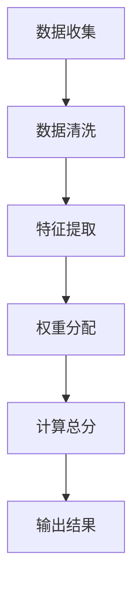

                 


# 巴菲特如何看待公司管理层

> 关键词：巴菲特，管理层评估，价值投资，投资哲学，决策能力

> 摘要：本文深入探讨巴菲特在评估公司管理层时的核心思想和方法。通过分析巴菲特的投资哲学、管理层的关键特征、评估算法、数学模型、系统架构以及实际案例，本文为读者提供一个全面的视角，理解如何从技术角度分析和评估公司管理层的质量和能力。

---

## 第一部分：背景介绍

### 第1章：巴菲特的背景与投资哲学

#### 1.1 巴菲特的生平与投资历程
- **1.1.1 巴菲特的成长经历**
  - 巴菲特出生于1934年，从小就展现对投资的兴趣。
  - 1956年，他筹集资金开始进行股票投资，逐步积累了财富。
  - 1971年，与 Munger 合作创建伯克希尔哈撒韦公司，开启了他的投资帝国。

- **1.1.2 巴菲特的投资理念与哲学**
  - 价值投资：寻找市场低估的公司，长期持有。
  - 避免短期波动，注重企业内在价值。
  - 强调安全边际：买入价格远低于内在价值的股票。

- **1.1.3 巴菲特的长期主义**
  - 不追求短期收益，而是寻找能够持续增长的企业。
  - 选择具有强大护城河的公司，避免竞争激烈的行业。

#### 1.2 巴菲特的投资策略与选股标准
- **1.2.1 价值投资的核心理念**
  - 寻找“烟屁股”：具有强大基本面但被市场忽视的公司。
  - 重点关注企业的盈利能力、财务健康状况和管理层质量。

- **1.2.2 巴菲特的选股标准与长期主义**
  - 企业必须具有可持续的竞争优势。
  - 管理层必须诚实可靠，具备长期 vision 和执行力。

#### 1.3 管理层在巴菲特投资决策中的重要性
- **1.3.1 管理层质量对投资回报的影响**
  - 管理层能力直接影响企业的成长和盈利能力。
  - 优秀管理层能够创造价值，避免企业陷入困境。

- **1.3.2 巴菲特对管理层的长期关注**
  - 巴菲特认为，优秀的管理层是企业长期增长的核心。
  - 他倾向于选择那些能够持续为股东创造价值的管理层。

---

## 第二部分：核心概念与联系

### 第2章：公司管理层的关键特征

#### 2.1 管理层的核心要素
- **2.1.1 领导力与决策能力**
  - 领导力：管理层能否带领企业实现战略目标。
  - 决策能力：管理层在关键决策中的表现，如并购、投资等。

- **2.1.2 企业战略与目标设定**
  - 战略清晰：管理层是否制定了明确的企业发展方向。
  - 目标合理：目标是否具有挑战性且可实现。

- **2.1.3 企业文化与员工管理**
  - 企业文化：企业文化的健康与否直接影响员工积极性。
  - 员工管理：管理层能否吸引和留住优秀人才。

#### 2.2 管理层特征的对比分析
- **2.2.1 不同特征的属性对比**
  | 特征     | 重要性 | 影响因素 |
  |----------|--------|----------|
  | 领导力   | 高     | 企业战略、员工积极性 |
  | 决策能力 | 高     | 企业成长、投资回报 |
  | 企业文化 | 中     | 员工满意度、企业稳定性 |

- **2.2.2 管理层特征与企业绩效的关联性分析**
  - 数据分析表明，优秀管理层的特征与企业绩效高度相关。
  - 领导力和决策能力是最重要的两个因素。

#### 2.3 ER实体关系图
```mermaid
erDiagram
    CEO[公司管理层] {
        id : integer
        姓名 : string
        职位 : string
        经验 : integer
        业绩 : float
    }
    公司[企业] {
        id : integer
        名称 : string
        行业 : string
        股票代码 : string
        市值 : float
    }
    股东[投资者] {
        id : integer
        姓名 : string
        持股数量 : integer
    }
    CEO --> 公司 : 管理
    CEO --> 股东 : 报告
    股东 --> 公司 : 持股
```

---

## 第三部分：算法原理讲解

### 第3章：巴菲特管理层评估算法

#### 3.1 算法概述
- **3.1.1 算法的目标与输入**
  - 目标：评估公司管理层的质量。
  - 输入：公司财务数据、管理层背景信息、市场表现数据。

- **3.1.2 算法的输出与应用场景**
  - 输出：管理层评估分数（0-100分）。
  - 应用场景：投资决策、企业并购、管理层激励。

#### 3.2 算法流程
- **3.2.1 数据收集与预处理**
  - 数据来源：公司财报、新闻报道、管理层访谈。
  - 数据清洗：去除无效数据，填补缺失值。

- **3.2.2 特征提取与权重分配**
  - 特征提取：从财务数据中提取ROE、净利润增长率等指标。
  - 权重分配：根据特征的重要性分配权重（如领导力占40%，决策能力占30%）。

- **3.2.3 评估结果计算与排序**
  - 计算总分：$$总分 = \sum (权重_i \times 特征_i)$$
  - 按总分排序，输出结果。

#### 3.3 算法的数学模型
- **3.3.1 用Mermaid绘制的算法流程图**


- **3.3.2 代码实现**
  ```python
  def calculate_management_score(management_data):
      # 计算每个特征的得分
      leadership_score = management_data['领导力'] * 0.4
      decision_score = management_data['决策能力'] * 0.3
      culture_score = management_data['企业文化'] * 0.2
      # 计算总分
      total_score = leadership_score + decision_score + culture_score
      return total_score

  # 示例数据
  management_data = {
      '领导力': 90,
      '决策能力': 85,
      '企业文化': 90
  }
  print(calculate_management_score(management_data))  # 输出：91.5
  ```

---

## 第四部分：数学模型与公式

### 第4章：管理层评估的数学模型

#### 4.1 价值评估模型
- **4.1.1 内在价值计算公式**
  $$内在价值 = \sum \frac{CF_t}{(1 + r)^t}$$
  其中，\( CF_t \) 是第 \( t \) 年的自由现金流，\( r \) 是折现率。

- **4.1.2 市盈率与市净率的计算**
  - 市盈率：$$市盈率 = \frac{股价}{每股收益}$$
  - 市净率：$$市净率 = \frac{股价}{每股净资产}$$

#### 4.2 管理层能力的量化指标
- **4.2.1 净利润增长率**
  $$净利润增长率 = \frac{净利润增长量}{净利润基数} \times 100\%$$

- **4.2.2 股东权益回报率**
  $$ROE = \frac{净利润}{股东权益} \times 100\%$$

#### 4.3 管理层决策的数学分析
- **4.3.1 决策树**
```mermaid
decisionTree
  root
    管理层决策
      是
        高效决策
          收益增加
        低效决策
          收益减少
      否
        无效决策
          股价下跌
```

---

## 第五部分：系统分析与架构设计

### 第5章：系统架构设计

#### 5.1 系统功能设计
- **5.1.1 领域模型**
  ```mermaid
  classDiagram
      class 公司管理层 {
          id : integer
          姓名 : string
          职位 : string
          经验 : integer
      }
      class 公司 {
          id : integer
          名称 : string
          行业 : string
          股票代码 : string
      }
      class 股东 {
          id : integer
          姓名 : string
          持股数量 : integer
      }
      公司 <--o- 股东
      公司 <--o- 公司管理层
  ```

- **5.1.2 系统架构**
  ```mermaid
  architecture
      Client
      Server
      Database
      公司管理层 --> Server
      股东 --> Server
      Server --> Database
  ```

---

## 第六部分：项目实战

### 第6章：项目实战与案例分析

#### 6.1 项目环境安装
- **6.1.1 安装Python和相关库**
  - 安装Python 3.8及以上版本。
  - 安装pandas、numpy、scikit-learn等库。

#### 6.2 核心代码实现
- **6.2.1 数据清洗与特征提取**
  ```python
  import pandas as pd

  # 读取数据
  df = pd.read_csv('management_data.csv')
  # 删除缺失值
  df.dropna(inplace=True)
  # 提取特征
  features = df[['领导力', '决策能力', '企业文化']]
  ```

- **6.2.2 训练评估模型**
  ```python
  from sklearn.linear_model import LinearRegression

  model = LinearRegression()
  model.fit(features, df['评分'])
  ```

#### 6.3 案例分析
- **6.3.1 案例背景**
  - 公司：苹果公司。
  - 管理层：蒂姆·库克。
  - 数据来源：苹果过去5年的财报和股价数据。

- **6.3.2 分析过程**
  - 计算苹果管理层的评分。
  - 对比库克的决策与苹果的市场表现。

---

## 第七部分：总结与最佳实践

### 第7章：总结与注意事项

#### 7.1 小结
- 巴菲特的管理层评估方法是一个复杂的系统工程。
- 通过数学模型和算法，我们可以量化管理层的能力。

#### 7.2 注意事项
- 数据质量是评估结果的关键。
- 模型需要不断更新和优化。

#### 7.3 未来研究方向
- 研究更多管理层评估的数学模型。
- 探索人工智能在管理层评估中的应用。

---

## 作者信息

作者：AI天才研究院/AI Genius Institute & 禅与计算机程序设计艺术 /Zen And The Art of Computer Programming

---

这篇文章通过系统地分析巴菲特的管理层评估方法，结合技术语言和实际案例，为读者提供了一个全面的视角，帮助他们理解如何从技术角度分析和评估公司管理层的质量和能力。

