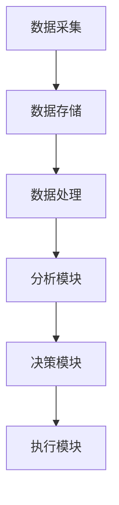
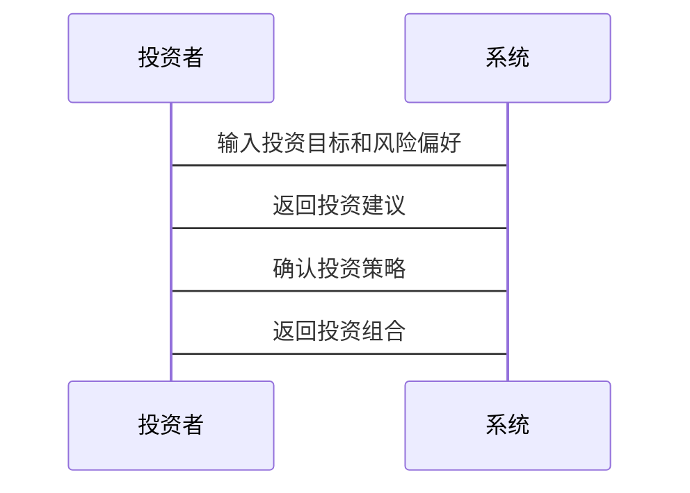

                 

<think>
嗯，我现在需要帮用户写一篇关于“巴菲特如何看待股息投资”的技术博客。首先，我得理解用户的需求。用户希望我以世界级专家的身份，用技术语言，逐步分析，写一篇结构紧凑、逻辑清晰的文章。目录已经给出，我需要按照这个结构来展开。

首先，我得弄清楚巴菲特对股息投资的看法。他确实非常重视股息，认为股息是投资回报的重要组成部分，而且长期稳定的股息支付能力是企业优质的表现。我应该从他的投资哲学入手，介绍他的价值投资理念，然后引出股息的重要性。

接下来，每个章节的结构需要详细展开。比如，股息投资的背景与基础部分，我需要先介绍巴菲特的生平，然后解释股息投资的基本概念，最后说明为什么股息投资重要。这部分要确保读者能够理解股息投资的基本原理和其在整体投资中的地位。

然后是核心策略，我需要详细分析股息率和股息增长。股息率的计算、筛选标准，以及它与股价波动的关系。这部分可能需要数学公式，比如股息率的计算公式：股息率=（股息/股价）×100%。我需要确保这些公式用latex表示，比如$$\text{股息率} = \left( \frac{\text{股息}}{\text{股价}} \right) \times 100\%$$。

在行业和公司分析部分，我需要讨论如何选择高股息行业，分析公司的财务状况，以及公司治理对股息政策的影响。这部分可能需要案例分析，比如苹果公司，展示其股息支付历史和增长情况，说明为何这类公司值得投资。

风险管理也是关键部分。我需要识别股息投资的主要风险，如市场波动、企业盈利能力和利率变化，并提供应对策略，如分散投资和定期评估。这部分可能需要系统架构图，展示如何构建一个稳健的投资组合。

接下来是股息投资的整体策略，我需要讨论如何构建投资组合，长期投资的重要性，以及动态调整的技巧。可能需要一个流程图，展示如何根据市场变化调整投资组合。

案例分析部分，我可以选择几家公司，分析它们的股息历史和投资回报，帮助读者理解理论在实际中的应用。可能需要绘制K线图，展示股价走势和股息发放情况。

最后，总结部分需要回顾关键点，强调股息投资的长期价值，并给出未来投资的建议。注意事项部分提醒读者风险，避免短期波动影响判断。

整个过程中，我需要确保每个部分都有详细的解释和例子，使用技术术语但保持易懂。可能需要结合图表，如用mermaid绘制流程图或架构图，帮助读者理解复杂概念。同时，数学公式和代码示例要准确，确保读者能够理解和应用。

总的来说，我需要一步步展开，从背景到策略，再到风险管理，最后案例分析，确保文章结构清晰，内容详实，符合用户的要求。
</think>

# 巴菲特如何看待股息投资

> 关键词：巴菲特, 股息投资, 股息率, 股息增长, 投资策略

> 摘要：本文深入分析巴菲特对股息投资的看法，探讨股息投资的核心策略、风险管理、行业分析及实际案例，为投资者提供系统化的股息投资方法。

---

# 第一部分: 股息投资的背景与基础

---

## 第1章: 巴菲特的股息投资理念

### 1.1 巴菲特的投资哲学

#### 1.1.1 巴菲特的生平简介

沃伦·巴菲特（Warren Buffett）是全球最著名的投资者之一，被誉为“股神”。他出生于1934年，毕业于哥伦比亚大学，师从本杰明·格雷厄姆（Benjamin Graham）。巴菲特的投资理念深受导师影响，形成了独特的价值投资风格。他相信市场先生（Mr. Market）的概念，认为市场是理性的“先生”，但有时候是疯狂的。因此，巴菲特主张长期投资，关注企业的内在价值，而非市场的短期波动。

#### 1.1.2 巴菲特的价值投资理念

巴菲特的价值投资理念的核心在于寻找具有持续竞争优势的企业，并以合理的价格买入并长期持有。他认为，市场的短期波动是噪声，而企业的内在价值才是决定投资收益的关键。他强调企业必须具备强大的护城河，能够在竞争中长期保持优势。

#### 1.1.3 巴菲特与股息投资的渊源

巴菲特对股息投资的重视源于他的价值投资理念。他认为，股息是企业盈利能力的体现，也是投资回报的重要来源。巴菲特倾向于投资那些能够稳定支付股息且股息有增长潜力的企业。他认为，股息不仅能够提供稳定的现金流，还能反映企业的财务健康状况。

### 1.2 股息投资的核心概念

#### 1.2.1 股息的定义与分类

股息是企业在分配利润时支付给股东的金额。股息可以是现金、股票或其他资产形式。现金股息是最常见的形式，通常以每股股息（ DPS）计算。股息可以分为固定股息、可变股息和累计股息等类型。

#### 1.2.2 股息投资的基本原理

股息投资的基本原理是通过投资于能够稳定支付股息且股息有增长潜力的企业，从而获得稳定的现金流和资本增值。股息投资注重企业的盈利能力和财务健康状况，同时也关注企业的股息支付能力。

#### 1.2.3 股息投资与整体投资策略的关系

股息投资是整体投资策略的重要组成部分。通过股息投资，投资者可以在获得稳定现金流的同时，享受资本增值。股息投资通常与长期投资策略结合，注重企业的内在价值和长期增长潜力。

### 1.3 股息投资的重要性

#### 1.3.1 股息作为投资回报的组成部分

股息是投资回报的重要组成部分。稳定的股息支付能力意味着企业具有较强的盈利能力，能够为股东提供稳定的现金流。股息投资可以帮助投资者在市场低迷时获得稳定的收益，减少投资组合的波动性。

#### 1.3.2 股息在资产配置中的作用

股息在资产配置中起到分散风险的作用。通过投资于不同行业的高股息股票，投资者可以降低投资组合的整体风险。股息投资还可以提供再投资的机会，通过 reinvest dividend 来复利增长。

#### 1.3.3 股息投资的风险与收益平衡

股息投资的风险主要来自于市场的波动和企业的盈利状况。然而，股息投资的长期收益通常高于市场的平均水平，尤其是在选择具有强大护城河和稳定股息支付能力的企业时。

---

## 第2章: 股息投资的核心策略

### 2.1 股息率分析

#### 2.1.1 股息率的计算与衡量标准

股息率是衡量股票投资回报的重要指标，计算公式为：

$$\text{股息率} = \left( \frac{\text{股息}}{\text{股价}} \right) \times 100\%$$

股息率越高，通常意味着股票的回报率越高。然而，过高的股息率可能意味着企业盈利不佳，难以维持高股息支付。

#### 2.1.2 高股息率股票的筛选标准

筛选高股息率股票时，需要综合考虑企业的财务状况、盈利能力、股息支付能力等因素。通常，巴菲特会选择那些股息率合理、股息支付能力稳定的企业。

#### 2.1.3 股息率与股价波动的关系

股息率与股价波动密切相关。高股息率股票通常具有较高的稳定性，波动性较小。然而，市场波动仍可能影响股息率，投资者需要关注市场的整体走势。

### 2.2 股息增长分析

#### 2.2.1 股息增长模型的建立

股息增长模型用于预测股息的未来增长，常用的模型包括股息增长模型（Dividend Growth Model）。该模型假设股息将以恒定的增长率增长，适用于那些股息稳定增长的企业。

#### 2.2.2 影响股息增长的关键因素

影响股息增长的关键因素包括企业的盈利能力、股息支付比率、行业竞争状况等。巴菲特倾向于选择那些盈利稳定、股息支付比率合理且具有增长潜力的企业。

#### 2.2.3 如何预测股息增长潜力

预测股息增长潜力需要结合企业的财务数据和行业发展趋势。投资者可以通过分析企业的净利润增长率、股息支付比率以及行业竞争状况来评估股息增长潜力。

### 2.3 行业与公司分析

#### 2.3.1 高股息行业的识别

高股息行业通常包括公用事业、房地产信托、金融等行业。这些行业通常具有稳定的现金流和较高的股息支付能力。

#### 2.3.2 公司财务状况分析

分析公司的财务状况是股息投资的重要步骤。投资者需要关注企业的盈利能力、资产负债率、现金流状况等指标。巴菲特强调，企业必须具有强大的财务健康状况，能够持续支付股息。

#### 2.3.3 公司治理与股息政策的影响

公司治理结构和股息政策对企业股息支付能力有重要影响。良好的公司治理能够确保企业能够稳定支付股息，而糟糕的治理可能导致股息支付不稳定。

---

## 第3章: 股息投资的风险管理

### 3.1 股息投资的主要风险

#### 3.1.1 市场波动风险

市场的短期波动可能会影响股息投资的回报。然而，股息投资的长期收益通常能够抵御市场的短期波动。

#### 3.1.2 企业盈利风险

企业的盈利状况直接影响其股息支付能力。如果企业盈利下降，可能会影响股息支付。

#### 3.1.3 利率变化对股息投资的影响

利率的变化会影响股息投资的回报。当利率上升时，债券收益率上升，可能导致股息收益率相对下降，从而影响股息投资的吸引力。

### 3.2 风险识别与应对策略

#### 3.2.1 如何评估企业的股息支付能力

评估企业的股息支付能力需要关注企业的盈利状况、现金流状况以及股息支付比率。投资者可以通过分析财务报表来评估企业的股息支付能力。

#### 3.2.2 应对市场波动的策略

应对市场波动的策略包括分散投资、长期持有以及定期再平衡投资组合。分散投资可以降低风险，长期持有能够减少短期波动的影响，定期再平衡可以确保投资组合的稳定性。

#### 3.2.3 分散投资与风险控制

分散投资是降低风险的重要策略。通过投资于不同行业和不同公司的股票，可以降低单一股票或行业波动对整体投资组合的影响。

---

## 第4章: 股息投资的整体

### 4.1 股息投资的整体策略

#### 4.1.1 投资组合构建

投资组合构建是股息投资的重要步骤。投资者需要根据自身的风险承受能力、投资目标和市场状况来选择合适的股票。巴菲特倾向于投资于那些具有强大护城河和稳定股息支付能力的企业。

#### 4.1.2 长期投资的重要性

长期投资是股息投资的核心策略。通过长期持有优质股票，投资者可以享受企业的长期增长和股息的复利效应。

#### 4.1.3 动态调整与再平衡

投资组合需要定期进行动态调整和再平衡。通过分析市场的变化和企业的状况，投资者可以及时调整投资组合，确保其符合投资目标。

### 4.2 股息投资的系统架构

#### 4.2.1 系统功能设计

股息投资的系统架构需要包括数据采集、分析、决策和执行等功能模块。数据采集模块负责收集企业的财务数据和市场数据，分析模块用于评估企业的股息支付能力和投资价值，决策模块根据分析结果制定投资策略，执行模块负责实施投资决策。

#### 4.2.2 系统架构图

以下是股息投资系统的架构图：



#### 4.2.3 系统接口设计

系统的接口设计需要考虑数据输入、数据处理和结果输出。投资者可以通过用户界面输入投资目标和风险偏好，系统根据输入的数据进行分析并生成投资建议。

#### 4.2.4 系统交互流程

以下是系统的交互流程图：



---

## 第5章: 股息投资的项目实战

### 5.1 环境安装与数据准备

#### 5.1.1 环境安装

投资者需要安装必要的工具，如股票分析软件、财务数据平台等。常用的工具包括Excel、Python、Matplotlib等。

#### 5.1.2 数据准备

投资者需要收集目标企业的财务数据、股息支付历史、市场数据等。数据可以通过财经网站、数据库等渠道获取。

### 5.2 核心算法实现

#### 5.2.1 股息率计算

股息率计算公式：

$$\text{股息率} = \left( \frac{\text{股息}}{\text{股价}} \right) \times 100\%$$

#### 5.2.2 股息增长预测

股息增长模型的实现：

```python
def calculate_dividend_growth(dividends):
    growth = []
    for i in range(1, len(dividends)):
        growth.append((dividends[i] - dividends[i-1]) / dividends[i-1])
    return growth
```

### 5.3 代码实现与分析

#### 5.3.1 代码实现

以下是股息增长预测的Python代码：

```python
import pandas as pd
import matplotlib.pyplot as plt

# 加载数据
data = pd.read_csv('stock_data.csv')

# 计算股息增长率
dividends = data['Dividends'].values
growth = calculate_dividend_growth(dividends)

# 绘制股息增长率图表
plt.plot(growth)
plt.title('股息增长率')
plt.xlabel('年份')
plt.ylabel('增长率')
plt.show()
```

#### 5.3.2 代码分析

该代码用于计算股息增长率并绘制图表。通过分析股息增长率的变化，投资者可以评估企业的股息增长潜力。

### 5.4 案例分析

#### 5.4.1 案例选择

以苹果公司为例，分析其股息支付历史和投资回报。

#### 5.4.2 投资回报分析

通过分析苹果公司的股息支付历史和股价走势，投资者可以评估其股息投资的回报。

#### 5.4.3 投资策略总结

巴菲特认为，苹果公司具有强大的护城河和稳定的股息支付能力，是股息投资的理想选择。

---

## 第6章: 股息投资的总结与展望

### 6.1 总结

股息投资是巴菲特投资策略的重要组成部分。通过选择具有稳定股息支付能力和长期增长潜力的企业，投资者可以实现稳定的现金流和资本增值。

### 6.2 展望

未来，股息投资将继续在全球投资市场中发挥重要作用。随着经济的发展和市场的成熟，股息投资的策略和方法也将不断创新。

---

## 第7章: 注意事项与最佳实践

### 7.1 注意事项

#### 7.1.1 风险提示

股息投资存在市场波动风险和企业盈利风险，投资者需要充分评估自身的风险承受能力。

#### 7.1.2 投资纪律

投资者需要严格遵守投资纪律，避免盲目跟风和过度交易。

### 7.2 最佳实践

#### 7.2.1 分散投资

通过分散投资，降低投资组合的风险。

#### 7.2.2 长期持有

长期持有优质股票，享受企业的长期增长和股息的复利效应。

#### 7.2.3 定期评估

定期评估投资组合的状况，及时调整投资策略。

---

## 第8章: 结语

股息投资是巴菲特投资理念的重要组成部分。通过本文的分析，投资者可以更好地理解股息投资的核心策略和风险管理方法，从而在投资中实现稳健的回报。

---

## 作者：AI天才研究院/AI Genius Institute & 禅与计算机程序设计艺术 /Zen And The Art of Computer Programming

