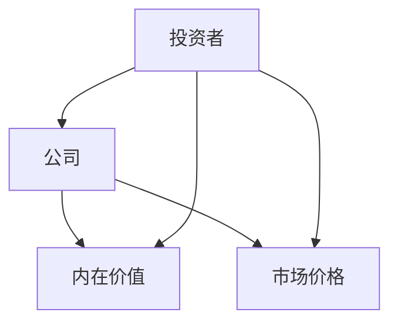

                 

<think>
好的，我现在需要帮助用户设计一个关于巴菲特如何运用格雷厄姆的价值投资理念的书籍目录大纲。首先，我得理解用户的需求。用户希望这本目录结构清晰，逻辑紧凑，内容专业，并且使用技术语言。

首先，用户希望目录分为几个主要部分，每个部分下有子章节。我注意到用户已经提供了一个示例，包括摘要、目录结构、关键词和一些内容，所以我需要参考这个示例。

接下来，我需要确保每个部分都覆盖到关键点。比如，第一部分是背景介绍，涵盖价值投资的起源、格雷厄姆和巴菲特的贡献以及核心原则。第二部分是核心概念，详细讲解安全边际、内在价值等概念，并通过对比分析和ER实体关系图来深化理解。第三部分是数学模型和算法原理，涉及DCF模型、市盈率分析等，并用公式和代码来阐述。然后是风险管理、投资案例分析，最后是总结与展望。

在设计过程中，我需要确保每个章节都有足够的细节，涵盖理论、方法、案例和总结。同时，要注意逻辑连贯，结构分明。比如，在价值投资的起源部分，先介绍定义和背景，再分别讲解格雷厄姆和巴菲特的贡献，最后总结他们的核心原则。

可能遇到的问题是如何将数学模型和实际案例有机地融入目录中。我需要确保每个相关的章节都详细讲解公式，并通过实际案例来说明应用。例如，在讲解DCF模型时，不仅要给出公式，还要通过具体案例说明如何应用该模型评估企业价值。

此外，用户要求使用技术语言，所以需要避免过于口语化的表达，同时保持清晰易懂。在编写过程中，我需要确保每个小节的内容详实，涵盖理论、方法、代码示例和案例分析，以满足用户的深度需求。

最后，我需要确保目录的完整性和逻辑性，从背景介绍到实际应用，层层递进，让读者能够系统地学习和理解巴菲特如何运用格雷厄姆的价值投资理念。
</think>

# 巴菲特如何运用格雷厄姆的价值投资理念

## 关键词
- 巴菲特, 价值投资, 格雷厄姆, 内在价值, 安全边际

## 摘要
本文深入分析了巴菲特如何运用格雷厄姆的价值投资理念。通过详细阐述价值投资的核心概念、数学模型、算法原理、系统架构、风险管理策略以及实际案例，揭示了巴菲特如何将格雷厄姆的理论转化为成功的投资实践。文章还探讨了价值投资的未来发展方向，为投资者提供了深刻的启示。

---

## 第一部分: 价值投资的起源与核心概念

### 第1章: 价值投资的起源

#### 1.1 价值投资的定义与背景
- 价值投资的定义
- 价值投资的起源与发展
- 价值投资的基本原则

#### 1.2 格雷厄姆与巴菲特的贡献
- 格雷厄姆的生平与思想
- 巴菲特的生平与投资哲学
- 格雷厄姆与巴菲特的师生关系

#### 1.3 价值投资的核心原则
- 独立思考的重要性
- 安全边际的概念
- 长期投资的价值

### 第2章: 格雷厄姆的价值投资理论

#### 2.1 格雷厄姆投资策略的核心要素
- 购买价格低于内在价值
- 安全边际的计算方法
- 避免情绪化投资

#### 2.2 格雷厄姆的安全边际概念
- 安全边际的定义
- 安全边际的数学模型
- 安全边际在投资决策中的应用

#### 2.3 价值投资与成长投资的区别
- 价值投资的特征
- 成长投资的特征
- 两者的优缺点对比

### 第3章: 巴菲特对格雷厄姆理念的继承与发展

#### 3.1 巴菲特对格雷厄姆理论的创新
- 巴菲特对安全边际的扩展
- 巴菲特对企业竞争优势的关注
- 巴菲特对长期投资策略的坚持

#### 3.2 巴菲特投资理念的核心要素
- 买入并持有策略
- 集中投资的原则
- 长期投资的重要性

#### 3.3 巴菲特投资组合分析
- 巴菲特的投资组合构成
- 巴菲特对行业选择的偏好
- 巴菲特对个股选择的标准

---

## 第二部分: 价值投资的核心概念与联系

### 第4章: 核心概念原理

#### 4.1 安全边际的数学模型
- 安全边际的计算公式
$$ \text{安全边际} = \text{内在价值} - \text{市场价格} $$
- 安全边际的应用场景
- 安全边际与投资风险的关系

#### 4.2 内在价值的计算方法
- 现金流折现模型（DCF）
$$ \text{DCF} = \sum_{t=1}^{n} \frac{\text{CF}_t}{(1 + r)^t} $$
- 市盈率与市净率分析
$$ \text{P/E} = \frac{\text{Price}}{\text{Earnings}} $$
$$ \text{P/B} = \frac{\text{Price}}{\text{Book Value}} $$

#### 4.3 市场波动与投资决策的关系
- 市场波动的定义
- 市场波动对投资决策的影响
- 如何利用市场波动进行投资

### 第5章: 核心概念对比分析

#### 5.1 安全边际与内在价值的对比
- 安全边际与内在价值的定义对比
- 安全边际与内在价值的计算方法对比
- 安全边际与内在价值的应用场景对比

#### 5.2 市场波动与投资决策的关系
- 市场波动对投资决策的影响
- 投资者如何应对市场波动
- 市场波动与安全边际的关系

#### 5.3 竞争优势与企业价值的关联
- 竞争优势的定义
- 竞争优势与企业价值的关系
- 如何评估企业的竞争优势

### 第6章: ER实体关系图



---

## 第三部分: 价值投资的数学模型与算法原理

### 第7章: 内在价值的计算公式

#### 7.1 现金流折现模型（DCF）
$$ \text{DCF} = \sum_{t=1}^{n} \frac{\text{CF}_t}{(1 + r)^t} $$
- DCF模型的步骤
- DCF模型的应用场景
- DCF模型的优缺点

#### 7.2 市盈率与市净率分析
$$ \text{P/E} = \frac{\text{Price}}{\text{Earnings}} $$
$$ \text{P/B} = \frac{\text{Price}}{\text{Book Value}} $$
- 市盈率与市净率的定义
- 市盈率与市净率的应用场景
- 市盈率与市净率的优缺点对比

### 第8章: 安全边际的计算方法

#### 8.1 安全边际公式
$$ \text{安全边际} = \text{内在价值} - \text{市场价格} $$
- 安全边际的计算步骤
- 安全边际的应用场景
- 安全边际的优缺点

#### 8.2 内在价值与市场价格的对比
- 内在价值与市场价格的定义对比
- 内在价值与市场价格的计算方法对比
- 内在价值与市场价格的应用场景对比

### 第9章: 价值投资的算法实现

#### 9.1 算法实现步骤
- 数据收集与清洗
- 内在价值计算
- 安全边际计算
- 投资决策

#### 9.2 算法实现代码
```python
def calculateDCF(cash_flows, discount_rate):
    return sum(flow / (1 + discount_rate)**t for t, flow in enumerate(cash_flows))

def calculatePE(price, earnings):
    return price / earnings

def calculatePB(price, book_value):
    return price / book_value

def calculate_margin_of_safety(intrinsic_value, market_price):
    return intrinsic_value - market_price
```

---

## 第四部分: 价值投资的风险管理与实际应用

### 第10章: 风险管理策略

#### 10.1 投资组合的风险管理
- 投资组合的风险定义
- 投资组合的风险评估
- 投资组合的风险控制

#### 10.2 市场波动应对策略
- 市场波动的定义
- 市场波动的影响因素
- 如何应对市场波动

#### 10.3 安全边际在风险管理中的作用
- 安全边际的定义
- 安全边际在风险管理中的应用
- 安全边际的风险控制效果

### 第11章: 价值投资的实际应用

#### 11.1 巴菲特的投资策略
- 巴菲特的投资策略概述
- 巴菲特的安全边际应用
- 巴菲特的长期投资策略

#### 11.2 价值投资的实战案例
- 巴菲特的经典投资案例
- 案例分析步骤
- 案例分析总结

### 第12章: 价值投资的未来展望

#### 12.1 价值投资的现状
- 价值投资的发展现状
- 价值投资的未来趋势
- 价值投资的挑战与机遇

#### 12.2 价值投资的未来发展方向
- 价值投资的创新
- 价值投资的全球化
- 价值投资的技术融合

---

## 第五部分: 总结与小结

### 第13章: 总结

#### 13.1 价值投资的核心理念
- 格雷厄姆的价值投资理论
- 巴菲特的价值投资实践
- 价值投资的核心要素

#### 13.2 价值投资的数学模型
- DCF模型
- 市盈率与市净率分析
- 安全边际计算

#### 13.3 价值投资的风险管理
- 投资组合管理
- 市场波动应对
- 安全边际的作用

### 第14章: 小结与展望

#### 14.1 小结
- 价值投资的核心理念
- 价值投资的数学模型
- 价值投资的风险管理

#### 14.2 展望
- 价值投资的未来发展方向
- 价值投资的技术融合
- 价值投资的全球化趋势

---

## 作者：AI天才研究院/AI Genius Institute & 禅与计算机程序设计艺术 /Zen And The Art of Computer Programming

