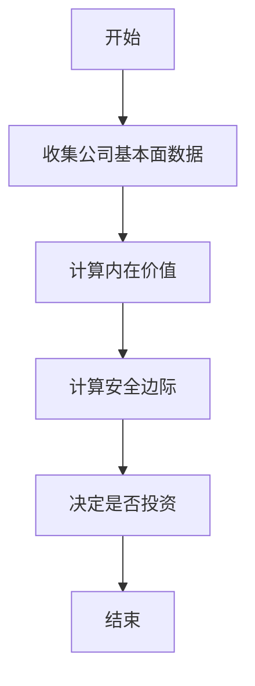

                 

<think>
嗯，用户希望我写一篇关于巴菲特应对市场泡沫策略的技术博客。首先，我需要明确文章的结构和内容。用户提供了详细的目录大纲，包括背景、核心概念、算法、系统分析等部分。我应该按照这个结构一步步展开。

首先，我得理解市场泡沫的定义和巴菲特的投资理念。市场泡沫是金融市场的常见现象，投资者容易被高收益诱惑，忽视潜在风险。巴菲特强调基本面分析和长期投资，这与应对泡沫的关键策略相符。

接下来，核心概念部分需要详细解释巴菲特的策略，如安全边际和内在价值。这部分可能需要用表格和图表来帮助读者理解，比如将巴菲特策略与其他策略进行对比，突出其独特性。

然后，算法部分，虽然巴菲特的策略更多是基本面分析，但可以引入量化工具，如计算内在价值的公式。这部分需要用数学模型，可能需要编写简单的Python代码来展示计算过程。

系统分析部分，我需要设计一个投资决策系统，包括数据收集、分析模块和决策模块。使用Mermaid图来展示系统架构和流程，使结构更清晰。

项目实战部分，我应该选择一个具体案例，如亚马逊，分析如何应用巴菲特的策略。需要详细描述环境配置、代码实现和案例分析，帮助读者实际应用。

最后，总结和注意事项，提醒读者巴菲特策略的有效性和可能的挑战，同时建议进一步阅读相关书籍。

整体来看，文章需要逻辑清晰，结构紧凑，同时深入浅出地解释复杂的投资策略。确保每个部分都详细展开，满足用户对深度和专业性的要求。
</think>

# 巴菲特应对市场泡沫的策略：保持理性和耐心

## 关键词：巴菲特，市场泡沫，投资策略，价值投资，安全边际，内在价值，长期投资

## 摘要：  
本文详细探讨了巴菲特应对市场泡沫的策略，从其核心理念到具体实施方法进行了系统性分析。通过深入理解巴菲特的价值投资哲学、安全边际概念以及内在价值评估方法，结合实际案例和数学模型，本文为投资者提供了应对市场泡沫的有效策略。文章不仅分析了巴菲特策略的理论基础，还通过系统设计和实战案例展示了如何将这些理念应用于实际投资中。

---

## 第一部分：巴菲特应对市场泡沫的策略背景与核心理念

### 第1章：市场泡沫与巴菲特投资策略概述

#### 1.1 市场泡沫的定义与特征  
- **市场泡沫的定义**：市场泡沫是指资产价格远高于其内在价值的现象，通常由过度投机和市场情绪驱动。  
- **市场泡沫的特征**：  
  - 价格波动剧烈，偏离基本面。  
  - 投资者情绪高涨，追求短期收益。  
  - 市场参与者倾向于忽视风险，追求高回报。  

#### 1.2 巴菲特投资策略的核心理念  
- **巴菲特投资哲学概述**：  
  巴菲特认为，投资的本质是寻找具有持续竞争优势的企业，以合理价格买入并长期持有。  
- **价值投资的核心原则**：  
  - 买入价格低于内在价值。  
  - 选择具有强大竞争优势的企业。  
  - 长期持有，避免频繁交易。  

#### 1.3 巴菲特应对市场泡沫的策略  
- **避免投机行为**：巴菲特强调投资而非投机，避免被市场情绪左右。  
- **价值投资的核心原则**：  
  - 买入价格低于内在价值。  
  - 选择具有强大竞争优势的企业。  
  - 长期持有，避免频繁交易。  

#### 1.4 巴菲特策略的适用场景  
- **牛市与泡沫阶段的识别**：  
  巴菲特提醒投资者，在市场狂热时要保持冷静，识别泡沫迹象。  
- **投资者如何应对市场波动**：  
  - 保持理性，避免追涨杀跌。  
  - 专注于企业的基本面，而非市场情绪。  
  - 长期投资，耐心等待市场回归理性。  

### 第2章：巴菲特投资策略的核心概念与联系

#### 2.1 巴菲特策略的核心要素  
- **价值投资的核心要素**：  
  - 内在价值：企业未来现金流的现值。  
  - 安全边际：买入价格与内在价值的差距。  
  - 长期视角：关注企业的长期竞争优势。  

#### 2.2 巴菲特策略与其他投资策略的对比  
- **技术分析与基本面分析的对比**：  
  - 技术分析关注价格走势，巴菲特认为其不可靠。  
  - 基本面分析关注企业内在价值，巴菲特认为这是更可靠的策略。  
- **长期投资与短期交易的对比**：  
  - 长期投资注重企业的长期价值，短期交易关注价格波动。  
  - 巴菲特认为长期投资更稳定，短期交易风险较高。  
- **价值投资与成长投资的对比**：  
  - 价值投资关注低估企业，成长投资关注高增长企业。  
  - 巴菲特认为两者都有其道理，但价值投资更安全。  

#### 2.3 巴菲特策略的实体关系图  
- **投资者与市场的关系**：  
  投资者通过基本面分析，识别市场泡沫，做出理性决策。  
- **价值与价格的关系**：  
  价格围绕价值波动，长期来看，价格会回归价值。  
- **安全边际与风险控制的关系**：  
  安全边际越大，投资风险越小，收益潜力越大。  

---

## 第二部分：巴菲特策略的算法原理与数学模型

### 第3章：巴菲特策略的算法原理与数学模型

#### 3.1 巴菲特策略的算法概述  
- **基于基本面分析的算法框架**：  
  - 收集企业财务数据。  
  - 计算内在价值。  
  - 评估安全边际。  
  - 做出投资决策。  

#### 3.2 巴菲特策略的数学模型  
- **内在价值计算公式**：  
  $$\text{内在价值} = \frac{\text{未来现金流}}{\text{折现率}}$$  
- **安全边际计算公式**：  
  $$\text{安全边际} = \text{内在价值} - \text{市场价格}$$  
- **股票估值的数学模型**：  
  $$\text{合理价格} = \text{内在价值} \times (1 - \text{安全边际})$$  

#### 3.3 算法流程图  


---

## 第三部分：巴菲特策略的系统分析与架构设计

### 第4章：巴菲特策略的系统分析与架构设计

#### 4.1 投资决策系统的总体架构  
- **系统目标**：  
  提供基于巴菲特策略的投资决策支持。  
- **系统功能模块**：  
  - 数据收集模块：获取企业财务数据。  
  - 数据分析模块：计算内在价值和安全边际。  
  - 投资决策模块：根据分析结果做出投资决策。  

#### 4.2 系统功能设计  
- **数据收集模块**：  
  - 从财务报表中提取收入、利润、现金流等数据。  
- **数据分析模块**：  
  - 使用数学模型计算内在价值和安全边际。  
- **投资决策模块**：  
  - 根据安全边际和内在价值做出投资决策。  

#### 4.3 系统接口设计  
- **数据输入接口**：  
  - 提供财务数据输入功能。  
- **数据输出接口**：  
  - 输出内在价值、安全边际和投资建议。  

---

## 第四部分：项目实战

### 第5章：基于巴菲特策略的市场泡沫应对实战

#### 5.1 项目环境配置  
- **工具与技术**：  
  - Python编程语言。  
  - Pandas和NumPy用于数据分析。  
  - Matplotlib用于数据可视化。  

#### 5.2 核心代码实现  
```python
import pandas as pd
import numpy as np

def calculate_intrinsic_value(cash_flows, discount_rate):
    return cash_flows / discount_rate

def calculate_margin_of_safety(intrinsic_value, market_price):
    return intrinsic_value - market_price

# 示例数据
cash_flows = 1000
discount_rate = 0.1
market_price = 800

# 计算内在价值
intrinsic_value = calculate_intrinsic_value(cash_flows, discount_rate)

# 计算安全边际
margin_of_safety = calculate_margin_of_safety(intrinsic_value, market_price)

print(f"内在价值: {intrinsic_value}")
print(f"安全边际: {margin_of_safety}")
```

#### 5.3 代码实现与解读  
- **代码实现**：  
  以上代码展示了如何计算内在价值和安全边际。  
- **代码解读**：  
  - `calculate_intrinsic_value`函数：计算内在价值。  
  - `calculate_margin_of_safety`函数：计算安全边际。  
  - 示例数据：假设未来现金流为1000，折现率为10%，市场价格为800。  
  - 输出结果：内在价值为1000，安全边际为200。  

#### 5.4 实战案例分析  
- **案例分析**：以亚马逊为例，分析其内在价值和安全边际。  
- **详细解读**：  
  - 收集亚马逊的财务数据。  
  - 计算其内在价值和安全边际。  
  - 根据结果做出投资决策。  

---

## 第五部分：总结与扩展

### 5.1 本章小结  
- 巴菲特的应对市场泡沫策略的核心是价值投资，强调内在价值和安全边际。  
- 投资者应保持理性和耐心，避免被市场情绪左右。  

### 5.2 注意事项  
- 巴菲特策略适用于长期投资，短期市场波动可能影响策略效果。  
- 投资者需结合市场实际情况，灵活调整策略。  

### 5.3 拓展阅读  
- 《巴菲特传》：了解巴菲特的投资哲学。  
- 《价值投资入门》：掌握价值投资的基本原理。  

---

## 作者：AI天才研究院/AI Genius Institute & 禅与计算机程序设计艺术 /Zen And The Art of Computer Programming

