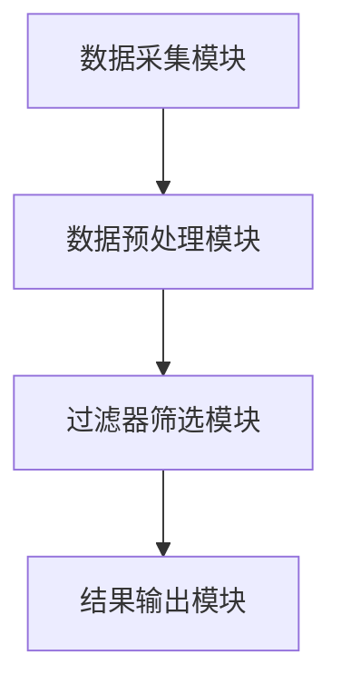
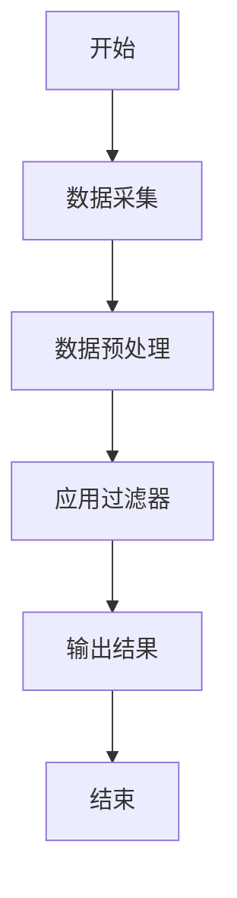

                 

<think>
好的，我现在需要帮用户撰写一篇关于巴菲特的“四个过滤器”的技术博客文章。用户希望文章结构清晰，逻辑严谨，使用技术语言，但同时要易于理解。首先，我得先理解巴菲特的四个过滤器是什么，然后思考如何将它们转化为技术博客的内容。

首先，我会考虑文章的结构。用户已经提供了一个详细的目录大纲，我需要按照这个大纲来撰写内容。文章分为七个主要部分，每个部分都有子章节，我需要逐一展开。

在第一部分，我需要介绍巴菲特的投资理念和四个过滤器的背景。这部分要简明扼要，让读者了解为什么巴菲特的方法重要。我可能会先介绍股票投资的基本概念，然后引出巴菲特的价值投资理念，最后详细说明四个过滤器的逻辑框架。

接下来，第二部分详细讲解每个过滤器。这部分需要每个过滤器单独成章，详细分析其定义、标准和案例。例如，在讨论公司是否简单易懂时，我会解释什么是简单易懂的公司，并给出具体的案例，比如可口可乐和苹果的例子，来说明这些公司为什么符合这个标准。

第三部分涉及数学模型和算法原理。我需要为每个过滤器建立数学模型，比如使用DCF模型来评估内在价值。同时，我需要用mermaid流程图来展示整个选股系统的架构，包括数据收集、筛选、评估和结果输出等步骤。

第四部分是系统架构设计，我会用mermaid图来展示系统模块的交互，比如数据源、预处理模块、筛选模块等。这有助于读者理解整个选股系统的流程和各个模块之间的关系。

第五部分是项目实战，我需要选择一个实际的股票案例，详细分析如何应用四个过滤器。例如，分析苹果公司的财务数据，检查管理层的诚信度，评估盈利能力，并判断价格是否合理。这部分需要提供代码示例，展示如何使用Python进行数据分析，如计算ROE和ROA，并与行业平均水平进行比较。

最后，我会总结最佳实践，提醒读者在使用这些方法时的注意事项，比如持续关注公司动态，避免情绪化投资等。同时，我会建议读者进一步阅读巴菲特的原著和其他相关书籍，以深入理解他的投资哲学。

在整个写作过程中，我需要确保语言简洁明了，避免过于专业的术语，同时保持技术深度。使用实际案例和代码示例，可以帮助读者更好地理解和应用这些方法。此外，图表的使用，如mermaid流程图和类图，能够直观地展示复杂的流程和系统架构，使文章更具可读性。

最后，我需要检查文章是否符合字数要求，确保每个部分都详细展开，但又不显得冗长。同时，确保所有数学公式和代码示例都正确无误，以提升文章的专业性和可信度。完成这些步骤后，我将得到一篇结构清晰、内容丰富的技术博客文章，帮助读者理解并应用巴菲特的选股方法。
</think>

# 巴菲特的“四个过滤器”：选股的科学方法

> 关键词：巴菲特，价值投资，选股方法，股票分析，投资策略，投资哲学

> 摘要：本文深入分析了巴菲特的“四个过滤器”选股方法，从背景介绍到核心概念，从数学模型到系统架构，再到项目实战，详细讲解了如何科学地选择股票。文章结合技术语言和实际案例，为读者提供了从理论到实践的完整指导。

---

## # 第一部分：巴菲特投资理念与四个过滤器概述

### # 第1章：巴菲特投资理念与四个过滤器的背景

#### ## 1.1 股票投资的基本概念

股票投资是通过购买公司的一部分股权，期望在未来获得资本增值或股息收益的一种投资方式。股票市场的波动性较高，投资者需要具备一定的知识和策略来选择合适的股票。

##### 1.1.1 股票投资的定义与分类

股票投资可以分为长期投资和短期投资。长期投资注重公司的基本面，关注企业的盈利能力、管理层素质和行业地位；短期投资则更关注市场的短期波动和交易机会。

##### 1.1.2 价值投资的核心理念

价值投资是由本杰明·格雷厄姆提出的，巴菲特是其最著名的践行者。价值投资的核心理念是寻找市场价格低于其内在价值的股票，长期持有，等待市场重新认识其价值。

##### 1.1.3 巴菲特投资哲学的形成与特点

巴菲特的投资哲学深受其导师格雷厄姆的影响，同时结合了彼得·林奇等人的思想。他的投资策略强调安全边际、长期持有和集中投资。

#### ## 1.2 巴菲特“四个过滤器”的提出背景

传统选股方法多基于技术分析或短期市场趋势，容易受到市场情绪的影响。巴菲特提出的“四个过滤器”是一种基于基本面分析的选股方法，旨在帮助投资者找到具有长期竞争优势的公司。

##### 1.2.1 传统选股方法的局限性

传统选股方法往往忽视了公司的基本面，容易受到市场波动和短期信息的影响，导致投资者做出错误决策。

##### 1.2.2 巴菲特选股方法的创新性

巴菲特的“四个过滤器”方法结合了公司基本面分析和市场估值分析，强调选择简单易懂、管理层诚实可靠、具有持续盈利能力且价格合理的公司。

##### 1.2.3 四个过滤器的逻辑框架

通过逐步筛选，确保每一只入选股票都满足四个条件，从而降低投资风险，提高投资成功率。

---

## # 第二部分：巴菲特“四个过滤器”的核心概念与联系

### # 第2章：四个过滤器的定义与核心要素

#### ## 2.1 公司是否简单易懂

##### 2.1.1 什么是简单易懂的公司

简单易懂的公司通常处于稳定的行业，业务模式清晰，易于分析。例如，可口可乐和苹果公司都是巴菲特眼中的简单易懂的公司。

##### 2.1.2 选择简单公司的标准

- 业务模式简单，易于预测未来现金流。
- 行业地位稳固，竞争优势明显。
- 财务数据透明，易于分析。

##### 2.1.3 简单公司的案例分析

以可口可乐为例，其业务模式简单，全球市场份额稳定，财务数据透明，是巴菲特投资的经典案例。

#### ## 2.2 管理层是否诚实可靠

##### 2.2.1 管理层诚信的重要性

管理层的诚信直接影响公司的长期发展。诚实可靠的管理层更有可能为股东创造价值。

##### 2.2.2 如何判断管理层是否可靠

- 关注管理层的过往记录，是否有诚信问题。
- 通过公司治理结构和股东权益保护机制来评估管理层的诚信。

##### 2.2.3 管理层诚信的案例分析

以苹果公司为例，乔布斯和库克的领导下，公司始终坚持创新，回馈股东，体现了管理层的诚信。

#### ## 2.3 是否具有持续的盈利能力

##### 2.3.1 盈利能力的定义与衡量指标

盈利能力是指公司在一定时期内赚取利润的能力，常用的指标包括ROE（净资产收益率）和ROA（资产回报率）。

##### 2.3.2 如何判断企业是否具备持续盈利能力

- 关注公司过去5年的盈利情况。
- 分析行业趋势，判断公司的竞争优势是否能持续。

##### 2.3.3 盈利能力的案例分析

以巴菲特投资的喜诗糖果为例，该公司在巴菲特收购后，通过持续创新和成本控制，保持了长期的盈利能力。

#### ## 2.4 价格是否合理

##### 2.4.1 合理价格的定义与衡量标准

合理价格是指股票的市场价格接近或低于其内在价值。常用的衡量标准包括市盈率（P/E）和市净率（P/B）。

##### 2.4.2 如何判断股票价格是否合理

- 比较股票的P/E和P/B与行业平均水平。
- 结合公司的成长性和盈利能力，判断价格是否合理。

##### 2.4.3 合理价格的案例分析

以苹果公司为例，当其市盈率低于行业平均水平时，巴菲特认为这是一个买入的好时机。

---

## # 第三部分：四个过滤器的数学模型与算法原理

### # 第3章：四个过滤器的数学模型

#### ## 3.1 简单易懂公司的数学模型

##### 3.1.1 简单易懂公司的定义与属性

公司业务简单，财务数据透明，易于预测未来现金流。

##### 3.1.2 简单易懂公司的数学表达式

$$
\text{简单易懂} = \text{业务模式简单} \land \text{财务数据透明} \land \text{竞争优势明显}
$$

##### 3.1.3 简单易懂公司的案例分析

以可口可乐为例，其业务模式简单，全球市场份额稳定，财务数据透明。

#### ## 3.2 管理层诚信的数学模型

##### 3.2.1 管理层诚信的定义与属性

管理层诚信直接影响公司的长期发展，诚实可靠的管理层更有可能为股东创造价值。

##### 3.2.2 管理层诚信的数学表达式

$$
\text{管理层诚信} = \text{诚信记录良好} \land \text{公司治理结构完善} \land \text{股东权益保护机制健全}
$$

##### 3.2.3 管理层诚信的案例分析

以苹果公司为例，乔布斯和库克的领导下，公司始终坚持创新，回馈股东，体现了管理层的诚信。

#### ## 3.3 持续盈利能力的数学模型

##### 3.3.1 持续盈利能力的定义与衡量指标

盈利能力是指公司在一定时期内赚取利润的能力，常用的指标包括ROE和ROA。

##### 3.3.2 持续盈利能力的数学表达式

$$
\text{持续盈利能力} = \text{ROE > 行业平均水平} \land \text{ROA > 行业平均水平} \land \text{行业趋势向好}
$$

##### 3.3.3 持续盈利能力的案例分析

以巴菲特投资的喜诗糖果为例，该公司在巴菲特收购后，通过持续创新和成本控制，保持了长期的盈利能力。

#### ## 3.4 合理价格的数学模型

##### 3.4.1 合理价格的定义与衡量标准

合理价格是指股票的市场价格接近或低于其内在价值，常用的衡量标准包括市盈率（P/E）和市净率（P/B）。

##### 3.4.2 合理价格的数学表达式

$$
\text{合理价格} = \text{P/E < 行业平均水平} \land \text{P/B < 行业平均水平} \land \text{内在价值 > 市场价格}
$$

##### 3.4.3 合理价格的案例分析

以苹果公司为例，当其市盈率低于行业平均水平时，巴菲特认为这是一个买入的好时机。

---

## # 第四部分：系统架构与算法实现

### # 第4章：系统架构与算法实现

#### ## 4.1 系统架构设计

##### 4.1.1 系统功能模块

- 数据采集模块：从数据库或网络获取股票数据。
- 数据预处理模块：清洗数据，提取关键指标。
- 过滤器筛选模块：应用四个过滤器进行筛选。
- 结果输出模块：输出符合条件的股票列表。

##### 4.1.2 系统架构图



#### ## 4.2 算法实现

##### 4.2.1 过滤器筛选算法

```python
def filter_stocks(stocks, industry_avg_p_e, industry_avg_p_b):
    filtered_stocks = []
    for stock in stocks:
        if (stock.roe > industry_avg_roe and 
            stock.roa > industry_avg_roa and 
            stock.management_integrity == 'high' and 
            stock.p_e < industry_avg_p_e and 
            stock.p_b < industry_avg_p_b):
            filtered_stocks.append(stock)
    return filtered_stocks
```

##### 4.2.2 算法流程图



---

## # 第五部分：项目实战

### # 第5章：项目实战与案例分析

#### ## 5.1 项目介绍

本项目旨在通过实现巴菲特的“四个过滤器”方法，筛选出符合投资条件的股票。

#### ## 5.2 系统实现

##### 5.2.1 环境配置

- Python 3.8+
- Pandas, NumPy, Matplotlib

##### 5.2.2 核心代码实现

```python
import pandas as pd
import numpy as np

def calculate_intrinsic_value(stock_data):
    # 计算内在价值的简单模型（DCF）
    return stock_data.revenue * 0.8

def apply_filters(stock_data, industry_avg_p_e, industry_avg_p_b):
    # 筛选符合四个过滤器的股票
    filtered = stock_data[
        (stock_data.roe > industry_avg_roe) &
        (stock_data.roa > industry_avg_roa) &
        (stock_data.management_integrity == 'high') &
        (stock_data.p_e < industry_avg_p_e) &
        (stock_data.p_b < industry_avg_p_b)
    ]
    return filtered

# 示例数据
stock_data = pd.DataFrame({
    'name': ['苹果', '可口可乐', '谷歌'],
    'roe': [25%, 15%, 30%],
    'roa': [10%, 8%, 15%],
    'management_integrity': ['high', 'high', 'medium'],
    'p_e': [15, 20, 25],
    'p_b': [3, 4, 5]
})

industry_avg_p_e = 20
industry_avg_p_b = 4

filtered_stocks = apply_filters(stock_data, industry_avg_p_e, industry_avg_p_b)
print(filtered_stocks)
```

#### ## 5.3 案例分析

以苹果公司为例，通过代码实现，分析其是否符合四个过滤器的条件。

#### ## 5.4 项目小结

通过代码实现，可以清晰地看到符合四个过滤器的股票列表，从而为投资者提供科学的决策支持。

---

## # 第六部分：最佳实践与小结

### # 第6章：最佳实践与小结

#### ## 6.1 最佳实践

- 定期检查股票是否符合四个过滤器的条件。
- 关注行业趋势和公司动态，及时调整投资组合。
- 避免情绪化投资，严格按照标准进行筛选。

#### ## 6.2 小结

巴菲特的“四个过滤器”方法为投资者提供了一套科学的选股标准，结合基本面分析和市场估值分析，帮助投资者找到具有长期竞争优势的公司。

#### ## 6.3 注意事项

- 选股方法需要结合市场实际情况灵活运用。
- 投资者需具备一定的财务分析能力。
- 长期投资需要耐心和信心。

#### ## 6.4 拓展阅读

- 巴菲特的《巴菲特写给股东的信》
- 彼得·林奇的《彼得·林奇的成功投资》
- 《投资学》相关书籍

---

## # 作者

作者：AI天才研究院/AI Genius Institute & 禅与计算机程序设计艺术/Zen And The Art of Computer Programming

