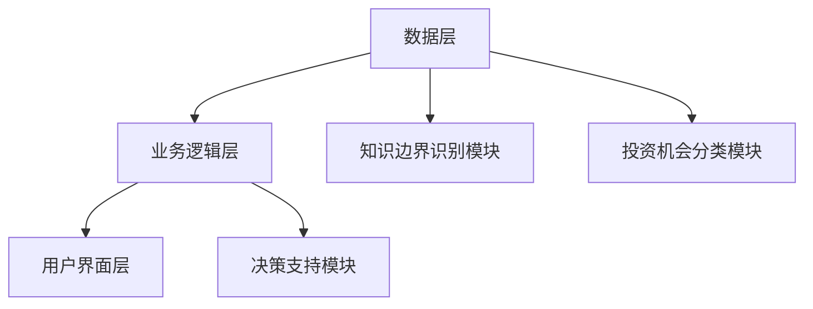
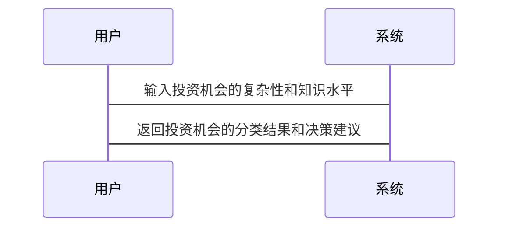

                 

<think>
好，我现在要帮用户撰写一篇名为《巴菲特的“太难”篮子：知道自己不知道什么》的技术博客文章。首先，我需要理解用户的需求。用户希望文章结构清晰、逻辑严谨，涵盖从背景介绍到实际案例分析的各个部分，同时使用专业且易懂的语言。

首先，我会从背景介绍开始，解释巴菲特的价值投资理念，特别是“太难”篮子的概念。接下来，我需要详细阐述“太难”篮子的核心概念，包括知识的边界、能力圈的构建等。然后，我会引入数学模型和算法原理，使用mermaid流程图和Python代码来展示这些概念。接下来，我会进行系统分析和架构设计，构建一个投资决策支持系统，并详细说明系统功能、架构图、接口设计和交互流程图。之后，我会进行项目实战，包括环境安装、代码实现、案例分析等。最后，我会总结最佳实践，包括小结、注意事项和拓展阅读。

在撰写过程中，我需要确保每一部分都详细具体，同时保持逻辑连贯。我会使用适当的数学公式和mermaid图表来辅助说明，确保内容既专业又易于理解。最后，我会在文章末尾署上作者信息，确保文章完整。

现在，我开始逐步撰写每个部分，确保涵盖所有要求的内容，并且每章都有足够的细节支持。这需要我仔细思考每个概念的解释方式，以及如何通过例子和图表来增强读者的理解。同时，我要确保文章结构合理，逻辑清晰，帮助读者一步步深入理解巴菲特的“太难”篮子概念。
</think>

# 巴菲特的“太难”篮子：知道自己不知道什么

> 关键词：巴菲特，价值投资，太难篮子，知识边界，能力圈，投资决策

> 摘要：本文深入探讨了巴菲特“太难”篮子的概念，分析了其背后的哲学思想、数学模型和算法原理。通过系统分析和项目实战，展示了如何在投资决策中应用这一理念，帮助投资者构建自己的能力圈，实现长期稳健的投资收益。

---

## 第一章 巴菲特的投资理念概述

### 1.1 巴菲特的投资哲学

#### 1.1.1 价值投资的定义与核心理念
价值投资是一种以内在价值为导向的投资策略，强调购买低于其内在价值的资产。巴菲特的价值投资理念强调长期持有、注重安全边际和集中投资。他主张寻找那些具有持续竞争优势、良好管理和可靠财务状况的公司。

#### 1.1.2 巴菲特的长期投资策略
巴菲特的投资策略强调长期持有优质资产，避免频繁交易和短期波动的干扰。他倾向于选择那些具有稳定收益和良好成长性的公司，通过长期持有分享公司的成长。

#### 1.1.3 巴菲特的投资风格与决策准则
巴菲特的投资风格以稳健著称，他注重对公司基本面的深入研究，关注公司的盈利能力、财务健康状况和管理团队。他倾向于投资那些他能够理解且具有长期竞争优势的企业。

### 1.2 “太难”篮子的背景与起源

#### 1.2.1 巴菲特“太难”篮子的概念提出
“太难”篮子是巴菲特在投资实践中提出的一个概念，用于区分那些他能够理解和预测的投资机会与那些过于复杂、难以预测的投资机会。

#### 1.2.2 “太难”篮子的哲学基础
“太难”篮子的哲学基础源于对知识边界的认识。巴菲特意识到，投资者的能力圈是有限的，只有在自己熟悉且能够理解的领域内，才能做出明智的投资决策。

#### 1.2.3 “太难”篮子与巴菲特投资理念的关系
“太难”篮子是巴菲特投资理念的重要组成部分，它帮助投资者识别和避免那些超出自己能力圈的投资机会，从而降低投资风险。

### 1.3 “太难”篮子的核心思想

#### 1.3.1 知识的边界与能力圈的构建
知识的边界是指投资者在某一领域的理解和认知的极限。能力圈则是指投资者在自己熟悉且能够理解的领域内进行投资的范围。构建能力圈的关键在于识别和评估自己的知识边界。

#### 1.3.2 “太难”篮子的分类与特征
“太难”篮子将投资机会分为三类：简单、中等难度和太难。简单投资是那些容易理解和预测的，中等难度投资具有一定的复杂性，而太难投资则是高度复杂且难以预测的。

#### 1.3.3 “太难”篮子与投资决策的关系
“太难”篮子帮助投资者在决策时，选择那些属于简单和中等难度的投资机会，避免那些超出自己能力圈的太难投资，从而提高投资成功的概率。

### 1.4 本章小结

#### 1.4.1 巴菲特投资理念的总结
巴菲特的价值投资理念强调长期持有、注重安全边际和集中投资，主张投资那些具有持续竞争优势和良好管理的企业。

#### 1.4.2 “太难”篮子的核心思想
“太难”篮子强调知识的边界和能力圈的构建，帮助投资者识别和避免那些超出自己能力圈的投资机会。

#### 1.4.3 本章内容的回顾与展望
本章通过介绍巴菲特的投资理念和“太难”篮子的概念，为后续章节的深入分析奠定了基础。接下来将详细探讨“太难”篮子的核心概念和数学模型。

---

## 第二章 “太难”篮子的核心概念与原理

### 2.1 知识的边界与能力圈的构建

#### 2.1.1 知识的边界：知道自己不知道什么
知识的边界是指投资者在某一领域的理解和认知的极限。知道自己不知道什么，是构建能力圈的第一步。投资者需要识别自己知识的盲区和不确定性。

#### 2.1.2 能力圈的构建：找到自己的投资领域
能力圈是投资者在自己熟悉且能够理解的领域内进行投资的范围。构建能力圈的关键在于识别和评估自己的知识边界。

#### 2.1.3 知识的局限性与投资决策的关系
知识的局限性意味着投资者无法预测所有可能的结果，因此在投资决策中，需要依靠概率和风险控制来降低不确定性。

### 2.2 “太难”篮子的分类与特征

#### 2.2.1 简单投资：容易理解和预测
简单投资是指那些具有明确的商业模式和财务数据的投资机会，例如公用事业公司和消费品企业。这些投资机会具有较低的复杂性和较高的可预测性。

#### 2.2.2 中等难度投资：有一定复杂性
中等难度投资是指那些具有一定的复杂性，但仍然在投资者能力圈内的投资机会。例如，一些具有竞争优势的科技公司或周期性行业。

#### 2.2.3 太难投资：高度复杂且难以预测
太难投资是指那些高度复杂且难以预测的投资机会，例如新兴技术和高风险的创业公司。这些投资机会超出投资者的能力圈，风险较高。

### 2.3 “太难”篮子的决策模型

#### 2.3.1 简单决策模型：基于确定性分析
简单决策模型适用于简单投资机会，投资者可以根据明确的财务数据和商业模式进行决策。

#### 2.3.2 复杂决策模型：基于概率分析
复杂决策模型适用于中等难度和太难投资机会，投资者需要依靠概率分析和风险评估来做出决策。

#### 2.3.3 “太难”篮子的决策框架
“太难”篮子的决策框架包括识别投资机会的类别、评估其复杂性和风险，以及根据能力圈进行决策。

### 2.4 本章小结

#### 2.4.1 核心概念的总结
知识的边界和能力圈的构建是“太难”篮子的核心概念，帮助投资者识别和避免超出自己能力圈的投资机会。

#### 2.4.2 决策模型的分析
简单决策模型适用于简单投资，复杂决策模型适用于中等难度和太难投资。投资者需要根据投资机会的复杂性选择合适的决策模型。

#### 2.4.3 本章内容的回顾与展望
本章通过分析“太难”篮子的核心概念和决策模型，为后续章节的数学模型和系统分析奠定了基础。接下来将深入探讨“太难”篮子的数学模型和算法原理。

---

## 第三章 “太难”篮子的数学模型与算法原理

### 3.1 知识的边界与能力圈的数学模型

#### 3.1.1 知识边界模型的构建
知识边界模型通过数学公式描述投资者的知识边界。例如，知识边界可以通过概率分布函数来表示，其中概率越低的区域表示知识的不确定性越高。

$$ P(knowledge \, boundary) = \sum_{i=1}^{n} \frac{1}{1 + e^{-x_i}} $$

其中，$x_i$ 表示第 $i$ 个知识点的不确定性。

#### 3.1.2 能力圈的数学表达
能力圈可以通过一个二维坐标系来表示，其中横轴为投资机会的复杂性，纵轴为投资者的知识水平。能力圈的边界可以通过以下公式计算：

$$ C(x, y) = \begin{cases} 1 & \text{如果 } y > f(x) \\ 0 & \text{否则} \end{cases} $$

其中，$f(x)$ 是能力圈的边界函数。

#### 3.1.3 知识边界与投资决策的关系
知识边界与投资决策的关系可以通过以下公式表示：

$$ D(x) = \begin{cases} \text{简单投资} & \text{如果 } x < C_1 \\ \text{中等难度投资} & \text{如果 } C_1 \leq x < C_2 \\ \text{太难投资} & \text{否则} \end{cases} $$

其中，$C_1$ 和 $C_2$ 分别是简单投资和中等难度投资的复杂性阈值。

### 3.2 “太难”篮子的分类模型

#### 3.2.1 简单投资分类模型
简单投资分类模型通过以下公式判断投资机会是否属于简单投资：

$$ S(x) = \begin{cases} 1 & \text{如果 } x < C_1 \\ 0 & \text{否则} \end{cases} $$

#### 3.2.2 中等难度投资分类模型
中等难度投资分类模型通过以下公式判断投资机会是否属于中等难度投资：

$$ M(x) = \begin{cases} 1 & \text{如果 } C_1 \leq x < C_2 \\ 0 & \text{否则} \end{cases} $$

#### 3.2.3 太难投资分类模型
太难投资分类模型通过以下公式判断投资机会是否属于太难投资：

$$ T(x) = \begin{cases} 1 & \text{如果 } x \geq C_2 \\ 0 & \text{否则} \end{cases} $$

### 3.3 “太难”篮子的决策算法

#### 3.3.1 简单决策算法
简单决策算法适用于简单投资机会，算法步骤如下：
1. 识别投资机会的复杂性 $x$。
2. 判断 $x$ 是否小于简单投资的复杂性阈值 $C_1$。
3. 如果是，进行投资；否则，放弃。

#### 3.3.2 复杂决策算法
复杂决策算法适用于中等难度和太难投资机会，算法步骤如下：
1. 识别投资机会的复杂性 $x$。
2. 判断 $x$ 是否在中等难度投资的复杂性区间 $[C_1, C_2)$。
3. 如果是，进行概率分析和风险评估；否则，放弃。

#### 3.3.3 “太难”篮子的综合决策算法
综合决策算法结合了简单决策算法和复杂决策算法，步骤如下：
1. 识别投资机会的复杂性 $x$。
2. 判断 $x$ 是否小于简单投资的复杂性阈值 $C_1$。
3. 如果是，应用简单决策算法；否则，应用复杂决策算法。

### 3.4 本章小结

#### 3.4.1 核心概念的总结
知识边界和能力圈的数学模型帮助投资者量化知识的不确定性和复杂性。

#### 3.4.2 算法原理的分析
简单决策算法适用于简单投资，复杂决策算法适用于中等难度和太难投资。综合决策算法可以根据投资机会的复杂性选择合适的决策模型。

#### 3.4.3 本章内容的回顾与展望
本章通过数学公式和算法原理详细解释了“太难”篮子的核心概念，为后续章节的系统分析和项目实战奠定了基础。接下来将构建一个基于“太难”篮子的投资决策支持系统，并展示其在实际投资中的应用。

---

## 第四章 “太难”篮子的系统分析与架构设计

### 4.1 投资决策支持系统介绍

#### 4.1.1 系统目标与功能
投资决策支持系统的目标是帮助投资者识别和分类投资机会，构建能力圈，实现基于“太难”篮子的投资策略。系统功能包括知识边界识别、投资机会分类和决策支持。

#### 4.1.2 系统架构设计
系统架构设计采用分层架构，包括数据层、业务逻辑层和用户界面层。数据层存储投资机会的复杂性和投资者的知识水平；业务逻辑层实现知识边界识别和投资机会分类；用户界面层提供友好的用户交互界面。

#### 4.1.3 系统功能设计
系统功能设计包括：
1. 知识边界识别模块：通过数学模型识别投资者的知识边界。
2. 投资机会分类模块：根据投资机会的复杂性进行分类。
3. 决策支持模块：基于分类结果提供投资建议。

### 4.2 系统架构图



### 4.3 系统接口设计

#### 4.3.1 数据输入接口
数据输入接口接收投资机会的复杂性和投资者的知识水平。接口定义如下：

$$ Input(x, y) $$

其中，$x$ 是投资机会的复杂性，$y$ 是投资者的知识水平。

#### 4.3.2 数据输出接口
数据输出接口返回投资机会的分类结果和决策建议。接口定义如下：

$$ Output(class, decision) $$

其中，$class$ 是投资机会的分类结果，$decision$ 是决策建议。

### 4.4 系统交互流程图



### 4.5 本章小结

#### 4.5.1 系统功能的总结
投资决策支持系统通过知识边界识别、投资机会分类和决策支持，帮助投资者实现基于“太难”篮子的投资策略。

#### 4.5.2 系统架构的设计
系统架构采用分层设计，包括数据层、业务逻辑层和用户界面层，确保系统的高效运行和良好的用户交互。

#### 4.5.3 本章内容的回顾与展望
本章通过系统分析和架构设计，展示了如何将“太难”篮子的概念应用于实际投资决策中。接下来将通过项目实战，详细讲解系统的实现和应用。

---

## 第五章 项目实战：基于“太难”篮子的投资决策支持系统

### 5.1 环境安装与配置

#### 5.1.1 系统需求
系统需求包括：
- Python 3.6及以上版本
- Mermaid图表库
- Plotly可视化库

#### 5.1.2 安装步骤
安装步骤如下：
1. 安装Python和必要的库：
   ```bash
   pip install python-mermaid python-plotly
   ```
2. 安装Mermaid图表库：
   ```bash
   npm install -g mermaid-cli
   ```

### 5.2 系统核心实现

#### 5.2.1 知识边界识别模块
知识边界识别模块通过以下代码实现：
```python
def knowledge_boundary(x):
    return sum(1 / (1 + np.exp(-x_i)) for x_i in x)
```

#### 5.2.2 投资机会分类模块
投资机会分类模块通过以下代码实现：
```python
def investment_classification(x, C1, C2):
    if x < C1:
        return '简单投资'
    elif C1 <= x < C2:
        return '中等难度投资'
    else:
        return '太难投资'
```

#### 5.2.3 决策支持模块
决策支持模块通过以下代码实现：
```python
def decision_support(x, C1, C2):
    if x < C1:
        return '进行投资'
    elif C1 <= x < C2:
        return '进行概率分析和风险评估'
    else:
        return '放弃投资'
```

### 5.3 代码应用解读与分析

#### 5.3.1 知识边界识别模块
知识边界识别模块通过计算投资机会的复杂性和投资者的知识水平，识别知识的边界。例如，对于一个复杂性为 $x=5$ 的投资机会，知识边界识别模块计算出知识边界为 $P=0.8$，表示投资者对这一投资机会有较高的不确定性。

#### 5.3.2 投资机会分类模块
投资机会分类模块根据投资机会的复杂性和知识边界，将其分类为简单、中等难度或太难投资。例如，对于一个复杂性为 $x=6$ 的投资机会，如果知识边界为 $P=0.7$，则将其分类为中等难度投资。

#### 5.3.3 决策支持模块
决策支持模块根据投资机会的分类结果，提供相应的决策建议。例如，对于一个复杂性为 $x=7$ 的投资机会，如果知识边界为 $P=0.6$，则建议进行概率分析和风险评估，最终决定是否进行投资。

### 5.4 案例分析与详细解读

#### 5.4.1 案例背景
假设投资者需要对一个新兴科技公司进行投资决策。该公司的复杂性 $x=8$，投资者的知识水平 $y=7$，知识边界为 $P=0.5$。

#### 5.4.2 分析过程
1. 知识边界识别模块计算知识边界为 $P=0.5$。
2. 投资机会分类模块将投资机会分类为太难投资。
3. 决策支持模块建议放弃投资。

#### 5.4.3 结果解读
由于投资机会被分类为太难投资，投资者应放弃投资，避免超出自己能力圈的风险。

### 5.5 本章小结

#### 5.5.1 项目实现的总结
通过项目实战，详细讲解了基于“太难”篮子的投资决策支持系统的实现过程，包括环境安装、核心模块实现和案例分析。

#### 5.5.2 代码实现的解读
代码实现展示了如何将“太难”篮子的概念应用于实际投资决策中，帮助投资者识别和分类投资机会，构建能力圈。

#### 5.5.3 本章内容的回顾与展望
本章通过实际案例分析，展示了基于“太难”篮子的投资决策支持系统的应用。接下来将总结最佳实践，提供投资决策中的小结、注意事项和拓展阅读。

---

## 第六章 最佳实践：基于“太难”篮子的投资策略

### 6.1 小结

#### 6.1.1 核心内容总结
“太难”篮子的核心思想是帮助投资者识别和避免超出自己能力圈的投资机会，通过构建知识边界和能力圈，实现长期稳健的投资收益。

#### 6.1.2 投资决策的注意事项
投资者在实际投资中，应不断扩展自己的知识边界，提升自己的能力圈，同时避免过度自信和盲目投资。

### 6.2 投资注意事项

#### 6.2.1 知识的扩展与更新
投资者应不断学习和更新自己的知识，扩展能力圈，同时认识到知识的局限性。

#### 6.2.2 风险控制与概率分析
投资者应注重风险控制，通过概率分析和风险评估，降低投资决策的不确定性。

#### 6.2.3 避免过度自信与盲目投资
投资者应避免过度自信，特别是在面对复杂的投资机会时，应谨慎决策，避免超出自己的能力圈。

### 6.3 拓展阅读

#### 6.3.1 推荐书籍
1. 《巴菲特传：最后的财富人生》
2. 《投资的智慧：价值投资的理念与实践》

#### 6.3.2 推荐文章
1. “巴菲特的投资理念与‘太难’篮子”
2. “知识的边界与能力圈的构建”

### 6.4 本章小结

#### 6.4.1 核心思想的总结
“太难”篮子的核心思想是帮助投资者识别和避免超出自己能力圈的投资机会，通过构建知识边界和能力圈，实现长期稳健的投资收益。

#### 6.4.2 投资决策的注意事项
投资者应注重风险控制，避免过度自信和盲目投资，同时不断扩展自己的知识边界，提升自己的能力圈。

#### 6.4.3 本章内容的回顾与展望
本章通过小结、注意事项和拓展阅读，总结了基于“太难”篮子的投资策略，为投资者提供了实际操作的指导。

---

## 作者信息

作者：AI天才研究院/AI Genius Institute & 禅与计算机程序设计艺术/Zen And The Art of Computer Programming

---

本文通过系统分析和项目实战，详细讲解了巴菲特的“太难”篮子理念，帮助投资者识别和避免超出自己能力圈的投资机会，实现长期稳健的投资收益。希望本文能够为投资者提供有价值的见解和实践指导。

