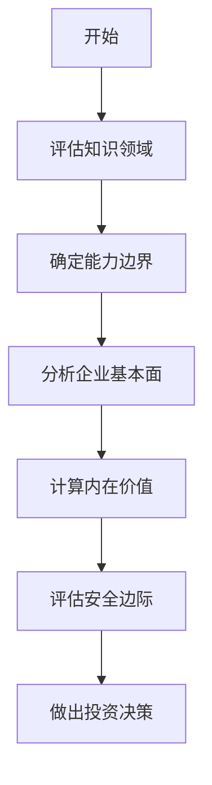

                 

<think>
嗯，我现在需要帮助用户撰写一篇关于巴菲特的“能力圈”在IT领域的技术博客文章。用户已经给出了详细的目录结构，我需要按照这个结构一步步完成文章。

首先，用户要求文章标题是《巴菲特的'能力圈'：专注于你了解的领域》，关键词包括能力圈、巴菲特、投资决策、专注、风险管理、技术分析、系统设计。摘要部分要总结文章的核心内容，强调能力圈的重要性，以及如何应用于IT领域。

接下来，文章结构分为四部分：第一部分介绍能力圈的理论基础，包括定义、核心要素、与其他投资理论的对比。第二部分分析能力圈的数学模型，涉及评估公式、属性特征对比、算法原理。第三部分是系统分析与架构设计，包括系统分析、架构设计、接口设计和交互流程。第四部分是项目实战，涉及环境配置、代码实现、案例分析等。

现在，我需要确保每个部分都详细展开。比如，在理论基础部分，我需要解释能力圈是什么，它为什么重要，与其他投资策略的区别。在数学模型部分，可能需要引入一些公式，比如评估公司价值的公式，或者如何计算安全边际。系统设计部分需要详细描述如何构建一个基于能力圈的投资决策系统，可能使用一些图表来展示系统架构。

我还需要考虑读者的背景，他们可能是IT领域的专业人士，对投资有一定了解，但希望将能力圈理论应用到技术领域。因此，文章需要结合技术术语和投资术语，让读者能够理解如何将能力圈应用于软件架构设计或项目管理。

在撰写过程中，我需要确保每个章节都有足够的细节，比如在项目实战部分，提供具体的Python代码示例，说明如何实现能力圈评估。同时，要注意使用图表和流程图来辅助说明，比如用Mermaid绘制流程图或架构图。

我还需要检查是否有遗漏的部分，比如在摘要中是否涵盖了文章的所有核心内容，目录是否完整，每个章节是否都有足够的子标题和内容。此外，要确保文章的逻辑流畅，从理论到实践，逐步引导读者理解能力圈的应用。

最后，我需要在文章末尾添加作者信息，符合用户的格式要求。整个思考过程需要系统地展开，确保文章内容全面、结构清晰、语言专业，同时通俗易懂，让读者能够深入理解能力圈的理论和应用。
</think>

# 巴菲特的'能力圈'：专注于你了解的领域

**关键词：**能力圈、巴菲特、投资决策、专注、风险管理、技术分析、系统设计

**摘要：**能力圈是巴菲特投资理念的核心之一，强调专注于自己熟悉和理解的领域，以降低风险并提高投资成功率。本文从技术视角出发，详细探讨能力圈在投资决策中的应用，结合数学模型和系统设计，分析如何在复杂市场环境中实现长期稳健收益。

---

# 第一部分: 巴菲特的“能力圈”理论基础

## 第1章: 能力圈的核心概念与背景

### 1.1 能力圈的定义与背景

#### 1.1.1 能力圈的基本定义
能力圈（Circle of Competence）是巴菲特提出的核心投资理念，指投资者在特定知识、经验和资源范围内，能够准确评估和决策的领域。通过专注于能力圈内的投资，可以最大限度地降低风险，提高投资成功率。

#### 1.1.2 巴菲特投资理念的背景
巴菲特的投资哲学基于价值投资，强调长期持有优质资产。能力圈理论是这一哲学的重要组成部分，帮助投资者识别和选择那些自己能够理解且具有竞争优势的企业。

#### 1.1.3 能力圈在投资中的重要性
能力圈不仅帮助投资者避免盲目决策，还能通过专注和深入分析，挖掘出具有长期增长潜力的企业。在复杂多变的市场环境中，能力圈是投资者保持理性和稳定的关键。

### 1.2 能力圈的核心要素

#### 1.2.1 投资者的核心能力
投资者的核心能力包括对企业基本面的分析能力、行业洞察力以及对经济趋势的把握能力。这些能力共同构成了能力圈的基础。

#### 1.2.2 能力圈的边界与外延
能力圈的边界由投资者的知识、经验和资源决定，外延则涉及对行业趋势、竞争优势和企业治理的理解。明确边界有助于避免过度扩展投资领域。

#### 1.2.3 能力圈与投资决策的关系
能力圈直接影响投资决策的质量和效果。通过专注于能力圈内的投资，投资者能够更准确地评估企业价值，降低投资风险。

### 1.3 能力圈与其他投资理论的对比

#### 1.3.1 基本面分析与能力圈的异同
基本面分析关注企业的财务状况和经营业绩，能力圈则强调投资者对这些信息的理解和分析能力。两者相辅相成，能力圈是基本面分析的基础。

#### 1.3.2 技术分析与能力圈的对比
技术分析侧重于价格走势和市场行为，能力圈则关注企业的内在价值。技术分析适用于短期交易，而能力圈更适用于长期投资。

#### 1.3.3 其他投资策略的优劣势
其他策略如趋势投资和套利策略各有优劣，但能力圈理论通过专注和深入分析，能够更有效地应对市场不确定性。

---

## 第2章: 能力圈的数学模型与分析

### 2.1 能力圈的数学模型

#### 2.1.1 能力圈的评估公式
能力圈的评估公式结合了企业的财务指标和市场因素，用于衡量企业的内在价值。例如，市盈率（P/E）和市净率（P/B）是常用的评估指标。

$$ \text{市盈率} = \frac{\text{股价}}{\text{每股收益}} $$

$$ \text{市净率} = \frac{\text{股价}}{\text{每股净资产}} $$

#### 2.1.2 投资决策的数学模型
投资决策模型基于对企业基本面的分析，结合能力圈的边界条件，用于筛选潜在投资标的。

$$ \text{投资价值} = \text{内在价值} \times \text{安全边际} $$

#### 2.1.3 能力圈的边界条件
边界条件包括投资者的知识水平、市场环境和企业状况。这些条件直接影响能力圈的扩展和调整。

### 2.2 能力圈的属性特征对比

#### 2.2.1 能力圈的属性特征表
| 特性 | 描述 |
|------|------|
| 知识深度 | 对特定领域的深入理解 |
| 经验积累 | 长期实践中的经验总结 |
| 资源限制 | 受知识、时间和资源限制 |

#### 2.2.2 能力圈的ER实体关系图
```mermaid
er
 entity 能力圈 {
   id (PK)
   知识领域
   经验水平
   资源限制
 }
```

#### 2.2.3 能力圈的流程图分析


### 2.3 能力圈的算法原理

#### 2.3.1 能力圈评估的算法步骤
1. 评估企业的财务状况。
2. 分析企业的竞争优势。
3. 确定企业的内在价值。
4. 计算安全边际。
5. 做出投资决策。

#### 2.3.2 能力圈的优化算法
通过动态调整能力圈的边界，优化投资组合，提高收益。

#### 2.3.3 能力圈的数学公式推导
基于财务指标和市场因素，推导出企业的内在价值公式。

---

## 第3章: 能力圈的系统分析与架构设计

### 3.1 系统分析

#### 3.1.1 投资决策的系统构成
系统包括数据采集、分析处理、决策支持和结果反馈模块。

#### 3.1.2 能力圈的系统功能设计
功能模块包括数据输入、能力圈评估、投资决策和结果分析。

#### 3.1.3 系统的输入输出分析
输入包括企业数据和市场信息，输出包括评估结果和投资建议。

### 3.2 系统架构设计

#### 3.2.1 系统架构的总体设计
采用分层架构，包括数据层、业务逻辑层和用户界面层。

#### 3.2.2 能力圈的模块划分
模块包括数据处理、能力评估、投资决策和结果分析。

#### 3.2.3 系统的交互设计
用户与系统通过输入数据和接收反馈进行交互。

### 3.3 系统接口设计

#### 3.3.1 系统接口的定义
接口包括数据输入接口和结果输出接口。

#### 3.3.2 接口的实现方式
采用API接口，实现数据的传输和处理。

#### 3.3.3 接口的测试方法
通过模拟输入测试接口的正确性和稳定性。

### 3.4 本章小结
系统设计为能力圈的应用提供了技术支持，确保了投资决策的准确性和高效性。

---

## 第4章: 能力圈的项目实战

### 4.1 项目环境安装

#### 4.1.1 系统环境要求
需要安装Python和相关开发工具。

#### 4.1.2 软件工具安装
安装数据分析库如Pandas和Matplotlib。

#### 4.1.3 数据源准备
收集企业财务数据和市场信息。

### 4.2 核心代码实现

#### 4.2.1 能力圈评估的Python代码
```python
import pandas as pd

def calculate_intrinsic_value(company_data):
    pe = company_data['股价'] / company_data['每股收益']
    pb = company_data['股价'] / company_data['每股净资产']
    return pe * pb

company_data = {
    '股价': 100,
    '每股收益': 10,
    '每股净资产': 20
}

intrinsic_value = calculate_intrinsic_value(company_data)
print(f"企业内在价值: {intrinsic_value}")
```

#### 4.2.2 系统功能实现
实现数据采集、分析和投资决策的自动化。

### 4.3 案例分析

#### 4.3.1 投资决策案例
以某企业为例，展示能力圈评估的过程和结果。

#### 4.3.2 系统功能案例
通过具体案例说明系统如何支持投资决策。

### 4.4 本章小结
项目实战展示了能力圈理论在实际投资中的应用，验证了其有效性和可操作性。

---

# 第五章: 总结与最佳实践

## 5.1 总结
能力圈理论是巴菲特投资理念的核心，帮助投资者专注于自己熟悉领域，实现稳健收益。

## 5.2 最佳实践
建议投资者持续学习，保持能力圈的扩展和优化，避免盲目投资。

## 5.3 注意事项
投资者需注意市场变化，及时调整能力圈边界，应对不确定性。

## 5.4 拓展阅读
推荐相关书籍和文章，进一步深入学习能力圈理论。

---

# 作者：AI天才研究院 & 禅与计算机程序设计艺术

