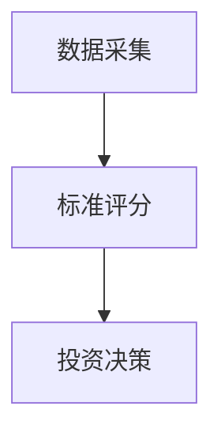

                 


# 巴菲特的20格打孔卡投资法则

## 关键词：
- 巴菲特投资法则
- 价值投资
- 股票筛选标准
- 投资决策框架
- 股票分析模型

## 摘要：
巴菲特的20格打孔卡投资法则是价值投资领域的经典策略，通过系统化的方法筛选优质股票。本文详细解析了该法则的背景、筛选标准、数学模型、系统设计及实际应用，结合案例分析和代码实现，帮助投资者理解并应用这一方法。

---

## 目录

1. [巴菲特投资理念与20格打孔卡概述](#巴菲特投资理念与20格打孔卡概述)
2. [20格打孔卡的筛选标准与使用方法](#20格打孔卡的筛选标准与使用方法)
3. [20格打孔卡的数学模型与公式](#20格打孔卡的数学模型与公式)
4. [系统化投资框架的设计与实现](#系统化投资框架的设计与实现)
5. [20格打孔卡的项目实战](#20格打孔卡的项目实战)
6. [最佳实践与注意事项](#最佳实践与注意事项)

---

## 第一部分：巴菲特投资理念与20格打孔卡概述

### 第1章：巴菲特的投资哲学

#### 1.1 投资的本质
- 投资的定义与核心目标：通过分析企业的基本面，寻找具有长期竞争优势的公司。
- 巴菲特的价值投资理念：买入并持有优质股票，追求长期稳定的收益。
- 长期投资与复利效应：通过时间的积累，实现财富的指数级增长。

#### 1.2 巴菲特的20格打孔卡背景
- 20格打孔卡的由来：巴菲特设计的表格，用于筛选符合投资标准的股票。
- 核心目的：通过系统化的方法，确保投资决策的科学性和严谨性。

### 第2章：20格打孔卡的核心要素

#### 2.1 企业基本面分析
- 财务健康状况：ROE、净利润率等指标。
- 市场地位与竞争优势：行业龙头、品牌价值。
- 管理团队能力：领导层的经验和稳定性。

#### 2.2 估值与安全边际
- 市盈率（P/E）：衡量股票价格是否合理。
- 市净率（P/B）：评估资产是否被低估。

---

## 第二部分：20格打孔卡的筛选标准与使用方法

### 第3章：打孔卡的制作与填写

#### 3.1 制作打孔卡的步骤
- 确定20个筛选标准：企业盈利能力、财务状况、管理团队等。
- 设计表格：将每个标准转化为可评分的形式。

#### 3.2 如何填写20个标准
- 逐一评估公司：每个标准打分，最终筛选出符合要求的股票。

### 第4章：打孔卡在投资决策中的应用

#### 4.1 筛选股票的流程
- 列出候选公司：筛选出符合初步条件的公司。
- 细致评估：根据打孔卡逐一打分，筛选出最优股票。

---

## 第三部分：20格打孔卡的数学模型与公式

### 第5章：价值投资的数学模型

#### 5.1 股票内在价值计算公式
$$ V = \frac{E}{k} $$
其中，$V$ 表示股票的内在价值，$E$ 表示企业的预期收益，$k$ 表示折现率。

#### 5.2 市盈率与市净率的计算
- 市盈率公式：$$ P/E = \frac{P}{E} $$
- 市净率公式：$$ P/B = \frac{P}{B} $$

---

## 第四部分：系统化投资框架的设计与实现

### 第6章：投资框架的系统分析

#### 6.1 系统功能模块设计
- 数据采集：获取公司财务数据。
- 标准评分：根据打孔卡评分。
- 投资决策：筛选出符合标准的股票。

#### 6.2 系统架构图（Mermaid）



### 第7章：系统实现

#### 7.1 数据采集与处理
- 使用Python读取财务数据：```python
import pandas as pd
df = pd.read_csv('financial_data.csv')
```

#### 7.2 标准评分实现
- 计算ROE：```python
roe = (net_income / equity) * 100
```

---

## 第五部分：20格打孔卡的项目实战

### 第8章：项目实战

#### 8.1 环境安装
- 安装Python和相关库：```bash
pip install pandas numpy
```

#### 8.2 核心代码实现
- 读取数据并计算评分：```python
import pandas as pd

# 读取数据
df = pd.read_csv('stocks.csv')

# 计算ROE
df['roe'] = (df['net_income'] / df['equity']) * 100

# 打印结果
print(df.head())
```

---

## 第六部分：最佳实践与注意事项

### 第9章：最佳实践

#### 9.1 小结
- 系统化投资框架的重要性：通过打孔卡筛选优质股票，降低投资风险。
- 长期投资的优势：复利效应带来的财富增长。

#### 9.2 注意事项
- 定期更新数据：确保信息的及时性。
- 结合市场变化：灵活调整投资策略。

---

## 作者：AI天才研究院 & 禅与计算机程序设计艺术

---

通过以上内容，您可以系统地理解和应用巴菲特的20格打孔卡投资法则，从理论到实践，全面掌握这一经典投资策略。

