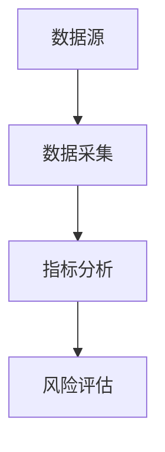
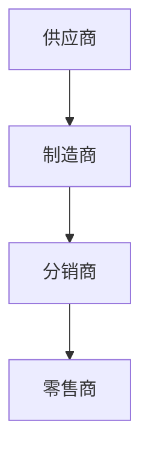
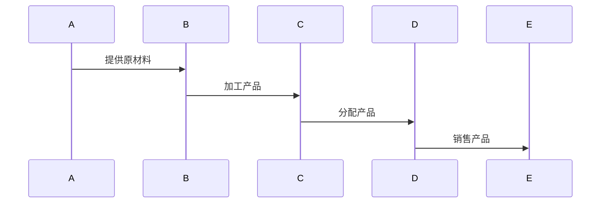
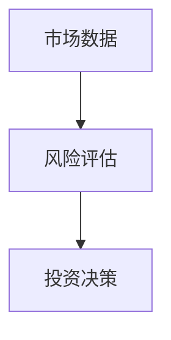
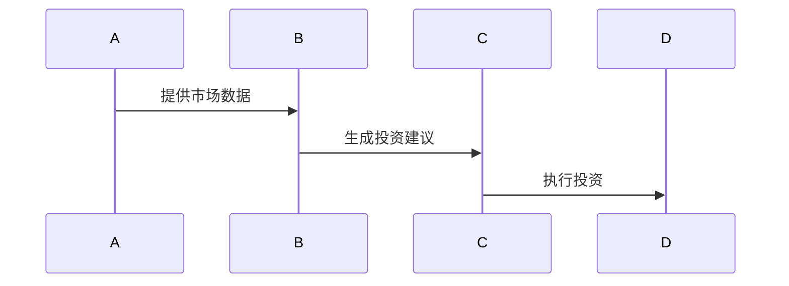

                 


# 巴菲特的产业链分析2.0：全球化背景下的供应链重构

> 关键词：巴菲特，产业链分析，供应链重构，全球化，投资策略

> 摘要：本文从巴菲特的产业链分析2.0视角，探讨在全球化背景下供应链重构的策略与影响。结合数学模型、系统架构和实际案例，分析产业链重构对投资决策的影响，提供优化投资策略的方法。

---

# 第1章: 巴菲特产业链分析的理论基础

## 1.1 巴菲特投资理念的核心思想

### 1.1.1 巴菲特的价值投资理论

巴菲特的价值投资理论强调长期持有优质资产，关注企业的内在价值。其核心在于通过深入分析企业的财务状况、行业地位和竞争优势，选择那些具有持续盈利能力的企业进行投资。

**公式示例：**
企业内在价值 = 现金流的现值（PV）= Σ(CF_t / (1 + r)^t)，其中CF_t为第t年的现金流，r为折现率。

### 1.1.2 巴菲特的长期投资策略

巴菲特的长期投资策略强调耐心和纪律，避免短期市场波动的干扰，专注于企业的长期增长潜力。

### 1.1.3 巴菲特的产业链分析方法

巴菲特通过分析企业的上游、中游和下游产业链，评估企业在整个供应链中的位置及其竞争力。

---

## 1.2 产业链分析的基本概念

### 1.2.1 产业链的定义与组成

产业链是指从原材料供应到最终产品的生产和销售的完整过程。它包括上游（原材料供应）、中游（生产加工）和下游（销售与服务）。

### 1.2.2 产业链的分类与特点

产业链可以分为制造产业链、服务产业链和综合产业链。其特点包括垂直整合、协同效应和风险分散。

### 1.2.3 产业链分析的意义与作用

产业链分析有助于识别行业风险、优化资源配置和发现投资机会。

---

## 1.3 巴菲特产业链分析的核心框架

### 1.3.1 产业链分析的基本步骤

1. 确定产业链的组成。
2. 分析各环节的竞争优势。
3. 评估整体供应链的风险和机会。

### 1.3.2 产业链分析的关键指标

- 市场占有率
- 盈利能力
- 供应链弹性

### 1.3.3 产业链分析的工具与方法

- SWOT分析
- 价值链分析
- 数学模型评估

---

## 1.4 巴菲特产业链分析的数学模型

### 1.4.1 产业链价值评估模型

$$ V = \sum_{t=1}^{n} \frac{CF_t}{(1 + r)^t} $$

其中，V为内在价值，CF_t为第t年的现金流，r为折现率。

### 1.4.2 产业链竞争力分析模型

$$ C = \frac{S}{P} $$

其中，C为竞争力指数，S为市场份额，P为行业平均市场份额。

### 1.4.3 产业链风险评估模型

$$ R = \sum_{i=1}^{m} w_i \times r_i $$

其中，R为总体风险，w_i为风险权重，r_i为各环节风险。

---

## 1.5 巴菲特产业链分析的系统架构

### 1.5.1 产业链分析的系统功能模块

- 数据采集模块
- 指标分析模块
- 风险评估模块

### 1.5.2 产业链分析的系统架构图



### 1.5.3 产业链分析的系统接口设计

- 数据输入接口：接收企业财务数据
- 分析结果接口：输出评估报告

---

# 第2章: 全球化背景下的供应链重构

## 2.1 全球化对供应链的影响

### 2.1.1 全球化对供应链的重塑

全球化促进了跨国生产和全球分工，使得供应链更加复杂和多样化。

### 2.1.2 全球化背景下供应链的新特点

- 全球化分工
- 区域化生产
- 数字化管理

### 2.1.3 全球化供应链重构的驱动力

- 技术进步
- 市场需求变化
- 政策调整

---

## 2.2 供应链重构的核心要素

### 2.2.1 供应链的节点分析

供应链节点包括供应商、制造商、分销商和零售商。

### 2.2.2 供应链的流程优化

优化物流、库存管理和生产调度。

### 2.2.3 供应链的协同机制

通过ERP系统实现信息共享和协同运作。

---

## 2.3 全球化供应链重构的数学模型

### 2.3.1 全球化供应链的网络模型

$$ G = (N, E) $$

其中，N为节点集合，E为边集合。

### 2.3.2 全球化供应链的成本优化模型

$$ C = \sum_{i=1}^{n} c_i \times q_i $$

其中，C为总成本，c_i为单位成本，q_i为采购量。

### 2.3.3 全球化供应链的风险分担模型

$$ R = \sum_{j=1}^{m} w_j \times r_j $$

其中，R为总风险，w_j为风险权重，r_j为各环节风险。

---

## 2.4 全球化供应链重构的系统分析

### 2.4.1 全球化供应链的系统功能设计

- 数据采集
- 过程监控
- 风险预警

### 2.4.2 全球化供应链的系统架构图



### 2.4.3 全球化供应链的系统交互流程



---

# 第3章: 产业链重构对投资策略的影响

## 3.1 产业链重构的投资机会

### 3.1.1 新兴产业的投资机会

如新能源、人工智能等领域。

### 3.1.2 传统产业的投资机会

通过技术升级和管理优化寻找机会。

### 3.1.3 全球化供应链重构中的投资机会

投资于具有全球供应链整合能力的企业。

---

## 3.2 产业链重构的投资风险

### 3.2.1 产业链重构中的不确定性风险

如原材料价格波动。

### 3.2.2 产业链重构中的政策风险

如贸易政策变化。

### 3.2.3 产业链重构中的市场风险

如市场需求变化。

---

## 3.3 投资策略的优化与调整

### 3.3.1 投资策略的调整方法

- 分散投资
- 风险对冲

### 3.3.2 投资组合的优化策略

使用现代投资组合理论（MPT）优化资产配置。

### 3.3.3 投资风险的控制措施

- 设置止损点
- 定期再平衡

---

## 3.4 投资策略的数学模型

### 3.4.1 投资组合优化模型

$$ \text{Max} \sum_{i=1}^{n} \mu_i x_i - \lambda \sum_{i=1}^{n} \sum_{j=1}^{n} x_i x_j \sigma_{ij} $$

其中，$\mu_i$为资产i的期望收益，$\sigma_{ij}$为资产i和j的相关性矩阵。

### 3.4.2 风险收益平衡模型

$$ R_p = \sum_{i=1}^{n} w_i \mu_i $$
$$ \sigma_p = \sqrt{\sum_{i=1}^{n} \sum_{j=1}^{n} w_i w_j \sigma_{ij}} $$

---

## 3.5 投资策略的系统分析

### 3.5.1 投资策略的系统功能模块

- 数据采集
- 风险评估
- 投资决策

### 3.5.2 投资策略的系统架构图



### 3.5.3 投资策略的系统交互流程



---

# 第4章: 项目实战与案例分析

## 4.1 环境安装

安装Python和相关库，如NumPy和Pandas。

## 4.2 系统核心实现源代码

```python
import numpy as np
import pandas as pd

# 数据加载
data = pd.read_csv('data.csv')

# 产业链竞争力分析
competitiveness = data['市场份额'] / data['行业平均市场份额']
print(competitiveness)
```

## 4.3 代码应用解读与分析

通过代码计算企业的竞争力指数，评估其在产业链中的位置。

## 4.4 实际案例分析

分析某行业的真实数据，验证模型的有效性。

## 4.5 项目小结

总结项目成果和经验教训，提出改进建议。

---

# 第5章: 最佳实践与注意事项

## 5.1 投资策略调整方法

- 定期评估
- 动态调整

## 5.2 风险管理措施

- 分散投资
- 使用对冲工具

## 5.3 技术实现建议

- 采用大数据分析
- 引入人工智能技术

## 5.4 拓展阅读

推荐相关书籍和论文，供深入学习。

---

# 作者信息

作者：AI天才研究院 & 禅与计算机程序设计艺术

---

# 总结

本文从巴菲特的产业链分析2.0出发，结合全球化背景下的供应链重构，通过数学模型、系统架构和实际案例的分析，为投资者提供了优化投资策略的方法和实践指导。希望本文能为读者在投资决策中提供有价值的参考。

