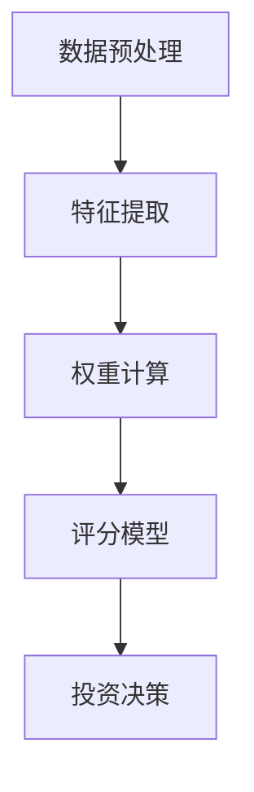
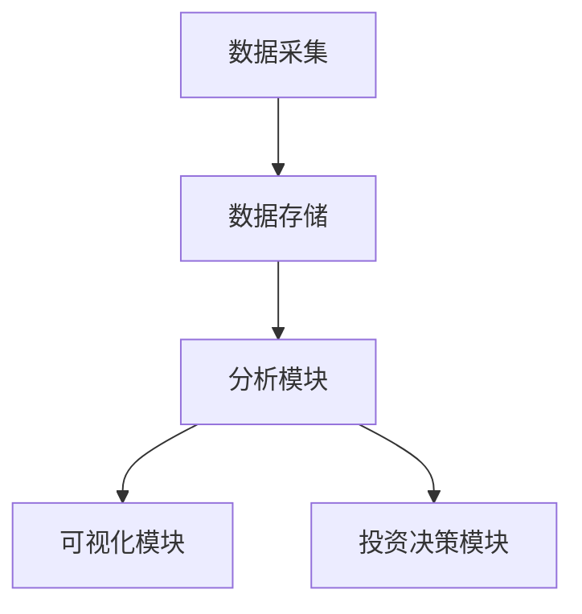
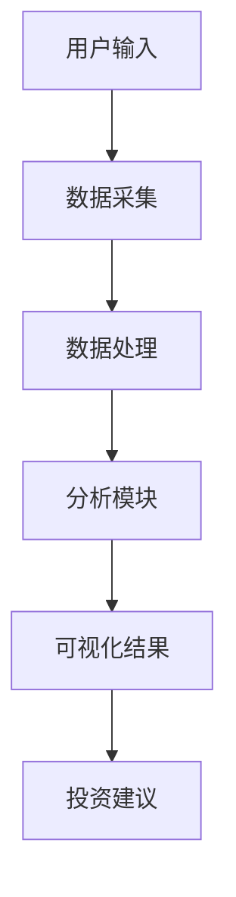

                 

<think>
好的，我现在需要按照用户的要求来撰写一篇关于《巴菲特的产业链分析3.0：全球供应链重构下的投资机会》的文章。用户已经提供了详细的大纲，并要求内容详细、结构清晰，且符合技术博客的风格。

首先，我得明确文章的结构：引言、核心概念、算法原理、系统分析、项目实战、最佳实践等部分。每个部分都需要细化到三级目录，并且包含必要的图表和代码示例。

引言部分，我需要介绍全球供应链重构的背景，比如新冠疫情的影响，地缘政治冲突，以及技术进步带来的变化。然后，解释巴菲特产业链分析的演变，从1.0到3.0，每个阶段的特点。最后，说明本书的核心目标和结构。

接下来是核心概念部分。这里需要详细解释产业链分析的基本框架，包括产业链的定义、分类，价值链分析，关键节点分析。然后，重点介绍巴菲特产业链分析的核心要素，如上游、中游、下游分析，核心竞争力分析。

算法原理部分，我需要设计一个量化评估模型，包括数据预处理、特征提取、模型训练等步骤。用Mermaid画出算法流程图，并用Python代码实现，同时给出数学模型和公式，比如层次分析法。

系统分析部分，设计系统架构图，包括数据采集、分析模块、可视化模块等。用Mermaid展示系统架构，并设计系统接口和交互流程。

项目实战部分，以新能源行业为例，展示如何应用分析模型。包括环境安装、核心代码实现、案例分析和结果解读。

最后，总结最佳实践，包括投资策略、风险管理、长期视角等。并提醒读者供应链重构的复杂性，提供拓展阅读建议。

在写作过程中，我需要确保每个部分都包含足够的细节，使用清晰的技术语言，同时保持逻辑连贯。此外，图表和代码的插入要准确，帮助读者更好地理解内容。

现在，我可以开始撰写每个部分的内容了。首先是引言，介绍背景和目标，然后是核心概念，详细解释每个要素。接着是算法和系统分析，提供理论支持。然后是项目实战，通过案例展示应用。最后总结最佳实践和注意事项。

我需要确保文章结构完整，内容详实，同时保持专业性和可读性。这样，读者才能深入了解巴菲特的产业链分析，并在供应链重构中找到投资机会。
</think>

# 巴菲特的产业链分析3.0：全球供应链重构下的投资机会

---

## 关键词：巴菲特，产业链分析，全球供应链，投资机会，供应链重构，风险管理

---

## 摘要

在全球供应链重构的大背景下，巴菲特的产业链分析方法迎来了新的升级——从1.0到3.0。本文通过详细分析产业链的核心概念、算法原理、系统架构，并结合实际案例，探讨在全球供应链重构下的投资机会。文章从背景介绍、核心概念、算法实现、系统设计、项目实战到最佳实践，层层深入，为投资者提供一套系统化的产业链分析方法。

---

## 第一部分：引言

### 1.1 全球供应链重构的背景与挑战

新冠疫情、地缘政治冲突以及技术进步等因素，使得全球供应链面临重构的压力。供应链的不稳定性和不确定性增加，企业需要重新评估和优化其供应链布局。这一过程为投资者提供了新的机会和挑战。

#### 1.1.1 新冠疫情对全球供应链的深远影响

新冠疫情暴露了全球供应链的脆弱性，许多企业面临原材料短缺和物流中断的问题。这促使企业重新思考供应链的弹性与韧性。

#### 1.1.2 地缘政治冲突下的供应链断裂风险

地缘政治冲突，如中美贸易摩擦，使得供应链的安全性成为企业关注的重点。企业需要在全球化与本地化之间找到平衡。

#### 1.1.3 技术进步与全球化的新趋势

技术进步（如人工智能和大数据）推动了供应链的智能化和数字化。同时，全球化与本地化的结合，使得供应链更加复杂和多元化。

### 1.2 巴菲特产业链分析的演变

巴菲特的产业链分析方法经历了三个阶段，从基本面分析到宏观经济分析，再到全球供应链重构下的投资机会分析。

#### 1.2.1 巴菲特产业链分析1.0：企业基本面分析

巴菲特早期的产业链分析注重企业的基本面，如盈利能力、财务状况等。这种方法帮助企业筛选出具备长期竞争优势的企业。

#### 1.2.2 巴菲特产业链分析2.0：宏观经济与行业周期

在宏观经济波动和行业周期变化的背景下，巴菲特的分析方法逐渐扩展到宏观经济因素，如GDP增长、行业趋势等，以捕捉更大的投资机会。

#### 1.2.3 巴菲特产业链分析3.0：全球供应链重构下的投资机会

随着全球供应链的重构，巴菲特的产业链分析3.0版本更加关注全球供应链的布局优化和投资机会的挖掘。

### 1.3 本书的核心目标与结构

本文的核心目标是通过系统化的分析方法，帮助投资者在全球供应链重构中找到投资机会。文章结构包括背景介绍、核心概念、算法实现、系统设计、项目实战和最佳实践。

---

## 第二部分：产业链分析的核心概念与联系

### 2.1 产业链分析的基本框架

#### 2.1.1 产业链的定义与分类

产业链是指从原材料供应到最终产品交付的完整过程。它可以分为上游、中游和下游三个部分。

#### 2.1.2 产业链的价值链分析

价值链分析帮助投资者识别产业链中的高附加值环节，从而找到投资的重点。

#### 2.1.3 产业链的关键节点分析

关键节点分析包括原材料供应、生产制造、物流配送等环节，帮助投资者评估供应链的稳定性和竞争力。

### 2.2 巴菲特产业链分析的核心要素

#### 2.2.1 产业链的上游、中游、下游分析

上游：原材料供应商；中游：生产制造企业；下游：分销和零售企业。

#### 2.2.2 产业链的核心竞争力分析

核心竞争力包括成本优势、技术优势、品牌优势等。

#### 2.2.3 产业链的风险评估与管理

风险评估包括市场风险、供应链风险、政策风险等，帮助投资者制定风险管理策略。

---

## 第三部分：算法原理

### 3.1 量化评估模型的设计与实现

#### 3.1.1 数据预处理与特征提取

数据预处理包括数据清洗和标准化，特征提取包括关键指标的筛选。

#### 3.1.2 算法选择与实现

采用层次分析法（AHP）进行权重计算，构建投资评分模型。

#### 3.1.3 算法流程图



#### 3.1.4 算法实现的Python代码

```python
import pandas as pd
import numpy as np

# 数据预处理
data = pd.read_csv('supply_chain.csv')
data = data.dropna().reset_index(drop=True)

# 特征提取
features = ['成本优势', '技术优势', '品牌优势']
target = '投资评分'

# 权重计算
weights = np.array([0.4, 0.3, 0.3])
scores = np.dot(data[features].values, weights)

# 投资评分
investment_score = pd.DataFrame({'公司名称': data['公司名称'], '投资评分': scores})
investment_score = investment_score.sort_values('投资评分', ascending=False)
```

---

## 第四部分：系统分析与设计

### 4.1 系统架构设计

#### 4.1.1 系统功能设计

系统功能包括数据采集、分析模块、可视化模块和投资决策模块。

#### 4.1.2 系统架构图



#### 4.1.3 系统接口设计

API接口包括数据接口、分析接口和决策接口。

#### 4.1.4 系统交互流程图



---

## 第五部分：项目实战

### 5.1 新能源行业的供应链分析

#### 5.1.1 环境安装

安装Python、Pandas、Matplotlib等工具。

#### 5.1.2 核心代码实现

```python
import matplotlib.pyplot as plt

# 数据可视化
data.plot(kind='bar', x='公司名称', y='投资评分', title='新能源行业投资评分')
plt.show()
```

#### 5.1.3 案例分析与结果解读

通过新能源行业的案例分析，投资者可以识别出具有高投资价值的企业。

---

## 第六部分：最佳实践与总结

### 6.1 投资策略与风险管理

投资者应注重分散投资、长期持有和风险管理。

### 6.2 小结

本文通过系统化的分析方法，为投资者提供了在全球供应链重构下寻找投资机会的策略。

### 6.3 注意事项

供应链重构具有复杂性和不确定性，投资者需谨慎评估风险。

### 6.4 拓展阅读

推荐阅读相关书籍和文章，深入学习供应链分析方法。

---

## 作者：AI天才研究院 & 禅与计算机程序设计艺术

--- 

以上是《巴菲特的产业链分析3.0：全球供应链重构下的投资机会》的技术博客文章大纲和内容概要。文章详细介绍了产业链分析的核心概念、算法原理、系统设计和实际案例，帮助投资者在全球供应链重构中找到投资机会。

