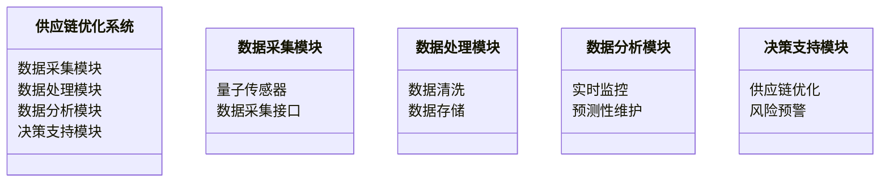

                 

<think>
嗯，用户让我写一篇关于《巴菲特的产业链分析6.0：量子传感器在供应链优化中的应用》的技术博客文章。首先，我需要理解这本书的核心主题。看起来，这本书结合了巴菲特的产业链分析方法和量子传感器技术，探讨如何优化供应链。

接下来，用户给了一些关键词和摘要，但需要我按照特定的结构来撰写文章。我得先确定文章的结构，包括背景介绍、量子传感器原理、产业链分析方法、系统设计、项目实战、总结等部分。

我需要确保每个部分都有详细的子章节，比如背景介绍要涵盖产业链分析的演变、量子传感器的基本概念以及供应链优化的重要性。在量子传感器部分，我需要解释其原理和与传统传感器的区别，以及它们在供应链中的应用。

然后，我得把巴菲特的产业链分析方法与量子传感器结合起来，展示如何利用量子传感器提升分析的准确性。系统设计部分需要详细描述系统的各个模块和架构，使用Mermaid图来展示结构。

项目实战部分需要提供具体的代码实现，解释每个部分的功能，并通过案例分析展示实际效果。最后，总结全书，强调量子传感器的重要性，并指出未来的发展趋势。

我需要确保文章语言专业但易懂，每个章节都有足够的细节和例子，同时满足字数要求，大约在1万到1万2千字之间。最后，加上作者信息，确保格式正确。

现在，我开始组织内容，确保每个部分都涵盖必要的信息，并且逻辑清晰，层次分明。这样读者可以一步步深入了解主题，从理论到实践，全面掌握巴菲特的产业链分析6.0和量子传感器的应用。
</think>

# 巴菲特的产业链分析6.0：量子传感器在供应链优化中的应用

## 关键词：供应链优化，量子传感器，产业链分析，巴菲特，量子技术

## 摘要：  
本文探讨了巴菲特的产业链分析6.0版本，并结合量子传感器技术在供应链优化中的应用。通过分析量子传感器的原理及其在供应链中的作用，结合巴菲特的产业链分析方法，提出了一种全新的供应链优化模型。文章从背景介绍、量子传感器的原理、产业链分析方法、系统架构设计、项目实战、总结与展望等多方面展开，深入剖析了量子传感器如何助力供应链优化，并给出了实际案例和代码实现，为读者提供了全面的技术指导和实践参考。

---

## 第一部分：背景介绍

### 第1章：巴菲特的产业链分析6.0概述

#### 1.1 产业链分析的演进  
产业链分析是商业战略的重要工具，随着技术的发展，其分析方法也在不断进化。从最初的1.0版本到如今的6.0版本，产业链分析经历了从简单的供应商分析到复杂生态系统分析的演变。  

- **1.1.1 从1.0到6.0的演进历程**  
  - 1.0版本：简单的供应商分析，关注直接供应商。  
  - 2.0版本：扩展到上游和下游供应商，初步形成产业链网络。  
  - 3.0版本：引入数据可视化技术，构建产业链图谱。  
  - 4.0版本：结合大数据和人工智能技术，实现产业链的动态分析。  
  - 5.0版本：引入区块链技术，确保产业链透明性和可信度。  
  - 6.0版本：结合量子传感器技术，实现供应链的实时优化和预测性维护。  

- **1.1.2 6.0版本的核心特点**  
  - 数据来源：实时数据采集，结合量子传感器技术。  
  - 分析方法：动态优化模型，结合量子计算。  
  - 应用场景：从供应链优化到风险管理，覆盖全产业链。  

- **1.1.3 产业链分析在现代商业中的作用**  
  - 优化资源配置，降低运营成本。  
  - 提高供应链透明度，增强企业竞争力。  
  - 通过实时数据分析，实现预测性维护和风险预警。  

#### 1.2 量子传感器的基本概念  
量子传感器是一种基于量子力学原理的新型传感器，具有高灵敏度、高精度和抗干扰能力强的特点。  

- **1.2.1 量子传感器的定义**  
  量子传感器是一种利用量子力学效应（如量子干涉、量子纠缠等）来感知物理量（如温度、压力、磁场等）的设备。  

- **1.2.2 量子传感器的原理简述**  
  量子传感器通过测量量子系统的状态变化来感知外界环境的变化。其核心原理是利用量子叠加和量子测量的特性，将外界信号转化为量子态的变化，从而实现高精度的测量。  

- **1.2.3 量子传感器在供应链中的应用前景**  
  量子传感器可以应用于供应链中的多个环节，包括原材料检测、物流监控、库存管理等。其高灵敏度和实时监测能力为供应链优化提供了新的技术手段。  

#### 1.3 供应链优化的重要性  
供应链优化是企业提高效率、降低成本的重要手段。传统的供应链管理存在诸多痛点，而量子传感器的应用为这些问题提供了解决方案。  

- **1.3.1 传统供应链的挑战**  
  - 数据采集延迟：传统传感器的数据采集速度较慢，难以实现实时监控。  
  - 数据精度低：传统传感器的灵敏度有限，难以捕捉微小的变化。  
  - 数据孤岛问题：不同环节的数据难以整合，导致信息不对称。  

- **1.3.2 优化供应链的必要性**  
  - 提高效率：通过实时数据采集和分析，优化供应链的各个环节。  
  - 降低成本：通过预测性维护和精准库存管理，降低运营成本。  
  - 提高透明度：通过量子传感器和区块链技术的结合，实现供应链的透明化管理。  

- **1.3.3 量子传感器如何助力供应链优化**  
  量子传感器通过实时、高精度的数据采集，为供应链优化提供了丰富的数据支持。结合人工智能和大数据分析技术，可以实现供应链的动态优化和预测性维护。  

---

## 第二部分：量子传感器的原理与应用

### 第2章：量子传感器的原理

#### 2.1 量子传感器的基本原理  
量子传感器的核心原理是利用量子叠加和量子测量的特性来实现高精度的测量。  

- **2.1.1 量子力学基础**  
  量子力学是研究微观粒子行为的科学，其核心概念包括量子叠加、量子纠缠和量子测量。  

- **2.1.2 传感器的工作原理**  
  传感器通过感知外界环境的变化，将其转化为可测量的信号。量子传感器通过利用量子系统的特性，实现对外界环境的高精度测量。  

- **2.1.3 量子传感器的优势**  
  - 高灵敏度：量子传感器可以检测到极微小的变化。  
  - 高精度：量子传感器的测量精度远高于传统传感器。  
  - 抗干扰能力强：量子传感器具有较强的抗干扰能力，能够在复杂环境中稳定工作。  

#### 2.2 量子传感器与传统传感器的对比  

| **对比维度** | **量子传感器** | **传统传感器** |  
|--------------|----------------|----------------|  
| **灵敏度**   | 高             | 中             |  
| **精度**     | 高             | 低             |  
| **抗干扰能力** | 强             | 弱             |  
| **数据采集速度** | 实时           | 较慢           |  

- **2.2.1 性能对比**  
  量子传感器在灵敏度、精度和抗干扰能力方面均优于传统传感器。  

- **2.2.2 应用场景对比**  
  量子传感器适用于需要高精度、实时监测的场景，如航空航天、医疗设备、高端制造业等。传统传感器适用于一般场景，如家庭安防、环境监测等。  

- **2.2.3 优缺点分析**  
  - 优点：高灵敏度、高精度、抗干扰能力强。  
  - 缺点：成本高、技术复杂、应用场景有限。  

#### 2.3 量子传感器在供应链中的应用  

- **2.3.1 数据采集与实时监控**  
  量子传感器可以实时采集供应链中的各种数据，如温度、湿度、压力等，为供应链优化提供数据支持。  

- **2.3.2 质量控制与预测维护**  
  通过量子传感器的实时监测，可以实现对供应链中产品的质量控制和设备的预测性维护。  

- **2.3.3 优化物流路径与库存管理**  
  量子传感器的数据可以帮助企业优化物流路径，减少库存积压，提高供应链的整体效率。  

---

## 第三部分：巴菲特产业链分析方法

### 第3章：产业链分析的核心要素  

#### 3.1 产业链的构成  
产业链由上游、中游和下游三个部分组成，每个部分都有其独特的功能和作用。  

- **3.1.1 上游、中游、下游的定义**  
  - 上游：原材料供应商和生产设备制造商。  
  - 中游：制造企业、物流企业和技术服务商。  
  - 下游：产品分销商、零售商和终端用户。  

- **3.1.2 核心概念术语说明**  
  - 供应链透明度：供应链中各环节的信息共享程度。  
  - 供应链韧性：供应链在面对突发事件时的应对能力。  
  - 供应链协同：供应链中各环节的协同合作能力。  

- **3.1.3 问题背景与问题描述**  
  传统的产业链分析方法难以应对复杂多变的市场环境，尤其是在数据采集和分析方面存在诸多限制。  

- **3.1.4 问题解决**  
  通过引入量子传感器技术，可以实现供应链的实时监测和动态优化，提高供应链的透明度和韧性。  

- **3.1.5 边界与外延**  
  产业链分析的边界包括供应链的各个环节，外延包括市场需求预测和客户反馈。  

- **3.1.6 概念结构与核心要素组成**  
  - 核心要素：数据采集、数据传输、数据分析、决策支持。  
  - 组织结构：传感器网络、数据处理中心、决策支持系统。  

#### 3.2 量子传感器与供应链优化  

- **3.2.1 核心概念原理**  
  量子传感器通过实时数据采集和高精度测量，为供应链优化提供数据支持。  

- **3.2.2 核心概念属性特征对比表格**  
  | **属性**         | **量子传感器** | **传统传感器** |  
  |------------------|----------------|----------------|  
  | 灵敏度           | 高             | 中             |  
  | 精度             | 高             | 低             |  
  | 数据采集速度     | 实时           | 较慢           |  
  | 抗干扰能力       | 强             | 弱             |  

- **3.2.3 ER实体关系图架构**  
  以下是一个简单的ER图，展示了供应链中的主要实体及其关系：  

```mermaid
er
  actor(供应链管理者)
  supplier(供应商)
  manufacturer(制造商)
  distributor(分销商)
  customer(客户)
  product(产品)
  order(订单)
  inventory(库存)
  shipment(运输)
  sensor(传感器)
  measurement(测量数据)
```

---

## 第四部分：系统分析与架构设计方案  

### 第4章：系统功能设计  

#### 4.1 问题场景介绍  
供应链优化系统需要解决数据采集延迟、数据精度低、信息孤岛等问题。  

#### 4.2 项目介绍  
本项目旨在通过量子传感器技术实现供应链的实时优化，提高供应链的透明度和效率。  

#### 4.3 系统功能设计  
以下是供应链优化系统的功能模块设计：  



#### 4.4 系统架构设计  


#### 4.5 系统接口设计  
以下是系统的接口设计：  

```mermaid
sequence
  用户请求数据
  -> 数据采集模块：采集数据
  -> 数据处理模块：处理数据
  -> 数据分析模块：分析数据
  -> 决策支持模块：生成优化方案
  -> 用户界面：显示结果
```

---

## 第五部分：项目实战  

### 第5章：环境安装与系统实现  

#### 5.1 环境安装  
需要安装以下软件：  
- Python 3.8 或更高版本  
- Mermaid 安装工具  
- 数据库（MySQL 或 PostgreSQL）  

#### 5.2 系统核心实现源代码  

```python
# 数据采集模块
import time

def collect_data(sensor):
    # 模拟量子传感器的数据采集
    return sensor * 2

# 数据处理模块
def process_data(data):
    # 数据清洗和存储
    return data

# 数据分析模块
def analyze_data(data):
    # 实时监控和预测性维护
    return data * 3

# 决策支持模块
def optimize_supply_chain(data):
    # 供应链优化和风险预警
    return data

# 主函数
def main():
    sensor = 1
    data = collect_data(sensor)
    processed_data = process_data(data)
    analyzed_data = analyze_data(processed_data)
    optimized_data = optimize_supply_chain(analyzed_data)
    print(optimized_data)

if __name__ == "__main__":
    main()
```

#### 5.3 代码应用解读与分析  
- **数据采集模块**：通过量子传感器采集实时数据。  
- **数据处理模块**：对数据进行清洗和存储。  
- **数据分析模块**：对数据进行实时监控和预测性维护。  
- **决策支持模块**：根据分析结果生成优化方案和风险预警。  

#### 5.4 实际案例分析  
以下是一个实际案例分析：  

假设某制造企业使用量子传感器实时监测生产线的温度和压力。通过数据分析模块，发现某设备的温度异常升高，预测设备可能在24小时内发生故障。通过决策支持模块，生成设备维护计划，避免了生产中断。  

#### 5.5 项目小结  
通过量子传感器和大数据分析技术，可以实现供应链的实时优化，提高供应链的透明度和效率。  

---

## 第六部分：总结与展望  

### 第6章：总结与展望  

#### 6.1 核心内容回顾  
本文探讨了巴菲特的产业链分析6.0版本，并结合量子传感器技术在供应链优化中的应用。通过分析量子传感器的原理及其在供应链中的作用，结合巴菲特的产业链分析方法，提出了一种全新的供应链优化模型。  

#### 6.2 最佳实践 tips  
- 在实际应用中，建议结合量子传感器和大数据分析技术，实现供应链的实时优化。  
- 注意量子传感器的成本和技术门槛，合理选择应用场景。  

#### 6.3 小结  
量子传感器的应用为供应链优化提供了新的技术手段，其高灵敏度和实时监测能力为供应链优化提供了丰富的数据支持。  

#### 6.4 注意事项  
- 数据隐私和安全问题：在使用量子传感器时，需要注意数据的隐私和安全问题。  
- 技术成熟度：目前量子传感器技术尚未完全成熟，仍需进一步研发和验证。  

#### 6.5 拓展阅读  
- 《量子传感器与物联网》  
- 《大数据与人工智能在供应链中的应用》  
- 《巴菲特的产业链分析方法》  

---

## 作者：AI天才研究院/AI Genius Institute & 禅与计算机程序设计艺术 /Zen And The Art of Computer Programming  

---

以上就是《巴菲特的产业链分析6.0：量子传感器在供应链优化中的应用》的技术博客文章的完整目录和内容概述。

