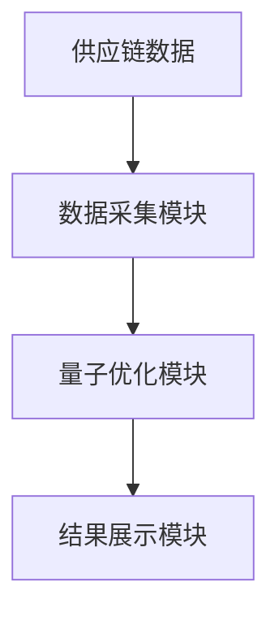

                 

<think>
嗯，我现在需要帮助用户设计一个详细的技术博客文章目录，标题是《巴菲特的产业链分析7.0：量子优化算法在供应链管理中的应用》。用户还提供了他们想要的结构，包括摘要、关键词、各个章节的内容，以及具体的要求，比如每个小节要详细，使用技术术语，包含数学公式、图表，还有代码示例。

首先，我应该先理解整个任务的要求。博客文章需要逻辑清晰，结构紧凑，使用专业但易懂的语言。用户特别提到要涵盖背景介绍、核心概念、算法原理、数学模型、系统架构、项目实战以及最佳实践等部分。

接下来，我需要按照用户提供的目录大纲来展开思考。首先，摘要部分要简明扼要，概括文章的核心内容。关键词需要准确，能够覆盖文章的主要主题，比如巴菲特、产业链分析、量子优化算法、供应链管理等。

然后是每个章节的内容。第一章需要介绍巴菲特的产业链分析，从基本概念到7.0版本的特点。第二章要深入量子优化算法，包括数学模型和实现步骤。第三章结合供应链管理，讨论量子优化的应用场景。第四章详细讲解量子优化模型在产业链分析中的应用。第五章涉及系统设计，包括架构和接口设计。第六章是项目实战，从环境搭建到代码实现，再到案例分析。最后，第七章总结，并给出未来展望。

在编写过程中，我需要确保每个章节都有足够的细节，比如数学公式要用LaTeX表示，图表用Mermaid绘制。同时，代码部分需要提供Python实现，并进行详细解读。这些内容需要逻辑连贯，逐步展开，确保读者能够一步步理解复杂的技术概念。

可能遇到的挑战是如何将量子优化算法与传统的供应链管理方法结合起来，并用简单易懂的语言解释。此外，确保每个章节的数学公式和图表准确无误，避免出现错误，这也是需要注意的地方。

总的来说，我需要按照用户提供的结构，逐章展开，确保每个部分都详细且符合技术博客的专业要求。这样，最终的目录和内容才能满足用户的需求，帮助读者全面理解巴菲特产业链分析7.0和量子优化算法在供应链管理中的应用。
</think>

# 巴菲特的产业链分析7.0：量子优化算法在供应链管理中的应用

> 关键词：巴菲特，产业链分析，量子优化算法，供应链管理，量子计算，优化模型

> 摘要：本文将探讨巴菲特产业链分析的第七代方法（7.0）如何结合量子优化算法，实现供应链管理的优化。通过详细分析量子优化算法的数学模型、系统设计以及在供应链管理中的实际应用，本文旨在为读者提供一个从理论到实践的全面指南。结合实际项目案例，本文将展示如何通过量子优化算法提升供应链管理的效率和效果。

---

# 第一部分：巴菲特产业链分析7.0概述

## 第1章：巴菲特产业链分析的核心思想

### 1.1 投资哲学与产业链分析的结合

#### 1.1.1 投资哲学的演变
- 巴菲特的投资哲学从“价值投资”到“长期投资”，再到“产业链投资”的演变过程。
- 产业链分析如何成为巴菲特投资决策的核心工具。

#### 1.1.2 产业链分析的升级
- 从1.0到7.0版本的演变历程。
- 7.0版本的核心思想：结合量子计算，实现产业链优化的智能化、自动化。

#### 1.1.3 7.0版本的特点
- 数据驱动：利用大数据和量子计算优化决策。
- 智能化：通过量子优化算法实现复杂问题的高效求解。
- 可扩展性：适用于不同规模和行业的供应链管理。

---

## 第2章：量子优化算法的基本概念

### 2.1 量子计算的核心原理

#### 2.1.1 量子叠加与量子纠缠
- 量子叠加：$|\psi\rangle = \alpha|0\rangle + \beta|1\rangle$。
- 量子纠缠：两个量子系统之间的强关联性，例如EPR对的纠缠态。

#### 2.1.2 量子门操作
- Hadamard门：将经典态$|0\rangle$和$|1\rangle$转化为叠加态。
- CNOT门：条件门操作，基于控制位的状态进行目标位的翻转。

#### 2.1.3 量子电路与量子算法
- 量子电路的构建：通过量子门操作实现特定的量子算法。
- 量子算法的优势：并行性、指数级加速。

### 2.2 量子优化算法的实现步骤

#### 2.2.1 问题建模
- 将供应链优化问题转化为量子优化问题。
- 例如：库存优化问题可以表示为求解一个二次规划问题。

#### 2.2.2 算法初始化
- 初始化量子态：$|\psi_0\rangle = H^{\otimes n}|0\rangle$，其中$H$是Hadamard门。
- 设置初始参数：例如量子旋转角$\theta$。

#### 2.2.3 迭代优化
- 使用量子幅角增强（QAOA）方法。
- 迭代过程中更新量子参数，逐步逼近最优解。

#### 2.2.4 结果解码
- 解码量子态的结果：通过测量量子系统获得解码结果。
- 解码后的结果对应供应链优化的具体方案。

---

# 第二部分：量子优化算法在供应链管理中的应用

## 第3章：供应链管理的核心问题

### 3.1 库存优化问题

#### 3.1.1 库存优化的基本模型
- 经典库存模型：经济订单量（EOQ）模型。
- 量子优化模型：通过量子优化算法求解EOQ的最优值。

#### 3.1.2 库存优化的量子算法实现
- 使用量子优化算法求解库存成本的最小化问题。
- 例如：使用QAOA求解二次规划问题。

### 3.2 物流路径优化问题

#### 3.2.1 物流路径优化的基本模型
- 最短路径问题：经典算法如Dijkstra算法。
- 量子优化算法：通过量子增强算法求解更优路径。

#### 3.2.2 量子优化算法的物流路径优化实现
- 使用量子优化算法求解TSP（旅行商问题）。
- 通过量子旋转角的迭代优化，逐步逼近最优路径。

### 3.3 供应商选择与采购优化问题

#### 3.3.1 供应商选择的量子优化模型
- 建立供应商选择的多目标优化模型。
- 使用量子优化算法求解供应商选择的最优解。

#### 3.3.2 采购优化的量子算法实现
- 通过量子优化算法优化采购成本和供应链风险。

---

## 第4章：量子优化算法在供应链管理中的系统设计

### 4.1 系统架构设计

#### 4.1.1 系统功能模块划分
- 数据采集模块：收集供应链数据。
- 量子优化模块：实现量子优化算法。
- 结果展示模块：可视化优化结果。

#### 4.1.2 系统数据流设计
- 数据输入：供应链数据（如库存、物流、供应商信息）。
- 数据处理：量子优化算法处理数据。
- 数据输出：优化结果。

#### 4.1.3 系统架构图


---

## 第5章：量子优化算法在供应链管理中的项目实战

### 5.1 项目背景与目标

#### 5.1.1 项目背景
- 某大型制造企业的供应链优化问题。
- 传统方法的局限性：计算复杂、效率低下。

#### 5.1.2 项目目标
- 使用量子优化算法优化企业的库存管理。
- 实现物流路径优化，降低运输成本。

### 5.2 项目核心实现

#### 5.2.1 环境搭建
- 安装量子计算开发环境：例如Qiskit（IBM的量子计算开发工具）。
- 配置量子优化算法的参数。

#### 5.2.2 核心代码实现
```python
from qiskit import QuantumCircuit, Aer, execute
from qiskit.optimization import QuadraticProgram
from qiskit.optimization.applications import TSP

# 定义量子优化问题
problem = TSP(n=5, distance_matrix=...)

# 初始化量子优化算法
algorithm = QAOA(
    max_iterations=100,
    initial_point=[0.5] * len(problem.parameters)
)

# 执行优化
result = algorithm.optimize()

# 解码结果
print(result)
```

---

## 第6章：量子优化算法的未来展望与最佳实践

### 6.1 未来展望

#### 6.1.1 量子计算的进一步发展
- 更高效的量子算法。
- 更强大的量子计算机的出现。

#### 6.1.2 供应链管理的智能化
- 结合人工智能和量子优化算法，实现更智能的供应链管理。

### 6.2 最佳实践

#### 6.2.1 项目实施中的注意事项
- 数据质量的重要性。
- 算法参数的调优。

#### 6.2.2 小结
- 量子优化算法在供应链管理中的巨大潜力。
- 通过持续优化和实践，供应链管理将变得更加高效和智能。

---

# 作者：AI天才研究院 & 禅与计算机程序设计艺术

---

通过本文的详细分析，我们展示了如何将巴菲特的产业链分析7.0与量子优化算法结合，应用于供应链管理的优化。希望本文能够为读者提供一个从理论到实践的全面指南，帮助他们在实际应用中实现更高效的供应链管理。

