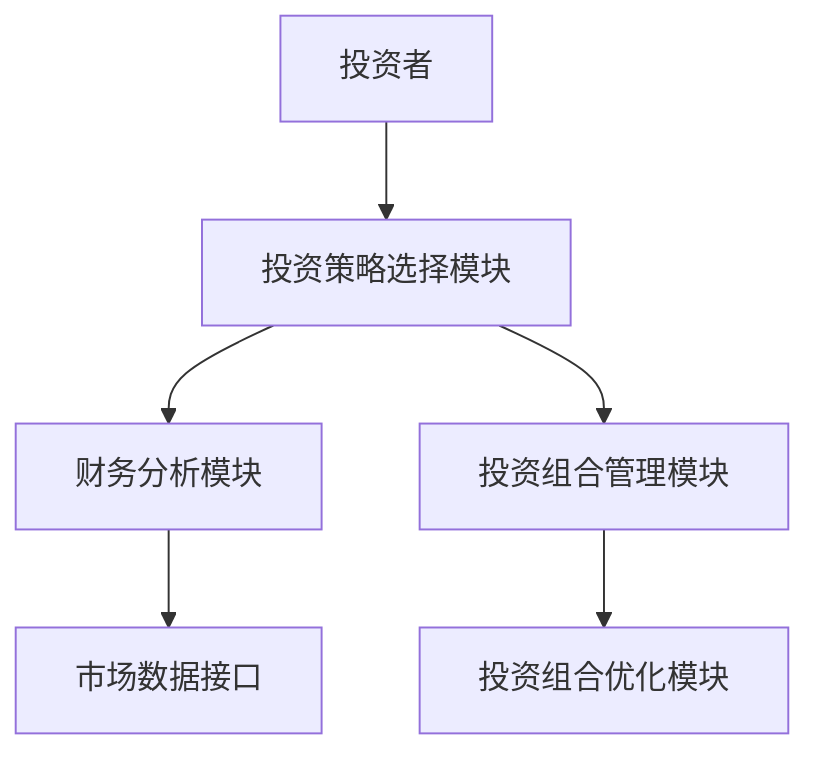

                 


# 巴菲特的价值投资vs成长投资

> 关键词：价值投资，成长投资，巴菲特，投资策略，投资分析

> 摘要：本文深入探讨了巴菲特的价值投资和成长投资两种投资策略的核心理念、分析方法、成功案例以及两者之间的差异与适用场景。通过对比分析，帮助读者理解这两种投资策略在不同市场环境下的优缺点，并结合实际案例和数学模型，提供一种系统化的投资分析方法。

---

# 第一部分: 投资的基础与价值投资的起源

## # 第1章: 巴菲特与价值投资的背景

### 1.1 投资的基本概念

#### 1.1.1 投资的定义与分类
投资是通过将资金投入到资产或项目中，以期获得未来收益的行为。根据资产类型，投资可以分为股票、债券、房地产等多种形式。股票投资是最常见的投资形式之一，而股票投资又可以进一步分为价值投资和成长投资。

#### 1.1.2 投资的基本原则
投资的基本原则包括分散投资、长期持有、风险控制和价值评估。这些原则是投资成功的基础，无论采用哪种投资策略，都需要遵循这些基本原则。

#### 1.1.3 投资市场的基本结构
股票市场是一个复杂的系统，包括买方、卖方、交易所、中介机构和监管机构等组成部分。理解市场结构有助于投资者更好地把握市场动态，制定合理的投资策略。

### 1.2 巴菲特的生平与投资理念

#### 1.2.1 巴菲特的成长经历
沃伦·巴菲特（Warren Buffett）出生于1930年，美国堪萨斯州。他在青少年时期就开始对投资产生了浓厚的兴趣，通过阅读和实践积累了丰富的投资知识。他在哥伦比亚大学获得了经济学学士学位，并在毕业后开始了自己的投资生涯。

#### 1.2.2 巴菲特的价值投资理念
巴菲特的价值投资理念的核心是寻找被市场低估的优秀企业，长期持有，等待其内在价值的实现。他认为市场先生是疯狂的，投资者应该利用市场的非理性行为来获取超额收益。

#### 1.2.3 巴菲特的投资哲学
巴菲特的投资哲学可以概括为“以合理的价格买入优秀的公司”。他强调安全边际、竞争优势和长期价值，反对短期投机和盲目跟风。

### 1.3 价值投资的起源与发展

#### 1.3.1 价值投资的定义
价值投资是一种以低于其内在价值的价格买入优质资产的投资策略。其核心思想是寻找市场先生的错误定价，并从中获利。

#### 1.3.2 价值投资的历史发展
价值投资的理论基础可以追溯到本杰明·格雷厄姆（Benjamin Graham）和戴维·多德（David Dodd）的学术研究。巴菲特是格雷厄姆的学生，他将价值投资的理念进一步发扬光大。

#### 1.3.3 价值投资的核心思想
价值投资的核心思想是关注企业的内在价值，而非市场的短期波动。投资者应该寻找那些具有强大竞争优势、良好财务状况和可持续盈利能力的企业，并以合理的价格买入并长期持有。

---

## 第二部分: 价值投资与成长投资的核心概念

## # 第2章: 价值投资的核心原理

### 2.1 价值投资的核心概念

#### 2.1.1 市场先生的概念
市场先生（Mr. Market）是格雷厄姆提出的一个比喻，用来描述股票市场的波动性。市场先生每天都会以不同的价格买卖股票，投资者应该利用市场先生的疯狂和恐惧来获取利润。

#### 2.1.2 安全边际的定义与作用
安全边际是指股票的市场价格低于其内在价值的部分。通过安全边际，投资者可以降低投资风险，确保在市场波动中不会遭受重大损失。

#### 2.1.3 内在价值的计算方法
内在价值是基于企业未来现金流的现值计算得出的。公式为：

$$
\text{内在价值} = \sum_{t=1}^{\infty} \frac{\text{现金流}_t}{(1 + r)^t}
$$

其中，r 是折现率，通常采用企业的资本成本或市场利率。

### 2.2 价值投资的分析方法

#### 2.2.1 财务报表分析
财务报表分析是价值投资的重要组成部分。投资者需要关注企业的收入、利润、资产负债表和现金流等指标，以评估企业的财务健康状况。

#### 2.2.2 股东权益分析
股东权益分析包括对企业股本、资本公积、盈余公积和未分配利润等项目的分析，以评估企业的资本结构和股东权益的稳定性。

#### 2.2.3 行业分析与竞争优势
行业分析帮助企业投资者了解企业的市场地位、行业竞争格局和未来发展趋势。竞争优势分析包括企业的成本优势、技术优势和品牌优势等。

### 2.3 价值投资的成功案例

#### 2.3.1 巴菲特的经典投资案例
巴菲特的经典投资案例包括购买美国运通公司（American Express）和可口可乐公司（Coca-Cola）。这些投资都以低于企业内在价值的价格买入，并长期持有，最终获得了巨大的收益。

#### 2.3.2 其他价值投资者的成功经验
其他价值投资者如彼得·林奇（Peter Lynch）和约翰·米勒（John Miller）也取得了成功。他们的经验表明，价值投资需要耐心、纪律和对企业基本面的深入研究。

## # 第3章: 成长投资的核心原理

### 3.1 成长投资的定义与特点

#### 3.1.1 成长投资的定义
成长投资是一种以投资于高成长性企业为特征的投资策略。其核心思想是寻找那些未来收入和利润能够快速增长的企业，并以较高的价格买入其股票。

#### 3.1.2 成长投资与价值投资的区别
价值投资关注的是企业的内在价值和市场价格的低估，而成长投资关注的是企业的未来增长潜力和盈利能力。两者的区别主要体现在投资目标、分析方法和风险承受能力上。

#### 3.1.3 成长投资的风险与收益
成长投资的风险较高，因为高成长性企业通常具有较高的估值和较高的波动性。但其潜在收益也更大，尤其是在市场环境良好时，成长投资可能带来超额收益。

### 3.2 成长投资的分析方法

#### 3.2.1 市盈率与市净率的分析
市盈率（P/E）和市净率（P/B）是成长投资常用的估值指标。市盈率反映了企业的盈利能力，市净率反映了企业的资产价值。

#### 3.2.2 营收与利润的持续增长
成长投资者需要关注企业的营收增长率和净利润增长率，寻找那些具有持续增长潜力的企业。

#### 3.2.3 行业趋势与未来潜力
成长投资需要关注行业趋势和企业的未来潜力。例如，科技行业的成长性就非常高，许多科技企业在未来几年内可能实现快速增长。

### 3.3 成长投资的成功案例

#### 3.3.1 美国科技公司的成长投资案例
美国科技公司如苹果（Apple）、谷歌（Google）和亚马逊（Amazon）等都是成长投资的成功案例。这些企业在过去几年内实现了收入和利润的快速增长，股价也出现了大幅上涨。

#### 3.3.2 其他成长投资者的成功经验
其他成长投资者如菲利普·费舍尔（Philip Fisher）和约翰·内夫（John Neff）也取得了成功。他们的经验表明，成长投资需要关注企业的管理团队、创新能力和市场前景。

## # 第4章: 价值投资与成长投资的比较分析

### 4.1 价值投资与成长投资的核心区别

#### 4.1.1 投资目标的差异
价值投资的目标是寻找被市场低估的优秀企业，而成长投资的目标是寻找具有高增长潜力的企业。

#### 4.1.2 投资策略的差异
价值投资注重安全边际和内在价值，而成长投资注重未来增长和市场潜力。

#### 4.1.3 风险承受能力的差异
价值投资的风险较低，适合风险厌恶型投资者，而成长投资的风险较高，适合风险承受能力强的投资者。

### 4.2 价值投资与成长投资的优缺点

#### 4.2.1 价值投资的优点与缺点
价值投资的优点包括风险低、稳定性高和长期收益稳定。其缺点包括需要较长的投资周期和对市场的耐心。

#### 4.2.2 成长投资的优点与缺点
成长投资的优点包括高增长潜力和高收益。其缺点包括高风险和高波动性。

#### 4.2.3 不同市场环境下的表现
在熊市中，价值投资表现较好，而在牛市中，成长投资表现较好。因此，投资者需要根据市场环境选择合适的投资策略。

### 4.3 价值投资与成长投资的适用场景

#### 4.3.1 价值投资的适用场景
价值投资适用于市场低估、经济衰退和市场恐慌等场景。此时，许多优秀企业的股票价格被低估，适合价值投资者买入。

#### 4.3.2 成长投资的适用场景
成长投资适用于市场繁荣、经济高速增长和技术创新等场景。此时，许多高成长性企业能够实现快速增长，适合成长投资者买入。

---

## # 第5章: 价值投资与成长投资的数学模型与算法分析

### 5.1 价值投资的数学模型

#### 5.1.1 内在价值的计算
内在价值的计算公式为：

$$
\text{内在价值} = \sum_{t=1}^{\infty} \frac{\text{现金流}_t}{(1 + r)^t}
$$

其中，r 是折现率，通常采用企业的资本成本或市场利率。

#### 5.1.2 安全边际的计算
安全边际的计算公式为：

$$
\text{安全边际} = \text{内在价值} - \text{市场价格}
$$

如果安全边际为正，说明股票价格被低估，适合买入。

### 5.2 成长投资的数学模型

#### 5.2.1 市盈率分析
市盈率的计算公式为：

$$
\text{市盈率} = \frac{\text{股价}}{\text{每股净利润}}
$$

#### 5.2.2 市净率分析
市净率的计算公式为：

$$
\text{市净率} = \frac{\text{股价}}{\text{每股净资产}}
$$

### 5.3 价值投资与成长投资的比较分析

#### 5.3.1 价值投资与成长投资的数学模型对比
通过比较内在价值和市场价值的差异，以及市盈率和市净率的差异，投资者可以更好地理解价值投资和成长投资的区别。

#### 5.3.2 价值投资与成长投资的综合分析
综合分析需要结合企业的财务状况、行业趋势和市场环境等因素，制定合理的投资策略。

---

## # 第6章: 系统分析与架构设计方案

### 6.1 问题场景介绍

#### 6.1.1 投资者的需求分析
投资者需要根据自身的风险承受能力和收益目标选择合适的投资策略。

#### 6.1.2 价值投资与成长投资的系统化分析
通过系统化的方法，投资者可以更好地理解和应用价值投资与成长投资的策略。

### 6.2 系统功能设计

#### 6.2.1 投资策略选择模块
投资者可以根据自身的风险偏好选择价值投资或成长投资。

#### 6.2.2 财务分析模块
系统可以自动计算企业的内在价值、市盈率和市净率等指标，帮助投资者做出决策。

#### 6.2.3 投资组合管理模块
系统可以帮助投资者管理投资组合，分散风险，优化资产配置。

### 6.3 系统架构设计

#### 6.3.1 系统架构图


#### 6.3.2 系统功能模块
系统功能模块包括投资策略选择、财务分析、市场数据接口和投资组合优化等模块。

---

## # 第7章: 项目实战与案例分析

### 7.1 项目环境安装

#### 7.1.1 系统要求
需要安装Python、Jupyter Notebook和相关数据分析库。

#### 7.1.2 数据来源
可以从Yahoo Finance获取股票数据。

### 7.2 系统核心实现源代码

#### 7.2.1 价值投资模型
```python
import pandas as pd
import yfinance as yf

# 下载股票数据
aapl = yf.download('AAPL', start='2020-01-01', end='2023-12-31')

# 计算内在价值
def calculate_intrinsic_value(eps, growth_rate, discount_rate):
    return eps * (1 + growth_rate) / (1 + discount_rate)

aapl_eps = aapl['EPS'].mean()
aapl_growth_rate = 0.1
aapl_discount_rate = 0.05

aapl_intrinsic_value = calculate_intrinsic_value(aapl_eps, aapl_growth_rate, aapl_discount_rate)
```

#### 7.2.2 成长投资模型
```python
import pandas as pd
import yfinance as yf

# 下载股票数据
amzn = yf.download('AMZN', start='2020-01-01', end='2023-12-31')

# 计算市盈率
def calculate_pe_ratio(price, eps):
    return price / eps

amzn_pe_ratio = calculate_pe_ratio(amzn['Close'].mean(), amzn['EPS'].mean())
```

### 7.3 代码应用解读与分析

#### 7.3.1 价值投资模型解读
价值投资模型通过计算企业的内在价值，帮助投资者判断股票是否被低估。如果市场价格低于内在价值，说明股票具有投资价值。

#### 7.3.2 成长投资模型解读
成长投资模型通过计算市盈率和市净率等指标，帮助投资者判断企业的成长潜力。如果市盈率和市净率合理，说明企业具有较高的成长性。

### 7.4 案例分析与详细讲解剖析

#### 7.4.1 价值投资案例分析
以苹果公司为例，计算其内在价值和市场价格，判断其是否具有投资价值。

#### 7.4.2 成长投资案例分析
以亚马逊公司为例，计算其市盈率和市净率，判断其是否具有成长性。

### 7.5 项目小结

#### 7.5.1 项目总结
通过实际案例分析，投资者可以更好地理解和应用价值投资和成长投资的策略。

#### 7.5.2 项目注意事项
投资者需要根据市场环境和企业实际情况调整投资策略，避免盲目跟风。

---

## # 第8章: 总结与展望

### 8.1 总结

#### 8.1.1 核心内容回顾
本文深入探讨了价值投资和成长投资的核心理念、分析方法和成功案例，帮助投资者更好地理解这两种投资策略的差异和适用场景。

#### 8.1.2 投资策略的选择
投资者需要根据自身的风险承受能力和收益目标选择合适的投资策略。

### 8.2 展望

#### 8.2.1 价值投资与成长投资的未来趋势
随着市场环境的变化，价值投资和成长投资的策略也在不断演变。投资者需要关注市场动态和企业发展趋势，调整投资策略。

#### 8.2.2 投资者的长期视角
无论是价值投资还是成长投资，都需要投资者具备长期视角和耐心，才能实现稳健的收益。

---

## 附录

### 附录A: 价值投资与成长投资相关工具

#### 附录A.1 数据分析工具
常用的数据分析工具包括Python、R和Excel等。

#### 附录A.2 投资分析工具
常用的投资分析工具包括 Yahoo Finance、Morningstar和Screener等。

### 附录B: 术语表

#### 附录B.1 价值投资术语
- 安全边际
- 内在价值
- 市场先生

#### 附录B.2 成长投资术语
- 市盈率
- 市净率
- 营收增长率

### 附录C: 进一步阅读

#### 附录C.1 价值投资经典书籍
- 《The Intelligent Investor》 by Benjamin Graham
- 《The Warren Buffett Way》 by Bruce Greenwald

#### 附录C.2 成长投资经典书籍
- 《The New Personal Finance》 by Philip K. Fisher
- 《The Innovator's Dilemma》 by Clayton Christensen

---

# 作者：AI天才研究院/AI Genius Institute & 禅与计算机程序设计艺术 /Zen And The Art of Computer Programming

