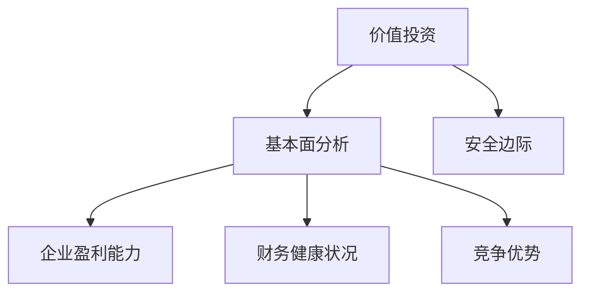
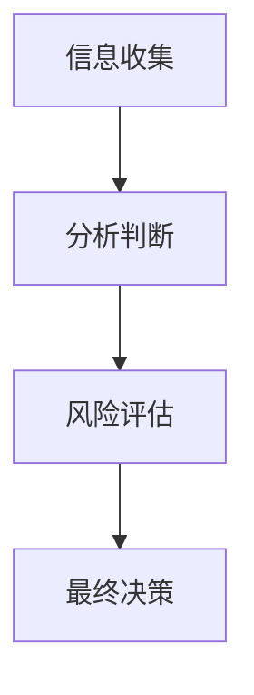
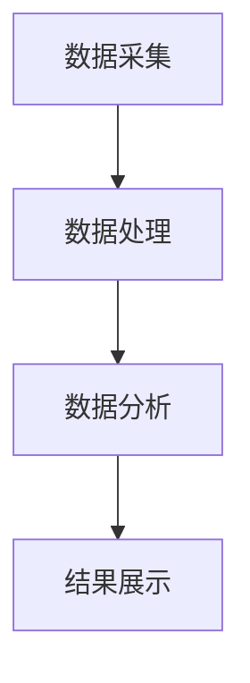
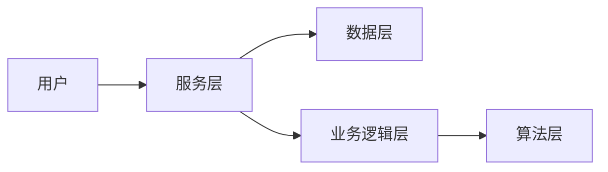

                 


# 巴菲特的价值投资再思考：数字时代的适应与创新

## 关键词：价值投资、数字时代、创新思维、技术赋能、投资策略、系统架构

## 摘要：  
在数字时代，传统的价值投资理论面临着前所未有的挑战和机遇。本文从技术赋能的角度，重新审视巴菲特的价值投资理念，探讨如何在数字时代中适应与创新。通过分析大数据、人工智能等技术在投资决策中的应用，提出一套结合传统价值投资与现代技术创新的投资策略。文章最后结合实际案例，展示如何构建数字化投资分析系统，并通过系统架构设计和项目实战，帮助投资者在数字时代中实现价值投资的创新与突破。

---

## 第一部分：价值投资的数字化转型

### 1.1 传统价值投资的核心理念

#### 1.1.1 价值投资的定义与历史

- **价值投资**是指通过分析企业的内在价值，寻找市场价低于内在价值的标的进行投资。  
- 巴菲特的价值投资理念强调企业的基本面分析，包括企业的盈利能力、财务健康状况、竞争优势等。  
- 价值投资的核心在于**安全边际**，即买入价格低于内在价值，以降低投资风险。



#### 1.1.2 投资者心态与决策过程

- 投资者的心态是价值投资成功的关键。  
- 巴菲特强调长期投资、价值发现和耐心持有。  
- 投资者的决策过程包括信息收集、分析判断、风险评估和最终决策。



#### 1.1.3 价值投资的核心要素

- **企业内在价值**：企业的未来现金流的现值。
- **安全边际**：买入价格与内在价值的折扣。
- **竞争优势**：企业的核心竞争力，如成本优势、品牌优势等。

### 1.2 数字时代的价值投资挑战

#### 1.2.1 数据驱动的投资决策

- 数字时代，数据成为投资决策的核心依据。  
- 通过大数据分析，投资者可以更全面地了解企业的基本面信息。  
- 数据驱动的投资决策包括市场情绪分析、行业趋势预测等。

#### 1.2.2 技术赋能的解决方案

- 利用人工智能技术，构建量化投资模型。  
- 通过机器学习算法，预测企业的未来现金流和市场趋势。  
- 技术赋能的价值投资策略包括数据挖掘、算法交易和智能风控。

#### 1.2.3 创新对企业价值的影响

- 创新是企业持续增长的核心动力。  
- 数字技术（如人工智能、区块链）的应用，显著提升了企业的竞争优势。  
- 创新能力是企业内在价值的重要组成部分。

### 1.3 技术驱动的创新实践

#### 1.3.1 AI在投资分析中的应用

- 人工智能技术可以帮助投资者分析海量数据，发现潜在的投资机会。  
- 通过自然语言处理技术，分析新闻、财报等非结构化数据。  
- AI算法可以预测市场的短期波动，辅助投资者做出更精准的决策。

#### 1.3.2 大数据驱动的市场预测

- 大数据技术可以整合多源数据，构建市场预测模型。  
- 通过时间序列分析，预测企业的未来收益。  
- 大数据分析可以识别市场趋势，帮助投资者制定投资策略。

#### 1.3.3 区块链技术与价值评估

- 区块链技术可以提高数据的透明度和可信度。  
- 通过区块链技术，投资者可以更准确地评估企业的价值。  
- 区块链的应用可以降低企业的运营成本，提升企业的竞争优势。

---

## 第二部分：创新思维与投资策略

### 2.1 创新对企业价值的影响

#### 2.1.1 创新与企业竞争优势

- 创新是企业保持竞争优势的关键。  
- 技术创新可以降低企业的生产成本，提高生产效率。  
- 创新还可以拓展企业的市场空间，创造新的收入来源。

#### 2.1.2 创新周期与投资机会

- 创新周期是指从技术创新到市场应用的过程。  
- 在创新周期的不同阶段，投资者可以找到不同的投资机会。  
- 投资者需要关注创新周期的拐点，及时调整投资策略。

#### 2.1.3 创新评估的数学模型

- **创新指数模型**：通过量化企业的创新能力，评估其市场价值。  
- **创新收益模型**：预测创新对企业收益的具体影响。  
- **创新风险模型**：评估创新过程中的潜在风险。

```latex
$$
\text{创新指数} = \frac{\text{研发投入}}{\text{企业规模}} \times \text{创新成果数量}
$$
```

### 2.2 投资策略的创新与优化

#### 2.2.1 动态

---

## 第三部分：系统分析与架构设计

### 3.1 问题场景介绍

- 数字时代，投资者需要构建一个数字化的投资分析系统。  
- 系统需要整合多源数据，支持复杂的投资决策。  
- 系统需要具备实时分析和智能预警功能。

### 3.2 项目介绍

- 项目目标：构建一个数字化的投资分析系统。  
- 项目范围：包括数据采集、分析、预测和决策支持功能。  
- 项目团队：数据工程师、算法工程师、系统架构师等。

### 3.3 系统功能设计

#### 3.3.1 领域模型

- 通过领域模型，明确系统的功能模块和数据关系。  
- 领域模型包括数据采集、数据处理、数据分析和结果展示等功能模块。



#### 3.3.2 系统架构设计

- 系统架构采用分层设计，包括数据层、业务逻辑层和用户界面层。  
- 数据层负责数据的存储和管理。  
- 业务逻辑层负责数据的处理和分析。  
- 用户界面层负责与用户的交互。



### 3.4 系统接口设计

- 系统接口包括数据接口和用户接口。  
- 数据接口负责与外部数据源的交互。  
- 用户接口负责与用户的交互，包括数据输入和结果输出。

### 3.5 系统交互设计

- 系统交互流程包括数据采集、数据处理、数据分析和结果展示。  
- 用户可以通过系统界面输入数据，系统处理后输出分析结果。


---

## 第四部分：项目实战

### 4.1 环境安装

- **工具安装**：安装Python、Jupyter Notebook、Pandas、Scikit-learn等工具。  
- **数据源**：获取股票数据，如Yahoo Finance API。  
- **环境配置**：配置虚拟环境，安装必要的库。

### 4.2 系统核心实现源代码

#### 4.2.1 数据采集

```python
import pandas as pd
from pandas_datareader import data as pdr

# 获取股票数据
def get_stock_data(ticker, start, end):
    df = pdr.get_data_yahoo(ticker, start, end)
    return df

# 示例代码
ticker = 'AAPL'
start = '2020-01-01'
end = '2023-12-31'
df = get_stock_data(ticker, start, end)
print(df.head())
```

#### 4.2.2 数据分析

```python
import numpy as np
from sklearn.linear_model import LinearRegression

# 数据分析
def predict_future_price(df, n_days=30):
    # 数据准备
    X = np.arange(len(df))
    y = df['Close'].values
    # 模型训练
    model = LinearRegression()
    model.fit(X.reshape(-1, 1), y)
    # 预测未来n天的价格
    future_X = np.array([len(df) + i for i in range(n_days)]).reshape(-1, 1)
    future_price = model.predict(future_X)
    return future_price

# 示例代码
future_price = predict_future_price(df)
print(f'预测未来30天的价格：{future_price}')
```

#### 4.2.3 系统实现

```python
from flask import Flask, request, jsonify

app = Flask(__name__)

@app.route('/api/stock', methods=['POST'])
def predict_stock():
    data = request.json
    ticker = data['ticker']
    start = data['start']
    end = data['end']
    df = get_stock_data(ticker, start, end)
    future_price = predict_future_price(df)
    return jsonify({'status': 'success', 'result': future_price.tolist()})

if __name__ == '__main__':
    app.run(debug=True)
```

### 4.3 实际案例分析

#### 4.3.1 案例背景

- 案例目标：预测某企业的未来股价走势。  
- 数据来源：公开的历史股价数据、财务报表数据等。  
- 分析工具：Python、Pandas、Scikit-learn、Flask。

#### 4.3.2 数据分析与结果展示

- 通过线性回归模型，预测企业的未来股价。  
- 结果展示包括历史股价走势、预测股价走势等。

### 4.4 项目小结

- 通过项目实战，投资者可以掌握数字化投资分析的基本方法。  
- 系统实现可以帮助投资者更高效地进行投资决策。  
- 项目实战中，投资者需要不断优化系统功能，提升分析的准确性。

---

## 总结与展望

### 5.1 本书总结

- 本书从数字时代的价值投资挑战出发，探讨了技术赋能的创新实践。  
- 通过系统架构设计和项目实战，展示了如何构建数字化投资分析系统。  
- 本书为投资者提供了在数字时代中实现价值投资的创新与突破的思路。

### 5.2 未来展望

- 随着技术的不断发展，价值投资的数字化转型将更加深入。  
- 人工智能和大数据技术将在投资决策中发挥越来越重要的作用。  
- 未来的投资策略将更加依赖于技术创新和系统优化。

### 5.3 最佳实践 tips

- **保持学习**：技术在不断进步，投资者需要持续学习新技术。  
- **注重实践**：通过项目实战，提升自己的技术能力和投资水平。  
- **风险管理**：在投资过程中，始终关注风险控制，确保投资安全。

---

## 作者信息

作者：AI天才研究院/AI Genius Institute & 禅与计算机程序设计艺术 /Zen And The Art of Computer Programming

---

通过以上思考和撰写，我希望能够为您提供一篇结构清晰、内容详实的技术博客文章，帮助您在数字时代中重新思考价值投资，并通过技术创新实现投资策略的优化与突破。

