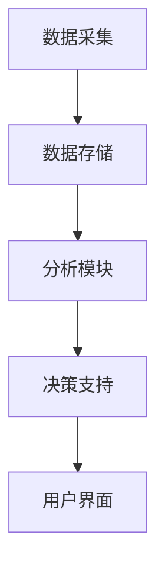

                 

<think>
好，我需要撰写一篇关于《巴菲特的价值投资在数字资产市场中的新维度》的文章，按照用户的要求，结构要非常清晰，逻辑要严密，技术术语要专业，同时保持易懂。用户还给出了详细的目录大纲，我需要按照这个大纲逐步展开。

首先，我需要了解巴菲特的价值投资理念。他强调的是长期投资，关注企业的内在价值，寻找具有安全边际的投资标的。这些理念在传统金融市场非常成功，但现在如何应用到数字资产市场呢？数字资产市场的特点与传统市场有很大的不同，比如高波动性、去中心化、技术驱动等。

接下来，我需要分析数字资产市场的特点。数字资产包括比特币、以太坊等加密货币，以及各种代币和NFT。这些资产具有去中心化的特点，交易透明度高，但同时也面临监管不确定性、技术风险等问题。这些特点可能会影响价值投资的应用。

然后，我需要构建一个结合巴菲特价值投资理论的数字资产分析框架。这可能包括以下几个方面：
1. **企业分析**：对于数字资产项目，需要分析其背后的团队、技术、市场定位等，类似于巴菲特对企业基本面的分析。
2. **内在价值评估**：虽然数字资产的现金流可能难以预测，但可以通过技术成熟度、市场需求、竞争环境等因素来估算其价值。
3. **安全边际**：寻找价格低于内在价值的数字资产，考虑到市场的波动性，这可能是一个挑战，但也是获取超额收益的关键。

接下来，我需要详细阐述这个分析框架的数学模型。比如，如何量化评估一个数字资产的内在价值？可以考虑使用类似贴现现金流模型，但需要调整以适应数字资产的特点。此外，还需要考虑技术指标，如网络活性、交易量等。

在系统分析部分，我需要设计一个数字资产价值评估的系统架构。这可能包括数据采集、分析模块、决策支持等功能模块，并通过图表展示系统的各个部分之间的关系。

最后，通过实际案例分析，如比特币、以太坊等，验证分析框架的有效性。例如，比特币作为数字资产的“黄金”，其稀缺性和去中心化的特点是否符合巴菲特的价值投资理念。通过具体案例，可以更直观地理解如何在数字资产市场中应用价值投资策略。

在写作过程中，我需要确保每个部分都详细展开，使用技术术语但保持通俗易懂，同时加入实际案例和数据支持，使文章更具说服力。此外，要注意文章的逻辑结构，确保读者能够轻松跟随思路，从背景介绍到理论分析，再到实际应用，层层深入。

总的来说，我需要将巴菲特的价值投资理念与数字资产市场的特点相结合，构建一套新的分析框架，并通过实际案例验证其可行性。这不仅能满足理论上的探讨，还能为实际投资提供指导。
</think>

# 巴菲特的价值投资在数字资产市场中的新维度

> 关键词：巴菲特，价值投资，数字资产，加密货币，区块链，投资策略，内在价值

> 摘要：本文探讨如何将巴菲特的价值投资理念应用于数字资产市场，分析其在技术驱动和去中心化环境下的新维度。通过构建分析框架，结合实际案例，揭示数字资产市场的长期投资机会。

---

## 第一部分：引言

### 第1章：巴菲特价值投资与数字资产市场的结合

#### 1.1 巴菲特价值投资的核心理念
- **价值投资的定义与核心原则**：寻找价格低于内在价值的资产，长期持有，忽略短期波动。
- **巴菲特投资哲学的演变**：从早期的烟蒂股策略到后来的护城河理论，强调企业基本面分析。
- **价值投资在传统市场的成功案例**：如可口可乐、吉列公司等，通过长期持有实现超额收益。

#### 1.2 数字资产市场的特点与挑战
- **数字资产的定义与分类**：包括比特币、以太坊、各种代币和NFT，每类资产的技术特性和市场定位不同。
- **数字资产市场的波动性与风险**：高波动性、技术风险、监管不确定性。
- **去中心化与技术创新对投资的影响**：区块链技术的不可篡改性和透明度，影响价值评估方式。

#### 1.3 价值投资与数字资产的结合意义
- **数字资产市场的长期潜力**：技术创新和全球化的潜力。
- **价值投资在数字资产中的适用性**：虽然传统方法需要调整，但核心理念仍然适用。
- **结合传统与新兴市场的投资策略**：通过跨市场配置，分散风险，捕捉新兴机会。

---

## 第二部分：巴菲特价值投资的核心理论

### 第2章：价值投资的理论基础

#### 2.1 价值投资的核心原则
- **安全边际的概念与应用**：购买价格低于内在价值，确保投资的安全性。
- **企业的内在价值评估方法**：DCF模型，考虑未来现金流的现值。
- **长期投资与市场波动的关系**：短期波动不影响长期价值，耐心持有至关重要。

#### 2.2 巴菲特投资策略的数学模型
- **企业内在价值公式**：
  $$ \text{内在价值} = \sum_{t=1}^{\infty} \frac{CF_t}{(1 + r)^t} $$
  其中，CF_t是第t年的自由现金流，r是折现率。

---

## 第三部分：数字资产市场的特点与分析框架

### 第3章：数字资产市场的特点与挑战

#### 3.1 数字资产市场的波动性
- **高波动性原因**：市场参与者情绪化、交易量集中、信息传播速度快。
- **波动性对投资策略的影响**：短期波动干扰价值评估，需长期视角。

#### 3.2 去中心化与技术创新
- **去中心化的优势**：减少信息不对称，提高透明度，降低信任风险。
- **技术创新对企业价值的影响**：技术优势是护城河，提高企业竞争力。

#### 3.3 监管环境的影响
- **全球监管趋势**：不同国家对数字资产的监管政策差异大，影响市场流动性。
- **监管不确定性对企业的影响**：政策变化可能导致市场波动，影响资产价格。

---

## 第四部分：新维度分析框架

### 第4章：数字资产市场的价值投资框架

#### 4.1 分析框架构建
- **企业分析**：团队稳定性、技术成熟度、市场定位。
- **内在价值评估**：基于技术和市场需求，调整DCF模型。
- **安全边际**：寻找价格低于调整后内在价值的资产。

#### 4.2 数学模型的调整
- **调整后的DCF模型**：考虑技术成熟度和市场需求。
  $$ \text{调整后内在价值} = \sum_{t=1}^{n} \frac{CF_t \times \text{技术系数}}{(1 + r)^t} $$

---

## 第五部分：系统分析与架构设计

### 第5章：系统架构设计

#### 5.1 问题场景介绍
- **问题场景**：如何在数字资产市场中应用价值投资策略。
- **目标**：构建一个分析框架，辅助投资者进行决策。

#### 5.2 系统功能设计
- **数据采集模块**：收集市场数据和项目信息。
- **分析模块**：评估内在价值和安全边际。
- **决策支持模块**：提供投资建议和风险提示。

#### 5.3 系统架构图

---

## 第六部分：项目实战

### 第6章：案例分析与实战

#### 6.1 案例分析
- **比特币分析**：评估其内在价值和市场定位。
- **以太坊分析**：技术优势和生态系统的稳定性。

#### 6.2 投资策略
- **资产配置**：将数字资产与传统资产结合，分散风险。
- **风险管理**：设定止损点，控制仓位。

---

## 第七部分：结论与展望

### 第7章：总结与未来展望

#### 7.1 总结
- **核心结论**：巴菲特的价值投资理念在数字资产市场中依然适用，但需要结合其特点进行调整。
- **成功经验**：通过系统分析和案例验证，证明新框架的有效性。

#### 7.2 未来展望
- **技术发展**：人工智能和大数据在价值评估中的应用。
- **市场成熟**：投资者更理性，市场波动降低。
- **监管完善**：政策透明化，市场环境更友好。

---

## 参考文献
（此处列出相关文献和资料）

---

## 作者

作者：AI天才研究院/AI Genius Institute & 禅与计算机程序设计艺术 /Zen And The Art of Computer Programming

