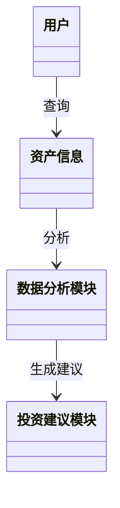

                 


# 巴菲特的价值投资在量子加密资产中的新维度

> **关键词**：价值投资，量子计算，加密资产，投资策略，风险管理  
> 
> **摘要**：本文探讨了巴菲特价值投资理念在量子加密资产领域的应用，通过分析量子加密资产的技术特性、市场现状及投资机会，提出了结合价值投资理论的新型投资策略。文章从价值投资的理论基础出发，结合量子加密资产的技术优势，构建了适用于新兴加密资产市场的投资框架，并通过实际案例分析验证了其可行性。

---

## 第一部分：引言

### 1.1 价值投资与量子加密资产的结合

#### 背景介绍
- 价值投资是由巴菲特提出的长期投资策略，强调以低于内在价值的价格买入优质资产。
- 量子加密资产是基于量子计算技术的新兴资产类别，具有去中心化、安全性高、计算效率高等特点。
- 两者的结合为投资者提供了新的投资维度，特别是在加密资产市场的波动性和技术不确定性背景下，价值投资的理念能够提供长期稳定的收益。

#### 核心概念与联系
- 价值投资的核心是寻找具有持续竞争优势和良好治理的企业。
- 量子加密资产的技术优势（如量子安全加密、高效计算）为投资者提供了新的投资标的。
- 通过分析量子加密资产的技术成熟度、市场需求和竞争格局，投资者可以找到具有长期增长潜力的标的。

---

## 第二部分：价值投资的理论基础

### 2.1 价值投资的核心要素

#### 2.1.1 企业基本面分析
- 企业基本面分析是价值投资的核心，包括对企业盈利能力、财务状况、竞争优势和管理团队的评估。
- 通过分析企业的财务报表（如利润表、资产负债表、现金流量表），可以计算其内在价值。

#### 2.1.2 行业分析与竞争格局
- 行业分析帮助投资者理解企业的市场定位和竞争优势。
- 竞争格局分析包括对行业集中度、市场进入壁垒和技术门槛的评估。

#### 2.1.3 财务报表分析与估值方法
- 财务报表分析是评估企业内在价值的关键步骤。
- 常用的估值方法包括市盈率（P/E）、市净率（P/B）、股息率等。

---

### 2.2 价值投资的数学模型

#### 2.2.1 内在价值计算公式
$$ V = \frac{CF}{r - g} $$
- **CF**：未来现金流的现值
- **r**：折现率
- **g**：现金流增长率

#### 2.2.2 安全边际的计算方法
$$ \text{安全边际} = V - P $$
- **V**：内在价值
- **P**：市场价格

---

## 第三部分：量子加密资产的技术与市场分析

### 3.1 量子计算的核心技术

#### 3.1.1 量子位与量子态
- 量子位（qubit）是量子计算的基本单位，具有叠加态和纠缠态的特性。
- 量子态的叠加态表示为：
  $$ | \psi \rangle = \alpha |0\rangle + \beta |1\rangle $$
  其中，$\alpha$ 和 $\beta$ 是复数，且满足 $|\alpha|^2 + |\beta|^2 = 1$。

#### 3.1.2 量子算法与计算优势
- 量子算法（如Shor算法）能够在某些领域（如大数分解、密码破解）实现指数级加速。
- 量子计算的优势在于其并行计算能力，能够在短时间内完成传统计算机无法完成的任务。

---

### 3.2 加密资产的分类与特性

#### 3.2.1 比特币、以太坊等主流加密货币
- 比特币：基于区块链技术的去中心化加密货币。
- 以太坊：支持智能合约的区块链平台。

#### 3.2.2 智能合约与去中心化金融（DeFi）
- 智能合约是基于区块链的自动执行程序，能够实现复杂的金融交易。
- DeFi（Decentralized Finance）是基于区块链的去中心化金融服务。

---

### 3.3 量子加密资产的市场现状

#### 3.3.1 市场规模与增长趋势
- 量子加密资产的市场规模正在快速增长，预计未来几年将呈现指数级增长。
- 市场增长的主要驱动力是量子计算技术的成熟和去中心化金融的发展。

#### 3.3.2 市场参与者与竞争格局
- 主要参与者包括科技巨头（如谷歌、IBM）、区块链初创公司和加密货币交易所。
- 竞争格局呈现多元化，技术门槛高，市场集中度较低。

#### 3.3.3 量子加密资产的风险与挑战
- 技术风险：量子计算技术尚未完全成熟，存在技术瓶颈。
- 市场风险：加密资产市场波动性大，价格受政策和市场情绪影响。
- 法律风险：加密资产的法律监管尚不完善，存在合规风险。

---

## 第四部分：价值投资在量子加密资产中的应用

### 4.1 价值投资与量子加密资产的投资框架

#### 4.1.1 投资框架的构建
- 基于价值投资理念，构建适用于量子加密资产的投资框架。
- 关注具有长期增长潜力的量子加密资产，如量子计算技术公司、DeFi平台等。

#### 4.1.2 投资策略
- 长期持有优质标的：选择具有技术优势和良好治理的量子加密资产。
- 估值分析：通过财务报表分析和市场估值指标（如P/E、P/B）评估标的的内在价值。
- 风险管理：设置止损点，控制投资组合的波动性。

---

### 4.2 价值投资在量子加密资产中的案例分析

#### 4.2.1 案例：量子计算技术公司A
- 公司背景：A公司是全球领先的量子计算技术公司，拥有专利技术。
- 财务分析：公司收入稳步增长，利润率较高，具备长期竞争优势。
- 投资策略：以低于内在价值的价格买入，长期持有。

#### 4.2.2 案例：DeFi平台B
- 平台背景：B平台是基于以太坊的去中心化金融平台，支持多种智能合约。
- 市场分析：市场需求快速增长，平台具有较高的市场占有率。
- 投资策略：评估平台的用户增长和技术创新能力，选择合适的进入时机。

---

## 第五部分：系统分析与架构设计

### 5.1 系统功能设计

#### 5.1.1 系统功能模块
- 用户界面：提供资产信息查询、数据分析、投资建议等功能。
- 数据分析模块：基于财务数据和市场数据，计算资产的内在价值。
- 投资建议模块：根据分析结果，生成个性化投资建议。

#### 5.1.2 系统类图


---

## 第六部分：项目实战

### 6.1 环境安装

#### 6.1.1 环境要求
- 操作系统：Windows 10 或 macOS
- 开发工具：Python 3.8+
- 第三方库：Pandas、Matplotlib、Scikit-learn

#### 6.1.2 安装步骤
```bash
pip install pandas matplotlib scikit-learn
```

---

### 6.2 核心代码实现

#### 6.2.1 数据分析模块
```python
import pandas as pd
import numpy as np
import matplotlib.pyplot as plt

# 示例数据：量子计算公司股票价格
data = {
    '日期': ['2023-01', '2023-02', '2023-03', '2023-04'],
    '价格': [100, 110, 120, 130]
}
df = pd.DataFrame(data)

# 计算均线
df['均线'] = df['价格'].rolling(2).mean()

# 绘制价格与均线图
plt.figure(figsize=(10, 6))
plt.plot(df['日期'], df['价格'], label='价格')
plt.plot(df['日期'], df['均线'], label='均线')
plt.title('量子计算公司股价走势')
plt.xlabel('日期')
plt.ylabel('价格')
plt.legend()
plt.show()
```

#### 6.2.2 投资建议模块
```python
import pandas as pd
import numpy as np

# 示例数据：量子计算公司财务数据
data = {
    '项目': ['收入', '净利润', '研发投入'],
    '金额': [1000, 200, 300]
}
df = pd.DataFrame(data)

# 计算ROE（净资产收益率）
roe = df.loc[df['项目'] == '净利润', '金额'].values[0] / df.loc[df['项目'] == '收入', '金额'].values[0] * 100
print(f'ROE: {roe}%')

# 基于ROE生成投资建议
if roe > 15:
    print('建议买入')
else:
    print('建议观望')
```

---

## 第七部分：总结与展望

### 7.1 总结
- 价值投资的理念适用于量子加密资产的投资，特别是在技术成熟和市场稳定的标的中。
- 通过系统的分析和风险管理，投资者可以在新兴市场中获得长期稳定的收益。

### 7.2 展望
- 未来，随着量子计算技术的进一步发展，量子加密资产的投资机会将更加多样化。
- 投资者需要持续关注技术进步和市场动态，优化投资策略。

---

## 作者

作者：AI天才研究院/AI Genius Institute & 禅与计算机程序设计艺术 /Zen And The Art of Computer Programming

