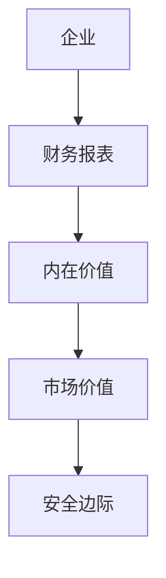
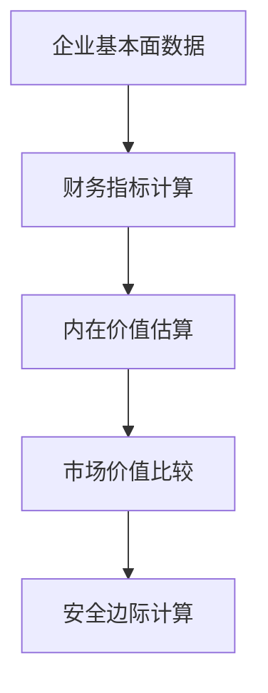

                 


# 巴菲特的价值投资在量子金融时代的新解读

## 关键词：巴菲特，价值投资，量子金融，人工智能，大数据分析，量化模型

## 摘要：本文将探讨巴菲特的价值投资理念在量子金融时代的演变与应用。通过分析传统价值投资与新兴技术的结合，提出新的投资策略框架，包括量化模型构建、大数据分析和风险管理，为投资者提供在新时代下的投资指导。

---

# 引言

在金融市场的不断演变中，巴菲特的价值投资理念依然熠熠生辉。然而，随着量子计算、人工智能和大数据分析等技术的进步，金融市场的复杂性和不确定性也在增加。本文旨在探讨如何将传统的价值投资理念与现代技术相结合，以应对量子金融时代的挑战。

---

# 第一部分：巴菲特价值投资的理论基础

## 第1章：巴菲特价值投资的核心理念

### 1.1 价值投资的定义与核心原则

#### 1.1.1 价值投资的定义
价值投资是一种以企业内在价值为核心的投资策略，强调以低于内在价值的价格买入优质资产。巴菲特的价值投资理念强调长期持有、关注企业基本面和安全边际。

#### 1.1.2 巴菲特的价值投资核心原则
- **安全边际**：买入价格低于内在价值，以降低风险。
- **长期投资**：关注企业的长期价值，而非短期波动。
- **优质企业**：选择具有持续竞争优势的企业。

#### 1.1.3 价值投资的哲学基础
价值投资不仅仅是技术分析，更是一种哲学，强调理性思考、独立判断和长期视角。

### 1.2 巴菲特投资策略的关键要素

#### 1.2.1 高质量企业的定义与特征
- 高质量企业：具有持续盈利能力和竞争优势。
- 特征：稳定的收益、强大的护城河、良好的治理结构。

#### 1.2.2 安全边际的概念与计算
安全边际 = 内在价值 - 市场价格。通过计算安全边际，投资者可以评估投资的安全性。

#### 1.2.3 财务报表分析的关键指标
- 资产负债表：关注负债、现金流、股东权益。
- 利润表：关注收入、成本、净利润。
- 现金流量表：关注现金流来源和使用情况。

### 1.3 巴菲特投资策略的适用场景

#### 1.3.1 传统金融市场的应用
在传统市场中，价值投资通过基本面分析找到被低估的企业。

#### 1.3.2 非有效市场的表现
在非有效市场中，价值投资策略更容易发现低估资产。

#### 1.3.3 长期投资与短期波动的平衡
尽管短期波动难以预测，但长期投资仍能捕捉企业增长的价值。

---

## 第2章：巴菲特价值投资的核心概念与联系

### 2.1 核心概念原理

#### 2.1.1 企业内在价值的计算公式
$$ \text{内在价值} = \sum_{t=1}^{\infty} \frac{\text{现金流}_t}{(1 + r)^t} $$
其中，r为折现率，现金流为企业未来产生的现金流。

#### 2.1.2 安全边际的数学模型
$$ \text{安全边际} = \text{内在价值} - \text{市场价格} $$

#### 2.1.3 财务指标与企业价值的关系
- 市盈率（P/E）：股价与每股收益的比率。
- 市净率（P/B）：股价与每股净资产的比率。
- 股东权益收益率（ROE）：衡量企业盈利能力的指标。

### 2.2 核心概念属性特征对比表格

| 概念       | 特征               |
|------------|--------------------|
| 内在价值   | 企业的未来现金流折现值 |
| 市场价值   | 当前市场价格       |
| 安全边际   | 内在价值与市场价格差值 |

### 2.3 ER实体关系图架构（Mermaid流程图）



---

## 第3章：巴菲特价值投资的算法原理

### 3.1 量化模型构建（Mermaid流程图）



### 3.2 算法实现（Python代码示例）

```python
import pandas as pd
import numpy as np

def calculate_intrinsic_value(financial_data, discount_rate):
    # 计算自由现金流
    free_cash_flow = financial_data['净利润'] - financial_data['资本支出']
    # 计算终值
    terminal_value = free_cash_flow * (1 + discount_rate) / (discount_rate - 0.05)
    # 计算内在价值
    intrinsic_value = free_cash_flow.sum() + terminal_value
    return intrinsic_value

# 示例数据
data = {'净利润': [100, 120, 130], '资本支出': [30, 35, 40]}
financial_data = pd.DataFrame(data)
discount_rate = 0.1

# 计算内在价值
iv = calculate_intrinsic_value(financial_data, discount_rate)
print(f"内在价值: {iv}")
```

---

## 第4章：量子金融时代的技术背景

### 4.1 量子计算对金融建模的影响

量子计算的出现，使得复杂的金融建模问题能够更高效地解决，如期权定价和风险评估。

### 4.2 人工智能在金融分析中的应用

人工智能技术，如机器学习，可以用于预测市场趋势和识别投资机会。

### 4.3 大数据分析与量化交易

通过大数据分析，投资者可以发现市场中的异常情况，从而进行量化交易。

---

## 第5章：价值投资与量子金融的结合

### 5.1 技术如何赋能价值投资

通过量子计算和人工智能技术，投资者可以更准确地计算企业内在价值和市场风险。

### 5.2 量化模型在价值投资中的应用

构建基于机器学习的量化模型，识别具有潜在价值的企业。

### 5.3 风险管理与投资组合优化

利用大数据分析和优化算法，构建风险可控的投资组合。

---

## 第6章：实际案例分析

### 6.1 案例背景

选择一家具有强大竞争优势的企业，分析其内在价值和市场价格。

### 6.2 数据收集与分析

收集企业的财务数据和市场数据，计算内在价值和安全边际。

### 6.3 投资决策

基于分析结果，做出买入、持有或卖出的决策。

---

## 第7章：未来展望

### 7.1 新技术的影响

量子计算和人工智能将如何进一步改变金融投资？

### 7.2 投资策略的演变

价值投资在新时代下的策略调整和优化。

### 7.3 投资者面临的挑战

技术进步带来的新挑战，如数据隐私和模型过拟合问题。

---

# 总结

在量子金融时代，巴菲特的价值投资理念依然具有重要的指导意义。通过与新技术的结合，投资者可以更有效地识别优质企业，降低投资风险，实现长期收益。然而，这也带来了新的挑战，需要投资者不断学习和适应。

---

# 作者：AI天才研究院 & 禅与计算机程序设计艺术

