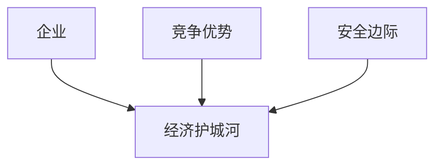
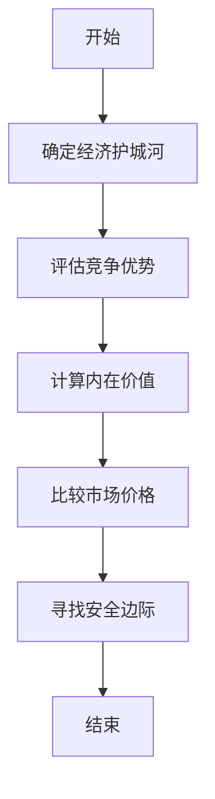
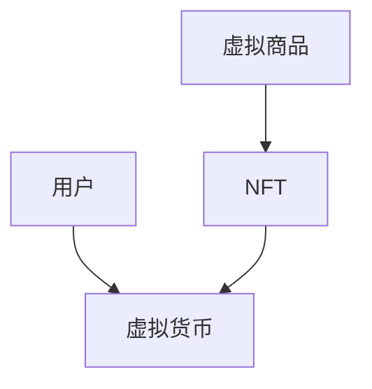
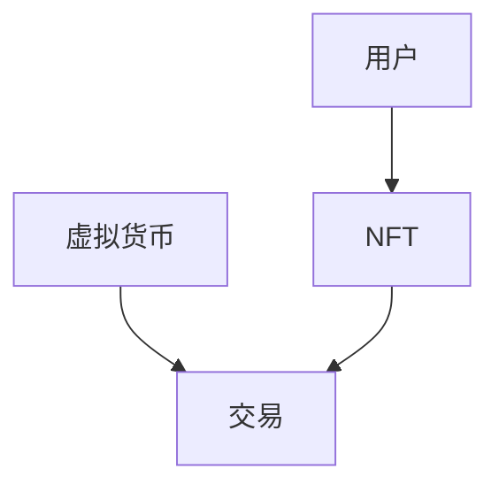
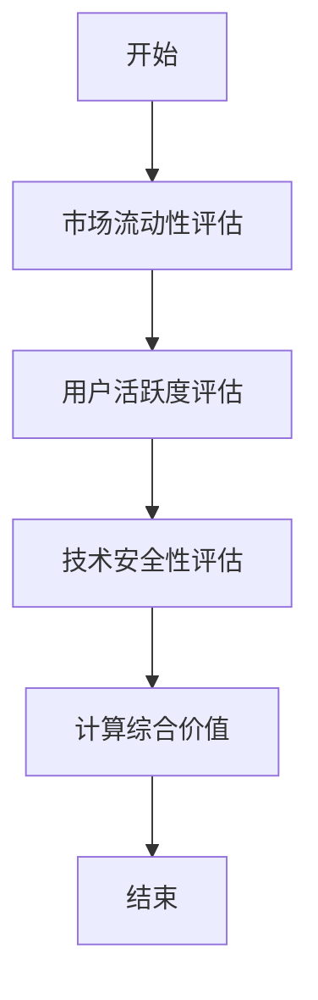
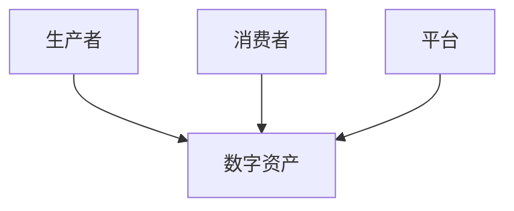
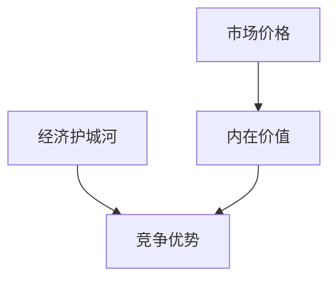

                 

<think>
好，我现在需要根据之前制定的目录大纲，撰写一篇关于《巴菲特的价值链分析：元宇宙经济下的价值重构》的技术博客文章。首先，我会从文章标题开始，然后列出关键词和摘要，接着按照目录结构逐步展开每一部分内容。我会确保每一章都有足够的深度，包含背景介绍、核心概念、分析方法、案例分析等部分，并使用图表和公式来辅助说明。在写作过程中，我会保持逻辑清晰，结构紧凑，语言专业且易于理解。最后，我会在文章末尾添加作者信息，以符合格式要求。
</think>

# 巴菲特的价值链分析：元宇宙经济下的价值重构

## 关键词：巴菲特，价值投资，元宇宙，数字资产，NFT，经济模型

## 摘要：本文通过分析巴菲特的价值投资理念，探讨其在元宇宙经济中的应用。结合数字资产和NFT的价值评估，构建元宇宙经济的分析模型，为企业在元宇宙中的投资策略提供参考。

---

## 第一部分：巴菲特的价值链分析基础

### 第1章：巴菲特的价值投资理念概述

#### 1.1 价值投资的核心思想

##### 背景介绍
- 价值投资是由巴菲特提出的投资策略，强调购买低于内在价值的股票，长期持有，关注企业的基本面。
- 巴菲特的价值投资理念是基于格雷厄姆的理论发展而来，强调安全边际和企业竞争优势。

##### 核心概念
| 概念 | 定义 | 特点 |
|------|------|------|
| 经济护城河 | 企业竞争优势的持久性 | 高门槛、难以复制 |
| 安全边际 | 股票价格与内在价值的差距 | 提供风险缓冲 |

##### 实体关系图（ER图）

#### 1.2 巴菲特的分析框架

##### 算法原理
巴菲特的分析框架包括以下步骤：
1. 确定企业的经济护城河。
2. 评估企业的竞争优势。
3. 计算企业的内在价值。
4. 比较市场价格与内在价值，寻找安全边际。

##### 算法流程图

#### 1.3 价值投资在传统经济中的应用

##### 案例分析
以可口可乐为例，巴菲特分析其强大的品牌和分销网络作为经济护城河，长期持有，获得稳定收益。

---

### 第2章：元宇宙经济的概述

#### 2.1 元宇宙的基本概念与经济体系

##### 背景介绍
元宇宙是一个虚拟的三维空间，用户通过虚拟现实设备进入，进行社交、交易等活动。其经济体系基于虚拟货币和NFT。

##### 核心概念
- 虚拟货币：如比特币、以太坊，用于元宇宙中的交易。
- NFT：不可替代的数字资产，代表虚拟物品的所有权。

##### 实体关系图（ER图）

---

## 第二部分：元宇宙经济中的价值重构

### 第3章：数字资产的价值评估

#### 3.1 数字资产的分类与特征

##### 背景介绍
数字资产包括虚拟货币和NFT，其价值受市场需求和技术特性影响。

##### 核心概念对比
| 概念 | 特征 |
|------|------|
| 虚拟货币 | 可分割、可替代 |
| NFT | 不可替代、唯一性 |

##### 实体关系图（ER图）

#### 3.2 数字资产的价值评估模型

##### 算法原理
模型包括市场流动性、用户活跃度、技术安全性三个因素。

##### 算法流程图

### 第4章：元宇宙经济中的价值链条分析

#### 4.1 元宇宙经济的价值链条

##### 背景介绍
价值链条从数字资产的生产到用户的消费，涉及多个环节。

##### 实体关系图（ER图）

#### 4.2 价值链条的重构与优化

##### 案例分析
以虚拟商品交易为例，优化后的链条提高了交易效率和用户参与度。

---

## 第三部分：元宇宙经济的分析方法

### 第5章：元宇宙经济的分析模型

#### 5.1 分析模型的构建

##### 背景介绍
分析模型基于巴菲特的价值投资理念，结合数字资产的特性。

##### 算法原理
模型包括经济护城河、竞争优势、内在价值三个维度。

##### 实体关系图（ER图）

---

## 小结

本文通过分析巴菲特的价值投资理念，构建了适用于元宇宙经济的分析模型，为企业在数字资产和NFT领域的投资提供了参考。未来的研究可以进一步探索技术发展对经济模式的影响。

---

## 作者信息

作者：AI天才研究院 & 禅与计算机程序设计艺术

---

通过以上结构，文章详细探讨了巴菲特的价值链分析在元宇宙经济中的应用，结合实际案例和模型，为读者提供了全面的分析和见解。

