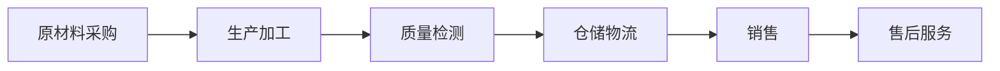
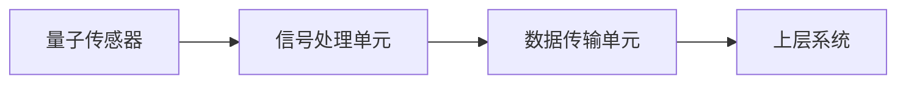
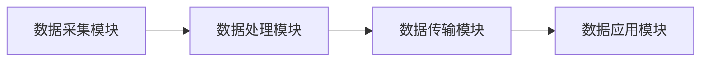

                 

# 巴菲特的价值链分析：量子传感技术在产业升级中的作用

## 关键词：
巴菲特，价值链分析，量子传感技术，产业升级，企业创新，技术应用，投资价值

## 摘要：
本文从巴菲特的价值链分析出发，探讨量子传感技术在产业升级中的重要作用。通过对量子传感技术的基本原理、算法原理、系统架构以及实际应用案例的详细分析，揭示该技术如何优化企业价值链，提升企业竞争优势，从而为企业创造更大的投资价值。文章结合实际案例，分析量子传感技术在企业产业升级中的应用场景，并为企业如何利用该技术实现价值提升提供实用建议。

---

## 第一部分: 巴菲特的价值链分析与量子传感技术概述

### 第1章: 巴菲特的价值链分析基础

#### 1.1 巴菲特投资理念概述
##### 1.1.1 巴菲特的价值投资理论
巴菲特的价值投资理论强调企业内在价值的重要性。他认为，企业的内在价值是其未来现金流的现值，而企业的竞争优势是决定其内在价值的关键因素。竞争优势可以体现在成本优势、技术优势、品牌优势等方面。企业竞争优势越强，其内在价值越高，投资回报也越大。

**核心概念对比表：**
| 对比维度       | 竞争优势         | 投资价值         |
|----------------|------------------|------------------|
| 核心要素       | 技术、成本、品牌  | 现金流、回报率   |
| 实现路径       | 提升产品附加值    | 投资优质企业     |
| 关键指标       | 市场占有率、利润率 | 净利润、ROE      |

##### 1.1.2 企业价值链的核心要素
企业价值链是指企业从原材料采购、生产加工、销售到售后服务的完整流程。价值链的优化能够降低企业成本、提升效率、增强客户满意度。巴菲特认为，企业竞争优势的核心在于价值链中的关键环节是否具有竞争优势。

**企业价值链模型：**

##### 1.1.3 企业竞争优势的来源
企业竞争优势来源于其在价值链中的独特能力，例如技术创新能力、成本控制能力、品牌影响力等。巴菲特特别关注那些具有强大护城河（competitive moat）的企业，这些企业能够在长期竞争中保持优势地位。

#### 1.2 量子传感技术的基本概念
##### 1.2.1 量子传感技术的定义
量子传感技术是一种基于量子效应的传感技术，利用量子系统的特性（如量子纠缠、量子干涉）进行测量和感知。与传统传感器相比，量子传感器具有更高的灵敏度和精度，能够在复杂环境中获取更精确的数据。

##### 1.2.2 量子传感技术的基本原理
量子传感技术的核心原理是利用量子系统对外界环境的敏感性。通过测量量子系统的状态变化，可以获取被测对象的详细信息。例如，利用量子干涉效应可以实现高精度的长度测量，利用量子纠缠效应可以实现高灵敏度的磁场测量。

##### 1.2.3 量子传感技术的应用领域
量子传感技术广泛应用于多个领域，包括：
- **精密测量**：如长度、角度、磁场的高精度测量。
- **医疗健康**：如生物分子检测、医学成像。
- **通信技术**：如量子导航、量子通信。
- **工业制造**：如高精度加工、质量检测。

**量子传感技术的应用领域对比表：**
| 应用领域       | 典型应用案例       | 技术优势         |
|----------------|--------------------|------------------|
| 精密测量       | 高精度激光测量     | 灵敏度高          |
| 医疗健康       | 生物分子检测       | 精确性高          |
| 通信技术       | 量子通信           | 安全性高          |
| 工业制造       | 高精度加工         | 稳定性高          |

### 第2章: 量子传感技术与企业产业升级

#### 2.1 量子传感技术对企业竞争优势的影响
##### 2.1.1 量子传感技术如何提升企业效率
通过引入量子传感器，企业可以实现生产过程的实时监测和优化。例如，在制造业中，量子传感器可以实时监测设备运行状态，提前预测设备故障，从而减少停机时间，提升生产效率。

##### 2.1.2 量子传感技术如何降低企业成本
量子传感器的高精度和灵敏度可以显著降低资源浪费。例如，在能源行业，量子传感器可以精确测量能源消耗，帮助企业优化能源使用，降低运营成本。

##### 2.1.3 量子传感技术如何增强企业创新力
量子传感技术的引入为企业提供了新的技术工具，能够支持企业进行创新研发。例如，利用量子传感器进行新材料的研发，可以显著加快研发进程，降低研发成本。

#### 2.2 量子传感技术在产业升级中的作用
##### 2.2.1 产业升级的核心驱动力
产业升级的核心驱动力在于技术创新。量子传感技术作为一种颠覆性技术，能够为产业升级提供新的动力。通过引入量子传感技术，企业可以实现生产过程的智能化、数字化，从而推动整个产业链的升级。

##### 2.2.2 量子传感技术在产业升级中的应用场景
量子传感技术在产业升级中的应用场景广泛，包括：
- **智能制造**：通过量子传感器实现生产设备的智能化监测和控制。
- **绿色制造**：通过量子传感器优化能源使用，减少环境污染。
- **高效物流**：通过量子传感器实现物流过程的实时监控和优化。

##### 2.2.3 量子传感技术对产业链的价值链优化
量子传感技术能够优化产业链中的多个环节。例如，在供应链管理中，量子传感器可以实时监测物流状态，提高供应链的透明度和效率。在产品设计中，量子传感器可以提供更精确的测量数据，支持产品创新。

---

## 第二部分: 量子传感技术的核心算法与系统架构

### 第3章: 量子传感技术的算法原理

#### 3.1 量子传感技术的核心算法
##### 3.1.1 量子测量的基本原理
量子测量的核心原理是利用量子系统的叠加态和纠缠态进行测量。通过测量量子系统的状态变化，可以获取被测对象的详细信息。

##### 3.1.2 量子传感器的信号处理算法
量子传感器的信号处理算法主要包括量子态的制备、测量和数据分析。例如，利用量子干涉效应进行长度测量时，需要对量子态进行精确操控和测量。

##### 3.1.3 量子传感技术的数学模型
量子传感技术的数学模型通常基于量子力学的基本原理。例如，利用量子干涉效应进行长度测量的数学模型可以表示为：
$$
L = \frac{\lambda}{2} \cdot \frac{\phi}{\pi}
$$
其中，$L$ 是被测长度，$\lambda$ 是光波长，$\phi$ 是相位差。

#### 3.2 量子传感技术的系统架构
##### 3.2.1 量子传感系统的组成结构
量子传感系统通常包括量子传感器、信号处理单元和数据传输单元。量子传感器负责采集数据，信号处理单元对数据进行分析和处理，数据传输单元将数据传输到上层系统。

##### 3.2.2 量子传感技术的系统架构图

##### 3.2.3 量子传感系统的功能模块划分
量子传感系统的功能模块主要包括数据采集、数据处理、数据传输和数据应用。每个模块的功能如下：
- 数据采集：通过量子传感器采集被测数据。
- 数据处理：对采集到的数据进行分析和处理，提取有用信息。
- 数据传输：将处理后的数据传输到上层系统。
- 数据应用：利用数据进行进一步分析和应用，例如预测设备故障。

### 第4章: 量子传感技术的系统设计

#### 4.1 量子传感系统的功能设计
##### 4.1.1 量子传感系统的功能需求分析
量子传感系统需要满足以下功能需求：
- 高精度测量：能够实现高精度的测量，满足不同应用场景的需求。
- 实时监测：能够实时监测被测对象的状态，支持动态调整。
- 数据分析：能够对采集到的数据进行分析，提供有用的信息。

##### 4.1.2 量子传感系统的功能模块设计
量子传感系统的功能模块设计如下：
- 数据采集模块：负责采集量子传感器的数据。
- 数据处理模块：负责对数据进行分析和处理，提取有用信息。
- 数据传输模块：负责将数据传输到上层系统。
- 数据应用模块：负责利用数据进行进一步分析和应用。

##### 4.1.3 量子传感系统的功能实现
量子传感系统的功能实现需要结合具体的算法和系统架构。例如，利用量子干涉效应进行长度测量时，需要精确控制量子态的制备和测量。

#### 4.2 量子传感系统的架构设计
##### 4.2.1 量子传感系统的架构图

##### 4.2.2 量子传感系统的组件交互设计
量子传感系统的组件交互设计如下：
- 数据采集模块与量子传感器进行交互，采集被测数据。
- 数据处理模块对采集到的数据进行分析和处理，提取有用信息。
- 数据传输模块将处理后的数据传输到上层系统。
- 数据应用模块利用数据进行进一步分析和应用。

##### 4.2.3 量子传感系统的数据流设计
量子传感系统的数据流设计如下：
- 数据采集模块将量子传感器的数据传输到数据处理模块。
- 数据处理模块对数据进行分析和处理，提取有用信息。
- 数据传输模块将数据传输到上层系统。
- 数据应用模块利用数据进行进一步分析和应用。

---

## 第三部分: 量子传感技术的项目实战与最佳实践

### 第5章: 量子传感技术的项目实战

#### 5.1 项目背景与目标
##### 5.1.1 项目背景介绍
本项目旨在通过引入量子传感技术，优化企业的生产流程，提升企业的竞争优势。项目的目标包括：
- 提高生产效率
- 降低生产成本
- 提升产品质量

##### 5.1.2 项目需求分析
项目需求分析包括以下内容：
- 生产过程中的关键测量点
- 测量精度要求
- 测量频率要求
- 数据分析需求

##### 5.1.3 项目目标与范围
项目目标是通过引入量子传感技术，实现生产过程的实时监测和优化。项目的范围包括：
- 量子传感器的选型与部署
- 数据采集与处理系统的开发
- 数据分析与应用系统的开发

#### 5.2 项目环境与工具安装
##### 5.2.1 项目环境介绍
项目环境包括硬件设备和软件工具。硬件设备包括量子传感器、数据采集卡、计算机等。软件工具包括数据采集软件、数据分析软件、系统管理软件等。

##### 5.2.2 项目工具安装
项目工具安装包括以下步骤：
1. 安装量子传感器驱动程序
2. 安装数据采集软件
3. 安装数据分析软件
4. 安装系统管理软件

#### 5.3 项目核心实现
##### 5.3.1 量子传感器的部署与配置
量子传感器的部署与配置包括以下步骤：
1. 选择合适的量子传感器
2. 部署量子传感器
3. 配置量子传感器的参数

##### 5.3.2 数据采集与处理系统的实现
数据采集与处理系统的实现包括以下步骤：
1. 编写数据采集程序
2. 实现数据处理算法
3. 开发数据可视化界面

##### 5.3.3 数据分析与应用系统的实现
数据分析与应用系统的实现包括以下步骤：
1. 编写数据分析程序
2. 实现数据分析算法
3. 开发数据应用界面

#### 5.4 项目案例分析与解读
##### 5.4.1 项目案例介绍
本项目案例介绍了一家制造企业如何通过引入量子传感技术，优化其生产流程。通过量子传感器的部署，企业实现了生产设备的实时监测和优化，显著提高了生产效率。

##### 5.4.2 项目实施效果分析
项目实施效果分析包括以下内容：
- 生产效率提升
- 生产成本降低
- 产品质量提升

##### 5.4.3 项目经验总结
项目经验总结包括以下内容：
- 量子传感技术的优势
- 项目实施的关键点
- 项目实施的注意事项

### 第6章: 量子传感技术的最佳实践与小结

#### 6.1 量子传感技术的最佳实践
##### 6.1.1 项目实施的关键点
- 选择合适的量子传感器
- 配置量子传感器的参数
- 开发数据采集与处理系统
- 开发数据分析与应用系统

##### 6.1.2 项目实施的注意事项
- 确保量子传感器的稳定性
- 确保数据采集与处理系统的可靠性
- 确保数据分析与应用系统的有效性

#### 6.2 小结与展望
##### 6.2.1 小结
本文从巴菲特的价值链分析出发，探讨了量子传感技术在产业升级中的重要作用。通过对量子传感技术的基本原理、算法原理、系统架构以及实际应用案例的详细分析，揭示了该技术如何优化企业价值链，提升企业竞争优势。

##### 6.2.2 展望
未来，随着量子传感技术的不断发展，其在产业升级中的应用将更加广泛。企业可以通过引入量子传感技术，实现生产过程的智能化、数字化，从而推动整个产业链的升级。

---

## 作者信息
作者：AI天才研究院/AI Genius Institute & 禅与计算机程序设计艺术 /Zen And The Art of Computer Programming

