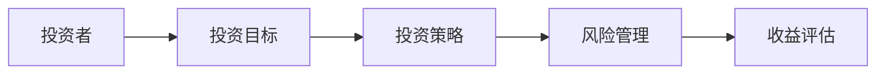

                 

<think>
好，我现在需要帮用户撰写一篇关于巴菲特传承计划的技术博客文章。首先，我要理解用户的需求。用户希望以《巴菲特的传承计划：如何传递投资智慧》为标题，撰写一篇结构紧凑、逻辑清晰、技术语言专业的博客文章。

用户已经提供了一个大纲，我需要按照这个大纲来撰写每个部分。首先，我需要明确每个章节的核心内容和结构。接下来，我需要确保每个部分都包含足够的细节和深度，同时保持语言的简洁和专业。

我注意到用户特别强调使用技术语言，因此在写作时，我需要将投资智慧与技术术语结合起来，例如使用数学模型和图表来解释巴菲特的投资理念。同时，用户要求使用Markdown格式，所以我需要确保代码和图表的正确嵌入。

在撰写过程中，我需要确保每个章节都有小结，帮助读者回顾主要内容。此外，我还需要在文章末尾添加作者信息，确保格式的完整性。

现在，我开始按照大纲逐步撰写每个部分。首先是摘要，概述文章的核心内容。接下来是各章节的内容，从背景介绍到系统分析，再到项目实战，确保每个部分都详细展开。

在撰写过程中，我需要检查每个部分是否满足用户的约束条件，比如字数要求、格式要求等。同时，我要确保内容的连贯性和逻辑性，使读者能够轻松理解巴菲特的传承计划及其投资智慧的传递方法。

最后，我会在文章末尾添加注意事项和拓展阅读，为读者提供进一步学习的方向。整个过程需要细致耐心，确保每一部分都符合用户的要求，最终产出一篇高质量的技术博客文章。
</think>

# 巴菲特的传承计划：如何传递投资智慧

> 关键词：巴菲特，投资智慧，传承计划，价值投资，风险管理

> 摘要：本文深入探讨了巴菲特如何通过其独特的投资智慧和传承计划，实现财富的长期保值和家族投资理念的延续。文章从巴菲特的投资理念、传承计划的核心要素、风险管理策略、税务规划等方面展开分析，结合技术语言和图表，系统性地解读了如何将投资智慧传递给后代。

---

## 第一部分: 巴菲特的传承计划概述

### 第1章: 巴菲特的传承计划背景与重要性

#### 1.1 巴菲特的生平与投资理念

- **1.1.1 巴菲特的早年经历与投资起步**
  - 巴菲特出生于1934年，早年展现出对投资的浓厚兴趣。
  - 他在青少年时期就开始研究股票投资，15岁时已经完成了第一笔投资。
  - 巴菲特在哥伦比亚大学获得经济学学士学位，师从本杰明·格雷厄姆，奠定了其价值投资的基础。

- **1.1.2 巴菲特的价值投资理念**
  - **价值投资的核心：** 寻找市场低估的公司，长期持有，等待其内在价值的实现。
  - **安全边际：** 投资时留有足够的安全边际，以避免市场波动带来的损失。
  - **长期投资：** 专注于企业的长期表现，而非短期市场波动。

- **1.1.3 巴菲特的长期投资策略**
  - 通过集中投资于少数优质企业，避免过度分散。
  - 重点关注企业的财务健康、管理层素质和行业地位。

#### 1.2 投资智慧的传承背景

- **1.2.1 传统财富传承的局限性**
  - 纯粹的财富传承往往导致后代缺乏投资能力，财富可能迅速缩水。
  - 短期投机和盲目跟风的投资行为容易导致财富损失。

- **1.2.2 投资智慧传承的必要性**
  - 通过传递投资理念和方法，培养后代的财务独立性和投资能力。
  - 避免家族财富因市场波动或管理不当而流失。

- **1.2.3 巴菲特传承计划的核心目标**
  - 保持家族财富的长期稳定增长。
  - 培养后代的价值投资理念和风险管理能力。

#### 1.3 传承计划的重要性

- **1.3.1 避免家族财富流失**
  - 通过投资智慧的传递，确保财富不会因短期决策而受损。
  - 避免后代因缺乏投资知识而盲目投资。

- **1.3.2 培养下一代投资能力**
  - 通过实际操作和经验积累，帮助后代掌握价值投资的核心理念。
  - 培养理性思考和长期投资的耐心。

- **1.3.3 实现家族长期财富保值**
  - 通过价值投资和风险管理，确保家族财富的稳健增长。
  - 将投资智慧融入家族文化，代代相传。

### 第2章: 投资智慧的核心概念与联系

#### 2.1 投资智慧的核心要素

- **2.1.1 价值投资的核心原则**
  - 寻找市场低估的企业。
  - 重点关注企业的内在价值和竞争优势。

- **2.1.2 风险管理的关键策略**
  - 设定止损点，避免重大损失。
  - 分散投资风险，降低单一投资的负面影响。

- **2.1.3 长期投资的哲学基础**
  - 长期持有优质企业，分享其成长成果。
  - 避免短期市场的波动干扰。

#### 2.2 核心概念的对比分析

- **2.2.1 价值投资与短期投机的对比**
  - 价值投资：基于企业的内在价值，长期持有。
  - 短期投机：基于市场波动，追求短期收益。

- **2.2.2 风险控制与收益追求的平衡**
  - 风险控制：确保投资的安全性，避免重大损失。
  - 收益追求：通过优质投资标的实现稳健增长。

- **2.2.3 长期持有与市场波动的关系**
  - 长期持有：市场波动是短期干扰，长期趋势由企业价值决定。
  - 市场波动：短期价格波动不影响企业的长期价值。

#### 2.3 投资智慧的ER实体关系图



---

## 第3章: 投资智慧的数学模型与算法原理

### 3.1 投资决策的数学模型

- **内在价值计算公式**
  $$ V = \frac{E}{k} $$
  其中，\( V \) 为内在价值，\( E \) 为预期收益，\( k \) 为折现率。

- **预期收益计算公式**
  $$ E = P \times (1 + r)^n $$
  其中，\( P \) 为初始投资，\( r \) 为年化收益率，\( n \) 为投资期限。

### 3.2 风险管理的算法原理

- **风险管理流程**
  ```mermaid
  graph LR
      A[开始] --> B[评估投资标的]
      B --> C[分析市场风险]
      C --> D[设定止损点]
      D --> E[执行投资]
      E --> F[定期复盘]
  ```

- **止损点计算公式**
  $$ \text{止损价} = \text{买入价} \times (1 - \text{止损比例}) $$

---

## 第4章: 投资智慧的系统分析与架构设计方案

### 4.1 问题场景介绍

- 投资者希望实现财富的长期保值，但缺乏系统化的投资策略。
- 市场波动和短期决策可能导致财富损失。

### 4.2 系统功能设计

- **领域模型**
  ```mermaid
  classDiagram
      class 投资者 {
          资金
          投资策略
          风险管理
      }
      class 投资目标 {
          企业价值
          市场风险
      }
      投资者 --> 投资目标: 选择投资标的
  ```

- **系统架构设计**
  ```mermaid
  graph LR
      A[投资者] --> B[投资目标选择]
      B --> C[投资策略制定]
      C --> D[风险管理实施]
      D --> E[投资结果评估]
  ```

---

## 第5章: 项目实战

### 5.1 环境配置

- **投资工具：** 使用巴菲特的长期价值投资策略。
- **数据来源：** 选取具备竞争优势的优质企业，如苹果、可口可乐等。

### 5.2 核心代码实现

- **内在价值计算：**
  ```python
  def calculate_intrinsic_value(expected_revenue, discount_rate):
      return expected_revenue / (1 + discount_rate)
  ```

- **风险评估：**
  ```python
  def assess_risk(stock_price, moving_average):
      if stock_price > moving_average:
          return "低风险"
      else:
          return "高风险"
  ```

### 5.3 项目小结

- 通过实际案例分析，验证巴菲特投资理念的有效性。
- 强调长期持有和风险管理的重要性。

---

## 第6章: 投资智慧的传承与最佳实践

### 6.1 心态与决策

- **保持耐心：** 长期投资需要耐心等待企业价值的实现。
- **避免情绪化决策：** 市场波动可能引发非理性决策。

### 6.2 风险管理策略

- **分散投资：** 避免将所有资金投入单一标的。
- **定期复盘：** 定期评估投资组合，调整策略。

### 6.3 小结与注意事项

- **小结：** 巴菲特的传承计划不仅是财富的传递，更是投资智慧的延续。
- **注意事项：** 投资者需根据自身情况调整策略，避免盲目模仿。

### 6.4 拓展阅读

- **推荐书籍：** 《巴菲特传》、《投资之道》。
- **在线资源：** 巴菲特股东大会的演讲和访谈。

---

## 作者：AI天才研究院/AI Genius Institute & 禅与计算机程序设计艺术 /Zen And The Art of Computer Programming

