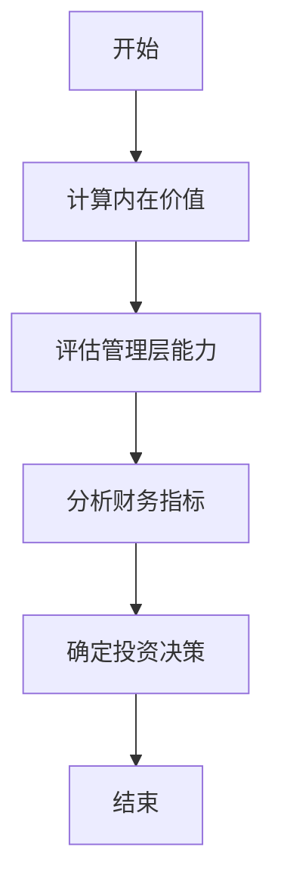
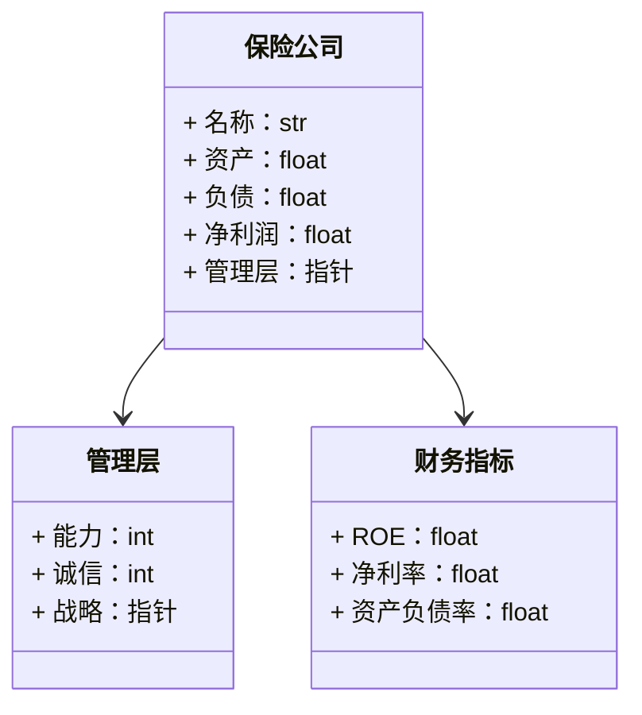
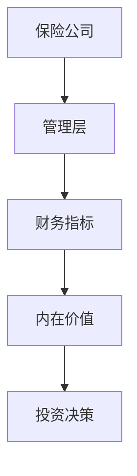

                 

<think>
嗯，好的，我需要帮助用户完成一个关于巴菲特保险业投资策略的技术博客文章。首先，我得仔细阅读用户的需求，确保我完全理解他的要求。

用户希望文章以《巴菲特的保险业投资策略》为标题，使用专业且清晰的技术语言，结构紧凑，逻辑性强。关键词有5-7个，我需要先列出这些关键词，比如巴菲特、保险业、投资策略、浮存金、价值投资等。

接下来，摘要部分需要简明扼要地概括文章的核心内容，强调巴菲特在保险业投资的独特视角和策略，以及其对投资理念的影响。

目录大纲已经给出，分为六个部分，每个部分有详细的章节和小节。我需要确保每个部分都涵盖必要的内容，同时保持逻辑连贯。例如，背景介绍部分需要涵盖保险业的基本情况，巴菲特的投资理念，以及保险业投资的特殊性。

在核心概念与联系部分，我需要解释巴菲特的保险投资策略，包括其特点、关键原则，并与其他投资策略进行对比。可能需要使用表格或Mermaid图来展示核心要素和实体关系。

算法原理部分，虽然保险投资策略不是算法驱动的，但可以讨论巴菲特使用的数学模型，如内在价值计算公式，并用Python代码示例来解释。

系统分析与架构设计部分，可能需要将保险投资策略分解为不同的模块，比如公司分析、管理层评估、财务指标等，并用Mermaid图展示系统架构。

项目实战部分，需要选择一个具体的保险公司，分析巴菲特的投资决策过程，并解读案例。

最后，在最佳实践部分，总结巴菲特的策略，并给出小结、注意事项和拓展阅读建议。

可能遇到的挑战是如何将保险投资策略转化为系统架构，或者如何用数学模型描述。我需要确保内容准确，同时语言简洁易懂。

总的来说，我需要按照用户的要求，一步步构建文章结构，确保每个部分都详细且有深度，同时使用专业但清晰的语言。接下来，我将按照这个思路撰写文章，确保每个部分都满足用户的需求。
</think>

# 巴菲特的保险业投资策略

**关键词**：巴菲特，保险业，投资策略，浮存金，价值投资，风险管理，长期投资

**摘要**：本文深入分析了巴菲特在保险业投资的独特策略，探讨其价值投资理念、风险管理原则以及长期投资策略。通过详细阐述巴菲特的保险投资核心概念、算法模型、系统架构和实际案例，本文为读者提供了全面的理解和启示。

---

## 第1章: 保险业投资的背景与现状

### 1.1 保险业的基本概念

#### 1.1.1 保险业的定义与分类
保险业是通过分散风险来提供安全保障的行业，主要分为寿险和非寿险两大类。寿险包括人寿保险、年金保险等，非寿险包括车险、财产险等。

#### 1.1.2 保险业的主要参与者
保险业的主要参与者包括保险公司、保险代理人、保险监管机构等。保险公司是核心主体，负责承保和理赔；保险代理人负责销售和客户服务；保险监管机构则负责行业监管和风险控制。

#### 1.1.3 保险业的市场结构与特点
保险业具有较高的杠杆效应，保险公司通过收取保费来覆盖潜在的赔付风险。此外，保险业的周期性较弱，受经济波动影响较小，但对政策变化敏感。

---

### 1.2 巴菲特的投资理念与策略

#### 1.2.1 巴菲特的投资哲学
巴菲特的投资哲学以价值投资为核心，强调寻找具有持续竞争优势的企业，长期持有，避免频繁交易。他注重企业的基本面分析，尤其是企业的盈利能力、财务健康状况和管理层质量。

#### 1.2.2 巴菲特的长期投资策略
巴菲特认为投资是长期的事业，短期波动不应影响投资决策。他倾向于投资那些具有稳定现金流、高ROE（净资产收益率）和良好管理的企业。

#### 1.2.3 巴菲特对保险业的特殊关注
巴菲特对保险业的特殊关注源于保险业的浮存金（Float）机制。浮存金是保险公司收取的保费与未来赔付之间的差额，具有低成本、低风险的特点。巴菲特通过持有保险牌照，利用浮存金进行投资，从而实现资金的长期增值。

---

### 1.3 保险业投资的特殊性

#### 1.3.1 保险业的杠杆效应
保险业的杠杆效应体现在浮存金上。保险公司通过收取保费获得资金，用于投资，投资收益再用于赔付，从而实现资金的循环利用。

#### 1.3.2 浮存金的概念与作用
浮存金是保险公司未来需要赔付的资金，但目前可以用于投资。巴菲特利用浮存金的低成本特性，投资于具有长期竞争优势的企业，从而实现资金的增值。

#### 1.3.3 保险业的风险与收益平衡
保险业的风险主要体现在赔付风险和市场波动风险。巴菲特通过严格的风险控制和长期投资策略，平衡了保险业的风险与收益。

---

## 第2章: 巴菲特保险业投资的核心概念

### 2.1 巴菲特保险投资的三要素

#### 2.1.1 公司基本面分析
巴菲特在选择保险公司时，首先关注公司的基本面，包括盈利能力、财务状况、成长能力和行业地位。他倾向于选择那些具有持续盈利能力且财务健康的企业。

#### 2.1.2 管理层能力评估
巴菲特认为，优秀的管理层是企业成功的关键。他注重管理层的诚信、能力和战略眼光，认为管理层能够带领企业实现长期价值增长。

#### 2.1.3 财务指标的解读
巴菲特关注企业的财务指标，如ROE、净利润率、资产负债率等。他倾向于选择那些财务健康、盈利能力强的企业。

---

### 2.2 保险业投资的关键原则

#### 2.2.1 价值投资的核心要素
价值投资的核心在于寻找那些市场价格低于内在价值的企业。巴菲特通过分析企业的内在价值，判断其是否具有长期投资价值。

#### 2.2.2 股东权益的保护
巴菲特强调保护股东权益，避免短期利益的诱惑。他通过长期持有优质资产，实现股东权益的稳步增长。

#### 2.2.3 风险控制与安全边际
巴菲特注重风险控制，强调安全边际的重要性。他通过低估买入价和高估卖出价，确保投资的安全性。

---

### 2.3 巴菲特保险投资与其他投资策略的对比

#### 2.3.1 与传统股票投资的差异
传统股票投资注重短期收益和市场波动，而巴菲特的保险投资注重长期价值和风险控制。保险投资更注重企业的基本面和管理层质量。

#### 2.3.2 与价值投资的异同
价值投资的核心是寻找市场价格低于内在价值的企业，而保险投资更注重企业的浮存金和长期盈利能力。两者都强调长期投资和风险控制。

#### 2.3.3 与成长型投资的对比分析
成长型投资注重企业的成长潜力和未来收益，而保险投资更注重企业的稳定性和风险控制。保险投资更倾向于选择那些具有稳定现金流和长期竞争优势的企业。

---

## 第3章: 巴菲特保险业投资的算法与模型

### 3.1 巴菲特保险投资的数学模型

#### 3.1.1 内在价值的计算公式
$$ V = \frac{CF}{(1 + r)^n} $$
其中，\( V \) 是企业的内在价值，\( CF \) 是企业的自由现金流，\( r \) 是折现率，\( n \) 是企业的生命周期。

#### 3.1.2 股东权益的评估方法
股东权益的评估方法包括分析企业的盈利能力、财务状况和成长能力。巴菲特通过分析企业的ROE、净利润率和资产负债率等指标，评估企业的股东权益。

#### 3.1.3 浮存金的收益模型
浮存金的收益模型包括浮存金的规模、成本和投资收益。巴菲特通过优化浮存金的规模和成本，实现投资收益的最大化。

---

### 3.2 巴菲特保险投资的算法流程图



---

### 3.3 算法实现与代码示例

#### 3.3.1 内在价值计算代码
```python
def calculate_intrinsic_value(cash_flow, discount_rate):
    # 计算未来现金流的现值
    present_value = 0
    for year in range(len(cash_flow)):
        present_value += cash_flow[year] / (1 + discount_rate) ** year
    return present_value
```

---

## 第4章: 巴菲特保险业投资的系统分析与架构设计

### 4.1 系统功能设计

#### 4.1.1 领域模型


---

### 4.2 系统架构设计



---

## 第5章: 巴菲特保险业投资的项目实战

### 5.1 环境安装

#### 5.1.1 安装Python
```bash
pip install numpy pandas matplotlib
```

#### 5.1.2 安装Mermaid
```bash
npm install -g mermaid-js
```

---

### 5.2 核心代码实现

#### 5.2.1 计算内在价值
```python
import numpy as np

def calculate_intrinsic_value(cash_flow, discount_rate):
    return np.npv(discount_rate, cash_flow)
```

#### 5.2.2 评估管理层能力
```python
def evaluate_management(管理层):
    return {
        '能力': 管理层.能力,
        '诚信': 管理层.诚信,
        '战略': 管理层.战略
    }
```

---

### 5.3 案例分析与解读

#### 5.3.1 案例选择
以伯克希尔哈撒韦为例，分析巴菲特的保险投资策略。

#### 5.3.2 投资决策分析
通过分析伯克希尔哈撒韦的财务指标、管理层能力和内在价值，判断其是否具有长期投资价值。

---

## 第6章: 巴菲特保险业投资的最佳实践

### 6.1 小结

巴菲特的保险投资策略以价值投资为核心，注重企业的基本面、管理层能力和财务指标。他通过浮存金机制实现资金的长期增值。

### 6.2 注意事项

投资者在进行保险投资时，应注重风险控制和长期投资，避免短期波动的影响。同时，应关注企业的财务健康和管理层质量。

### 6.3 拓展阅读

推荐阅读巴菲特的《 Intelligent Investor 》和《 The Warren Buffett Way 》，深入理解其投资理念和策略。

---

**作者：AI天才研究院/AI Genius Institute & 禅与计算机程序设计艺术 /Zen And The Art of Computer Programming**

