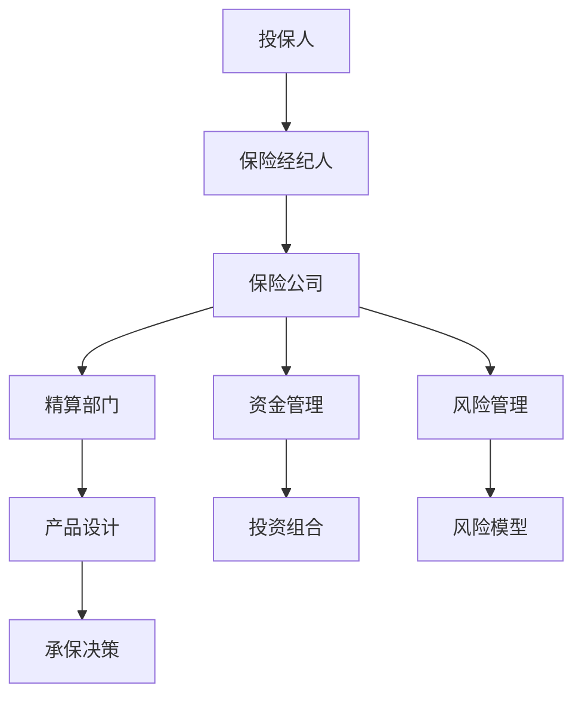
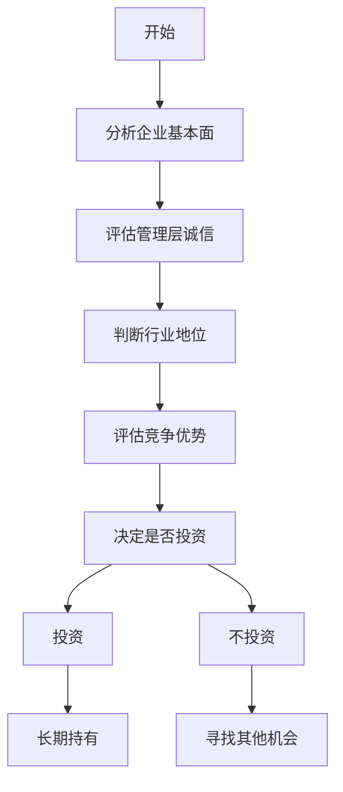
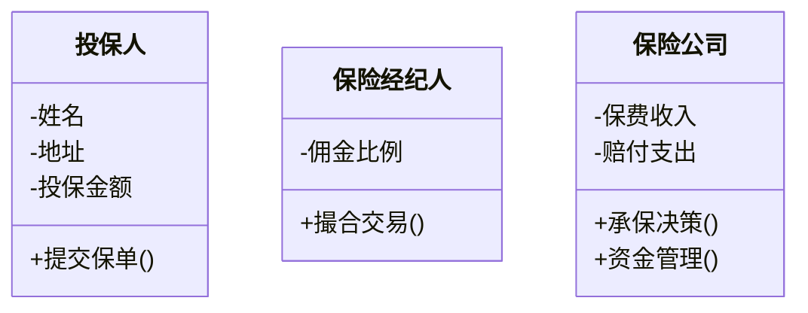
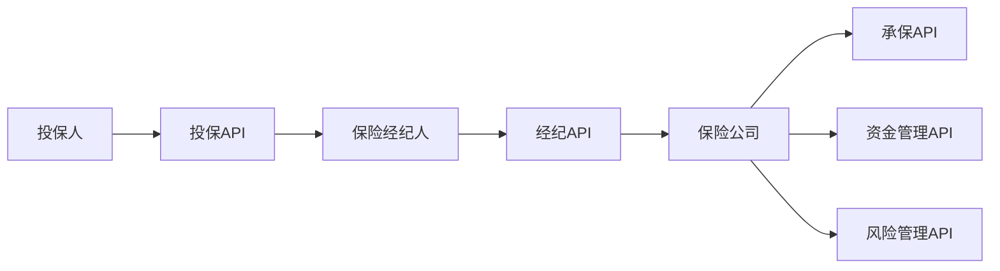

                 


# 巴菲特的保险业投资：在气候变化背景下的新考量

> 关键词：巴菲特，保险业投资，气候变化，风险管理，价值投资

> 摘要：本文深入分析了巴菲特在保险业的投资策略，特别是在气候变化对保险业带来新风险和机会的背景下，探讨了保险业的风险管理、投资策略以及气候变化对保险公司的财务稳定性的影响。文章从保险业的基本原理、巴菲特的投资理念、气候变化的影响、风险评估模型、系统架构设计、项目实战以及最佳实践等多个方面进行了详细阐述，为读者提供了全面的视角来理解巴菲特在保险业投资中的独特见解。

---

## 目录

1. **背景与概述**
   - 1.1 巴菲特的投资理念与保险业
   - 1.2 保险业的基本原理
   - 1.3 气候变化对保险业的影响

2. **核心概念与联系**
   - 2.1 保险公司的业务流程图
   - 2.2 巴菲特投资策略的决策树

3. **算法原理**
   - 3.1 风险评估模型的原理与应用
   - 3.2 资产配置模型的数学推导

4. **系统分析与架构设计**
   - 4.1 领域模型类图
   - 4.2 系统架构图

5. **项目实战**
   - 5.1 模拟投资案例
   - 5.2 代码实现与解读

6. **最佳实践与总结**
   - 6.1 小结
   - 6.2 注意事项
   - 6.3 拓展阅读

---

## 第一部分: 背景与概述

### 第1章: 巴菲特的投资理念与保险业

#### 1.1 巴菲特的投资哲学
##### 1.1.1 价值投资的核心理念
巴菲特的价值投资理念强调寻找具有持续竞争优势的公司，并以合理的价格进行投资。他注重企业的基本面分析，包括盈利能力、财务健康状况和管理团队的诚信。

##### 1.1.2 巴菲特对保险业的特殊关注
保险业是巴菲特投资组合中的重要组成部分。他通过旗下的伯克希尔哈撒韦公司，持有多家保险公司，如GEICO和Duckingham。保险业的长期稳定性和较高的净资产收益率吸引了巴菲特。

##### 1.1.3 保险业的长期投资价值
保险业通过收取保费和管理保险资金，能够在较长的时间内实现资产的增值。巴菲特认为，优秀的保险公司能够在市场波动中保持稳定，并通过长期投资获得超额收益。

#### 1.2 保险业的基本原理
##### 1.2.1 保险的定义与分类
保险是一种风险管理工具，通过转移风险来保护个人或企业免受潜在损失。保险可以分为人寿保险、财产保险、责任保险等。

##### 1.2.2 保险的三大基本原则
- **风险分散**：通过承保大量风险不同的保单来分散风险。
- **大数法则**：基于统计学原理，预测损失的概率和规模。
- **保费收取**：根据风险程度收取保费，确保保险公司有足够的资金赔付。

##### 1.2.3 保险市场的构成与运作
保险市场由保险公司、保险经纪人、投保人和监管机构组成。保险公司通过设计和销售保险产品，收取保费，并将部分资金用于投资，以实现资金的保值增值。

#### 1.3 气候变化对保险业的影响
##### 1.3.1 气候变化带来的风险
气候变化导致极端天气事件（如洪水、飓风、干旱）的频率和强度增加，保险公司面临更高的赔付压力。此外，气候变化可能影响保险公司的投资组合，如房地产和基础设施的价值可能下降。

##### 1.3.2 气候变化带来的机会
尽管气候变化带来了风险，但也为保险公司提供了新的机会。例如，开发绿色保险产品（如可再生能源项目保险）和投资于环保技术。

---

## 第二部分: 核心概念与联系

### 第2章: 核心概念与联系

#### 2.1 保险公司的业务流程图


#### 2.2 巴菲特投资策略的决策树


---

## 第三部分: 算法原理

### 第3章: 算法原理

#### 3.1 风险评估模型的原理与应用
风险评估模型用于预测保险公司的赔付风险。常用的模型包括VaR（Value at Risk）和CVaR（Conditional Value at Risk）。

##### VaR模型
VaR模型用于估计在一定置信水平下，资产组合的最大潜在损失。例如，95%置信水平的VaR意味着在95%的概率下，损失不会超过该值。

数学公式：
$$ \text{VaR} = \mu + z \cdot \sigma $$
其中，$\mu$ 是平均值，$z$ 是标准正态分布的分位数，$\sigma$ 是标准差。

##### 应用示例
假设某保险公司管理的资产组合价值为1000万美元，平均回报率为5%，标准差为15%。在95%的置信水平下，z值为1.645。

$$ \text{VaR} = 0.05 + 1.645 \cdot 0.15 = 0.24675 \text{亿美元} $$

---

## 第四部分: 系统分析与架构设计

### 第4章: 系统分析与架构设计

#### 4.1 领域模型类图


#### 4.2 系统架构图


---

## 第五部分: 项目实战

### 第5章: 项目实战

#### 5.1 模拟投资案例
假设某保险公司面临气候变化带来的风险，我们需要调整其投资策略。以下是具体步骤：

1. **数据收集**：收集过去10年的气候变化数据和保险赔付记录。
2. **风险评估**：使用VaR模型评估极端天气事件对赔付的影响。
3. **投资组合调整**：将部分资金投资于环保技术，降低风险并实现可持续发展。

#### 5.2 代码实现与解读
以下是Python代码示例，用于计算VaR：

```python
import numpy as np
import pandas as pd

# 数据准备
returns = np.random.normal(0.05, 0.15, 10000)

# 计算VaR
sorted_returns = np.sort(returns)
alpha = 0.05  # 95%置信水平
z_score = norm.ppf(1 - alpha)
var = np.mean(sorted_returns) + z_score * np.std(sorted_returns)

print(f"VaR at {alpha} significance level: {var}")
```

代码解释：
- 数据准备：生成10000个模拟回报率。
- 计算VaR：使用正态分布的分位数来估计VaR。
- 输出结果：显示在95%置信水平下的VaR值。

---

## 第六部分: 最佳实践与总结

### 第6章: 最佳实践与总结

#### 6.1 小结
本文从多个角度分析了巴菲特在保险业的投资策略，特别是在气候变化背景下的新考量。通过结合保险业的基本原理、巴菲特的投资理念、风险评估模型和系统架构设计，我们能够更好地理解保险业的投资机会和挑战。

#### 6.2 注意事项
- 投资保险业需要综合考虑财务状况、行业风险和气候变化因素。
- 在气候变化下，保险公司应积极开发绿色保险产品，优化投资组合。

#### 6.3 拓展阅读
- 《The Intelligent Investor》 by Benjamin Graham
- 《气候变化经济学》 by Nicholas Stern

---

## 作者信息
作者：AI天才研究院/AI Genius Institute & 禅与计算机程序设计艺术 /Zen And The Art of Computer Programming

