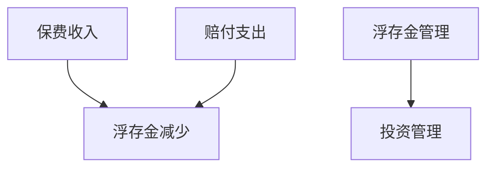
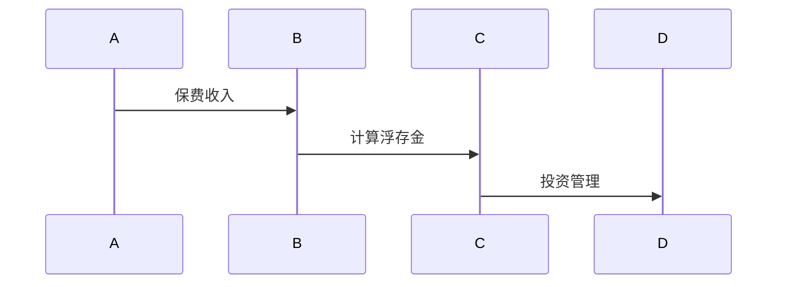

                 

<think>
嗯，用户想要我以《巴菲特的保险浮存金策略：利用他人的钱投资》为标题写一篇技术博客，但其实主题是投资策略，而不是纯技术。这可能有点矛盾，但我会尽力按照要求来写。

首先，我需要理解保险浮存金是什么。它是指保险公司为了赔付而预留的资金，这部分资金可以用于投资，从而为公司创造收益。巴菲特通过他的保险公司，利用这些浮存金进行长期投资，从而获得额外的利润。

接下来，我需要分析巴菲特的策略。他如何利用这些资金？他主要投资于优质企业，坚持价值投资，长期持有。这部分可以作为文章的核心内容。

然后，我需要考虑如何将这些内容转化为技术博客的语言。虽然主题是投资，但用户要求使用技术术语和结构，所以我可能需要将投资策略类比于软件架构或系统设计，用类似的技术术语来描述。

我还需要按照用户提供的大纲结构来组织内容，确保每章有吸引人的标题，逐步分析推理。同时，使用mermaid图表来辅助说明，比如画出保险公司的系统架构图或流程图。

在写作过程中，我可能会遇到如何将投资策略与技术分析结合起来的问题。例如，如何用系统架构图来表示巴菲特的投资策略？或者如何用算法模型来解释他的价值投资方法？

此外，我需要确保文章内容丰富，每个部分都有详细的讲解，包括背景介绍、核心概念、数学模型、系统分析、项目实战等。这可能需要我深入研究巴菲特的投资策略，并将其转化为技术性的分析。

最后，我需要在文章末尾加上作者信息，确保格式正确，并检查整体字数是否在要求范围内。同时，确保所有内容都符合逻辑，结构清晰，语言简洁明了。

总的来说，我需要将巴菲特的保险浮存金策略拆解成技术博客的结构，用类似软件架构的方法来分析，确保内容既专业又易懂。
</think>

# 巴菲特的保险浮存金策略：利用他人的钱投资

## 关键词：巴菲特，保险浮存金，投资策略，价值投资，长期投资

## 摘要：本文深入分析了巴菲特的保险浮存金策略，探讨了其如何利用保险公司的浮存金进行投资，实现财富增长。文章从保险浮存金的基本概念、巴菲特的投资理念、数学模型与算法、系统架构设计、项目实战等方面展开，详细解读了这一策略的运作机制、优势与风险。通过实际案例分析和最佳实践总结，本文为读者提供了全面理解巴菲特保险浮存金策略的视角。

---

# 第一部分: 巴菲特的保险浮存金策略概述

## 第1章: 保险浮存金的基本概念

### 1.1 保险浮存金的定义

#### 1.1.1 保险浮存金的定义与特点

保险浮存金（Insurance Float）是保险公司为了履行未来赔付责任而预留的资金，具有以下特点：
- **暂时性**：浮存金是暂时闲置的资金，保险公司需在未来赔付时返还。
- **低成本**：浮存金的成本较低，甚至可能为负（如保费收入超过赔付支出）。
- **可投资性**：浮存金可以用于投资，为公司创造额外收益。

#### 1.1.2 保险浮存金的来源与分类

浮存金主要来源于保险公司的保费收入，具体分类如下：
- **趸缴保费**：客户一次性缴纳的保费。
- **期缴保费**：客户分期缴纳的保费。
- **再保险保费**：保险公司接受其他保险公司转分保的保费。

#### 1.1.3 保险浮存金与传统保险资金的区别

保险浮存金与传统保险资金的主要区别在于：
- **资金用途**：浮存金主要用于投资，而传统保险资金主要用于赔付准备。
- **风险偏好**：浮存金的投资风险较高，而传统保险资金更注重安全性。
- **收益目标**：浮存金追求长期投资收益，而传统保险资金更注重保值。

### 1.2 巴菲特与保险浮存金的关系

#### 1.2.1 巴菲特的生平与投资理念

沃伦·巴菲特（Warren Buffett）是全球著名投资者，其投资理念以价值投资为核心，强调购买优质资产并长期持有。

#### 1.2.2 巴菲特如何利用保险浮存金进行投资

巴菲特通过旗下的保险公司（如GEICO）获取浮存金，并将其用于投资优质企业，尤其是那些具有持续竞争优势和良好治理结构的企业。

#### 1.2.3 保险浮存金在伯克希尔哈撒韦的角色

作为伯克希尔哈撒韦的董事长，巴菲特利用浮存金构建了一个庞大的投资组合，包括股票、债券、子公司股权等，为公司创造了巨额收益。

### 1.3 保险浮存金的运作机制

#### 1.3.1 保险浮存金的形成过程

浮存金的形成过程包括：
1. **保费收入**：客户缴纳保费，形成公司收入。
2. **赔付支出**：公司根据保单条款支付赔款。
3. **浮存金积累**：保费收入与赔付支出的差额即为浮存金。

#### 1.3.2 保险浮存金的管理与运用

浮存金的管理包括：
- **资金池管理**：将浮存金集中管理，用于投资。
- **投资策略**：选择优质资产进行长期投资，追求超额收益。
- **风险管理**：控制投资风险，确保浮存金的安全性。

#### 1.3.3 保险浮存金的风险与收益平衡

浮存金的风险与收益平衡：
- **收益**：通过投资优质资产，浮存金可以实现超额收益。
- **风险**：投资存在市场波动和本金损失的风险，需通过分散投资和严格选股来控制风险。

## 第2章: 巴菲特的投资理念与保险浮存金

### 2.1 巴菲特的价值投资理念

#### 2.1.1 价值投资的核心思想

价值投资强调以低于内在价值的价格买入优质资产，长期持有，等待价格回归。

#### 2.1.2 保险浮存金与价值投资的结合

巴菲特利用浮存金投资具有持续竞争优势的企业，践行价值投资理念。

#### 2.1.3 巴菲特如何选择投资标的

巴菲特选择投资标的的标准：
1. **优秀的管理层**：具有良好的道德和决策能力。
2. **持续的竞争优势**：企业具有独特的竞争优势。
3. **合理的估值**：价格低于内在价值。
4. **稳定的财务状况**：企业具有稳健的财务表现。

### 2.2 巴菲特的长期投资策略

#### 2.2.1 长期投资的优势与挑战

长期投资的优势：
- **复利效应**：长期持有优质资产可以实现财富的指数级增长。
- **忽略短期波动**：长期投资可以避免短期市场的干扰。

挑战：
- **市场波动**：长期投资仍需面对市场的波动和不确定性。
- **机会成本**：需要耐心等待优质资产的投资机会。

#### 2.2.2 保险浮存金在长期投资中的作用

浮存金为巴菲特提供了稳定的资金来源，支持其长期投资策略。

#### 2.2.3 巴菲特如何利用保险浮存金进行长期布局

巴菲特通过浮存金投资于具有长期竞争优势的企业，如苹果、可口可乐等，实现长期收益。

### 2.3 巴菲特的风险管理与保险浮存金

#### 2.3.1 巴菲特的风险管理理念

巴菲特的风险管理理念：
- **分散投资**：通过分散投资降低风险。
- **严格选股**：选择优质企业降低投资风险。
- **长期持有**：避免频繁交易带来的风险。

#### 2.3.2 保险浮存金在风险管理中的应用

浮存金用于投资优质资产，分散投资风险。

#### 2.3.3 巴菲特如何通过保险浮存金分散风险

巴菲特通过投资多样化的企业和资产类别，分散浮存金的投资风险。

---

# 第二部分: 保险浮存金的数学模型与算法原理

## 第3章: 保险浮存金的数学模型

### 3.1 保险浮存金的现金流模型

#### 3.1.1 现金流的基本概念

现金流是企业在一定时期内的现金流入和流出。

#### 3.1.2 保险浮存金的现金流计算公式

$$ \text{浮存金现金流} = \text{保费收入} - \text{赔付支出} $$

#### 3.1.3 现金流的管理与优化

通过优化保费收入和赔付支出，可以最大化浮存金现金流。

### 3.2 保险浮存金的投资收益模型

#### 3.2.1 投资收益的计算公式

$$ \text{投资收益} = \text{资产收益} \times \text{资产规模} $$

#### 3.2.2 资产收益的计算方法

资产收益可以通过股票、债券等资产的历史收益率或预期收益率计算。

---

# 第三部分: 保险浮存金的系统架构与设计

## 第4章: 保险浮存金的系统架构设计

### 4.1 系统功能设计

#### 4.1.1 系统功能模块

- **保费收入模块**：记录和管理保费收入。
- **赔付支出模块**：记录和管理赔付支出。
- **浮存金管理模块**：计算和管理浮存金。
- **投资管理模块**：管理浮存金的投资。

#### 4.1.2 系统功能流程图



### 4.2 系统架构设计

#### 4.2.1 系统架构图


### 4.3 系统接口设计

#### 4.3.1 系统接口设计

- **保费收入接口**：记录保费收入。
- **赔付支出接口**：记录赔付支出。
- **浮存金计算接口**：计算浮存金。
- **投资管理接口**：管理浮存金的投资。

#### 4.3.2 系统交互序列图



---

# 第四部分: 保险浮存金的项目实战

## 第5章: 保险浮存金的项目实战

### 5.1 环境安装

#### 5.1.1 环境要求

- **操作系统**：Windows/Mac/Linux
- **编程语言**：Python
- **开发工具**：PyCharm/VS Code

### 5.2 核心代码实现

#### 5.2.1 现金流计算代码

```python
def calculate_float_cash_flow(premiums, claims):
    return premiums - claims
```

#### 5.2.2 投资收益计算代码

```python
def calculate_investment_return(asset_return, asset_size):
    return asset_return * asset_size
```

### 5.3 案例分析与解读

#### 5.3.1 案例分析

假设某保险公司保费收入为1000万元，赔付支出为800万元，则浮存金为200万元。将这200万元投资于年收益率为5%的资产，投资收益为10万元。

#### 5.3.2 代码实现与解读

- **现金流计算**：计算浮存金。
- **投资收益计算**：计算投资收益。

### 5.4 项目小结

通过实际案例分析，我们可以看到浮存金在投资中的重要性，以及如何通过数学模型和系统设计实现浮存金的管理与投资。

---

# 第五部分: 保险浮存金的最佳实践与小结

## 第6章: 最佳实践与小结

### 6.1 最佳实践

- **风险管理**：分散投资，严格选股。
- **长期投资**：耐心持有优质资产。
- **系统管理**：通过系统化管理优化浮存金的投资。

### 6.2 小结

保险浮存金是巴菲特投资策略的重要组成部分，通过合理管理和投资，可以实现财富的长期增长。

### 6.3 注意事项

- **市场风险**：投资存在市场波动风险。
- **流动性风险**：浮存金可能面临流动性需求。
- **道德风险**：需确保保险公司的偿付能力。

### 6.4 拓展阅读

- 巴菲特的其他投资策略。
- 保险行业的最新发展。

---

# 作者：AI天才研究院 & 禅与计算机程序设计艺术

---

本文通过系统化的分析，深入探讨了巴菲特的保险浮存金策略，从基本概念到数学模型，再到系统设计和项目实战，为读者提供了全面的理解。希望本文能为投资者和程序员 alike 提供新的视角和启发。

