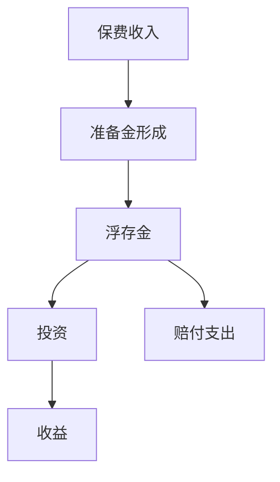
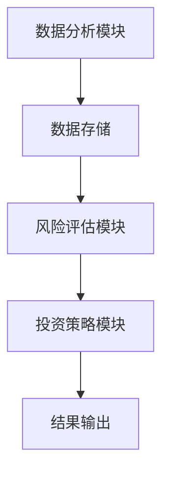

                 


# 巴菲特的保险行业投资逻辑：浮存金的魅力

## 关键词：
- 巴菲特投资逻辑
- 保险行业
- 浮存金
- 保险投资策略
- 财务分析
- 投资回报

## 摘要：
本文深入探讨了巴菲特在保险行业的投资逻辑，重点分析了浮存金这一关键概念。通过背景介绍、核心概念解析、算法原理、系统分析和项目实战等多维度，详细阐述了浮存金在保险投资中的作用及其魅力。结合数学模型和实际案例，展示了如何利用浮存金实现长期稳定的收益，为投资者提供了深刻的见解和实用的策略。

---

## 第一部分：保险行业的背景与巴菲特的投资逻辑

### 第1章：保险行业的基本概念与运作模式

#### 1.1 保险行业的基本概念
保险是一种风险管理工具，通过转移风险来保障个人或企业的财务安全。保险行业主要分为寿险和产险两大类，其运作模式依赖于保费收入和理赔支出的平衡。

- **保险的定义与分类**：
  - **寿险**：长期保障，涉及人寿、年金等产品。
  - **产险**：短期保障，涵盖财产损失、责任险等。
  - 保险公司的核心业务是通过收取保费建立赔偿准备金，用于支付未来的理赔。

- **保险公司的主要业务模式**：
  - **保费收入**：通过销售保险产品获取资金。
  - **投资收益**：利用保费收入进行投资，产生额外收益。
  - **理赔支出**：根据保险合同支付赔偿。

- **保险行业的财务结构与关键指标**：
  - **保费收入**：保险公司收入的主要来源。
  - **准备金**：用于赔付的专项资金，包括未赚取的保费。
  - **投资收益**：保费收入的投资所得，影响公司整体收益。

#### 1.2 巴菲特的投资理念概述
巴菲特是价值投资的代表人物，其投资理念强调长期稳定收益和安全边际。

- **巴菲特的投资哲学**：
  - **价值投资**：寻找被市场低估的优质资产，长期持有，分享企业成长。
  - **安全边际**：在投资中留有足够安全空间，避免重大损失。
  - **股息投资**：通过股息再投资，实现财富的复利增长。

- **巴菲特对保险行业的独特见解**：
  - 保险行业是巴菲特早期投资的重要领域，尤其是那些能够产生大量浮存金的公司。
  - 巴菲特认为，保险公司可以通过低风险投资利用浮存金，创造额外收益。

- **巴菲特投资的成功案例分析**：
  - **喜马拉雅保险**：早期投资，利用浮存金进行长期债券投资，实现稳定收益。
  - **伯克希尔哈撒韦**：通过收购保险公司，获得大量浮存金，用于其他投资。

#### 1.3 浮存金的概念与特点
浮存金是保险公司未使用的赔偿准备金，具有独特的财务属性。

- **浮存金的定义**：
  - 浮存金是保险公司收取的保费与实际赔付之间的差额。
  - 这部分资金可以用于投资，创造额外收益。

- **浮存金的来源与运作机制**：
  - 通过收取保费形成准备金，未用于赔付的部分即为浮存金。
  - 浮存金的规模取决于保费收入与赔付支出的时间差。

- **浮存金在保险行业中的战略意义**：
  - 作为低风险投资资金，保险公司可以利用浮存金投资债券、股票等，提高整体收益。
  - 浮存金的稳定性为保险公司提供了长期稳定的资金来源。

---

## 第二部分：浮存金的核心概念与原理

### 第2章：浮存金的原理与属性分析

#### 2.1 浮存金的形成与运作机制
浮存金的形成基于保险公司的财务结构和业务模式。

- **浮存金的形成机制**：
  - 保费收入：保险公司通过销售保险产品获得保费。
  - 赔付支出：根据保险合同，支付理赔费用。
  - 准备金：未使用的赔付准备金即为浮存金。

- **浮存金的流动性与稳定性分析**：
  - **流动性**：浮存金可以随时用于赔付，具有一定的流动性。
  - **稳定性**：浮存金的规模受保费收入和赔付支出的影响，具有一定的稳定性。

- **浮存金的风险**：
  - **市场风险**：浮存金投资于资本市场可能面临价格波动。
  - **信用风险**：投资债券等资产可能面临违约风险。
  - **流动性风险**：在赔付高峰期，浮存金可能不足以覆盖需求。

#### 2.2 浮存金的属性特征对比
与其他金融工具相比，浮存金具有独特的属性。

- **浮存金与其他金融工具的对比**：
  | 属性       | 浮存金         | 股票         | 债券         |
  |------------|---------------|--------------|--------------|
  | 风险等级   | 中等           | 高           | 中等         |
  | 收益潜力   | 中等           | 高           | 稳定         |
  | 流动性     | 中等           | 低           | 中等         |

- **浮存金的运作流程图**：


---

## 第三部分：浮存金的算法原理与技术实现

### 第3章：浮存金的数学模型与技术实现

#### 3.1 浮存金的数学模型
浮存金的评估涉及现值、风险调整回报等模型。

- **现值模型**：
  $$ PV = \frac{C}{(1 + r)^n} $$
  其中，PV为现值，C为未来现金流，r为贴现率，n为时间。

- **风险调整回报模型**：
  $$ R = R_m + \beta (R_m - R_f) $$
  其中，R为资产回报，R_m为市场回报，R_f为无风险回报，β为贝塔系数。

#### 3.2 浮存金的风险评估与优化
通过蒙特卡洛模拟评估浮存金的风险。

- **蒙特卡洛模拟步骤**：
  1. 确定变量分布（如赔付概率、投资回报率）。
  2. 生成随机样本。
  3. 计算结果。
  4. 统计分析。

- **Python实现示例**：
  ```python
  import numpy as np

  def monte_carlo_simulation(n_simulations):
      returns = np.random.normal(0.05, 0.15, n_simulations)
      return np.mean(returns)

  print(monte_carlo_simulation(10000))
  ```

---

## 第四部分：浮存金的系统分析与架构设计

### 第4章：浮存金的系统分析与架构设计

#### 4.1 系统分析
构建浮存金分析系统，用于评估和优化浮存金的收益。

- **问题场景**：
  - 如何利用浮存金实现最大收益？
  - 如何管理浮存金的投资风险？

- **系统功能设计**：
  - 数据分析模块：收集和处理浮存金数据。
  - 风险评估模块：评估投资风险。
  - 投资策略模块：制定投资策略。

- **系统架构图**：


---

## 第五部分：浮存金的项目实战与案例分析

### 第5章：浮存金的项目实战与案例分析

#### 5.1 环境安装与数据收集
配置数据分析环境，收集相关数据。

- **环境安装**：
  - 安装Python、Pandas、NumPy等工具。

- **数据收集**：
  - 获取保险公司的浮存金数据，包括保费、赔付、投资回报等。

#### 5.2 核心代码实现
编写代码分析浮存金的收益与风险。

- **Python代码示例**：
  ```python
  import pandas as pd

  # 假设df为浮存金数据
  df['return'] = df['投资回报'].pct_change()
  df['volatility'] = df['return'].std()
  ```

#### 5.3 代码应用解读
解释代码逻辑，展示如何应用到实际分析中。

- **案例分析**：
  - 以某保险公司为例，分析其浮存金的投资回报与风险。

---

## 第六部分：浮存金的最佳实践与未来展望

### 第6章：浮存金的最佳实践

#### 6.1 小结
总结浮存金的魅力及其在保险投资中的重要性。

- **小结**：
  - 浮存金是保险公司的核心资源，能够创造额外收益。
  - 合理管理浮存金，可以提升公司的整体盈利能力。

#### 6.2 投资建议
- **分散投资**：将浮存金投资于不同资产，降低风险。
- **长期视角**：关注长期回报，避免短期波动影响决策。
- **风险管理**：建立风险控制机制，确保浮存金的安全性。

#### 6.3 未来展望
- **技术进步**：人工智能和大数据技术将提升浮存金的分析能力。
- **市场变化**：保险行业的竞争加剧，浮存金的管理将更加重要。

---

## 结语
浮存金作为保险行业的独特资源，具有重要的战略意义。通过合理管理和优化，可以为保险公司创造持续稳定的收益。投资者应充分理解浮存金的运作机制，结合技术手段，提升投资效率和收益。

---

## 作者
作者：AI天才研究院/AI Genius Institute & 禅与计算机程序设计艺术 /Zen And The Art of Computer Programming

