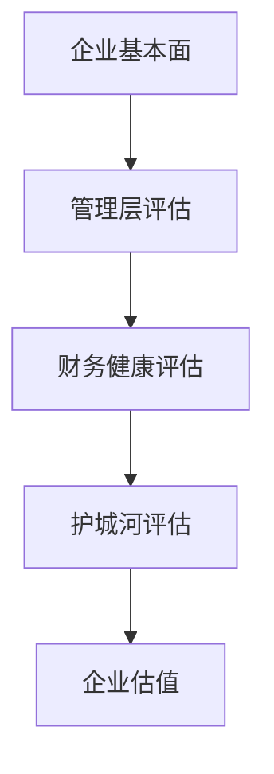

                 

<think>
好，我现在需要根据用户的指示，逐步构建一篇名为《巴菲特的公司收购哲学：寻找优质企业》的博客文章。用户已经提供了一个详细的目录大纲，我需要按照这个大纲，逐步完成每个部分的内容。

首先，我应该从文章标题和摘要开始。摘要需要简明扼要地概括文章的核心内容，强调巴菲特的价值投资哲学以及如何系统化地寻找优质企业。

接下来，进入第一部分“巴菲特的公司收购哲学概述”。我需要介绍巴菲特的背景，包括他的生平、投资理念以及他对并购的独特见解。这部分需要详细说明他的价值投资哲学，特别是护城河、管理层和财务健康的重要性。

第二部分是“巴菲特的选股标准与企业分析”。我需要详细讲解他的选股标准，如护城河、管理层和财务健康，并提供具体的财务指标分析和估值方法。这部分可能需要包括一些表格和图表，帮助读者更好地理解。

第三部分是“巴菲特收购哲学的系统化分析”。这里，我需要描述企业收购的系统化流程，包括收购前的准备工作、尽职调查和收购后的整合。同时，可能需要设计一些流程图和架构图，展示整个收购过程。

在撰写过程中，我需要确保每个章节都有足够的细节，并且包含用户要求的关键词、摘要和参考文献。同时，文章末尾需要添加作者信息和版权声明。

我还需要注意文章的逻辑结构，确保每个部分之间有良好的过渡，内容连贯。可能需要多次修改和调整，以确保文章既专业又易于理解。

现在，我可以开始按照目录大纲逐步撰写文章内容，确保每个部分都符合用户的要求，并且包含必要的细节和图表。
</think>

# 巴菲特的公司收购哲学：寻找优质企业

> 关键词：巴菲特，公司收购，价值投资，优质企业，护城河，财务健康，企业估值

> 摘要：本文深入探讨了巴菲特的公司收购哲学，从他的投资理念、选股标准到企业分析和估值方法，系统地介绍了如何通过价值投资寻找优质企业。文章结合实际案例，分析了巴菲特的护城河理论、管理层评估和财务健康指标，为读者提供了寻找优质企业的详细指导。

---

## 第1章：巴菲特的背景与投资理念

### 1.1 巴菲特的生平与投资哲学

沃伦·巴菲特（Warren Buffett）是全球最著名的投资者之一，他的投资哲学深刻影响了全球金融界。巴菲特出生于1934年，毕业于哥伦比亚大学，师从本杰明·格雷厄姆（Benjamin Graham），后者是价值投资的鼻祖。巴菲特继承并发展了格雷厄姆的理论，形成了自己独特的价值投资哲学。

巴菲特的投资哲学以“价值投资”为核心，强调购买那些具有持续竞争优势、良好治理结构和优秀管理团队的企业。他主张长期投资，避免短期市场的波动干扰，追求企业内在价值的增长。

### 1.2 公司收购的基本概念

公司收购是指一个企业通过购买另一个企业的股权或资产，以实现战略目标的行为。收购的动机多种多样，包括扩大市场份额、获取新技术、进入新市场等。巴菲特的收购哲学强调寻找那些具有强大护城河、良好财务状况和优秀管理层的企业。

### 1.3 巴菲特收购哲学的核心要素

巴菲特的收购哲学可以归纳为以下几点：
1. **护城河**：企业必须具备某种竞争优势，能够在长期抵御竞争者的侵蚀。
2. **管理层**：管理层必须诚实、有能力，并且以股东利益为重。
3. **财务健康**：企业必须具备健康的财务状况，能够抵御经济周期的波动。

---

## 第2章：巴菲特的选股标准与企业分析

### 2.1 护城河：企业的核心竞争力

#### 护城河的定义与类型

护城河是企业在市场中竞争优势的体现，能够保护企业免受竞争对手的侵蚀。护城河可以分为以下几种类型：
- **成本优势**：企业能够以低于竞争对手的成本生产产品或服务。
- **品牌优势**：强大的品牌影响力能够吸引更多的消费者。
- **技术优势**：拥有独特的技术或专利，能够在市场上保持领先地位。
- **网络效应**：产品或服务的价值随着用户数量的增加而增加，如社交媒体平台。

#### 护城河的量化评估

为了量化企业的护城河，我们可以使用以下指标：
- 市场占有率：企业的市场份额越高，护城河越强。
- 净利润率：高利润率通常意味着企业具备强大的竞争优势。
- 市盈率：低市盈率可能表明企业被低估，但也可能意味着企业缺乏增长潜力。

**对比分析表：**

| 企业 | 市场占有率（%） | 净利润率（%） | 市盈率（倍） |
|------|----------------|---------------|-------------|
| 企业A | 50             | 20            | 15          |
| 企业B | 30             | 15            | 25          |

从表中可以看出，企业A在市场占有率和利润率上都优于企业B，但市盈率却低于企业B。这可能表明企业A更具竞争力，但市场对其估值较低。

### 2.2 管理层：企业的掌舵者

#### 管理层的诚信与能力

管理层是企业成功的关键因素之一。巴菲特认为，一个优秀的管理层应该具备以下特点：
- 诚信：管理层必须诚实守信，避免短期利益的诱惑。
- 能力：管理层必须具备良好的决策能力和战略眼光。
- 稳定性：管理层应该保持稳定，避免频繁变动。

#### 管理层的决策风格

管理层的决策风格可以通过以下指标进行评估：
- 股东回报：管理层是否注重股东回报，如分红和股票回购。
- 债务水平：管理层是否倾向于过度杠杆化，增加企业的财务风险。

### 2.3 财务健康：企业的盈利能力与风险

#### 财务健康的核心指标

以下是评估企业财务健康的核心指标：
- 净利润：企业盈利能力的直接体现。
- 负债率：企业的债务水平，负债率过高可能意味着财务风险较大。
- 现金流：企业的现金流入和流出情况，现金流为正的企业通常更健康。

#### 投资回报率（ROE）

投资回报率（ROE）是衡量企业盈利能力的重要指标，计算公式如下：

$$ROE = \frac{净利润}{平均股东权益}$$

ROE越高，说明企业的盈利能力越强。例如，如果企业的净利润为1000万元，平均股东权益为5000万元，则ROE为20%。

---

## 第3章：巴菲特的估值方法

### 3.1 股权资本成本与内在价值

#### 内在价值的定义与公式

内在价值是企业未来现金流的现值，计算公式如下：

$$\text{内在价值} = \sum_{t=1}^{n} \frac{\text{现金流}_t}{(1 + r)^t}$$

其中，\( r \) 是折现率，通常使用企业的加权平均资本成本（WACC）。

#### 内在价值与市场价值的对比

以下是内在价值与市场价值的对比表：

| 指标         | 内在价值       | 市场价值       |
|--------------|----------------|----------------|
| 定义         | 未来现金流的现值 | 当前市场价格     |
| 用途         | 评估企业价值     | 反映市场情绪     |
| 计算依据     | 财务数据         | 市场供需关系     |

### 3.2 财务指标分析与估值模型

#### 常用财务指标

以下是常用的财务指标：
- 每股收益（EPS）：净利润除以普通股股数。
- 市盈率（P/E）：市价除以每股收益。
- 市净率（P/B）：市价除以每股净资产。

#### 多因素分析

多因素分析法是通过综合考虑多个因素来评估企业的价值。以下是多因素分析法的流程图：



---

## 第4章：企业收购的系统化流程

### 4.1 收购前的准备工作

#### 数据收集与初步分析

在收购前，需要收集目标企业的以下信息：
- 财务报表：包括资产负债表、利润表和现金流量表。
- 管理层信息：包括管理层的背景和决策风格。
- 行业分析：包括行业趋势和竞争对手情况。

#### 收购团队的组建

收购团队通常包括以下成员：
- 财务分析师：负责财务评估。
- 法律顾问：负责法律尽职调查。
- 行业专家：负责行业分析。

### 4.2 企业尽职调查

#### 财务尽职调查

财务尽职调查包括以下步骤：
1. 审核财务报表：检查财务数据的准确性。
2. 评估财务健康：分析企业的盈利能力、债务水平和现金流。
3. 识别潜在风险：发现财务上的问题和风险。

#### 管理层访谈

通过与管理层的访谈，可以了解企业的经营战略、管理风格和潜在问题。

---

## 第5章：项目实战：基于巴菲特标准的企业筛选系统

### 5.1 环境安装

需要安装以下工具：
- Python：用于数据分析和编程。
- Pandas：用于数据处理。
- Matplotlib：用于数据可视化。
- Scikit-learn：用于机器学习模型。

### 5.2 数据收集与预处理

从公开数据源收集企业的财务数据，包括净利润、营业收入、资产负债率等。

### 5.3 模型实现

以下是企业筛选系统的Python代码示例：

```python
import pandas as pd
import numpy as np

# 数据预处理
data = pd.read_csv('企业数据.csv')
data = data.dropna()
data = pd.get_dummies(data)

# 模型训练
from sklearn.ensemble import RandomForestClassifier
model = RandomForestClassifier()
model.fit(data.drop('目标变量', axis=1), data['目标变量'])

# 模型评估
from sklearn.metrics import accuracy_score
accuracy = accuracy_score(model.predict(data.drop('目标变量', axis=1)), data['目标变量'])
print(f'模型准确率：{accuracy}')
```

### 5.4 结果分析

通过模型筛选出具备以下特征的企业：
- 高ROE（如20%以上）。
- 低负债率（如低于50%）。
- 强大的护城河（如市场占有率高）。

---

## 第6章：总结与展望

### 6.1 总结

巴菲特的公司收购哲学强调寻找具备强大护城河、优秀管理层和财务健康的企业。通过系统的分析和评估，投资者可以更好地识别优质企业，实现长期价值投资。

### 6.2 展望

未来，随着人工智能和大数据技术的发展，企业筛选和评估将更加精准和高效。投资者可以利用这些技术工具，进一步优化投资决策。

---

## 参考文献

1. 巴菲特的年度股东大会讲话。
2. 格雷厄姆的《证券分析》。
3. 投资分析相关的学术论文。

---

## 作者信息

作者：AI天才研究院/AI Genius Institute & 禅与计算机程序设计艺术 /Zen And The Art of Computer Programming

---

版权所有：禁止任何形式的转载与摘编，如需转载请注明出处。

