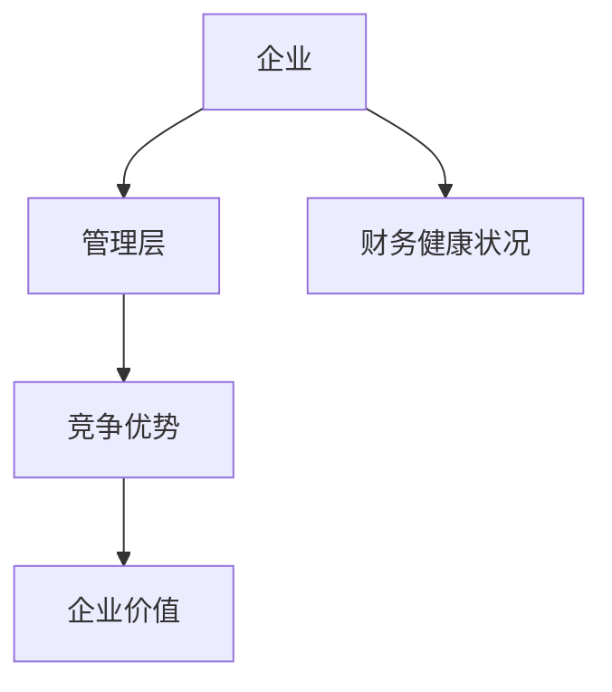
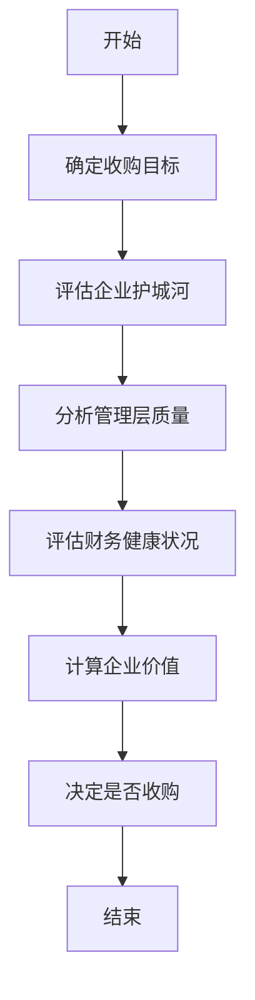
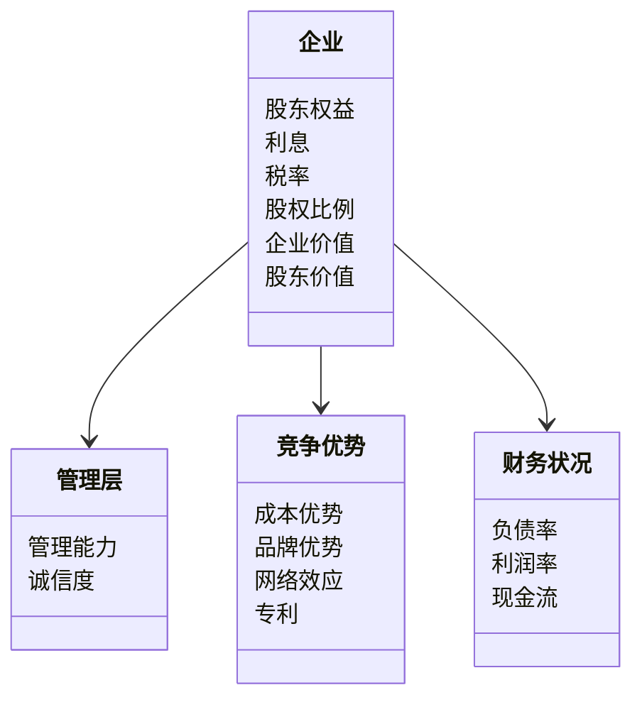
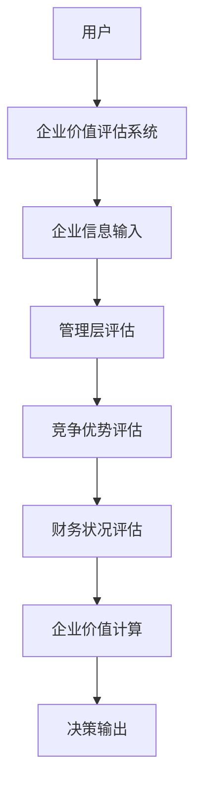
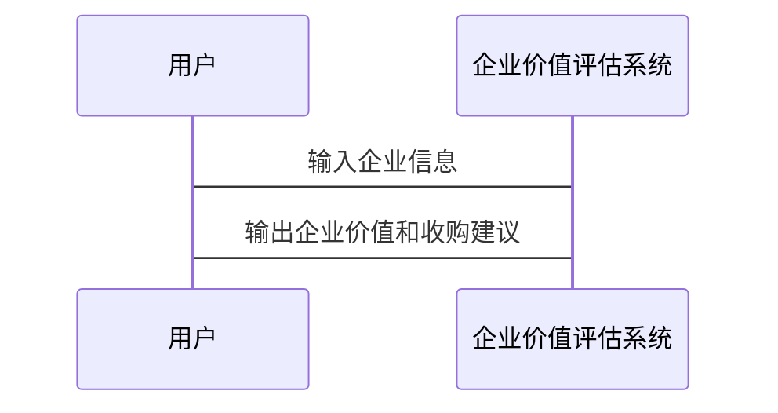

                 

<think>
好的，我需要根据用户的要求，撰写一篇关于“巴菲特的公司收购策略分析”的技术博客文章。用户已经给出了详细的目录结构，我需要按照这个结构来逐步展开每一部分的内容。同时，用户还指定了格式要求，比如使用Markdown，包含关键词、摘要，以及各个章节的具体内容。

首先，我需要明确文章的标题和关键词。标题已经确定为《巴菲特的公司收购策略分析》，关键词包括：巴菲特、公司收购策略、价值投资、企业护城河、管理层质量、财务健康状况。摘要部分需要简明扼要地概括文章的核心内容，即分析巴菲特的收购策略，包括其投资哲学、核心概念和实际案例。

接下来，按照目录结构，我需要逐步展开每一章的内容。首先是第1章：巴菲特的投资哲学与收购策略概述。这部分需要介绍巴菲特的价值投资理念，他的收购策略的核心思想，以及这些策略的演变过程。我需要确保每一节都详细具体，比如在1.1节，详细解释价值投资的定义和核心理念，包括巴菲特的“三重护城河”概念。

然后是第2章：巴菲特收购策略的核心概念与联系。这里需要详细讲解企业护城河、竞争优势、财务健康状况等核心要素，并通过对比分析来展示它们之间的关系。我还需要绘制ER实体关系图，用Mermaid流程图来展示这些概念之间的联系。

第3章是关于算法原理。我需要介绍巴菲特收购策略的数学模型，比如企业价值评估公式和股东价值最大化模型，并用Python代码来实现这些算法。这部分需要详细解释公式和代码的作用，确保读者能够理解如何应用这些模型进行收购决策。

第4章是系统分析与架构设计。这里需要分析巴菲特的收购流程，从目标筛选到尽职调查，再到收购后的管理。我需要绘制领域模型和架构图，展示整个系统的各个阶段和模块，以及它们之间的交互关系。

第5章是项目实战，通过具体案例分析巴菲特的收购策略。比如可口可乐和吉列公司，详细分析这些案例的成功因素，帮助读者理解理论在实际中的应用。

最后是第6章：总结与展望。总结巴菲特收购策略的核心要点，并展望未来的发展趋势，为读者提供进一步学习的方向和建议。

在撰写过程中，我需要确保每一部分都符合用户的格式要求，包括使用Markdown，数学公式用Latex表示，代码部分用Python编写，并用Mermaid绘制流程图和架构图。同时，文章字数需要在10000到12000字左右，因此每个章节的内容需要详细展开，提供丰富的例子和深入的分析。

现在，我需要开始逐章撰写内容，确保每一部分都符合要求，逻辑清晰，结构紧凑，语言简洁易懂。同时，保持整体的连贯性和深度，帮助读者全面理解巴菲特的公司收购策略。
</think>

# 巴菲特的公司收购策略分析

> 关键词：巴菲特、公司收购策略、价值投资、企业护城河、管理层质量、财务健康状况

> 摘要：本文深入分析了巴菲特的公司收购策略，从其投资哲学、核心概念到具体案例，系统阐述了巴菲特如何通过价值投资实现股东价值最大化。文章详细讲解了巴菲特的收购标准，包括企业护城河、管理层质量、财务健康状况等核心要素，并通过数学模型和实际案例，展示了其策略的科学性和实践性。

---

## 第1章: 巴菲特的投资哲学与收购策略概述

### 1.1 巴菲特的投资哲学

#### 1.1.1 价值投资的定义与核心理念
价值投资是一种以低于内在价值的价格购买优质资产的投资策略。巴菲特的价值投资理念强调长期持有优质股票，等待其内在价值的实现。他的核心思想是寻找那些具有持续竞争优势、良好管理团队和合理估值的企业。

#### 1.1.2 巴菲特的价值投资体系
巴菲特的价值投资体系主要包括以下几个方面：
1. **企业分析**：深入研究企业的财务状况、竞争优势和管理层质量。
2. **安全边际**：以低于企业内在价值的价格买入股票，确保投资的安全性。
3. **长期持有**：长期持有优质股票，避免频繁交易带来的成本和风险。

#### 1.1.3 巴菲特投资哲学的核心要素
- **企业质量**：企业必须具有持续的竞争优势和稳定的盈利能力。
- **管理层质量**：管理层必须诚实、有能力，并致力于股东利益。
- **估值合理**：买入价格必须低于企业的内在价值。

### 1.2 巴菲特收购策略的核心思想

#### 1.2.1 股东价值最大化的目标
巴菲特的收购策略以股东价值最大化为目标，即通过收购优质资产，提升股东的长期收益。他强调企业价值的增长必须以股东利益为核心。

#### 1.2.2 收购标的企业质量标准
巴菲特在选择收购目标时，重点关注企业的以下几个方面：
1. **护城河**：企业必须具有独特的竞争优势，能够在市场上长期保持领先地位。
2. **管理层质量**：管理层必须具备高度的专业性和责任感。
3. **财务健康状况**：企业必须具有稳健的财务状况，包括低负债率、高利润率和良好的现金流。

#### 1.2.3 收购与长期投资的结合
巴菲特将收购与长期投资相结合，通过收购优质企业，实现资本的长期增值。他注重企业的长期盈利能力，而非短期市场波动。

### 1.3 巴菲特收购策略的演变与特点

#### 1.3.1 巴菲特早期收购案例分析
巴菲特早期的收购案例主要集中在纺织、保险和能源等行业。例如，他在1980年代收购了可口可乐公司，该公司具有强大的品牌优势和稳定的现金流，符合巴菲特的护城河理论。

#### 1.3.2 巴菲特收购策略的成熟与完善
随着投资经验的积累，巴菲特的收购策略逐渐成熟。他更加注重企业的管理层质量和财务健康状况，同时扩大了投资的行业范围，涵盖了消费、金融、能源等多个领域。

#### 1.3.3 巴菲特收购策略的特点总结
- **长期视角**：巴菲特注重企业的长期价值，而非短期收益。
- **稳健风格**：他倾向于投资那些具有稳定现金流和良好财务状况的企业。
- **管理层信任**：巴菲特别注重管理层的诚信和能力，认为这是企业长期成功的关键。

### 1.4 本章小结
本章从巴菲特的投资哲学出发，详细阐述了他的收购策略的核心思想和演变过程。通过分析其早期案例，总结了巴菲特收购策略的特点，为后续章节的深入分析奠定了基础。

---

## 第2章: 巴菲特收购策略的核心概念与联系

### 2.1 巴菲特收购策略的核心要素

#### 2.1.1 企业护城河的定义与分类
企业护城河是指企业竞争优势的核心要素，能够使企业在长期竞争中保持领先地位。常见的护城河类型包括：
1. **成本优势**：企业通过规模经济或技术创新降低成本。
2. **品牌优势**：强大的品牌影响力能够吸引更多的消费者。
3. **网络效应**：产品或服务的使用能够带动更多用户加入，形成正反馈。
4. **专利和知识产权**：通过专利和技术壁垒保护企业的竞争优势。

#### 2.1.2 企业竞争优势的来源
企业竞争优势来源于多个方面，包括技术、成本、品牌、网络效应等。巴菲特认为，只有那些具有强大竞争优势的企业才能在长期竞争中获胜。

#### 2.1.3 企业财务健康状况的重要性
财务健康状况是衡量企业价值的重要指标。巴菲特强调，企业必须具有稳健的财务状况，包括低负债率、高利润率和良好的现金流。

### 2.2 巴菲特收购策略的核心概念对比分析

#### 2.2.1 企业护城河与竞争优势的对比
企业护城河是竞争优势的核心要素，而竞争优势是企业整体竞争力的体现。护城河能够确保企业在长期竞争中保持优势，而竞争优势则是护城河的具体表现。

#### 2.2.2 财务健康状况与企业价值的关系
财务健康状况直接影响企业价值。良好的财务状况能够降低企业的经营风险，提高其市场估值。巴菲特在收购时，特别关注企业的财务健康状况，以确保投资的安全性。

#### 2.2.3 管理层质量与企业长期发展的联系
管理层质量是企业长期发展的关键因素。巴菲特别注重管理层的诚信和能力，认为只有优秀的管理层才能带领企业实现长期增长。

### 2.3 巴菲特收购策略的ER实体关系图



通过上述关系图可以看出，企业价值的实现依赖于管理层的质量、竞争优势的强弱以及财务健康状况的好坏。管理层是连接企业与竞争优势的核心纽带，而财务健康状况则是企业价值的重要支撑。

### 2.4 本章小结
本章详细分析了巴菲特收购策略的核心概念，包括企业护城河、竞争优势、财务健康状况和管理层质量，并通过ER实体关系图展示了这些概念之间的联系。这些核心概念是巴菲特评估企业价值的重要依据，也是其收购策略成功的关键因素。

---

## 第3章: 巴菲特收购策略的算法原理

### 3.1 巴菲特收购策略的数学模型

#### 3.1.1 企业价值评估公式
企业价值的评估是巴菲特收购策略的核心部分。他使用以下公式来计算企业价值：

$$ 企业价值 = 股东权益 + 税后利息 \times (1 - 税率) $$

其中，股东权益是企业的净资产，利息是企业的债务利息，税率是企业所在国家或地区的税率。

#### 3.1.2 股东价值最大化模型
股东价值最大化是巴菲特收购策略的目标。他通过以下公式计算股东价值：

$$ 股东价值 = \frac{企业价值}{股权比例} $$

其中，股权比例是企业股权的占比。

### 3.2 巴菲特收购策略的算法流程图



通过上述流程图可以看出，巴菲特的收购策略是一个系统化的过程，从目标筛选到尽职调查，再到最终决策，每一步都需要仔细评估和计算。

### 3.3 巴菲特收购策略的Python实现示例

```python
def calculate_enterprise_value(equity, interest, tax_rate):
    enterprise_value = equity + interest * (1 - tax_rate)
    return enterprise_value

def calculate_shareholder_value(enterprise_value, equity_share):
    shareholder_value = enterprise_value / equity_share
    return shareholder_value

# 示例数据
equity = 1000000  # 股东权益
interest = 500000  # 利息
tax_rate = 0.3  # 税率
equity_share = 0.5  # 股权比例

# 计算企业价值
enterprise_value = calculate_enterprise_value(equity, interest, tax_rate)
print(f"企业价值: ${enterprise_value}")

# 计算股东价值
shareholder_value = calculate_shareholder_value(enterprise_value, equity_share)
print(f"股东价值: ${shareholder_value}")
```

通过上述代码，我们可以计算出企业的价值和股东的价值，从而为收购决策提供依据。

### 3.4 本章小结
本章通过数学模型和算法流程图，详细阐述了巴菲特收购策略的科学性和系统性。通过Python代码的实现，读者可以更好地理解如何应用这些模型进行收购决策。

---

## 第4章: 巴菲特收购策略的系统分析与架构设计

### 4.1 系统分析

#### 4.1.1 问题场景介绍
在实际收购过程中，巴菲特需要面对复杂的市场环境和众多的企业选择。他需要一个系统化的框架来评估企业价值和风险。

#### 4.1.2 项目介绍
本章将设计一个基于巴菲特收购策略的企业价值评估系统，帮助投资者快速识别具有投资价值的企业。

### 4.2 系统功能设计

#### 4.2.1 领域模型


通过上述领域模型，我们可以清晰地看到企业与其核心要素之间的关系。

#### 4.2.2 系统架构设计


该架构图展示了系统从输入企业信息到输出决策的整个流程。

### 4.3 系统接口设计

#### 4.3.1 输入接口
用户需要输入企业的各项信息，包括股东权益、利息、税率、股权比例、管理层能力、诚信度、竞争优势和财务状况。

#### 4.3.2 输出接口
系统输出企业的价值评估结果和收购建议。

### 4.4 系统交互设计

#### 4.4.1 交互流程


通过上述交互流程，用户可以快速获得企业的价值评估结果。

### 4.5 本章小结
本章通过系统分析和架构设计，展示了如何将巴菲特的收购策略应用于实际的企业价值评估中。通过领域模型和架构图，读者可以更好地理解系统的运作过程。

---

## 第5章: 巴菲特收购策略的项目实战

### 5.1 环境安装与配置
为了进行企业价值评估，我们需要安装以下工具：
- Python编程语言
- 数据分析库（如Pandas、NumPy）
- 图形绘制工具（如Matplotlib或Seaborn）

### 5.2 核心实现代码

#### 5.2.1 企业价值计算
```python
import pandas as pd

def calculate_enterprise_value(equity, interest, tax_rate):
    enterprise_value = equity + interest * (1 - tax_rate)
    return enterprise_value

# 示例数据
data = {
    '企业名称': ['企业A', '企业B', '企业C'],
    '股东权益': [1000000, 1500000, 2000000],
    '利息': [500000, 600000, 700000],
    '税率': [0.3, 0.25, 0.35]
}

df = pd.DataFrame(data)

# 计算企业价值
df['企业价值'] = df.apply(lambda x: calculate_enterprise_value(x['股东权益'], x['利息'], x['税率']), axis=1)

print(df)
```

#### 5.2.2 股东价值计算
```python
def calculate_shareholder_value(enterprise_value, equity_share):
    shareholder_value = enterprise_value / equity_share
    return shareholder_value

# 示例数据
equity_share = 0.5  # 股权比例

df['股东价值'] = df.apply(lambda x: calculate_shareholder_value(x['企业价值'], equity_share), axis=1)

print(df)
```

### 5.3 代码应用解读与分析
通过上述代码，我们可以计算出企业的价值和股东的价值。这为我们提供了重要的决策依据，帮助我们判断是否进行收购。

### 5.4 实际案例分析

#### 5.4.1 案例一：可口可乐公司
可口可乐公司具有强大的品牌优势和广泛的市场网络，符合巴菲特的企业护城河理论。其财务状况稳健，股东权益和现金流表现优异。

#### 5.4.2 案例二：吉列公司
吉列公司以其剃须刀专利和品牌优势著称，符合巴菲特的护城河理论。其管理层质量优秀，财务状况健康。

### 5.5 本章小结
本章通过实际案例分析，展示了如何应用巴菲特的收购策略进行企业价值评估。通过代码实现和案例分析，读者可以更好地理解理论在实践中的应用。

---

## 第6章: 总结与展望

### 6.1 总结
本文详细分析了巴菲特的公司收购策略，从其投资哲学、核心概念到具体案例，系统阐述了巴菲特如何通过价值投资实现股东价值最大化。通过数学模型和实际案例，展示了其策略的科学性和实践性。

### 6.2 展望
未来，随着市场的变化和技术的发展，巴菲特的收购策略也将不断进化。投资者需要结合新的市场环境和企业特点，灵活运用巴菲特的策略，以实现更好的投资回报。

### 6.3 注意事项
- 投资者需要结合市场环境和企业实际情况，灵活运用巴菲特的策略。
- 收购决策需要综合考虑多种因素，避免单一指标的误导。
- 长期投资需要耐心和信心，避免短期市场的波动干扰。

### 6.4 拓展阅读
- 巴菲特的《投资之道》
- 《巴菲特的护城河》
- 《价值投资入门》

### 6.5 本章小结
本章总结了全文的核心内容，并展望了未来的发展趋势。通过注意事项和拓展阅读，读者可以进一步深入学习和实践巴菲特的收购策略。

---

## 作者：AI天才研究院/AI Genius Institute & 禅与计算机程序设计艺术 /Zen And The Art of Computer Programming

