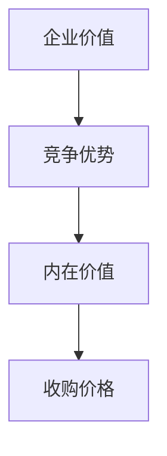
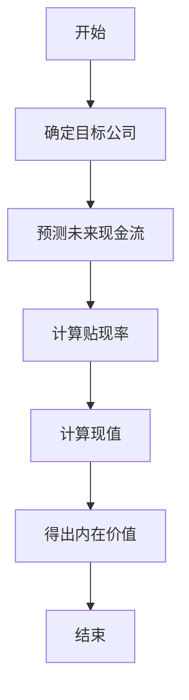
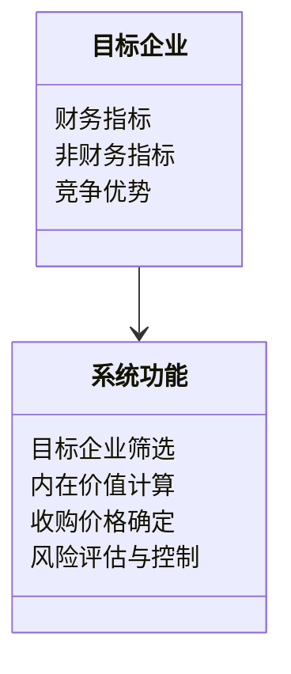
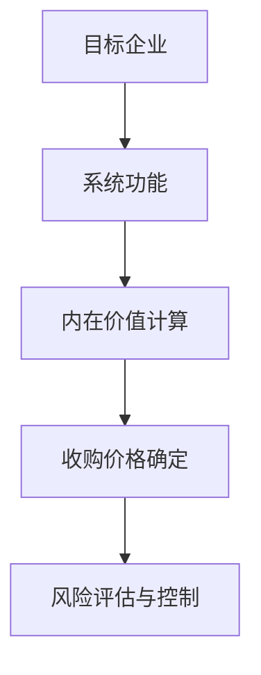
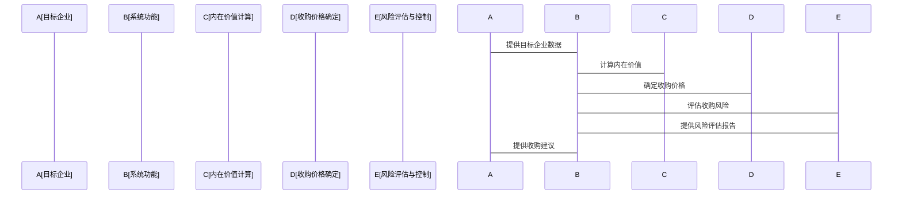

                 


# 巴菲特的公司收购策略：全资控股的魅力

> 关键词：巴菲特，公司收购，全资控股，价值投资，投资策略，内在价值

> 摘要：本文深入探讨了巴菲特的公司收购策略，特别是其全资控股的魅力。通过分析其投资哲学、收购核心概念、算法原理、数学模型、系统架构、项目实战和最佳实践，揭示了巴菲特成功背后的逻辑和方法。

---

# 第1章 巴菲特投资哲学与公司收购概述

## 1.1 巴菲特投资哲学的核心理念

### 1.1.1 价值投资的定义与核心原则

价值投资是一种投资策略，强调以低于其内在价值的价格购买优质资产。巴菲特的价值投资哲学基于以下核心原则：

- **安全边际**：购买价格低于内在价值，确保有足够安全空间。
- **长期视角**：关注企业的长期表现，而非短期波动。
- **竞争优势**：投资具有持续竞争优势的企业。

### 1.1.2 巴菲特的投资理念与长期主义

巴菲特的投资理念强调长期主义，认为市场短期波动无法预测，但长期趋势可以通过基本面分析确定。他主张通过全资控股的方式，确保对企业的控制权，从而实现长期稳定的收益。

### 1.1.3 公司收购在巴菲特投资组合中的地位

公司收购是巴菲特实现价值投资的重要手段。通过全资收购，他可以更好地控制企业，确保其长期发展符合投资目标。全资控股的魅力在于能够彻底改变企业的运营策略，挖掘其最大潜力。

## 1.2 公司收购的基本概念与分类

### 1.2.1 公司收购的定义与类型

公司收购是指一个企业通过购买另一个企业的股权或资产，以获得对目标公司的控制权。常见的收购类型包括：

- **杠杆收购**：利用借债资金进行收购。
- **股权收购**：通过购买目标公司的股权进行收购。
- **现金收购**：用现金支付收购价款。

### 1.2.2 全资控股的定义与特点

全资控股是指收购方持有目标公司100%的股权，从而完全控制其经营和管理。其特点包括：

- **完全控制权**：收购方可以自由决定企业的战略和运营。
- **高风险高回报**：全资控股需要投入更多资金，但潜在回报也更高。
- **长期稳定性**：通过全资控股，企业可以实现长期稳定的收益。

### 1.2.3 巴菲特全资控股的魅力与优势

巴菲特选择全资控股的魅力在于：

- **确保企业长期发展**：通过全资控股，他可以确保企业按照既定的长期战略发展。
- **最大化收益**：全资控股可以确保收益的全部归属，避免与合伙人分配利润。
- **控制风险**：全资控股能够更好地控制风险，避免外部投资者的干扰。

## 1.3 巴菲特公司收购策略的背景与演变

### 1.3.1 巴菲特早期投资经历

巴菲特早期的投资经历主要集中在股票市场，他通过分析企业的基本面，寻找被低估的股票进行投资。这种投资策略为他后来的公司收购奠定了基础。

### 1.3.2 巴菲特收购策略的成熟与演变

随着经验的积累，巴菲特逐渐将目光转向公司收购。他开始关注那些具有强大竞争优势的企业，通过全资控股的方式，确保企业长期稳定的发展。

### 1.3.3 巴菲特收购策略的现代应用

在现代商业环境中，巴菲特的收购策略依然具有重要的现实意义。他通过全资控股，继续践行价值投资的理念，为投资者创造稳定收益。

## 1.4 本章小结

本章介绍了巴菲特的投资哲学，重点阐述了公司收购的基本概念与分类，特别是全资控股的魅力与优势。通过分析巴菲特的早期投资经历和收购策略的演变，揭示了他成功背后的逻辑。

---

# 第2章 巴菲特公司收购的核心概念与联系

## 2.1 巴菲特收购策略的核心概念

### 2.1.1 企业价值评估

企业价值评估是巴菲特收购策略的核心，主要包括以下几个步骤：

1. **确定目标企业**：选择具有竞争优势和长期发展潜力的企业。
2. **分析财务状况**：评估企业的财务健康状况，包括资产负债表、利润表等。
3. **预测未来现金流**：基于历史数据和行业趋势，预测未来现金流。
4. **计算内在价值**：使用现金流贴现模型（DCF）计算企业的内在价值。

### 2.1.2 竞争优势分析

竞争优势分析是巴菲特评估企业的重要标准，主要包括：

- **成本优势**：企业在生产过程中的成本控制能力。
- **品牌优势**：品牌知名度和市场影响力。
- **技术优势**：拥有独特的技术或专利。

### 2.1.3 内在价值计算

内在价值是企业未来现金流的现值，计算公式如下：

$$ V = \frac{CF}{r} $$

其中，\( V \) 表示内在价值，\( CF \) 表示未来现金流，\( r \) 表示贴现率。

### 2.1.4 贴现率的确定

贴现率是影响内在价值计算的重要因素，通常基于企业的风险水平和市场利率确定。巴菲特通常使用长期国债收益率作为贴现率。

## 2.2 核心概念之间的联系

### 2.2.1 企业价值评估与竞争优势分析的关系

竞争优势分析是企业价值评估的重要组成部分，只有具备竞争优势的企业才能在未来产生稳定的现金流，从而具备较高的内在价值。

### 2.2.2 内在价值计算与收购价格的关联

内在价值是确定收购价格的重要依据。巴菲特通常以低于内在价值的价格进行收购，以确保安全边际。

### 2.2.3 财务指标与非财务指标的综合考量

财务指标（如利润、现金流）和非财务指标（如品牌、技术）共同决定了企业的长期发展潜力。巴菲特在评估企业时，始终坚持财务与非财务指标的综合考量。

## 2.3 巴菲特收购策略的ER实体关系图



## 2.4 本章小结

本章详细阐述了巴菲特收购策略的核心概念，包括企业价值评估、竞争优势分析和内在价值计算，并通过ER实体关系图展示了这些概念之间的联系。

---

# 第3章 巴菲特公司收购的算法原理讲解

## 3.1 巴菲特收购策略的数学模型

### 3.1.1 内在价值计算公式

$$ V = \frac{CF}{r} $$

其中，\( V \) 表示内在价值，\( CF \) 表示未来现金流，\( r \) 表示贴现率。

### 3.1.2 现金流贴现模型（DCF）的详细讲解

现金流贴现模型是巴菲特计算内在价值的核心工具。以下是DCF模型的详细步骤：

1. **预测未来现金流**：基于企业的历史数据和行业趋势，预测未来五到十年的现金流。
2. **确定贴现率**：通常使用长期国债收益率作为贴现率。
3. **计算现值**：将未来现金流贴现，计算其现值。
4. **求和得到内在价值**：将各年的现值相加，得到企业的内在价值。

### 3.1.3 DCF模型的Python实现示例

以下是一个简单的DCF模型的Python代码示例：

```python
def calculate_intrinsic_value(cash_flows, discount_rate):
    present_value = 0
    for i, cf in enumerate(cash_flows):
        present_value += cf / (1 + discount_rate) ** (i + 1)
    return present_value

# 示例数据
cash_flows = [100, 150, 200, 250, 300]
discount_rate = 0.05

intrinsic_value = calculate_intrinsic_value(cash_flows, discount_rate)
print(f"内在价值为: {intrinsic_value}")
```

### 3.1.4 DCF模型的优缺点

- **优点**：DCF模型能够准确反映企业的未来现金流，是评估企业内在价值的重要工具。
- **缺点**：模型依赖于对未来现金流的预测，具有一定的主观性和不确定性。

## 3.2 现金流贴现模型（DCF）的详细讲解

### 3.2.1 DCF模型的基本原理

DCF模型通过将未来现金流贴现，计算其现值，从而得到企业的内在价值。这种方法能够帮助投资者确定企业的合理估值。

### 3.2.2 DCF模型的步骤与流程

1. **确定目标企业**：选择具有竞争优势的企业。
2. **预测未来现金流**：基于历史数据和行业趋势，预测未来现金流。
3. **确定贴现率**：通常使用长期国债收益率作为贴现率。
4. **计算现值**：将未来现金流贴现，计算其现值。
5. **求和得到内在价值**：将各年的现值相加，得到企业的内在价值。

### 3.2.3 DCF模型的Mermaid流程图



## 3.3 巴菲特收购策略的数学模型

### 3.3.1 内在价值计算公式

$$ V = \frac{CF}{r} $$

### 3.3.2 现金流贴现模型的数学推导

现金流贴现模型的数学推导如下：

$$ V = \sum_{t=1}^{n} \frac{CF_t}{(1 + r)^t} $$

其中，\( CF_t \) 表示第 \( t \) 年的现金流，\( r \) 表示贴现率，\( n \) 表示预测年数。

## 3.4 本章小结

本章详细讲解了巴菲特收购策略的数学模型，包括内在价值计算公式和现金流贴现模型（DCF）。通过Python代码和Mermaid流程图，展示了DCF模型的实现步骤和应用场景。

---

# 第4章 巴菲特公司收购的系统分析与架构设计

## 4.1 系统分析

### 4.1.1 问题场景介绍

在公司收购过程中，常见的问题包括：

- **目标企业选择**：如何选择具有竞争优势的目标企业。
- **收购价格确定**：如何合理确定收购价格。
- **收购风险控制**：如何降低收购后的经营风险。

### 4.1.2 项目介绍

本项目旨在通过系统分析，设计一套基于巴菲特收购策略的公司收购系统，帮助投资者实现价值投资。

### 4.1.3 系统功能设计

系统功能设计包括：

1. **目标企业筛选**：基于财务指标和非财务指标，筛选出具有竞争优势的目标企业。
2. **内在价值计算**：使用DCF模型计算目标企业的内在价值。
3. **收购价格确定**：基于内在价值和市场情况，确定合理的收购价格。
4. **风险评估与控制**：评估收购后的经营风险，并制定相应的控制措施。

### 4.1.4 领域模型Mermaid类图



## 4.2 系统架构设计

### 4.2.1 系统架构Mermaid架构图



### 4.2.2 系统接口设计

系统接口设计包括：

1. **输入接口**：接收目标企业的财务数据和非财务数据。
2. **处理接口**：执行内在价值计算和收购价格确定。
3. **输出接口**：显示计算结果和风险评估报告。

### 4.2.3 系统交互Mermaid序列图



## 4.3 本章小结

本章通过系统分析与架构设计，展示了如何基于巴菲特收购策略构建一个完整的公司收购系统。通过Mermaid图，清晰地展示了系统的功能模块和交互流程。

---

# 第5章 巴菲特公司收购的项目实战

## 5.1 环境安装与配置

### 5.1.1 Python环境安装

安装Python和必要的库：

```bash
pip install numpy pandas matplotlib
```

### 5.1.2 数据库安装与配置

安装MySQL或MongoDB，并配置连接信息。

## 5.2 系统核心实现源代码

### 5.2.1 内在价值计算代码

```python
import numpy as np

def calculate_intrinsic_value(cash_flows, discount_rate):
    present_value = 0
    for i, cf in enumerate(cash_flows):
        present_value += cf / (1 + discount_rate) ** (i + 1)
    return present_value

# 示例数据
cash_flows = [100, 150, 200, 250, 300]
discount_rate = 0.05

intrinsic_value = calculate_intrinsic_value(cash_flows, discount_rate)
print(f"内在价值为: {intrinsic_value}")
```

### 5.2.2 收购价格确定代码

```python
import pandas as pd

def determine_purchase_price(intrinsic_value, margin_of_safety):
    purchase_price = intrinsic_value * (1 - margin_of_safety)
    return purchase_price

# 示例数据
intrinsic_value = 500
margin_of_safety = 0.2

purchase_price = determine_purchase_price(intrinsic_value, margin_of_safety)
print(f"建议的收购价格为: {purchase_price}")
```

## 5.3 代码应用解读与分析

### 5.3.1 内在价值计算代码解读

上述代码通过循环计算未来现金流的现值，最终得到企业的内在价值。贴现率通常基于企业的风险水平和市场利率确定。

### 5.3.2 收购价格确定代码解读

上述代码基于内在价值和安全边际，确定合理的收购价格。安全边际通常设定为20%，以确保收购价格低于内在价值。

## 5.4 实际案例分析

### 5.4.1 案例背景介绍

以巴菲特收购喜诗糖果为例，分析其收购过程和策略。

### 5.4.2 收购过程分析

1. **目标企业选择**：喜诗糖果具有强大的品牌优势和市场地位。
2. **内在价值计算**：使用DCF模型计算喜诗糖果的内在价值。
3. **收购价格确定**：基于内在价值和安全边际，确定收购价格。
4. **收购后的管理**：通过全资控股，确保企业长期稳定发展。

### 5.4.3 收购后的效果评估

分析收购后的实际效果，验证巴菲特收购策略的有效性。

## 5.5 本章小结

本章通过实际案例分析，展示了如何基于巴菲特收购策略进行项目实战。通过Python代码和案例分析，帮助读者理解如何在实际操作中应用这些策略。

---

# 第6章 巴菲特公司收购的最佳实践

## 6.1 最佳实践 tips

### 6.1.1 长期视角的重要性

在公司收购中，长期视角是确保成功的的关键因素。投资者应关注企业的长期发展潜力，而非短期收益。

### 6.1.2 安全边际的应用

安全边际是巴菲特收购策略的核心原则。通过设定安全边际，可以确保收购价格低于内在价值，从而降低投资风险。

### 6.1.3 竞争优势的持续评估

企业竞争优势是动态变化的，投资者需要持续评估和调整，确保企业始终保持竞争优势。

## 6.2 本章小结

本章总结了巴菲特公司收购的最佳实践，强调了长期视角、安全边际和竞争优势评估的重要性。

---

# 第7章 巴菲特公司收购的注意事项与拓展阅读

## 7.1 注意事项

### 7.1.1 收购风险的控制

在公司收购过程中，投资者需要注意以下风险：

- **财务风险**：高负债率可能导致财务危机。
- **市场风险**：市场波动可能影响企业价值。
- **经营风险**：企业内部管理问题可能影响长期发展。

### 7.1.2 收购后的整合策略

全资控股后，如何进行有效的整合是确保收购成功的关键。投资者需要制定合理的整合策略，确保企业文化的融合和管理的协调。

## 7.2 拓展阅读

### 7.2.1 巴菲特的经典著作

- 《巴菲特的智慧》
- 《投资的思维》
- 《价值投资入门》

### 7.2.2 相关投资策略

- 价值投资策略
- 股权投资策略
- 风险投资策略

## 7.3 本章小结

本章总结了巴菲特公司收购的注意事项，并提供了相关的拓展阅读材料，帮助读者进一步深入学习和实践。

---

# 作者

作者：AI天才研究院/AI Genius Institute & 禅与计算机程序设计艺术/Zen And The Art of Computer Programming

---

通过以上详细的目录结构和内容安排，我们希望能够全面、系统地介绍巴菲特的公司收购策略，特别是其全资控股的魅力。从投资哲学到系统架构，从数学模型到实际案例，力求为读者提供一个完整的学习和实践指南。

