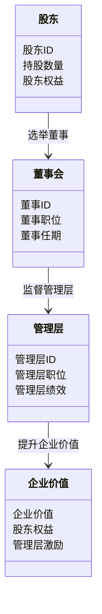
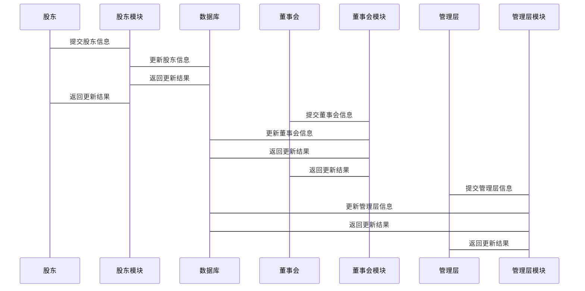

                 


# 巴菲特的公司治理观点

## 关键词：巴菲特、公司治理、股东价值、长期投资、价值投资

## 摘要：  
本文深入探讨了巴菲特的公司治理观点，结合其投资哲学，分析了其对公司治理的深远影响。通过详细分析股东权益保护、董事会独立性、管理层激励等核心要素，本文揭示了巴菲特如何通过长期稳定的治理策略实现股东价值最大化。此外，文章还结合实际案例和数学模型，展示了这些观点在现实中的应用及其对企业的启示。

---

# 第1章: 巴菲特的生平与投资哲学

## 1.1 巴菲特的生平简介

### 1.1.1 巴菲特的早年经历  
沃伦·巴菲特（Warren Buffett）于1934年8月30日出生于美国堪萨斯州的奥马哈市。他从小就展现出了对数字和投资的天赋，12岁时便完成了自己的第一笔股票投资。巴菲特的父母均为律师，父亲Howard Buffett是一位成功的房地产开发商，母亲Leila Buffett则具有敏锐的商业头脑。  

巴菲特在内布拉斯加大学完成了本科学业，随后转学到哥伦比亚大学，并在1951年获得了经济学硕士学位。在哥伦比亚大学的学习期间，他深受本杰明·格雷厄姆（Benjamin Graham）的影响，后者是价值投资理论的奠基人。  

### 1.1.2 巴菲特的合伙人制度  
巴菲特在1956年创立了自己的第一家合伙公司，吸引了最初的投资者，包括他的家人和朋友。这一合伙人制度的核心在于，巴菲特与投资者之间建立了高度的信任关系，他通过透明的沟通和长期的承诺赢得了投资者的信任。  

### 1.1.3 巴菲特的慈善事业  
除了商业成就，巴菲特还以慈善事业闻名。他承诺将自己超过85%的财富捐给慈善事业，主要支持教育和医疗领域。他的慈善理念与他的投资哲学一致：长期、稳定、可持续。

---

## 1.2 巴菲特的投资哲学

### 1.2.1 价值投资的核心理念  
巴菲特的价值投资理论强调以低于内在价值的价格买入优质资产。他认为市场短期可能疯狂，但长期会回归理性。他总结道：“价格是您支付的，价值是您得到的。”  

### 1.2.2 长期投资的重要性  
巴菲特坚信长期投资的重要性。他主张投资者应该买入并长期持有优质资产，而不是频繁交易。这种策略不仅降低了交易成本，还避免了短期波动带来的心理压力。  

### 1.2.3 股东价值最大化的目标  
巴菲特的目标是通过长期投资和优质资产配置，实现股东价值的最大化。他强调，企业的价值不仅仅在于其短期的盈利能力，更在于其长期的可持续发展能力。

---

## 1.3 巴菲特的公司治理观点

### 1.3.1 股东至上的原则  
巴菲特认为，公司治理的核心是保护股东的权益。他强调股东至上，认为公司应该为股东创造长期价值。  

### 1.3.2 避免过度杠杆的风险  
巴菲特反对过度使用杠杆，认为这会增加企业的财务风险。他主张通过内生增长和股东投资来实现企业的扩张，而不是依赖于债务融资。  

### 1.3.3 长期稳定的公司治理策略  
巴菲特强调长期稳定的治理策略。他认为，短期的市场波动不应该影响企业的长期战略决策。他主张通过长期的股东关系和稳定的管理层团队来实现企业的持续发展。

---

# 第2章: 巴菲特的公司治理核心概念

## 2.1 公司治理的基本概念

### 2.1.1 公司治理的定义  
公司治理是指通过董事会和管理层的决策，确保企业按照既定的目标和价值观运营的机制。  

### 2.1.2 公司治理的核心要素  
- 股东权益保护  
- 董事会的独立性  
- 管理层的激励机制  

### 2.1.3 公司治理的边界与外延  
公司治理不仅涉及内部管理，还包括与股东、债权人、监管机构等外部利益相关者的互动。  

---

## 2.2 巴菲特的公司治理模型

### 2.2.1 股东、董事会和管理层的关系  
巴菲特强调股东至上的原则，认为董事会和管理层应该以股东利益为核心，同时确保董事会的独立性和管理层的高效运作。  

### 2.2.2 股东至上的治理理念  
巴菲特认为，公司治理的终极目标是实现股东价值的最大化。他主张通过透明的沟通和高效的决策机制，确保股东的权益得到充分保护。  

### 2.2.3 长期稳定的治理策略  
巴菲特的治理策略强调长期性。他主张通过稳定的管理层团队和长期的股东关系，确保企业的持续发展。

---

## 2.3 巴菲特公司治理的核心要素

### 2.3.1 股东权益保护  
巴菲特认为，股东权益保护是公司治理的核心。他主张通过透明的财务披露和有效的股东沟通，确保股东的知情权和决策权。  

### 2.3.2 董事会的独立性  
巴菲特强调董事会的独立性。他认为，独立的董事会能够更好地监督管理层，确保管理层的行为符合股东的利益。  

### 2.3.3 管理层的激励机制  
巴菲特主张通过合理的激励机制，激发管理层的积极性。他主张将管理层的薪酬与企业的长期绩效挂钩，确保管理层与股东的利益一致。

---

# 第3章: 巴菲特的公司治理原则

## 3.1 股东至上的治理原则

### 3.1.1 股东权益的保护  
巴菲特认为，股东权益的保护是公司治理的核心。他主张通过法律和制度的保障，确保股东的知情权、参与权和收益权。  

### 3.1.2 股东决策的参与  
巴菲特主张股东应该积极参与企业的重大决策。他认为，股东的参与能够提高决策的透明度和合理性。  

### 3.1.3 股东价值的最大化  
巴菲特的目标是通过有效的公司治理，实现股东价值的最大化。他主张通过长期的投资和优质资产配置，实现股东的长期收益。

---

## 3.2 避免过度杠杆的财务风险

### 3.2.1 杠杆对财务健康的影响  
巴菲特认为，过度杠杆会增加企业的财务风险。他主张通过合理的资本结构，确保企业的财务健康。  

### 3.2.2 巴菲特对杠杆的谨慎态度  
巴菲特反对过度使用杠杆。他认为，杠杆虽然可以放大收益，但也可能放大亏损，尤其是在市场波动加剧的情况下。  

### 3.2.3 保持财务稳健的重要性  
巴菲特强调财务稳健的重要性。他认为，企业应该保持充足的流动资金和合理的负债水平，以应对市场的不确定性。

---

## 3.3 长期稳定的治理策略

### 3.3.1 长期投资的价值  
巴菲特认为，长期投资能够带来稳定的收益。他主张通过长期的投资策略，实现股东的长期收益。  

### 3.3.2 稳定的管理层团队  
巴菲特强调管理层的稳定性。他认为，稳定的管理层团队能够更好地制定和执行长期战略。  

### 3.3.3 可持续的股东回报  
巴菲特主张通过可持续的股东回报，实现股东的长期利益。他主张通过稳定的股息分红和资本增值，实现股东的长期回报。

---

# 第4章: 巴菲特的公司治理实践

## 4.1 巴菲特的公司治理案例

### 4.1.1 可口可乐的治理实践  
巴菲特是可口可乐的长期投资者。他认为，可口可乐的管理层具有高度的自治权，同时能够保持与股东的利益一致。  

### 4.1.2 富国银行的治理经验  
富国银行是巴菲特的控股公司之一。他认为，富国银行的治理模式注重股东利益，同时保持了管理层的高效运作。  

### 4.1.3 巴菲特控股公司的治理模式  
巴菲特的控股公司通常采用合伙人制度，强调股东至上和长期稳定的治理策略。

---

## 4.2 巴菲特的治理原则在实际中的应用

### 4.2.1 股东权益的保护  
巴菲特通过透明的财务披露和有效的股东沟通，确保股东的知情权和决策权。  

### 4.2.2 管理层激励的有效性  
巴菲特通过将管理层的薪酬与企业的长期绩效挂钩，确保管理层与股东的利益一致。  

### 4.2.3 长期稳定的股东回报  
巴菲特通过长期的投资策略和稳定的股息分红，实现股东的长期回报。

---

## 4.3 巴菲特治理模式的启示

### 4.3.1 股东至上的治理理念  
巴菲特的治理理念强调股东至上的原则，主张通过透明的沟通和高效的决策机制，确保股东的权益。  

### 4.3.2 避免过度杠杆的风险  
巴菲特的治理策略强调财务稳健，主张避免过度杠杆，以降低企业的财务风险。  

### 4.3.3 长期稳定的治理策略  
巴菲特的治理策略强调长期性，主张通过稳定的管理层团队和长期的股东关系，确保企业的持续发展。

---

# 第5章: 巴菲特的公司治理与企业价值

## 5.1 企业价值的评估方法

### 5.1.1 股权价值的计算  
股权价值的计算方法包括市盈率、市净率、股息率等指标。巴菲特认为，这些指标应该结合企业的基本面进行分析。  

### 5.1.2 股东权益的分析  
股东权益的分析包括资产、负债、所有者权益等部分。巴菲特认为，股东权益是企业价值的核心部分。  

### 5.1.3 企业价值的驱动因素  
企业价值的驱动因素包括盈利能力、成长性、财务状况、行业地位等。巴菲特认为，这些因素应该综合考虑。

---

## 5.2 巴菲特的公司治理对企业价值的影响

### 5.2.1 股东权益的保护对企业价值的影响  
股东权益的保护能够增强投资者的信心，从而提升企业价值。  

### 5.2.2 管理层激励对企业价值的影响  
有效的管理层激励机制能够激发管理层的积极性，从而提升企业绩效，进而提升企业价值。  

### 5.2.3 长期稳定的治理策略对企业价值的影响  
长期稳定的治理策略能够为企业提供稳定的环境，从而促进企业的长期发展，提升企业价值。

---

## 5.3 巴菲特治理模式的数学模型

### 5.3.1 企业价值的数学公式  
$$ 企业价值 = 股东权益 + 短期负债 $$  

### 5.3.2 股东权益的数学模型  
$$ 股东权益 = 资产 - 负债 $$  

### 5.3.3 管理层激励的数学分析  
$$ 管理层激励 = 股权激励 + 薪酬激励 $$  

---

# 第6章: 巴菲特公司治理的系统架构

## 6.1 问题场景介绍  
本章将结合巴菲特的公司治理观点，设计一个公司治理的系统架构，用于实现股东权益保护、董事会独立性和管理层激励的高效管理。  

## 6.2 系统功能设计

### 6.2.1 领域模型设计  
以下是领域模型的类图：



### 6.2.2 系统架构设计  
以下是系统架构的架构图：


### 6.2.3 系统接口设计  
以下是系统接口的交互图：



---

## 6.3 项目实战

### 6.3.1 环境安装  
为了实现本系统的功能，需要安装以下工具：  
- Python 3.9+  
- Django 框架  
- MySQL 数据库  
- Git 版本控制工具  

### 6.3.2 核心代码实现  

#### 系统功能实现代码  

```python
# models.py
from django.db import models

class Shareholder(models.Model):
    shareholder_id = models.CharField(max_length=50)
    shares_held = models.IntegerField()
    shareholder_rights = models.TextField()

    def __str__(self):
        return self.shareholder_id

class Board(models.Model):
    director_id = models.CharField(max_length=50)
    director_position = models.CharField(max_length=100)
    director_term = models.CharField(max_length=50)

    def __str__(self):
        return self.director_id

class Management(models.Model):
    manager_id = models.CharField(max_length=50)
    manager_position = models.CharField(max_length=100)
    manager_performance = models.TextField()

    def __str__(self):
        return self.manager_id

class CorporateValue(models.Model):
    corporate_value = models.FloatField()
    shareholder_rights = models.TextField()
    management_incentives = models.TextField()

    def __str__(self):
        return str(self.corporate_value)
```

#### 系统功能实现代码解释  
上述代码定义了四个模型：`Shareholder`、`Board`、`Management` 和 `CorporateValue`，分别对应股东、董事会、管理层和企业价值。每个模型都有自己的字段和方法，用于实现系统的功能。

---

## 6.4 实际案例分析  

### 6.4.1 案例分析  
以可口可乐为例，巴菲特的治理模式在可口可乐的成功中发挥了重要作用。通过长期的投资和稳定的管理层团队，可口可乐实现了持续的股东回报。  

### 6.4.2 代码实现  
以下是实现可口可乐治理模式的代码示例：  

```python
# views.py
from django.shortcuts import render
from .models import Shareholder, Board, Management, CorporateValue

def home(request):
    shareholders = Shareholder.objects.all()
    boards = Board.objects.all()
    managements = Management.objects.all()
    corporate_values = CorporateValue.objects.all()
    return render(request, 'home.html', {
        'shareholders': shareholders,
        'boards': boards,
        'managements': managements,
        'corporate_values': corporate_values
    })
```

---

## 6.5 项目小结  
本项目通过系统的实现，展示了巴菲特的公司治理观点在实际中的应用。通过透明的沟通和高效的决策机制，系统实现了股东权益保护、董事会独立性和管理层激励的有效管理。

---

# 第7章: 巴菲特公司治理的最佳实践

## 7.1 小结  
巴菲特的公司治理观点强调股东至上、避免过度杠杆和长期稳定的治理策略。通过这些原则，巴菲特实现了股东价值的最大化，同时也为企业的长期发展奠定了基础。  

## 7.2 注意事项  
在实际应用中，需要注意以下几点：  
1. 股东权益的保护需要通过法律和制度的保障。  
2. 管理层激励机制的设计需要结合企业的实际情况。  
3. 长期稳定的治理策略需要通过长期的投资和稳定的管理层团队来实现。  

## 7.3 拓展阅读  
1. 《巴菲特投资哲学》  
2. 《公司治理的理论与实践》  
3. 《价值投资入门》  

---

# 作者：AI天才研究院/AI Genius Institute & 禅与计算机程序设计艺术 /Zen And The Art of Computer Programming

