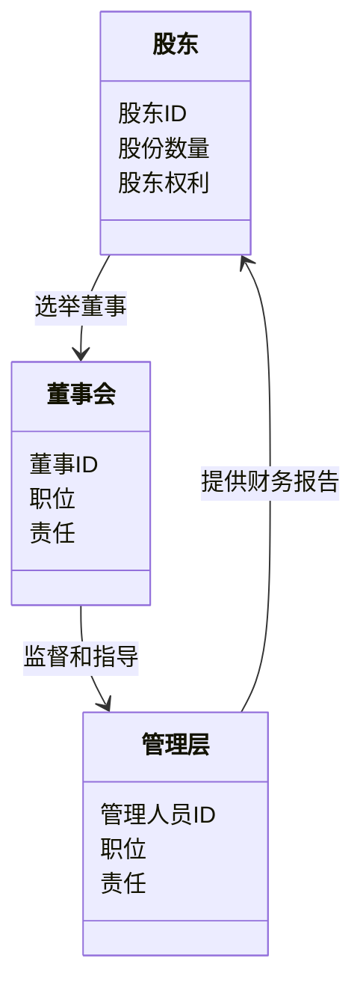
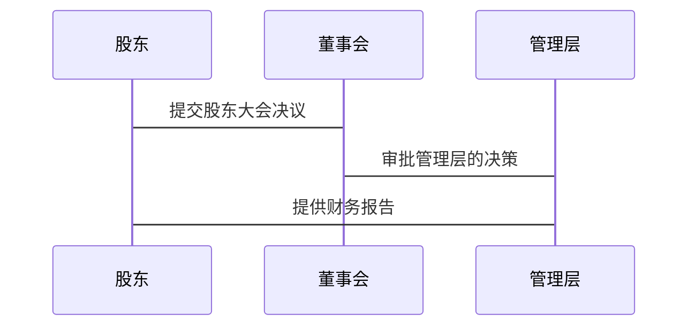

                 


# 巴菲特的公司治理观：股东利益至上

## 关键词：公司治理，巴菲特，股东利益，投资理念，长期价值，资本结构

## 摘要：本文探讨了巴菲特的公司治理理念，重点分析了其“股东利益至上”的核心思想。通过介绍公司治理的基本概念，巴菲特的股东价值最大化原则，以及如何通过数学模型和系统架构实现这一目标，本文为读者提供了全面的理解。文章还结合实际案例，展示了如何应用这些理念，并提供了最佳实践和小结。

---

# 第一部分: 背景介绍

## 第1章: 公司治理的基本概念

### 1.1 公司治理的定义与重要性

#### 1.1.1 公司治理的定义
公司治理是指公司内部和外部的利益相关者（如股东、董事会、管理层、债权人、客户等）之间的权利和责任分配、决策过程和监督机制。良好的公司治理确保公司能够高效运作，实现长期价值最大化。

#### 1.1.2 公司治理的重要性
公司治理是公司成功的关键因素之一。有效的治理能够提高透明度，降低代理成本，增强投资者信心，并确保公司战略的有效执行。

#### 1.1.3 公司治理的核心要素
公司治理的核心要素包括：
1. **董事会结构**：董事会是公司治理的核心，负责监督管理层，制定战略，确保公司利益最大化。
2. **管理层职责**：管理层负责日常运营，执行董事会的决策，并向董事会报告。
3. **股东权利**：股东作为公司所有者，有权参与公司重大决策，获得分红，并监督管理层。
4. **利益相关者关系**：公司需要平衡股东、债权人、员工、客户等利益相关者的关系。

### 1.2 股东与利益相关者的关系

#### 1.2.1 股东的角色与权利
股东是公司的所有者，享有投票权、分红权和剩余资产分配权。股东的决策对公司的发展至关重要，尤其是在股东大会中。

#### 1.2.2 利益相关者的定义与影响
利益相关者包括股东、债权人、员工、客户、供应商和监管机构。他们的利益可能与公司治理相关，需要在决策中得到平衡。

#### 1.2.3 股东与利益相关者的平衡
公司治理的核心是平衡股东与利益相关者的关系，确保股东利益最大化的同时，也考虑其他利益相关者的权益。

---

## 第2章: 巴菲特的股东利益至上理念

### 2.1 巴菲特的公司治理观

#### 2.1.1 巴菲特的股东价值最大化原则
巴菲特认为，公司的目标是为股东创造长期价值。他强调股东利益至上，认为管理层应该以股东利益为核心，制定决策。

#### 2.1.2 巴菲特对管理层的监督与激励机制
巴菲特认为，管理层的激励机制应该与股东利益挂钩，以确保管理层的行为与股东利益一致。他倾向于使用股票期权等长期激励工具。

#### 2.1.3 巴菲特的长期投资视角
巴菲特的投资策略以长期价值为导向，他注重公司的基本面和管理层的诚信，认为长期稳定的业绩是股东价值的体现。

### 2.2 股东利益至上的核心原则

#### 2.2.1 股东价值最大化的方法
巴菲特认为，股东价值最大化可以通过以下几个方面实现：
1. **注重长期收益**：公司应该注重长期盈利能力，而不是短期利润。
2. **合理资本结构**：公司应该保持合理的资本结构，避免过度负债，确保财务健康。
3. **高效的管理层**：管理层应该高效、透明，并与股东利益一致。

#### 2.2.2 股东利益与公司长期发展的结合
巴菲特强调，股东利益与公司长期发展的结合是公司治理的核心。他主张公司应该注重长期价值，而不是短期股价波动。

#### 2.2.3 股东利益至上的实现路径
1. **透明的财务报告**：公司应该提供透明的财务信息，增强投资者信心。
2. **有效的董事会监督**：董事会应该积极履行监督职责，确保管理层的行为符合股东利益。
3. **合理的激励机制**：通过股票期权等激励机制，确保管理层的行为与股东利益一致。

---

# 第二部分: 核心概念与联系

## 第3章: 巴菲特公司治理观的核心概念与联系

### 3.1 核心概念的原理

#### 3.1.1 股东价值最大化的数学模型
股东价值最大化可以通过以下数学模型进行评估：
$$
\text{股东价值} = \text{企业价值} - \text{债务价值}
$$
其中，企业价值可以通过息税前利润（EBIT）和资本成本进行评估。

#### 3.1.2 股东与公司绩效的关系
股东与公司绩效之间的关系可以通过以下公式表示：
$$
\text{股东回报} = \text{股息} + \text{股价增值}
$$
股价增值与公司的长期绩效密切相关。

#### 3.1.3 股东利益与公司治理结构的关联
公司治理结构通过影响管理层的决策和公司绩效，进而影响股东价值。有效的公司治理结构能够最大化股东价值。

### 3.2 核心概念的对比分析

#### 3.2.1 股东

---

# 第三部分: 算法原理讲解

## 第4章: 算法原理

### 4.1 公司治理的优化算法

#### 4.1.1 基于资本资产定价模型（CAPM）的股东价值评估
资本资产定价模型（CAPM）用于评估资产的预期回报率，公式为：
$$
r = r_f + \beta (r_m - r_f)
$$
其中，\( r \) 是资产的预期回报率，\( r_f \) 是无风险利率，\( \beta \) 是资产的贝塔系数，\( r_m \) 是市场预期回报率。

#### 4.1.2 最大化股东价值的优化算法
通过CAPM模型，我们可以评估不同资本结构下的股东价值，并选择最优资本结构以最大化股东价值。

---

# 第四部分: 数学模型和公式

## 第5章: 数学模型和公式

### 5.1 股东价值最大化的数学推导

#### 5.1.1 股东价值最大化的公式
股东价值最大化可以通过以下公式进行推导：
$$
\max \text{股东价值} = \max (E - D)
$$
其中，\( E \) 是企业价值，\( D \) 是债务价值。

#### 5.1.2 股东价值与资本结构的关系
通过CAPM模型，我们可以推导出资本结构对股东价值的影响：
$$
E = \text{EBIT} \times (1 - t) + \text{WACC} \times D
$$
其中，\( t \) 是税率，\( \text{WACC} \) 是加权平均资本成本。

---

# 第五部分: 系统分析与架构设计

## 第6章: 系统分析与架构设计方案

### 6.1 问题场景介绍

#### 6.1.1 公司治理的系统架构
公司治理的系统架构包括以下几个模块：
1. **董事会**：负责监督和决策。
2. **管理层**：负责日常运营。
3. **股东**：参与重大决策和监督。

### 6.2 系统功能设计

#### 6.2.1 领域模型（Mermaid类图）


#### 6.2.2 系统架构设计（Mermaid架构图）


### 6.3 系统接口设计

#### 6.3.1 股东与董事会的交互
股东通过股东大会选举董事会成员，并对董事会的重大决策进行投票。

#### 6.3.2 董事会与管理层的交互
董事会监督管理层的日常运营，确保管理层的行为符合公司战略和股东利益。

### 6.4 系统交互设计（Mermaid序列图）



---

# 第六部分: 项目实战

## 第7章: 项目实战

### 7.1 环境安装

#### 7.1.1 系统环境
- 操作系统：Windows/Linux/ macOS
- 开发工具：IntelliJ IDEA/VSCodium
- 数据库：MySQL/PostgreSQL
- 语言：Python/Java

### 7.2 核心实现

#### 7.2.1 股东价值最大化算法实现
使用Python编写CAPM模型，计算最优资本结构。

```python
import numpy as np

def calculate_capm(risk_free_rate, beta, market_return):
    return risk_free_rate + beta * (market_return - risk_free_rate)

risk_free_rate = 0.05
beta = 1.2
market_return = 0.10

expected_return = calculate_capm(risk_free_rate, beta, market_return)
print(f"Expected return: {expected_return}")
```

#### 7.2.2 系统架构实现
使用Django框架构建公司治理系统。

```python
from django.urls import path
from . import views

urlpatterns = [
    path('board/', views.BoardView.as_view()),
    path('management/', views.ManagementView.as_view()),
    path('shareholders/', views.ShareholdersView.as_view()),
]
```

### 7.3 代码解读与分析

#### 7.3.1 股东价值计算
上述Python代码通过CAPM模型计算资产的预期回报率，帮助评估股东价值。

#### 7.3.2 系统架构实现
Django框架用于构建公司治理系统的Web界面，包括董事会、管理层和股东的交互。

### 7.4 实际案例分析

#### 7.4.1 案例背景
假设一家公司希望通过优化资本结构来最大化股东价值。

#### 7.4.2 案例分析
使用CAPM模型计算不同资本结构下的股东价值，选择最优资本结构。

### 7.5 项目小结
通过实际案例分析，我们可以看到巴菲特的股东利益至上理念在公司治理中的实际应用，以及如何通过数学模型和系统架构实现股东价值最大化。

---

# 第七部分: 最佳实践和小结

## 第8章: 最佳实践和小结

### 8.1 最佳实践

#### 8.1.1 股东利益至上的实现
- 透明的财务报告
- 有效的董事会监督
- 合理的激励机制

#### 8.1.2 系统架构设计
- 清晰的职责划分
- 有效的信息传递
- 及时的反馈机制

### 8.2 小结

#### 8.2.1 股东利益至上的重要性
股东利益至上是公司治理的核心，能够确保公司长期发展和股东价值最大化。

#### 8.2.2 未来展望
随着公司治理的不断发展，如何更好地平衡股东与利益相关者的关系，将是未来研究的重要方向。

### 8.3 注意事项

#### 8.3.1 股东利益与公司绩效的关系
股东利益与公司绩效密切相关，但需要平衡其他利益相关者的关系。

#### 8.3.2 风险管理
在追求股东利益最大化的过程中，公司需要注重风险管理，避免过度负债和市场风险。

### 8.4 拓展阅读

#### 8.4.1 推荐书籍
- 《巴菲特传》：了解巴菲特的投资理念和公司治理观。
- 《公司治理》：深入探讨公司治理的理论与实践。

#### 8.4.2 推荐文章
- 网站：Harvard Business Review（HBR）
- 博客：Simplify The复杂

---

# 作者信息

作者：AI天才研究院/AI Genius Institute & 禅与计算机程序设计艺术 /Zen And The Art of Computer Programming

---

本文通过详细分析巴菲特的公司治理观，结合数学模型、系统架构和实际案例，为读者提供了全面的理解。希望本文能为您提供有价值的信息和启发！

