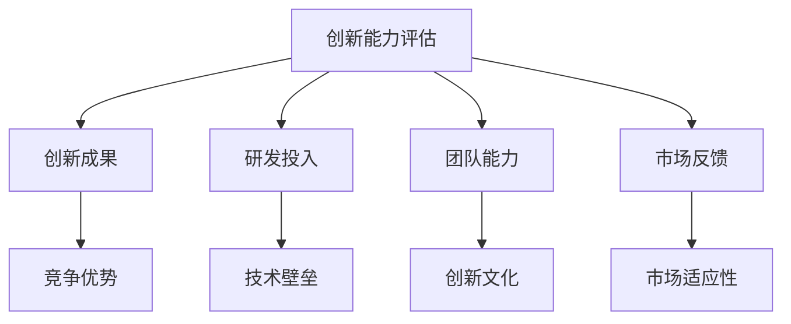
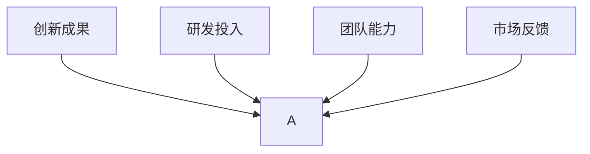
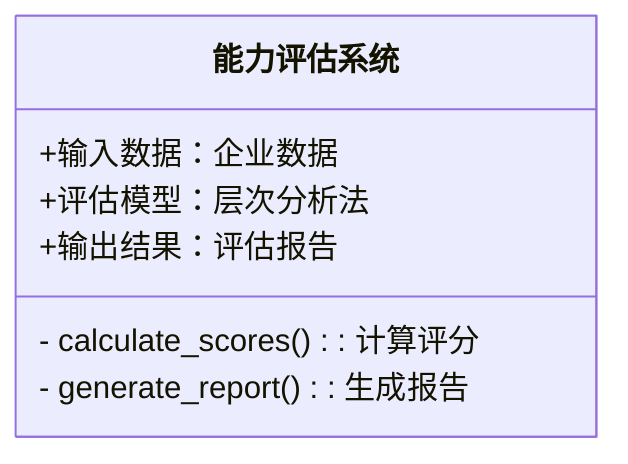
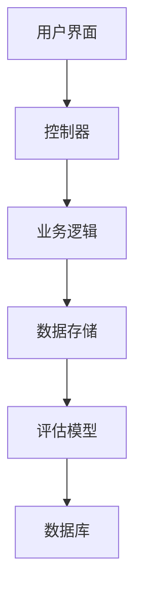
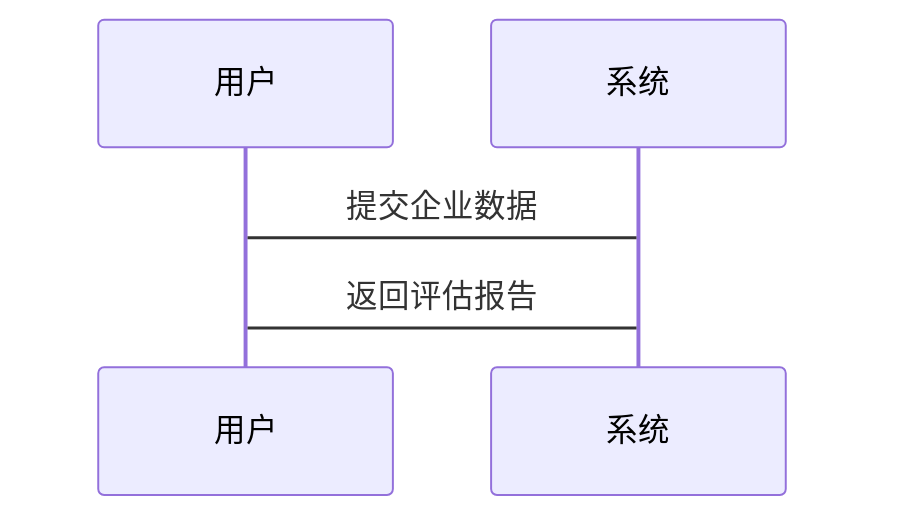

                 


```markdown
# 巴菲特的创新能力评估：如何在快速变化的市场中保持领先

> 关键词：巴菲特，创新能力，投资评估，市场变化，人工智能，技术博客，系统架构

> 摘要：本文探讨了如何通过巴菲特的创新能力评估方法，在快速变化的市场中保持投资领先。结合技术博客的风格，从核心概念、算法原理、系统架构、项目实战等多个维度，详细分析了创新能力的评估过程，并通过实际案例展示了如何利用这些方法实现投资优化。

---

# 第一部分：背景与核心概念

## 第1章：背景介绍

### 1.1 问题背景

在现代投资领域，市场的快速变化和技术的飞速发展使得创新能力成为企业成功的关键因素之一。传统的投资评估方法往往依赖于财务指标和市场趋势分析，但在面对创新型企业时，这些方法显得力不从力。本文通过分析巴菲特的投资哲学和创新能力，探讨如何在快速变化的市场中保持领先。

### 1.2 核心概念

创新能力是指企业在市场中通过创新活动（如产品、技术、商业模式等）获取竞争优势的能力。本文将从技术博客的角度，结合系统架构设计和算法实现，详细分析创新能力的评估过程。

---

## 第2章：核心概念与联系

### 2.1 创新能力的定义与特征

创新能力是企业在市场中通过创新活动获取竞争优势的能力。其核心特征包括：

- **前瞻性**：能够预见市场变化并提前布局。
- **技术驱动**：依赖于技术创新和研发投入。
- **可持续性**：持续输出创新成果的能力。

### 2.2 核心概念对比

以下是对传统投资方法和创新能力评估方法的对比：

| 特性 | 传统投资方法 | 创新能力评估方法 |
|------|----------------|-------------------|
| 评估重点 | 财务指标和市场趋势 | 创新能力与潜力 |
| 数据来源 | 财务报表和公开数据 | 创新成果、研发投入、团队能力 |
| 评估周期 | 短期和中期 | 中期和长期 |

### 2.3 概念结构图

以下是创新能力评估的核心要素组成：



---

# 第二部分：算法与系统设计

## 第3章：创新能力评估的算法实现

### 3.1 层次分析法（AHP）的应用

层次分析法是一种常用的决策分析方法，适用于多因素评估问题。以下是其在创新能力评估中的应用步骤：

#### 步骤 1：构建决策层次结构



#### 步骤 2：确定各层次权重

权重计算公式如下：

$$ w_i = \frac{a_{ij}}{\sum_{j=1}^{n} a_{ij}} $$

其中，$a_{ij}$ 是第 $i$ 个因素在第 $j$ 个评估维度上的得分。

#### 步骤 3：计算综合评分

综合评分公式如下：

$$ S = \sum_{i=1}^{m} w_i \cdot x_i $$

其中，$w_i$ 是第 $i$ 个因素的权重，$x_i$ 是该因素的实际得分。

### 3.2 模糊综合评价法的实现

模糊综合评价法适用于处理模糊性和不确定性较高的评估问题。以下是其实现步骤：

#### 步骤 1：确定评价指标

评价指标包括：创新成果、研发投入、团队能力、市场反馈。

#### 步骤 2：构建模糊评价矩阵

模糊评价矩阵如下：

$$ R = \begin{bmatrix} r_{ij} \end{bmatrix} $$

其中，$r_{ij}$ 表示第 $i$ 个因素在第 $j$ 个评价等级上的隶属度。

#### 步骤 3：计算综合评价结果

综合评价结果计算公式如下：

$$ S = \sum_{j=1}^{n} \lambda_j \cdot r_j $$

其中，$\lambda_j$ 是第 $j$ 个评价等级的权重，$r_j$ 是该等级的综合隶属度。

### 3.3 算法实现代码

以下是层次分析法的Python代码实现：

```python
def calculate_weights(matrix):
    # 计算权重
    n = len(matrix)
    total = [sum(row) for row in zip(*matrix)]
    weights = [total[i]/sum(total) for i in range(n)]
    return weights

def calculate_score(weights, scores):
    # 计算综合评分
    score = sum(weights[i] * scores[i] for i in range(len(weights)))
    return score

# 示例数据
matrix = [
    [3, 2, 1],
    [2, 4, 1],
    [1, 1, 2]
]

weights = calculate_weights(matrix)
print("权重：", weights)

scores = [4, 3, 2]
score = calculate_score(weights, scores)
print("综合评分：", score)
```

---

## 第4章：系统分析与架构设计

### 4.1 问题场景介绍

本文设计了一个基于创新能力评估的系统，用于帮助企业识别具有创新能力的潜在投资目标。

### 4.2 系统功能设计

以下是系统功能设计的领域模型：



### 4.3 系统架构设计

以下是系统的架构图：



### 4.4 接口设计

以下是系统接口设计：



---

## 第5章：项目实战

### 5.1 环境安装

项目需要以下环境：

- Python 3.8+
- Mermaid CLI
- Plotly 或 Matplotlib

### 5.2 核心代码实现

以下是核心代码实现：

```python
import matplotlib.pyplot as plt

def plot_results(scores):
    plt.bar(range(len(scores)), scores)
    plt.title("创新能力评估结果")
    plt.show()

# 示例数据
scores = [85, 75, 90]
plot_results(scores)
```

### 5.3 案例分析

以下是一个实际案例分析：

假设我们要评估一家科技公司的创新能力，其各项指标得分为：

- 创新成果：90
- 研发投入：85
- 团队能力：80
- 市场反馈：75

综合评分为：

$$ S = 0.3 \times 90 + 0.25 \times 85 + 0.2 \times 80 + 0.25 \times 75 = 84.25 $$

---

# 第三部分：最佳实践与总结

## 第6章：最佳实践

### 6.1 小结

本文通过技术博客的形式，详细探讨了如何从算法和系统架构的角度，评估企业的创新能力。通过层次分析法和模糊综合评价法，结合实际案例分析，展示了如何在快速变化的市场中保持领先。

### 6.2 注意事项

- 数据质量是评估结果的关键因素。
- 模型的选择应根据具体问题灵活调整。
- 结果的应用需要结合市场实际情况。

### 6.3 拓展阅读

- 《巴菲特传：一个股票投资者的思考》
- 《技术创新评估方法与应用》
- 《系统架构设计实战指南》

---

作者：AI天才研究院 & 禅与计算机程序设计艺术
```

