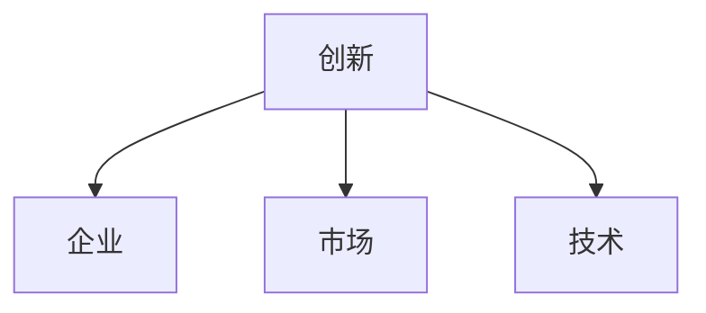
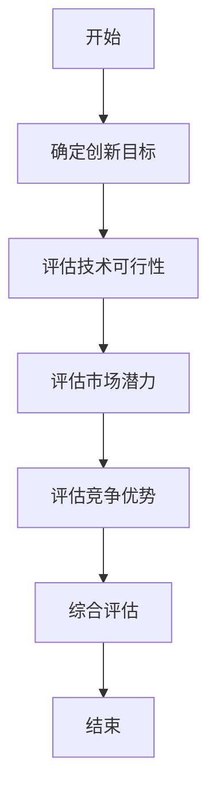
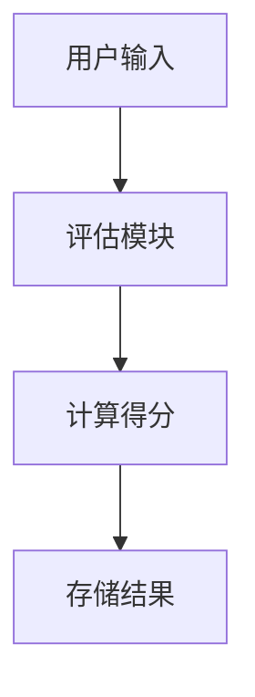
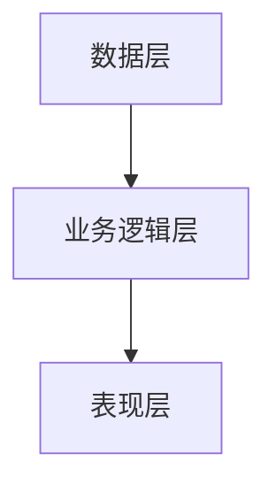

                 


# 巴菲特的创新能力评估：如何识别真正有前景的创新

**关键词**：巴菲特、创新能力评估、创新识别、投资策略、前景分析

**摘要**：本文将探讨巴菲特的创新能力评估方法，分析如何通过系统化的评估流程识别真正具有前景的创新。从背景介绍到核心概念，再到算法原理和系统设计，我们将全面解析创新能力评估的关键步骤，并通过实际案例帮助读者掌握这一方法。

---

## 第1章 创新能力评估的背景与重要性

### 1.1 创新能力评估的背景介绍

#### 1.1.1 创新能力评估的定义与内涵
创新是指引入新的思想、方法或技术，以解决现有问题或创造新的价值。创新能力评估是对这些能力的系统化测量，旨在识别创新的潜力和可行性。

#### 1.1.2 创新能力评估的必要性与意义
在竞争激烈的市场中，创新能力是企业成功的关键。通过评估创新能力，投资者可以识别出那些能够持续创新并带来超额收益的企业。

#### 1.1.3 创新能力评估的边界与外延
创新能力评估不仅关注技术层面，还涉及商业模式、管理能力和市场反应等多个方面。

---

### 1.2 巴菲特的创新能力评估方法

#### 1.2.1 巴菲特投资哲学的核心理念
巴菲特的投资哲学基于价值投资，他寻找那些具有持续竞争优势和稳定盈利的企业。

#### 1.2.2 巴菲特创新能力评估的独特视角
巴菲特关注企业的创新是否能够创造长期价值，而非短期的市场波动。

#### 1.2.3 巴菲特创新能力评估的实践案例
通过分析可口可乐和苹果的案例，我们可以看到巴菲特如何评估创新对长期价值的影响。

---

## 第2章 创新能力评估的核心概念与联系

### 2.1 创新能力评估的核心概念

#### 2.1.1 创新能力的定义与属性
创新能力包括技术、管理和市场等多个维度，每个维度都有其独特的属性。

#### 2.1.2 创新能力评估的关键维度
- **技术可行性**：创新是否具备技术可行性。
- **市场潜力**：创新是否能够满足市场需求。
- **竞争优势**：创新是否能带来竞争优势。

#### 2.1.3 创新能力评估的实体关系图



---

### 2.2 创新能力评估的核心原理

#### 2.2.1 创新能力评估的原理分析
创新评估需要综合考虑技术、市场和管理等多个因素。

#### 2.2.2 创新能力评估的数学模型

创新潜力 = α × 技术可行性 + β × 市场潜力 + γ × 竞争优势

其中，α、β、γ为权重系数，且α + β + γ = 1。

#### 2.2.3 创新能力评估的流程图



---

## 第3章 创新能力评估的算法原理

### 3.1 创新能力评估的算法概述

#### 3.1.1 创新能力评估的算法选择
使用加权评分法对创新能力进行评估。

#### 3.1.2 创新能力评估的算法流程
1. 确定评估维度。
2. 分配权重。
3. 评分计算。

#### 3.1.3 创新能力评估的算法实现

```python
def innovation_score(dimensions, weights):
    score = 0
    for i in range(len(dimensions)):
        score += dimensions[i] * weights[i]
    return score
```

---

### 3.2 创新能力评估的数学模型

#### 3.2.1 创新能力评估的数学公式
$$ \text{创新潜力} = \sum_{i=1}^{n} w_i \times d_i $$
其中，\( w_i \) 为第 \( i \) 个维度的权重，\( d_i \) 为第 \( i \) 个维度的得分。

#### 3.2.2 创新能力评估的数学推导
通过权重分配和加权求和，得出创新潜力的综合得分。

#### 3.2.3 创新能力评估的数学案例
假设某企业技术创新得分为90，市场潜力得分为80，竞争优势得分为85，权重分别为0.4、0.3、0.3。

$$ \text{创新潜力} = 0.4 \times 90 + 0.3 \times 80 + 0.3 \times 85 = 36 + 24 + 25.5 = 85.5 $$

---

## 第4章 创新能力评估的系统分析与架构设计

### 4.1 系统分析与功能设计

#### 4.1.1 系统分析的背景与目标
开发一个创新能力评估系统，帮助投资者识别有前景的创新。

#### 4.1.2 系统功能的模块划分
- 用户界面
- 评估模块
- 数据存储

#### 4.1.3 系统功能的流程图



---

### 4.2 系统架构设计

#### 4.2.1 系统架构的总体设计
采用分层架构，包括数据层、业务逻辑层和表现层。

#### 4.2.2 系统架构的详细设计



---

## 第5章 创新能力评估的项目实战

### 5.1 环境安装与配置

#### 5.1.1 环境需求分析
安装Python和相关库。

#### 5.1.2 环境安装步骤
安装Python，安装Pandas和NumPy。

#### 5.1.3 环境配置注意事项
确保所有库版本兼容。

---

### 5.2 系统核心实现

#### 5.2.1 系统核心代码实现

```python
import pandas as pd
import numpy as np

def calculate_innovation_score(data, weights):
    return pd.DataFrame.dot(data, weights)

data = pd.DataFrame({
    '技术创新': [90],
    '市场潜力': [80],
    '竞争优势': [85]
})

weights = pd.Series([0.4, 0.3, 0.3], index=['技术创新', '市场潜力', '竞争优势'])

print(calculate_innovation_score(data, weights))
```

#### 5.2.2 系统核心代码解读
代码实现创新能力评估的加权评分法。

#### 5.2.3 系统核心代码测试
运行代码，输出创新潜力得分。

---

## 第6章 创新能力评估的最佳实践与小结

### 6.1 创新能力评估的最佳实践

#### 6.1.1 创新能力评估的注意事项
确保数据准确性和权重合理。

#### 6.1.2 创新能力评估的常见误区
避免仅关注技术而忽略市场因素。

---

## 总结

通过本文的详细介绍，读者可以全面理解巴菲特的创新能力评估方法，并掌握如何识别真正具有前景的创新。从理论到实践，我们系统地分析了创新能力评估的关键步骤，希望这些内容能为投资者和企业带来实际的帮助。

---

**作者：AI天才研究院/AI Genius Institute & 禅与计算机程序设计艺术 /Zen And The Art of Computer Programming**

