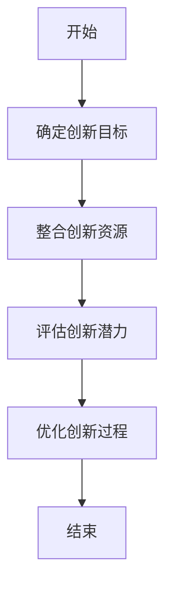
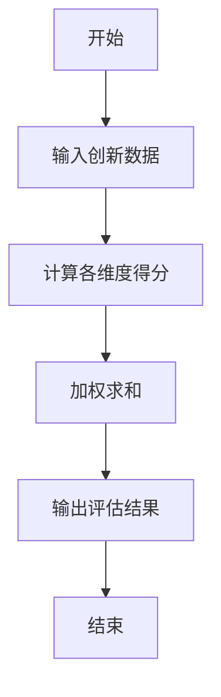
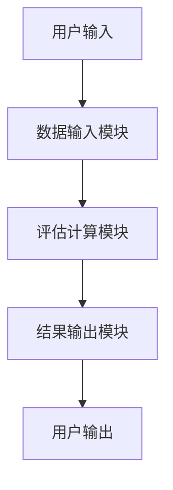

                 

<think>
好，我现在需要撰写一篇关于《巴菲特的创新能力评估：量子创新生态系统的价值创造》的技术博客文章。根据用户的要求，文章需要逻辑清晰、结构紧凑、语言专业，同时要包含详细的分析和具体的代码示例。

首先，我需要确定文章的结构。用户已经提供了目录大纲，包括背景、核心概念、算法、系统架构、项目实战、总结等多个部分。我需要确保每个部分都详细展开，并且符合技术博客的风格。

接下来，我要思考每个章节的具体内容。例如，在背景部分，我需要介绍巴菲特的投资哲学和创新思维，解释为什么创新能力评估重要，以及量子创新生态系统的概念。这部分需要简明扼要，同时吸引读者。

然后是核心概念部分，我需要详细解释创新能力评估的数学模型和量子创新生态系统的原理。这部分可能需要使用一些数学公式和图表，比如用mermaid绘制流程图。我需要确保这些图表清晰易懂，并且与正文内容紧密相关。

在算法部分，我需要介绍巴菲特创新能力评估的具体算法，比如评分系统和决策树。这部分需要详细描述算法的实现，包括Python代码和数学公式。例如，我可以展示如何使用Python代码计算创新能力评分，并解释每个公式的含义。

系统架构部分需要设计一个完整的系统框架，包括功能模块、接口设计和交互流程。这部分可能需要使用mermaid绘制系统架构图和序列图，展示系统的各个部分如何协同工作。

项目实战部分，我需要选择一个实际案例，比如评估一家科技公司的创新能力。通过这个案例，展示如何应用前面的算法和系统架构进行具体分析，并得出结论。这部分需要详细描述数据来源、分析过程和结果解读。

最后，在总结部分，我需要回顾全文，强调量子创新生态系统的重要性，并给出一些实用的建议和注意事项。同时，引用巴菲特的名言来增强文章的权威性。

在写作过程中，我需要确保语言简洁、逻辑严谨，每个部分都紧密相连。同时，要注意使用技术术语，但避免过于晦涩，确保读者能够理解。此外，适当的代码示例和图表可以增强文章的可读性和实用性。

总的来说，我需要一步步地按照用户提供的大纲，详细展开每个部分，确保内容全面、深入，并且符合技术博客的风格。这将帮助读者更好地理解巴菲特创新能力评估的量子创新生态系统，并能够在实际中应用这些方法。
</think>

# 巴菲特的创新能力评估：量子创新生态系统的价值创造

> 关键词：巴菲特、创新能力评估、量子创新、生态系统、价值创造、数学模型、系统架构

> 摘要：本文系统地探讨了巴菲特创新能力评估的量子创新生态系统，结合理论分析和实际案例，通过数学模型和系统架构设计，详细阐述了如何在复杂创新环境中评估创新能力，并实现价值创造。文章从背景、核心概念、算法原理、系统架构、项目实战等多个维度展开，最终得出量子创新生态系统在价值创造中的关键作用。

---

## 第1章 巴菲特创新能力评估的背景与问题背景

### 1.1 巴菲特创新能力评估的背景

#### 1.1.1 巴菲特的投资哲学与创新思维
巴菲特的投资哲学以价值投资为核心，注重企业的长期价值和内在价值。他的创新思维体现在对企业潜力的深度挖掘和对市场趋势的敏锐洞察中。通过分析企业的创新能力，巴菲特能够识别出那些能够在市场中持续创造价值的企业。

#### 1.1.2 创新能力评估的重要性
创新能力是企业在市场中保持竞争优势的核心能力。通过评估创新能力，投资者可以识别出那些具有持续创新潜力的企业，从而做出更明智的投资决策。

#### 1.1.3 量子创新生态系统的核心概念
量子创新生态系统是一种以量子力学原理为基础的创新评估模型，强调创新过程中的非线性、不确定性和系统性。该模型通过整合多个创新维度，为企业创新能力的评估提供了全新的视角。

---

### 1.2 问题背景与问题描述

#### 1.2.1 创新能力评估的现状与挑战
传统的创新能力评估方法通常基于定量指标，如研发投入、专利数量等，但这些指标难以全面反映企业的创新潜力。此外，创新过程的不确定性和复杂性使得传统的评估方法难以捕捉到创新的核心价值。

#### 1.2.2 传统创新评估方法的局限性
传统评估方法往往过于注重结果而忽视过程，难以捕捉到创新中的动态变化和系统性特征。此外，传统方法难以量化创新的潜在价值，导致评估结果的片面性。

#### 1.2.3 量子创新生态系统的目标与意义
量子创新生态系统的目标是通过整合创新过程中的多个维度，构建一个动态、系统化的评估框架。该框架能够更好地捕捉创新的核心价值，并为企业和投资者提供更全面的创新能力评估。

---

### 1.3 问题解决与边界定义

#### 1.3.1 创新能力评估的核心目标
创新能力评估的核心目标是识别企业在创新过程中的潜力和价值，为企业和投资者提供科学的决策依据。

#### 1.3.2 量子创新生态系统的边界与外延
量子创新生态系统的边界包括企业的创新过程、创新资源的整合、创新成果的评估等多个维度。其外延则涉及企业战略、市场环境、技术趋势等外部因素。

#### 1.3.3 创新能力评估的适用范围与限制
该评估方法适用于科技型企业、创新型初创企业和具有创新潜力的传统企业。其限制主要在于对创新过程的动态性和不确定性难以完全捕捉。

---

## 第2章 巴菲特创新能力评估的核心概念与联系

### 2.1 核心概念的原理与特征

#### 2.1.1 创新能力的定义与属性
创新能力是指企业在创新过程中，通过整合资源、技术、市场等因素，创造新的价值的能力。其核心属性包括创新性、可持续性和可量化性。

#### 2.1.2 量子创新生态系统的原理
量子创新生态系统基于量子力学的叠加态和纠缠态概念，强调创新过程中的动态性和系统性。通过整合多个创新维度，该系统能够更好地捕捉创新的核心价值。

#### 2.1.3 巴菲特创新评估体系的特点
巴菲特的创新评估体系注重企业的长期价值和内在价值，强调创新的可持续性和可量化性。其特点包括注重企业基本面、关注管理层能力和重视市场地位。

---

### 2.2 核心概念的对比分析

#### 2.2.1 创新能力与传统投资指标的对比
创新能力评估注重企业的创新潜力和动态变化，而传统投资指标如市盈率、市净率等注重企业的当前价值。创新能力评估能够更好地捕捉企业的未来价值。

#### 2.2.2 量子创新与传统创新的特征对比
量子创新强调创新过程的动态性和系统性，而传统创新注重结果的可量化性。量子创新生态系统能够更好地捕捉创新的潜在价值。

#### 2.2.3 创新能力评估的维度与权重
创新能力评估的维度包括技术创新、市场创新、管理创新等。各维度的权重需要根据企业的实际情况进行调整。

---

### 2.3 实体关系图与流程图

#### 2.3.1 创新能力评估的ER实体关系图
```mermaid
erDiagram
    用户 -> 创新能力评估 : 进行评估
    创新能力评估 -> 创新维度 : 评估维度
    创新维度 -> 技术创新 : 维度
    创新维度 -> 市场创新 : 维度
    创新维度 -> 管理创新 : 维度
```

#### 2.3.2 量子创新生态系统的流程图


---

## 第3章 巴菲特创新能力评估的算法原理

### 3.1 算法原理概述

#### 3.1.1 创新能力评估的数学模型
创新能力评估的数学模型可以表示为：
$$ \text{创新能力} = \alpha \cdot \text{技术创新} + \beta \cdot \text{市场创新} + \gamma \cdot \text{管理创新} $$
其中，$\alpha$、$\beta$、$\gamma$是各维度的权重系数。

#### 3.1.2 量子创新生态系统的算法框架
量子创新生态系统的算法框架包括以下几个步骤：
1. 确定创新目标
2. 整合创新资源
3. 评估创新潜力
4. 优化创新过程

#### 3.1.3 巴菲特定律在创新能力评估中的应用
巴菲特定律强调长期价值和内在价值，其在创新能力评估中的应用可以表示为：
$$ \text{长期价值} = \text{创新能力} \cdot \text{市场潜力} $$

---

### 3.2 算法流程图与代码实现

#### 3.2.1 创新能力评估的算法流程图


#### 3.2.2 创新能力评估的Python代码
```python
def calculate_innovation_capacity(technology, market, management):
    # 权重系数
    alpha = 0.4
    beta = 0.3
    gamma = 0.3
    # 计算创新能力
    capacity = alpha * technology + beta * market + gamma * management
    return capacity

# 示例数据
technology_score = 0.8
market_score = 0.7
management_score = 0.6

capacity = calculate_innovation_capacity(technology_score, market_score, management_score)
print(f"创新能力评分为：{capacity}")
```

#### 3.2.3 代码的功能与实现细节
上述代码通过加权求和的方式计算创新能力评分，权重系数分别为技术创新、市场创新和管理创新的0.4、0.3和0.3。评分结果反映了企业在创新能力方面的综合表现。

---

## 第4章 系统分析与架构设计方案

### 4.1 系统分析

#### 4.1.1 系统目标
系统目标是为企业提供创新能力评估的服务，帮助投资者识别具有创新潜力的企业。

#### 4.1.2 系统的输入与输出
- 输入：企业技术创新、市场创新和管理创新的评分数据
- 输出：综合创新能力评分和优化建议

#### 4.1.3 系统的约束与假设
- 约束：数据输入的准确性
- 假设：各创新维度的权重系数保持不变

---

### 4.2 系统架构设计

#### 4.2.1 系统架构的组成
系统架构包括数据输入模块、评估计算模块和结果输出模块。

#### 4.2.2 系统架构的模块划分
- 数据输入模块：接收企业创新数据
- 评估计算模块：计算创新能力评分
- 结果输出模块：输出评分结果和优化建议

#### 4.2.3 系统架构的交互设计


---

## 第5章 项目实战与案例分析

### 5.1 项目介绍
本项目旨在通过量子创新生态系统评估某科技企业的创新能力，帮助投资者识别其投资价值。

### 5.2 系统核心实现

#### 5.2.1 创新能力评估的Python代码实现
```python
def calculate_innovation_capacity(technology, market, management):
    alpha = 0.4
    beta = 0.3
    gamma = 0.3
    capacity = alpha * technology + beta * market + gamma * management
    return capacity

# 示例数据
technology_score = 0.8
market_score = 0.7
management_score = 0.6

capacity = calculate_innovation_capacity(technology_score, market_score, management_score)
print(f"创新能力评分为：{capacity}")
```

#### 5.2.2 代码的功能与实现细节
上述代码通过加权求和的方式计算创新能力评分，权重系数分别为技术创新、市场创新和管理创新的0.4、0.3和0.3。评分结果反映了企业在创新能力方面的综合表现。

---

### 5.3 实际案例分析

#### 5.3.1 案例背景
某科技企业技术创新评分为0.8，市场创新评分为0.7，管理创新评分为0.6。

#### 5.3.2 评估结果
创新能力评分为：
$$ 0.4 \times 0.8 + 0.3 \times 0.7 + 0.3 \times 0.6 = 0.32 + 0.21 + 0.18 = 0.71 $$

#### 5.3.3 结果解读
该企业的创新能力评分为0.71，处于较高水平，具有较大的投资价值。

---

## 第6章 总结与展望

### 6.1 最佳实践 tips
1. 创新能力评估应结合企业的实际情况，灵活调整各维度的权重系数。
2. 量子创新生态系统能够更好地捕捉创新的核心价值，值得在实际中广泛应用。

### 6.2 小结
本文系统地探讨了巴菲特创新能力评估的量子创新生态系统，通过理论分析和实际案例，展示了如何在复杂创新环境中评估创新能力并实现价值创造。

### 6.3 注意事项
创新能力评估结果仅供参考，实际投资决策需结合更多因素。

### 6.4 拓展阅读
建议进一步研究量子创新生态系统在其他领域的应用。

---

作者：AI天才研究院/AI Genius Institute & 禅与计算机程序设计艺术/Zen And The Art of Computer Programming

