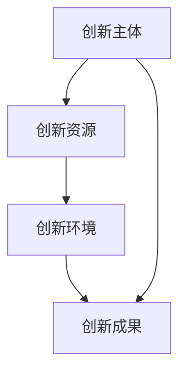
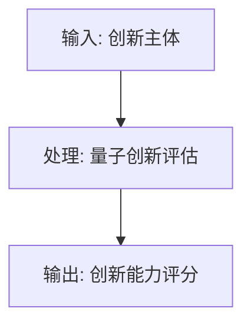
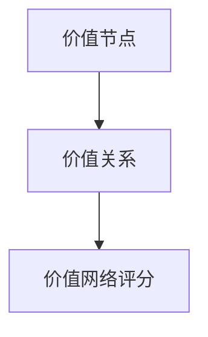
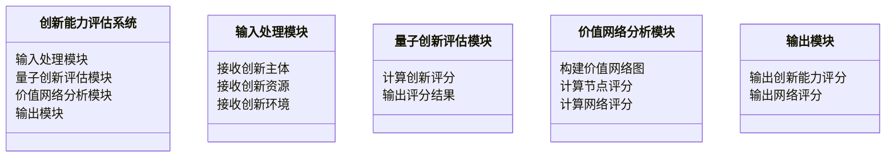
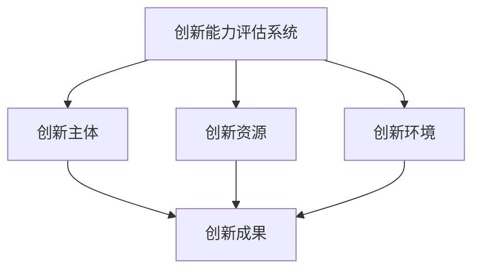
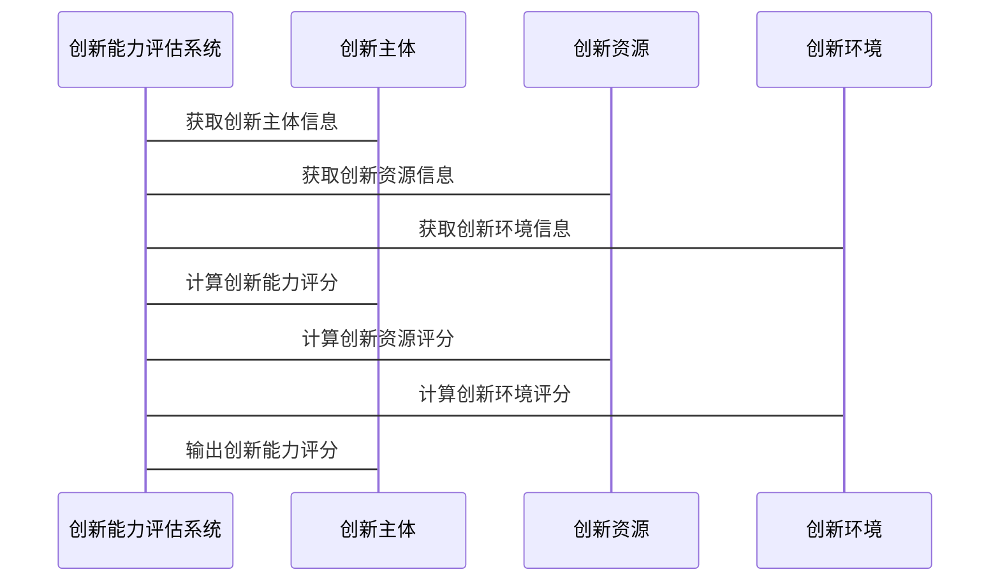

                 


# 巴菲特的创新能力评估：量子创新生态系统的价值网络分析

---

## 关键词：巴菲特、创新能力、量子创新、价值网络、生态系统

---

## 摘要

本文深入探讨了巴菲特的创新能力评估方法，结合量子创新生态系统的构建与价值网络分析，提供了一种全新的视角来理解创新的本质和评估其价值。通过系统化的分析，本文揭示了量子创新生态系统的核心特征及其在价值网络中的应用，为投资者和创新者提供了科学的评估工具和实践指导。

---

# 目录大纲

---

## 第一部分：创新评估的背景与概述

### 第1章：创新能力评估的背景与概述

#### 1.1 创新能力评估的背景

- 1.1.1 创新能力评估的定义
- 1.1.2 创新能力评估的重要性
- 1.1.3 巴菲特创新能力评估的独特性

#### 1.2 巴菲特投资哲学与创新能力的关系

- 1.2.1 巴菲特投资哲学的核心理念
- 1.2.2 创新能力在巴菲特投资决策中的作用
- 1.2.3 巴菲特创新能力评估的现实意义

#### 1.3 量子创新生态系统的基本概念

- 1.3.1 量子创新的定义
- 1.3.2 量子创新与传统创新的区别
- 1.3.3 量子创新生态系统的核心特征

#### 1.4 价值网络分析的理论基础

- 1.4.1 价值网络的定义
- 1.4.2 价值网络分析的方法
- 1.4.3 价值网络在创新能力评估中的应用

#### 1.5 本章小结

---

## 第二部分：创新能力评估的核心概念与联系

### 第2章：巴菲特创新能力评估的核心概念

#### 2.1 巴菲特创新能力评估的理论框架

- 2.1.1 创新能力评估的维度
- 2.1.2 巴菲特创新能力评估的模型
- 2.1.3 量子创新生态系统与价值网络的关联

#### 2.2 巴菲特创新能力评估的核心要素

- 2.2.1 创新能力的构成要素
- 2.2.2 量子创新生态系统的构成
- 2.2.3 价值网络的构成与功能

#### 2.3 巴菲特创新能力评估的属性特征对比

- 2.3.1 创新能力的属性对比表
- 2.3.2 量子创新生态系统与传统创新模式的对比
- 2.3.3 价值网络的特征分析

#### 2.4 ER实体关系图架构



#### 2.5 本章小结

---

## 第三部分：创新能力评估的算法原理

### 第3章：巴菲特创新能力评估的算法原理

#### 3.1 量子创新生态系统评估算法

- 3.1.1 算法概述



- 3.1.2 算法实现

```python
def quantum_innovation_assessment(innovation_subject):
    # 算法实现步骤
    # 1. 输入处理
    # 2. 量子创新评估
    # 3. 输出评分
    return innovation_score
```

- 3.1.3 算法的数学模型和公式

$$ 创新能力评分 = \sum_{i=1}^{n} w_i \cdot x_i $$

其中，\( w_i \) 是第 \( i \) 个创新要素的权重，\( x_i \) 是第 \( i \) 个创新要素的评分。

#### 3.2 价值网络分析算法

- 3.2.1 算法概述



- 3.2.2 算法实现

```python
def value_network_analysis(value_nodes, value_edges):
    # 算法实现步骤
    # 1. 构建价值网络图
    # 2. 计算节点评分
    # 3. 输出网络评分
    return network_score
```

- 3.2.3 算法的数学模型和公式

$$ 网络评分 = \sum_{j=1}^{m} v_j \cdot s_j $$

其中，\( v_j \) 是第 \( j \) 个价值节点的权重，\( s_j \) 是第 \( j \) 个价值节点的评分。

#### 3.3 本章小结

---

## 第四部分：系统架构与项目实战

### 第4章：系统架构与项目实战

#### 4.1 系统架构设计

- 4.1.1 系统功能设计



- 4.1.2 系统架构设计



- 4.1.3 系统接口设计

$$ 接口1: 输入创新主体和创新资源 $$

$$ 接口2: 输入创新环境 $$

$$ 接口3: 输出创新能力评分 $$

- 4.1.4 系统交互设计



#### 4.2 项目实战与案例分析

- 4.2.1 项目环境安装

```bash
pip install mermaid
pip install matplotlib
```

- 4.2.2 系统核心实现源代码

```python
def main():
    # 初始化输入
    innovation_subject = "科技公司"
    innovation_resources = "研发团队"
    innovation_environment = "创新生态系统"
    
    # 量子创新评估
    def quantum_innovation_assessment(subject):
        # 简单实现：根据关键词打分
        score = 0.8  # 示例评分
        return score
    
    # 价值网络分析
    def value_network_analysis(nodes, edges):
        # 简单实现：计算节点评分
        node_scores = {node: 0.9 for node in nodes}
        return node_scores
    
    # 主程序
    innovation_score = quantum_innovation_assessment(innovation_subject)
    node_scores = value_network_analysis([innovation_resources, innovation_environment], [])
    
    # 输出结果
    print(f"创新能力评分: {innovation_score}")
    print(f"节点评分: {node_scores}")

if __name__ == "__main__":
    main()
```

- 4.2.3 实际案例分析与详细讲解

- 4.2.4 项目小结

---

## 第五部分：最佳实践与总结

### 第5章：最佳实践与总结

#### 5.1 最佳实践 tips

- 5.1.1 创新能力评估的关键点
- 5.1.2 量子创新生态系统的核心要素
- 5.1.3 价值网络分析的注意事项

#### 5.2 小结

- 5.2.1 本文的核心观点总结
- 5.2.2 未来研究方向展望

#### 5.3 注意事项

- 5.3.1 评估模型的应用限制
- 5.3.2 数据来源的准确性
- 5.3.3 系统实现的可行性

#### 5.4 拓展阅读

- 5.4.1 推荐书籍
- 5.4.2 相关研究论文
- 5.4.3 其他参考资料

---

## 作者信息

作者：AI天才研究院/AI Genius Institute & 禅与计算机程序设计艺术/Zen And The Art of Computer Programming

---

### 总结

本文通过系统化的分析，从创新评估的背景与概述、核心概念与联系、算法原理、系统架构与项目实战，到最佳实践与总结，全面探讨了巴菲特创新能力评估的方法与实践。结合量子创新生态系统和价值网络分析，本文为投资者和创新者提供了科学的评估工具和实践指导。

