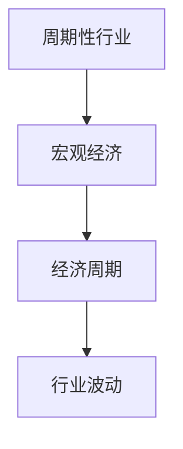
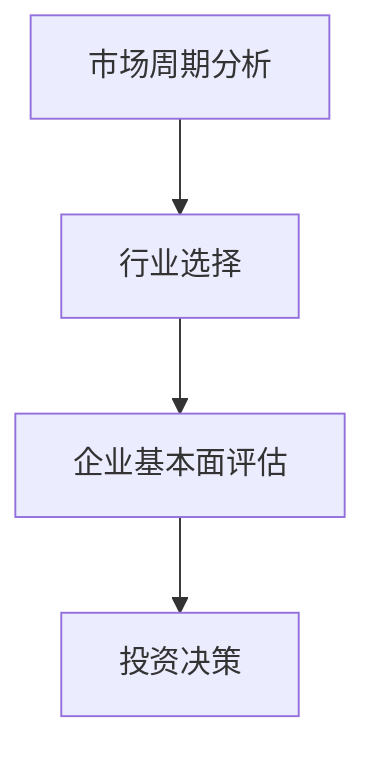
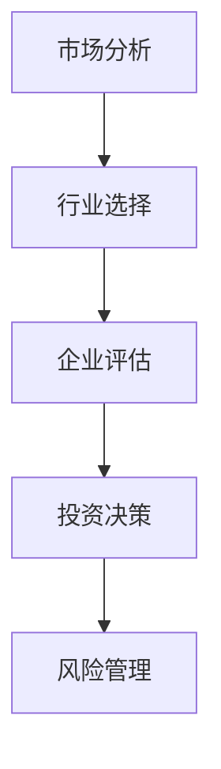

                 


# 巴菲特的周期性行业投资策略：把握时机的重要性

## 关键词：巴菲特，周期性行业，投资策略，时机，价值投资，风险管理

## 摘要：本文深入探讨巴菲特在周期性行业中的投资策略，分析如何通过把握时机实现长期收益最大化。结合巴菲特的经典案例，详细解析周期性行业的特点、投资策略的核心原理、系统分析架构设计以及实际项目中的应用，提供实用的投资建议和风险管理策略。

---

## 第一章：周期性行业的定义与特点

### 1.1 周期性行业的定义

周期性行业是指那些受到经济周期波动显著影响的行业，其需求和业绩在经济繁荣与衰退之间呈现周期性变化。这类行业通常包括原材料、能源、汽车制造、房地产和科技硬件制造等。

- **周期性行业的概念**：周期性行业的收益和股票价格与经济周期高度相关，通常在经济扩张时表现优异，而在经济衰退时则会大幅下降。
- **周期性行业的分类**：
  - **强周期性行业**：如原材料和能源行业，受经济波动影响较大。
  - **弱周期性行业**：如公用事业和消费品行业，受经济波动影响相对较小。
- **周期性行业的波动性特征**：周期性行业在经济周期的不同阶段表现出显著的波动性，这种波动性为投资者提供了套利机会。

### 1.2 巴菲特的投资理念

巴菲特是价值投资的倡导者，他注重企业内在价值，追求以合理价格投资于具备长期竞争优势的企业。在周期性行业中，巴菲特关注行业周期的低谷阶段，寻找那些在周期底部具有低估价值的企业进行投资。

- **价值投资哲学**：巴菲特认为市场先生的情绪波动为投资者提供了低价买入优质资产的机会。他倾向于在市场恐慌时买入优质资产，而在市场狂热时卖出。
- **周期性行业的关注点**：巴菲特关注行业周期的波动性、企业的财务状况、竞争优势和管理层质量。他倾向于在行业周期底部买入低估的优质企业。
- **投资策略的核心要素**：巴菲特的投资策略包括对企业基本面的深入分析、对行业周期的准确判断以及对市场情绪的有效把握。

---

## 第二章：周期性行业的核心概念与联系

### 2.1 周期性行业的核心要素

周期性行业的核心要素包括行业周期性、供需关系和财务指标。

- **行业周期性**：行业周期性是指行业随着经济周期波动而呈现出的周期性变化。行业周期通常分为复苏、增长、成熟和衰退四个阶段。
- **供需关系**：周期性行业的供需关系受到经济周期的影响，通常在经济扩张期需求增加，而在经济衰退期需求减少。
- **财务指标分析**：周期性行业的财务指标分析包括盈利能力、偿债能力、运营效率和成长能力等。巴菲特通常关注企业的ROE（净资产收益率）和ROA（资产收益率）等指标。

### 2.2 核心概念的联系

周期性行业与宏观经济的实体关系可以通过以下mermaid图表示：



---

## 第三章：巴菲特周期性行业投资策略的核心原理

### 3.1 巴菲特周期性投资策略的算法原理

巴菲特的周期性投资策略可以通过以下mermaid图表示：



该策略的核心步骤包括：

1. **市场周期分析**：分析当前经济周期所处的阶段，判断市场的整体趋势。
2. **行业选择**：根据市场周期选择具有长期竞争优势和低估价值的行业。
3. **企业基本面评估**：深入分析企业的财务状况、竞争优势和管理层质量，评估企业的内在价值。
4. **投资决策**：根据市场周期和企业基本面分析结果，做出买入、持有或卖出的投资决策。

### 3.2 投资策略的数学模型

巴菲特的投资策略中，内在价值的计算是关键。内在价值可以通过以下公式进行估算：

$$
\text{内在价值} = \frac{\text{息税前利润}}{\text{资本成本}}
$$

此外，巴菲特还强调安全边际的重要性，即以低于内在价值的价格买入资产。安全边际可以通过以下公式计算：

$$
\text{安全边际} = \text{内在价值} - \text{市场价格}
$$

---

## 第四章：周期性行业投资的系统分析与架构设计

### 4.1 问题场景介绍

周期性行业的投资需要考虑以下几个问题：

- **经济周期波动对企业的影响**：经济周期波动会影响企业的收入、利润和股价。
- **市场情绪对投资决策的影响**：市场情绪的波动可能导致投资者在市场高点买入而在市场低点卖出。

### 4.2 系统架构设计

周期性行业投资的系统架构设计可以通过以下mermaid图表示：



该系统架构设计包括以下几个步骤：

1. **市场分析**：分析当前市场周期和宏观经济环境。
2. **行业选择**：根据市场周期和宏观经济环境选择具有长期竞争优势和低估价值的行业。
3. **企业评估**：深入分析企业的财务状况、竞争优势和管理层质量，评估企业的内在价值。
4. **投资决策**：根据市场周期和企业基本面分析结果，做出买入、持有或卖出的投资决策。
5. **风险管理**：通过分散投资、设置止损点和定期调整投资组合等方式管理投资风险。

---

## 第五章：周期性行业投资的项目实战

### 5.1 环境安装

为了进行周期性行业投资分析，需要安装以下工具：

- **数据收集工具**：Excel、Python（pandas库）
- **分析工具**：投资分析软件（如Morningstar、S&P Global Market Intelligence）

### 5.2 核心实现

以下是周期性行业投资分析的Python代码示例：

```python
import pandas as pd

def analyze_industry(data):
    # 计算ROE
    roe = data['净利润'] / data['净资产']
    # 计算ROA
    roa = data['净利润'] / data['总资产']
    # 计算市盈率
    pe_ratio = data['股价'] / data['每股收益']
    # 计算市净率
    pb_ratio = data['股价'] / data['每股净资产']
    # 返回分析结果
    return pd.DataFrame({
        'ROE': roe,
        'ROA': roa,
        '市盈率': pe_ratio,
        '市净率': pb_ratio
    })

# 示例数据
data = {
    '净利润': [100, 200, 300],
    '净资产': [500, 600, 700],
    '总资产': [1000, 1200, 1400],
    '股价': [50, 60, 70],
    '每股收益': [2, 3, 4],
    '每股净资产': [10, 12, 14]
}

# 调用函数进行分析
analysis = analyze_industry(data)
print(analysis)
```

### 5.3 案例分析

以巴菲特投资的某周期性行业公司为例，分析其投资策略。

---

## 第六章：风险管理与投资建议

### 6.1 风险管理

周期性行业的投资风险主要来自市场波动和经济周期的影响。投资者可以通过以下方式管理投资风险：

- **分散投资**：将资金分散投资于不同行业和不同公司的股票，以降低投资风险。
- **设置止损点**：在股价下跌到一定程度时卖出股票，以避免更大的损失。
- **定期调整投资组合**：根据市场变化和企业基本面情况，定期调整投资组合。

### 6.2 投资建议

- **长期投资**：周期性行业的波动性较大，但长期来看，优质企业的内在价值会随着时间的推移而增长。
- **关注行业周期**：在行业周期的低谷阶段寻找低估的优质企业进行投资。
- **保持警惕**：在市场恐慌时保持冷静，避免盲目跟风。

---

## 总结与展望

巴菲特的周期性行业投资策略是一种长期价值投资策略，其核心在于通过深入分析行业周期和企业基本面，寻找低估的优质企业进行投资。本文详细介绍了周期性行业的特点、巴菲特的投资策略、系统分析架构设计以及实际项目中的应用，并提供了风险管理建议和投资建议。

未来，随着经济全球化和科技的进步，周期性行业将面临新的机遇和挑战。投资者需要不断学习和适应，以把握周期性行业的投资机会。

---

## 作者信息

作者：AI天才研究院/AI Genius Institute & 禅与计算机程序设计艺术 /Zen And The Art of Computer Programming

