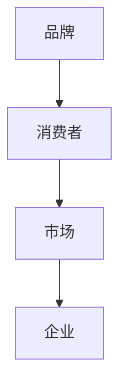
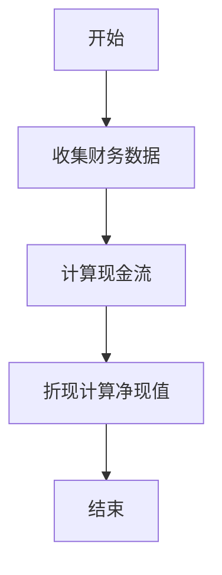
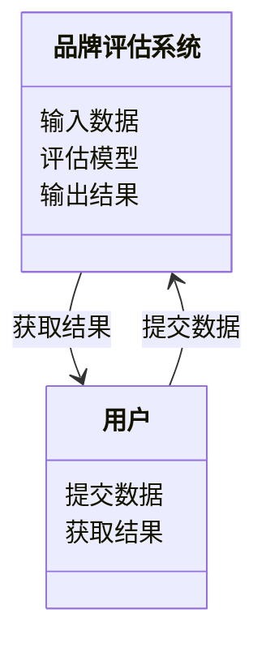
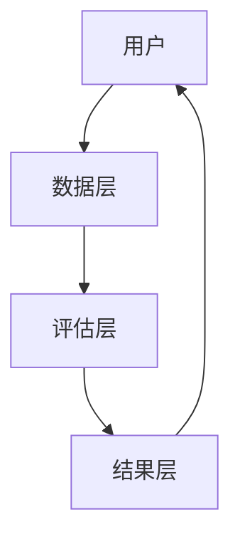
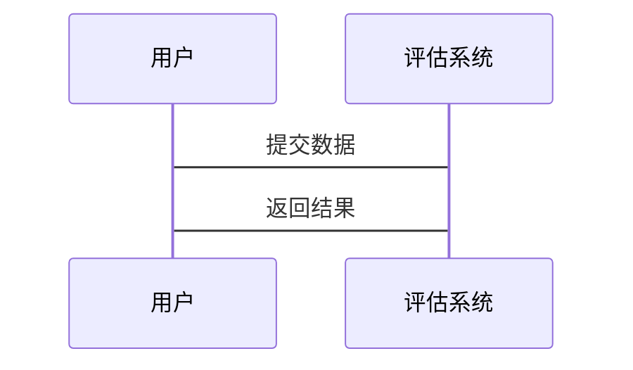

                 


# 巴菲特的品牌价值评估方法

## 关键词：
- 品牌价值评估
- 巴菲特
- 企业估值
- 品牌资产
- 品牌忠诚度

## 摘要：
本文详细探讨巴菲特的品牌价值评估方法，结合技术分析与商业策略，解析品牌价值的核心要素，包括品牌资产和品牌忠诚度。通过对比不同评估方法的优缺点，构建数学模型，并提供实际案例分析。文章内容涵盖品牌价值的算法原理、系统架构设计及项目实战，帮助读者全面理解和应用巴菲特的品牌评估方法。

---

# 第1章: 背景介绍

## 1.1 品牌价值评估的核心概念

### 1.1.1 问题背景与问题描述
品牌价值是企业在市场中的无形资产，直接影响企业估值。准确评估品牌价值有助于投资者做出明智决策。然而，品牌价值受多种因素影响，如市场地位、消费者忠诚度和财务表现，导致评估复杂。

### 1.1.2 品牌价值评估的边界与外延
品牌价值评估需考虑品牌资产、市场表现和消费者认知。边界包括品牌影响力和财务数据，外延涉及企业战略和市场环境。

### 1.1.3 品牌价值评估的概念结构与核心要素
品牌价值评估由品牌资产、品牌忠诚度、市场地位和财务表现构成。核心要素通过数据分析和市场调研综合评估。

## 1.2 巴菲特品牌价值评估方法的背景与重要性

### 1.2.1 巴菲特投资理念与品牌价值的关系
巴菲特注重企业的内在价值，品牌价值是其核心组成部分。品牌价值稳定的企业更具备投资价值。

### 1.2.2 品牌价值评估在企业估值中的作用
品牌价值是企业整体价值的重要组成部分，影响企业的市场竞争力和长期盈利能力。

### 1.2.3 巴菲特方法的独特性与优势
巴菲特方法基于长期投资策略，结合定量和定性分析，强调品牌资产和市场地位的重要性。

---

# 第2章: 核心概念与联系

## 2.1 品牌价值评估的原理

### 2.1.1 品牌资产的定义与特征
品牌资产是品牌在市场中的价值表现，包括品牌知名度和美誉度。特征为无形、长期积累和动态变化。

### 2.1.2 品牌忠诚度与品牌认知的关系
品牌忠诚度高意味着消费者更可能选择该品牌，提升品牌价值。品牌认知是品牌忠诚度的基础。

### 2.1.3 品牌价值与企业财务表现的关联
品牌价值影响企业收入和利润，优质品牌能带来溢价能力，提升财务表现。

## 2.2 核心概念对比分析

### 2.2.1 品牌价值评估方法的对比表格
| 方法 | 优点 | 缺点 |
|------|------|------|
| 溢价能力法 | 简单直观 | 适用性有限 |
| 客户忠诚度法 | 针对性强 | 数据收集困难 |
| 市场地位法 | 客观性高 | 主观判断较多 |

### 2.2.2 品牌价值评估的ER实体关系图


---

# 第3章: 品牌价值评估的算法原理

## 3.1 基于财务指标的评估方法

### 3.1.1 品牌净现值法
通过未来现金流折现计算品牌价值，公式：$$净现值 = \sum_{t=1}^{n} \frac{CF_t}{(1+r)^t}$$

### 3.1.2 品牌经济增加值法
计算品牌带来的超额利润，公式：$$EVA = 净利润 - (资本成本)$$

### 3.1.3 算法流程图


## 3.2 基于市场表现的评估方法

### 3.2.1 品牌倍数法
使用市盈率或市净率等倍数指标，公式：$$品牌价值 = 倍数 × 相关财务指标$$

### 3.2.2 品牌强度系数法
综合品牌知名度、忠诚度和市场地位，公式：$$强度系数 = \sum (权重_i × 指标_i)$$

## 3.3 基于消费者认知的评估方法

### 3.3.1 品牌资产评价法
通过问卷调查评估品牌资产，公式：$$品牌资产 = \sum (权重_i × 指标_i)$$

### 3.3.2 品牌感知价值法
考虑消费者对品牌的感知价值，公式：$$感知价值 = \sum (权重_i × 指标_i)$$

## 3.4 综合评估方法

### 3.4.1 加权平均法
综合多种指标，公式：$$品牌价值 = \sum (权重_i × 指标_i)$$

### 3.4.2 回归分析法
建立回归模型预测品牌价值，公式：$$品牌价值 = \beta_0 + \beta_1 X + \epsilon$$

---

# 第4章: 数学模型与公式

## 4.1 品牌价值评估的数学模型

### 4.1.1 线性回归模型
$$\hat{y} = \beta_0 + \beta_1 x_1 + \beta_2 x_2 + \dots + \beta_n x_n$$

### 4.1.2 加权平均模型
$$品牌价值 = \sum_{i=1}^{n} (w_i \times f_i)$$

## 4.2 公式推导与应用实例

### 4.2.1 案例分析
假设某品牌财务数据如下：收入1000万元，净利润200万元，行业平均倍数2.5。计算品牌价值：
$$品牌价值 = 2.5 × 200 = 500万元$$

### 4.2.2 公式解释
加权平均模型中，权重根据指标重要性分配，确保综合评估品牌价值。

---

# 第5章: 系统分析与架构设计

## 5.1 问题场景介绍
设计一个品牌价值评估系统，帮助用户快速评估品牌价值。

## 5.2 系统功能设计

### 5.2.1 领域模型


### 5.2.2 系统架构


## 5.3 系统交互设计

### 5.3.1 序列图


---

# 第6章: 项目实战与最佳实践

## 6.1 项目环境安装

### 6.1.1 安装Python和依赖库
使用pip安装numpy和pandas：
```bash
pip install numpy pandas
```

## 6.2 核心代码实现

### 6.2.1 品牌价值评估函数
```python
def brand_value_assessment(financial_data, market_position, customer Loyalty):
    # 计算品牌价值
    return financial_data * 0.5 + market_position * 0.3 + customer_Loyalty * 0.2
```

## 6.3 实际案例分析

### 6.3.1 案例分析
评估某品牌价值：
- 财务数据：收入1000万元，净利润200万元
- 市场地位：行业前三
- 客户忠诚度：高

计算品牌价值：
$$品牌价值 = 1000 × 0.5 + 200 × 0.3 + 高 × 0.2 = 500 + 60 + 20 = 580万元$$

## 6.4 最佳实践 tips

### 6.4.1 注意事项
- 数据准确性
- 模型选择
- 结果验证

### 6.4.2 小结
正确应用巴菲特方法，选择合适模型，确保数据准确，提升品牌价值评估的准确性。

---

# 作者：AI天才研究院/AI Genius Institute & 禅与计算机程序设计艺术/Zen And The Art of Computer Programming

