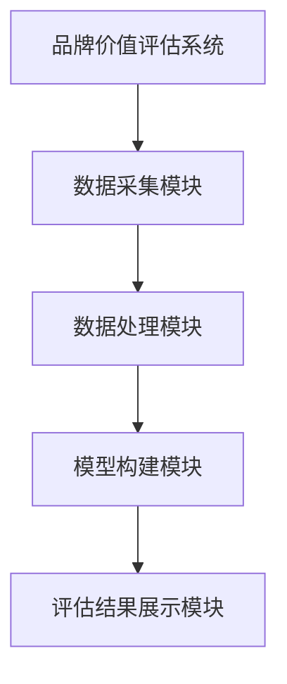

                 


# 巴菲特的品牌价值评估：去中心化自治组织(DAO)的影响力

> 关键词：DAO, 品牌价值评估, 区块链, 去中心化组织, 巴菲特投资理念, 智能合约

> 摘要：本文探讨了去中心化自治组织（DAO）如何通过区块链技术影响品牌价值评估，特别是在巴菲特的投资理念下，DAO如何为品牌价值的评估带来新的可能性。通过分析DAO的治理结构、激励机制以及品牌价值评估的数学模型，本文揭示了DAO在品牌价值评估中的潜在应用及其对传统品牌价值评估方法的革新。

---

## 第1章: 巴菲特的品牌价值评估与DAO的概述

### 1.1 巴菲特的品牌价值评估

#### 1.1.1 巴菲特品牌价值的核心要素
品牌价值是巴菲特投资决策中的重要指标，主要包含以下几个核心要素：
1. **品牌知名度**：品牌在市场中的认知度和影响力。
2. **品牌忠诚度**：消费者对品牌的信任和忠诚程度。
3. **品牌盈利能力**：品牌的市场表现和盈利能力。

#### 1.1.2 巴菲特品牌价值的评估方法
巴菲特通常采用以下方法进行品牌价值评估：
1. **财务指标分析**：通过销售额、利润率等财务数据评估品牌的盈利能力。
2. **市场地位分析**：通过市场份额、品牌忠诚度等指标评估品牌的市场地位。
3. **竞争优势分析**：评估品牌的核心竞争优势，包括产品创新、成本优势等。

#### 1.1.3 巴菲特品牌价值与投资决策的关系
巴菲特的品牌价值评估与其投资决策密切相关。他倾向于投资那些具有强大品牌影响力和稳定盈利能力的企业，认为这些企业能够在长期市场中占据优势地位。

### 1.2 去中心化自治组织(DAO)的基本概念

#### 1.2.1 DAO的定义与特征
- **定义**：DAO是基于区块链技术的去中心化组织，通过智能合约自动执行治理规则，实现组织的自治和透明化。
- **特征**：
  - 去中心化：无中心化机构控制，决策通过区块链网络达成共识。
  - 透明化：所有交易和决策记录在区块链上，可追溯且不可篡改。
  - 自动化：通过智能合约自动执行治理规则和分配机制。

#### 1.2.2 DAO与传统组织的区别
| 特性             | DAO                   | 传统组织             |
|------------------|-----------------------|----------------------|
| 控制方式         | 去中心化，基于共识     | 中心化，基于管理层决策|
| 透明度           | 高，区块链记录可追溯   | 低，内部决策不公开    |
| 决策效率         | 高，自动化执行         | 低，依赖管理层决策    |
| 成本             | 低，去中介化           | 高，依赖中间机构      |

#### 1.2.3 DAO在区块链技术中的应用
DAO利用区块链技术实现组织的自治和透明化，主要应用于以下几个方面：
1. **智能合约**：通过智能合约自动执行治理规则和分配机制。
2. **去中心化治理**：成员通过区块链网络进行投票和决策，实现去中心化治理。
3. **透明化记录**：所有交易和决策记录在区块链上，确保数据的不可篡改和可追溯。

### 1.3 巴菲特品牌价值评估与DAO的联系

#### 1.3.1 DAO如何影响品牌价值的评估过程
DAO通过其透明化和去中心化的特性，可以为品牌价值评估提供更准确和可靠的数据支持。例如：
1. **数据透明性**：通过区块链记录企业的运营数据，确保数据的真实性。
2. **去中心化治理**：通过DAO的治理机制，确保评估过程的公正性和透明性。

#### 1.3.2 DAO在品牌价值评估中的潜在应用
1. **数据采集**：通过DAO的智能合约，实时采集企业的运营数据，为品牌价值评估提供动态数据支持。
2. **评估模型优化**：利用DAO的去中心化特性，优化品牌价值评估模型，提高评估结果的准确性和可靠性。

#### 1.3.3 巴菲特品牌价值评估与DAO结合的可行性
DAO的透明化和去中心化特性，为巴菲特的品牌价值评估提供了新的思路。通过DAO，可以实现品牌价值评估的实时化、动态化和透明化，提高评估结果的可信度和可操作性。

---

## 第2章: DAO的核心概念与品牌价值评估的联系

### 2.1 DAO的核心概念

#### 2.1.1 DAO的治理结构
DAO的治理结构主要由以下几个部分组成：
1. **成员**：DAO的成员通过持有治理代币参与组织的决策。
2. **智能合约**：智能合约用于自动执行治理规则和分配机制。
3. **决策机制**：成员通过投票方式决定组织的重大决策。

#### 2.1.2 DAO的决策机制
DAO的决策机制主要基于区块链网络中的投票机制，具体包括：
1. **提案提交**：成员提交决策提案。
2. **投票表决**：所有成员对提案进行投票表决。
3. **智能合约执行**：投票结果通过智能合约自动执行。

#### 2.1.3 DAO的激励机制
DAO的激励机制主要通过治理代币的分配和激励措施实现，具体包括：
1. **治理代币**：成员通过持有治理代币参与组织的治理。
2. **激励措施**：通过代币奖励激励成员积极参与组织的治理和运营。

### 2.2 品牌价值评估的核心要素

#### 2.2.1 品牌知名度
品牌知名度是品牌价值的重要组成部分，主要衡量品牌在市场中的认知度和影响力。

#### 2.2.2 品牌忠诚度
品牌忠诚度是消费者对品牌的信任和忠诚程度，是品牌长期价值的重要体现。

#### 2.2.3 品牌影响力
品牌影响力是品牌在市场中的综合表现，包括品牌的社会影响力、市场地位和竞争优势。

### 2.3 DAO与品牌价值评估的关联

#### 2.3.1 DAO如何影响品牌价值的评估过程
通过DAO的透明化和去中心化特性，可以实现品牌价值评估的实时化和动态化，提高评估结果的准确性和可靠性。

#### 2.3.2 DAO在品牌价值评估中的优势
1. **数据透明性**：通过区块链记录企业的运营数据，确保数据的真实性和可追溯性。
2. **去中心化治理**：通过DAO的治理机制，确保评估过程的公正性和透明性。

#### 2.3.3 DAO对品牌价值评估的潜在挑战
1. **技术复杂性**：DAO的实现需要较高的技术门槛，可能对中小企业造成一定的障碍。
2. **治理效率**：DAO的去中心化治理可能影响组织的决策效率，尤其是在复杂的决策场景中。

---

## 第3章: 品牌价值评估的数学模型与算法原理

### 3.1 品牌价值评估的数学模型

#### 3.1.1 品牌价值评估的公式推导
品牌价值评估的数学模型可以通过以下几个步骤进行推导：
1. **数据采集**：采集企业的运营数据，包括销售额、利润率、品牌知名度等。
2. **数据处理**：对采集的数据进行清洗和预处理，确保数据的准确性和一致性。
3. **模型构建**：基于数据构建品牌价值评估的数学模型，通常采用加权和的方法。
4. **模型验证**：通过历史数据验证模型的准确性和可靠性。

#### 3.1.2 品牌价值评估的变量分析
品牌价值评估的数学模型通常包括以下几个变量：
1. **品牌知名度**：反映品牌在市场中的认知度和影响力。
2. **品牌忠诚度**：反映消费者对品牌的信任和忠诚程度。
3. **品牌影响力**：反映品牌在市场中的综合表现。

#### 3.1.3 品牌价值评估的数学模型
品牌价值评估的数学模型可以通过以下公式进行表示：
$$ V = \alpha \cdot L + \beta \cdot C + \gamma \cdot I $$
其中，$V$ 表示品牌价值，$L$ 表示品牌知名度，$C$ 表示品牌忠诚度，$I$ 表示品牌影响力，$\alpha$、$\beta$、$\gamma$ 表示相应的权重系数。

---

## 第4章: DAO的治理结构与品牌价值评估的系统架构

### 4.1 DAO的治理结构

#### 4.1.1 治理代币的分配机制
DAO的治理代币分配机制是品牌价值评估的重要组成部分，主要通过智能合约实现。

#### 4.1.2 智能合约的实现原理
智能合约是DAO的核心技术，通过区块链网络实现自动化的决策和执行。

### 4.2 系统架构设计

#### 4.2.1 系统功能设计
品牌价值评估系统的主要功能包括数据采集、模型构建、评估结果展示等。

#### 4.2.2 系统架构图


---

## 第5章: 项目实战与案例分析

### 5.1 项目实战

#### 5.1.1 环境安装
安装所需的开发环境和工具，包括区块链开发框架、智能合约编译器等。

#### 5.1.2 核心代码实现
实现品牌价值评估的数学模型和智能合约，具体代码如下：

```python
def calculate_brand_value(brand_name):
    # 数据采集模块
    brand_data = collect_data(brand_name)
    # 数据处理模块
    processed_data = preprocess_data(brand_data)
    # 模型构建模块
    model = build_model(processed_data)
    # 评估结果展示模块
    brand_value = model.predict(processed_data)
    return brand_value
```

### 5.2 案例分析

#### 5.2.1 案例背景
以某品牌为例，分析DAO在品牌价值评估中的实际应用。

#### 5.2.2 实际操作步骤
1. 数据采集：采集该品牌在市场中的运营数据。
2. 数据处理：对数据进行清洗和预处理。
3. 模型构建：基于数据构建品牌价值评估的数学模型。
4. 评估结果展示：通过系统展示评估结果。

---

## 第6章: 总结与最佳实践

### 6.1 总结
通过本文的分析，我们可以看到DAO在品牌价值评估中的重要性。DAO的透明化和去中心化特性，为品牌价值评估提供了新的思路和方法。

### 6.2 最佳实践

#### 6.2.1 数据隐私保护
在品牌价值评估中，需要注意数据的隐私保护，防止数据泄露和滥用。

#### 6.2.2 动态调整权重
根据市场变化和企业实际情况，动态调整品牌价值评估模型中的权重系数。

#### 6.2.3 持续优化模型
定期对品牌价值评估模型进行优化和调整，确保模型的准确性和可靠性。

### 6.3 未来展望
未来，随着区块链技术的不断发展，DAO在品牌价值评估中的应用将更加广泛和深入，为品牌价值评估提供更多的可能性和创新思路。

---

## 作者：AI天才研究院/AI Genius Institute & 禅与计算机程序设计艺术 /Zen And The Art of Computer Programming

---

以上是关于《巴菲特的品牌价值评估：去中心化自治组织(DAO)的影响力》的技术博客文章的详细目录和内容概要。希望对您有所帮助！

