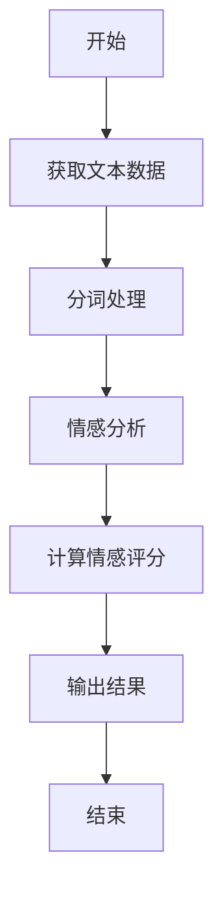
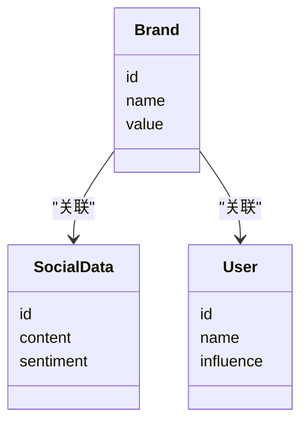
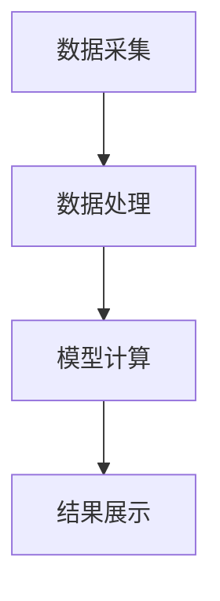
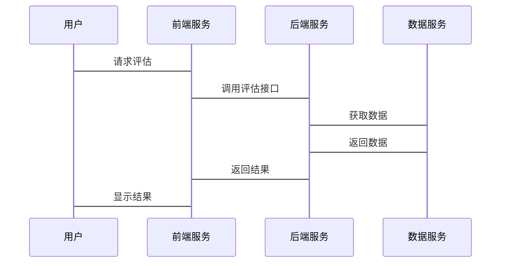

                 


# 巴菲特的品牌价值评估：社交媒体影响力的量化

## 关键词：品牌价值，社交媒体影响力，巴菲特投资理念，情感分析，传播广度，影响力评估，系统架构设计

## 摘要：本文通过分析巴菲特的投资理念，探讨如何利用社交媒体影响力量化品牌价值。结合技术与商业的视角，提出基于情感分析和传播广度的量化模型，并通过系统架构设计和项目实战，展示如何在实际中应用这些方法进行品牌价值评估。

---

# 第一部分: 巴菲特的品牌价值评估基础

## 第1章: 品牌价值与社交媒体影响力概述

### 1.1 品牌价值的定义与重要性

#### 1.1.1 品牌价值的定义
品牌价值是指品牌在市场中所能带来的经济价值和附加价值。它不仅包括品牌知名度和美誉度，还包括品牌忠诚度和市场影响力。

#### 1.1.2 品牌价值的核心要素
- **品牌知名度**：品牌在目标市场中的认知程度。
- **品牌美誉度**：消费者对品牌的好坏评价。
- **品牌忠诚度**：消费者对品牌的长期支持程度。

#### 1.1.3 品牌价值与企业长期发展的关系
品牌价值是企业长期发展的核心驱动力之一，直接影响企业的市场地位、客户忠诚度和盈利能力。

---

### 1.2 社交媒体影响力的核心特征

#### 1.2.1 社交媒体的定义
社交媒体是指基于互联网的互动平台，用户可以在这些平台上分享信息、建立关系和互动。

#### 1.2.2 社交媒体影响力的核心特征
- **用户参与度**：用户在社交媒体上的互动频率。
- **内容传播度**：内容在社交媒体上的扩散范围。
- **情感分析**：用户对品牌的情感倾向（正面、中性、负面）。

#### 1.2.3 品牌价值与社交媒体影响力的关系
社交媒体影响力是品牌价值的重要组成部分，通过社交媒体可以实时监测品牌声誉和市场反馈。

---

### 1.3 巴菲特投资理念与品牌价值评估

#### 1.3.1 巴菲特投资理念的核心思想
巴菲特强调长期投资、价值投资和基本面分析，注重企业的内在价值和竞争优势。

#### 1.3.2 品牌价值在巴菲特投资中的重要性
品牌价值是企业长期竞争优势的重要体现，巴菲特在评估企业时会重点关注品牌的价值和稳定性。

#### 1.3.3 巴菲特品牌价值评估方法的启示
通过长期观察和分析，巴菲特的方法强调了品牌价值的稳定性、可靠性和长期增长潜力。

---

## 第2章: 品牌价值与社交媒体影响力的核心概念

### 2.1 品牌价值的核心要素

#### 2.1.1 品牌知名度
品牌知名度是品牌被消费者认知和提及的频率，直接影响品牌的市场影响力。

#### 2.1.2 品牌美誉度
品牌美誉度是消费者对品牌的好坏评价，直接影响品牌的价值和市场地位。

#### 2.1.3 品牌忠诚度
品牌忠诚度是消费者对品牌的长期支持程度，是品牌价值的重要体现。

---

### 2.2 社交媒体影响力的关键指标

#### 2.2.1 用户参与度
用户参与度包括点赞、评论、分享等互动行为，反映了用户对品牌的兴趣和关注度。

#### 2.2.2 内容传播度
内容传播度是内容在社交媒体上的扩散范围，反映了品牌的影响力和传播效果。

#### 2.2.3 情感分析
情感分析通过自然语言处理技术，分析用户对品牌的情感倾向，帮助品牌了解市场反馈。

---

### 2.3 品牌价值与社交媒体影响力的对比分析

#### 2.3.1 概念对比表

| **核心要素**   | **品牌价值**             | **社交媒体影响力**         |
|----------------|--------------------------|-----------------------------|
| **定义**       | 品牌在市场中的经济价值   | 用户在社交媒体上的互动程度 |
| **核心指标**   | 品牌忠诚度、美誉度       | 用户参与度、传播度           |
| **影响因素**   | 产品质量、服务、声誉     | 用户互动、内容传播、情感倾向 |

#### 2.3.2 ER实体关系图

```mermaid
erDiagram
    brand {
        id
        name
        value
    }
    social_influence {
        id
        metric
        sentiment
    }
    brand --|{n} social_influence : "评估"
```

---

## 第3章: 社交媒体影响力量化的核心算法

### 3.1 社交媒体影响力量化模型

#### 3.1.1 模型输入
- 用户互动数据（点赞、评论、分享）
- 用户情感倾向数据（正面、中性、负面）

#### 3.1.2 模型输出
- 品牌影响力评分（1-10分）
- 品牌情感指数（-1到1）

#### 3.1.3 模型训练数据
- 历史品牌数据
- 用户行为数据
- 市场反馈数据

---

### 3.2 基于情感分析的影响力评分算法

#### 3.2.1 情感分析算法原理
情感分析算法通过自然语言处理技术，判断文本中的情感倾向。

#### 3.2.2 基于情感强度的加权评分系统
$$ sentiment\_score = \sum (weight \times emotion\_value) $$

其中，`weight`是情感词的权重，`emotion\_value`是情感值（1为正面，-1为负面）。

#### 3.2.3 算法流程图



---

### 3.3 基于传播广度的影响力评估算法

#### 3.3.1 传播广度的计算公式
$$ spread\_score = \frac{\text{转发数 + 评论数 + 点赞数}}{\text{总用户数}} \times 100 $$

#### 3.3.2 基于传播路径的权重分配
- 初始传播：权重为1
- 二次传播：权重为0.8
- 三次传播：权重为0.6

#### 3.3.3 算法优化策略
- 突出用户权重：高影响力用户传播权重更高。
- 时间衰减：传播时间越长，权重越低。

---

## 第4章: 品牌价值评估的系统架构设计

### 4.1 系统功能设计

#### 4.1.1 领域模型设计


#### 4.1.2 功能模块划分
- 数据采集模块：采集社交媒体数据。
- 数据处理模块：清洗和预处理数据。
- 模型计算模块：计算品牌影响力评分。
- 结果展示模块：可视化展示评估结果。

#### 4.1.3 模块交互流程


---

### 4.2 系统架构设计

#### 4.2.1 分层架构设计
- 数据层：数据存储和管理。
- 业务逻辑层：处理用户请求和业务逻辑。
- 表现层：展示结果和用户界面。

#### 4.2.2 微服务架构设计
- 前端服务：处理用户请求。
- 后端服务：处理数据和业务逻辑。
- 数据服务：存储和管理数据。

#### 4.2.3 系统交互图


---

## 第5章: 项目实战与案例分析

### 5.1 环境安装与配置

#### 5.1.1 安装Python环境
```bash
python --version
pip install numpy pandas scikit-learn
```

#### 5.1.2 安装社交媒体API
```bash
pip install tweepy requests
```

---

### 5.2 核心代码实现

#### 5.2.1 数据采集代码
```python
import tweepy

def get_tweets(api, query, count=100):
    tweets = []
    for tweet in tweepy.Cursor(api.search, query=query).items(count):
        tweets.append(tweet.text)
    return tweets
```

#### 5.2.2 情感分析代码
```python
from sklearn.feature_extraction.text import TfidfVectorizer
from sklearn.svm import SVC

vectorizer = TfidfVectorizer()
model = SVC()
```

---

### 5.3 案例分析与结果解读

#### 5.3.1 案例背景
假设评估某品牌在社交媒体上的影响力。

#### 5.3.2 数据处理
清洗数据并提取情感特征。

#### 5.3.3 模型计算
计算品牌影响力评分和情感指数。

#### 5.3.4 结果解读
展示评估结果并分析品牌表现。

---

## 第6章: 最佳实践与总结

### 6.1 小结
本文通过技术与商业的结合，提出了基于社交媒体影响力的品牌价值量化方法，为品牌评估提供了新思路。

### 6.2 注意事项
- 数据质量：确保数据准确性和完整性。
- 模型优化：根据实际需求调整模型参数。
- 风险控制：关注品牌声誉和市场反馈。

### 6.3 未来展望
随着技术的进步，社交媒体影响力评估将更加精准和智能化。

---

## 作者：AI天才研究院 & 禅与计算机程序设计艺术

