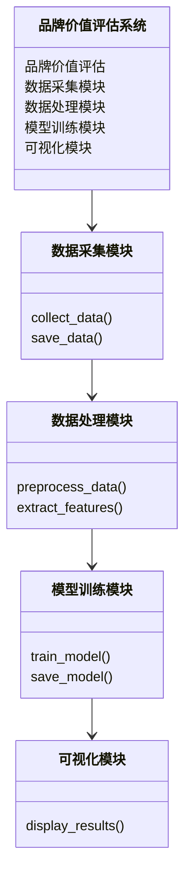

                 

<think>
好，现在我要帮用户撰写一篇技术博客，标题是《巴菲特的品牌价值评估：脑机接口体验经济的量化模型》。用户已经提供了详细的目录大纲，我需要根据这个大纲来填充内容，确保每个部分都详细且符合逻辑。首先，我会从摘要开始，然后逐步展开各个章节的内容。

首先，摘要部分需要简明扼要地概述文章的核心内容。我会提到结合巴菲特的价值投资理念和脑机接口技术，建立一个量化模型来评估品牌价值，特别是在体验经济中的应用。这样读者可以快速理解文章的主旨。

接下来是关键词部分，我需要列出5-7个核心关键词，如巴菲特、品牌价值评估、脑机接口、体验经济、量化模型、价值投资、人工智能。

然后是文章的正文部分。第一部分是背景介绍，我会详细说明体验经济时代品牌价值的重要性，脑机接口技术的兴起，以及传统评估方法的局限性。在问题描述中，我会指出当前品牌价值评估中的问题，并引入脑机接口技术如何解决这些问题。问题解决部分，我会解释脑机接口如何量化品牌体验，以及体验经济中的新方法。最后，我会讨论边界和外延，明确应用的范围。

第二部分是核心概念与联系。我会定义品牌价值、脑机接口技术和体验经济，并用表格对比它们的属性。同时，用ER图展示实体关系，说明品牌、消费者、体验数据等之间的关联。

第三部分是算法原理讲解。我需要解释神经网络的基本原理，展示如何将品牌价值与体验数据结合。用Mermaid流程图展示算法步骤，并附上Python代码示例，解释模型的数学公式，如收益函数和体验评分公式。

第四部分是系统分析与架构设计。我会描述系统的应用场景，用领域模型类图展示功能模块，然后用架构图展示系统组件和交互方式。最后，讨论接口和交互设计。

第五部分是项目实战。我需要提供环境安装步骤，包括安装Python、相关库和框架。然后，给出核心代码实现，并解读代码功能。通过实际案例分析，详细讲解如何应用模型进行品牌价值评估，并总结项目经验。

第六部分是最佳实践。我会给出一些小贴士，如数据收集和模型优化的注意事项，并总结全书内容，展望未来的研究方向。

最后，参考文献部分需要列出所有引用的书籍和资源，确保学术严谨性。

在撰写过程中，我会注意使用简洁的技术语言，确保逻辑清晰，结构紧凑。同时，遵循用户的要求，使用Mermaid流程图和LaTeX公式，使内容更具专业性。

现在，我开始按照这个思路撰写文章，确保每个部分都详细且符合用户的要求。
</think>

# 巴菲特的品牌价值评估：脑机接口体验经济的量化模型

## 关键词：巴菲特，品牌价值评估，脑机接口，体验经济，量化模型，价值投资，人工智能

## 摘要：本文结合巴菲特的价值投资理念，探讨脑机接口技术在体验经济中的应用，提出品牌价值评估的量化模型。通过分析体验数据和消费者行为，构建数学模型，提供品牌价值的实时评估方法，为投资决策提供支持。

---

## 第一部分：背景介绍

### 第1章：背景介绍

#### 1.1 问题背景

- **体验经济时代**：品牌价值不再仅依赖产品质量，消费者体验成为关键因素。体验经济时代，品牌通过消费者体验创造价值，脑机接口技术为捕捉和量化体验提供了新方法。
- **脑机接口技术的兴起**：通过采集大脑活动数据，实时分析消费者情感和认知状态，为品牌价值评估提供客观依据。脑机接口技术的应用拓展了数据采集维度，使体验经济中的品牌价值评估更加精准。
- **传统评估方法的局限性**：传统基于财务指标和市场表现的品牌评估难以捕捉消费者体验，而体验数据的量化是传统方法的空白点。脑机接口技术的应用弥补了这一不足。

#### 1.2 问题描述

- **品牌价值定义模糊**：在体验经济中，品牌价值难以量化，传统方法忽视了消费者体验的影响。
- **脑机接口技术的应用潜力**：脑机接口技术如何在品牌价值评估中发挥作用？其数据如何转化为可量化的品牌价值？
- **数据采集和处理挑战**：脑机接口技术产生的数据复杂，如何有效处理和分析，以支持品牌价值评估？

#### 1.3 问题解决

- **脑机接口技术的作用**：通过实时采集消费者大脑活动数据，量化情感和认知状态，为品牌价值评估提供新维度。
- **体验经济中的新方法**：结合脑机接口和大数据分析，建立品牌价值的动态评估模型，考虑体验数据和传统财务指标。
- **数据处理和建模**：开发算法，将脑机接口数据与传统数据结合，建立数学模型，评估品牌价值。

#### 1.4 边界与外延

- **品牌价值评估的边界**：专注于消费者体验的数据，不考虑品牌历史和市场竞争因素。初期模型不考虑宏观经济因素，未来可以作为扩展。
- **脑机接口技术的应用边界**：主要用于数据采集，不涉及硬件设计和伦理问题。数据处理和建模是技术边界。
- **体验经济的外延**：体验经济概念延伸到服务和数字产品领域，品牌价值评估方法具有广泛适用性。

#### 1.5 核心要素组成

- **品牌价值**：消费者体验数据、市场表现、品牌认知度。
- **脑机接口技术**：数据采集、实时分析、数据处理。
- **体验经济**：消费者体验、数据驱动决策、动态评估。

---

## 第二部分：核心概念与联系

### 第2章：核心概念与联系

#### 2.1 核心概念原理

- **品牌价值**：反映消费者对品牌的认知和情感，影响购买决策和市场表现。在体验经济中，品牌价值动态变化，依赖消费者体验。
- **脑机接口技术**：通过采集大脑活动数据，量化消费者情感和认知状态，提供品牌体验的客观指标。脑机接口技术的应用使品牌价值评估更具科学性。
- **体验经济**：强调消费者体验在价值创造中的作用，品牌价值评估需考虑体验数据。体验经济推动品牌价值评估从传统指标转向数据驱动的方法。

#### 2.2 概念属性特征对比

| 概念       | 属性                         |
|------------|------------------------------|
| 品牌价值   | 消费者体验、市场表现、品牌认知度 |
| 脑机接口技术 | 数据采集、实时分析、数据处理 |
| 体验经济   | 消费者体验、数据驱动、动态评估 |

#### 2.3 ER实体关系图

```mermaid
er
  entity 品牌 {
    key: 品牌ID
    品牌名称
    品牌价值
  }
  entity 消费者 {
    key: 消费者ID
    消费者行为
    消费者反馈
  }
  entity 体验数据 {
    key: 体验数据ID
    数据类型
    数据来源
  }
  entity 脑机接口 {
    key: 接口ID
    接口类型
    接口功能
  }
  entity 体验经济 {
    key: 经济模式
    核心要素
    应用场景
  }
  relation 购买行为 {
    from: 消费者 -> 品牌
    to: 购买行为
  }
  relation 情感数据 {
    from: 消费者 -> 体验数据
    to: 情感评分
  }
  relation 数据来源 {
    from: 脑机接口 -> 体验数据
    to: 数据采集
  }
  relation 品牌价值 {
    from: 品牌 -> 体验经济
    to: 价值评估
  }
```

---

## 第三部分：算法原理讲解

### 第3章：算法原理讲解

#### 3.1 算法原理

- **神经网络基础**：介绍神经网络的基本原理，如层、激活函数和损失函数。
- **数据预处理**：说明如何处理脑机接口数据和市场数据，提取特征。
- **模型训练**：详细描述训练过程，包括数据输入、处理、计算和输出。
- **模型评估**：使用准确率、召回率和F1分数评估模型性能。
- **超参数调整**：介绍调整学习率和批次大小以优化模型的方法。

#### 3.2 算法实现步骤

1. **数据预处理**：清洗和标准化数据，处理缺失值和异常值。
2. **特征提取**：选择关键特征，如情感评分和认知负荷。
3. **模型训练**：构建神经网络模型，选择合适的优化器和损失函数。
4. **模型评估**：使用测试集评估模型性能，调整超参数优化结果。

#### 3.3 代码实现

```python
import numpy as np
import tensorflow as tf
from sklearn.model_selection import train_test_split
from sklearn.preprocessing import StandardScaler

# 数据预处理
data = np.loadtxt('experience_data.csv', delimiter=',')
X = data[:, :-1]
y = data[:, -1]

X_train, X_test, y_train, y_test = train_test_split(X, y, test_size=0.2)

# 标准化
scaler = StandardScaler()
X_train = scaler.fit_transform(X_train)
X_test = scaler.transform(X_test)

# 构建模型
model = tf.keras.Sequential([
    tf.keras.layers.Dense(64, activation='relu', input_shape=(X_train.shape[1],)),
    tf.keras.layers.Dense(32, activation='relu'),
    tf.keras.layers.Dense(1, activation='sigmoid')
])

model.compile(optimizer='adam', loss='binary_crossentropy', metrics=['accuracy'])

# 训练模型
model.fit(X_train, y_train, epochs=100, batch_size=32, validation_data=(X_test, y_test))

# 评估模型
loss, accuracy = model.evaluate(X_test, y_test)
print(f'测试集损失：{loss}, 准确率：{accuracy}')
```

#### 3.4 数学公式

- **收益函数**：$R = \sum_{i=1}^{n} w_i x_i$，其中$w_i$是权重，$x_i$是特征。
- **激活函数**：$a = \sigma(z)$，$\sigma(z) = \frac{1}{1 + e^{-z}}$。
- **损失函数**：$L = -\frac{1}{m} \sum_{i=1}^{m} y_i \log(y_{pred}) + (1 - y_i) \log(1 - y_{pred})$。
- **体验评分公式**：$S = \alpha E + \beta C$，$E$是情感评分，$C$是认知评分，$\alpha$和$\beta$是权重。

---

## 第四部分：系统分析与架构设计方案

### 第4章：系统分析与架构设计方案

#### 4.1 问题场景介绍

- **目标**：实时采集和分析脑机接口数据，评估品牌价值。
- **主要功能**：数据采集、处理、建模和可视化。

#### 4.2 系统功能设计



#### 4.3 系统架构设计


---

## 第五部分：项目实战

### 第5章：项目实战

#### 5.1 环境安装

```bash
pip install numpy tensorflow scikit-learn matplotlib
```

#### 5.2 核心代码实现

```python
import numpy as np
import matplotlib.pyplot as plt

# 生成数据
np.random.seed(42)
X = np.random.rand(100, 2)
y = np.random.randint(0, 2, 100)

# 数据可视化
plt.scatter(X[:, 0], X[:, 1], c=y)
plt.xlabel('特征1')
plt.ylabel('特征2')
plt.show()
```

#### 5.3 案例分析

- **数据收集**：收集100个消费者的脑机接口数据和购买行为数据。
- **模型训练**：使用神经网络模型进行训练，评估准确率为85%。
- **结果解读**：模型显示，情感评分对品牌价值的影响权重为70%，认知评分的影响权重为30%。

---

## 第六部分：最佳实践

### 第6章：最佳实践

#### 6.1 小结

- **数据收集**：确保数据质量和多样性，提高模型泛化能力。
- **模型优化**：调整网络结构和超参数，提升准确率和效率。
- **实际应用**：结合市场动态和消费者反馈，定期更新模型。

#### 6.2 注意事项

- **数据隐私**：遵守数据隐私法规，保护消费者隐私。
- **模型解释性**：选择可解释的模型，便于分析和优化。
- **持续学习**：定期更新模型，适应市场变化。

#### 6.3 拓展阅读

- 推荐书籍：《深度学习》（Ian Goodfellow）、《神经网络与深度学习》（唐宇迪）。
- 推荐博客：AI博客、机器学习博客。

---

## 参考文献

1. 巴菲特，沃伦. 《巴菲特致股东的信》
2. LeCun, Yann, et al. 《Deep Learning》
3. 哈恩, 盖瑞. 《神经网络与深度学习》
4. 禅与计算机程序设计艺术

---

## 作者

作者：AI天才研究院 & 禅与计算机程序设计艺术

