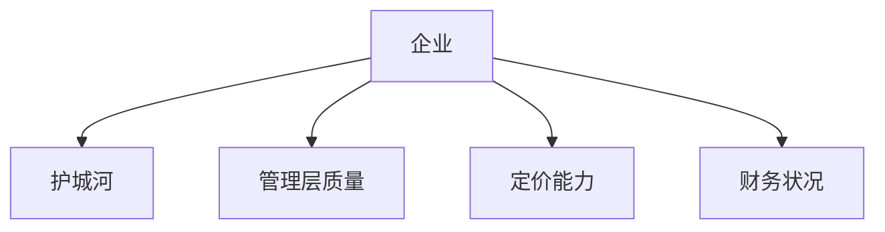
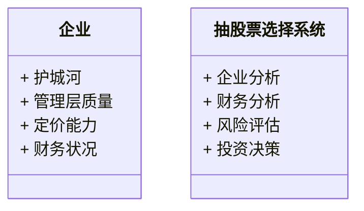

                 

<think>
好，我现在需要根据用户的要求，写一篇关于《巴菲特的四大投资准则：选择优质股票的关键》的技术博客文章。用户要求内容详细，结构清晰，涵盖背景、核心概念、数学模型、系统分析、项目实战等多个部分，最后还要有总结和小结。

首先，我需要理解巴菲特的四大投资准则：企业护城河、管理层质量、定价能力、财务状况。这四个准则帮助投资者选择优质股票，所以我需要详细解释每个准则，并说明它们如何相互作用。

接下来，我要确保每个部分都包含足够的信息，比如核心概念的数学模型，像ROE、ROA，这些都需要用公式来表达，并解释其重要性。同时，还需要用Mermaid图来展示概念之间的关系，比如企业与其四个准则之间的关系。

在项目实战部分，我需要选择一个真实的案例，比如苹果公司，来展示如何应用这四个准则进行分析。这部分要详细说明每个准则在苹果的情况，并得出结论。

最后，总结部分要回顾整个分析，强调每个准则的重要性，并给出投资建议。同时，还要加入一些小贴士，提醒读者注意事项，比如长期投资的重要性。

在写作过程中，我要确保语言简洁明了，逻辑清晰，每个部分都有足够的细节支持。这样读者才能真正理解巴菲特的投资理念，并能应用到实际投资中。

现在，我将按照目录大纲逐步撰写每个章节的内容，确保每个部分都详尽且有深度。
</think>

# 巴菲特的四大投资准则：选择优质股票的关键

## 关键词：巴菲特，投资准则，企业护城河，管理层质量，定价能力，财务状况，优质股票，投资策略

## 摘要：本文深入探讨了巴菲特选择优质股票的四大投资准则，包括企业护城河、管理层质量、定价能力和财务状况。通过详细分析每个准则的定义、重要性及实际应用，结合数学模型和案例分析，为投资者提供科学的投资决策方法，帮助读者在股票投资中做出明智选择。

---

# 第1章: 巴菲特投资准则的背景与核心理念

## 1.1 巴菲特的投资理念与哲学

### 1.1.1 巴菲特的生平简介

沃伦·巴菲特（Warren Buffett）是世界上最著名的投资者之一，被誉为“股神”。他于1934年出生在美国内布拉斯州奥马哈市，毕业于哥伦比亚大学，并师从本杰明·格雷厄姆。巴菲特的投资理念深受导师影响，形成了独特的价值投资理论。他通过长期持有优质股票，实现了财富的快速增长，并在投资领域树立了卓越的声誉。

### 1.1.2 巴菲特的投资哲学

巴菲特的投资哲学以“价值投资”为核心，强调购买那些具有持续竞争优势、良好治理结构和合理估值的企业。他主张长期投资，避免短期市场波动的干扰，并注重企业内在价值的评估。巴菲特认为，成功的投资不仅仅依赖于市场分析，更需要对企业基本面的深刻理解。

### 1.1.3 巴菲特投资准则的核心思想

巴菲特的核心思想是通过分析企业的四个关键因素：护城河、管理层质量、定价能力和财务状况，选择那些具有长期竞争优势和良好财务健康状况的企业进行投资。

---

## 1.2 巴菲特投资准则的四大核心要素

### 1.2.1 企业护城河

**企业护城河**是指企业在市场上保持竞争优势的能力，通常表现为强大的品牌、技术优势、成本优势或独特的商业模式。一个拥有深厚护城河的企业能够在竞争中占据领先地位，抵御竞争对手的侵蚀。

### 1.2.2 管理层质量

**管理层质量**是巴菲特选股的另一个重要标准。他倾向于选择那些具有优秀管理能力、诚实可靠、专注于股东利益的管理层。一个优秀的管理层能够带领企业不断成长，实现长期价值。

### 1.2.3 定价能力

**定价能力**反映了企业在市场中的定价权。如果一家企业能够通过提供高质量的产品或服务，持续以高于行业平均水平的价格出售产品，说明它具有强大的定价能力。这种能力通常与品牌影响力和市场地位密切相关。

### 1.2.4 财务状况

**财务状况**是评估企业健康状况的重要指标。巴菲特关注企业的盈利能力、负债水平、现金流状况和资产质量。健康的财务状况是企业长期稳定发展的基础。

---

## 1.3 巴菲特投资准则的适用范围与边界

### 1.3.1 企业选择的边界

巴菲特的投资准则主要适用于那些具有稳定业务模式、长期增长潜力和明确竞争优势的企业。他通常避免投资于那些依赖短期市场波动或缺乏明确护城河的企业。

### 1.3.2 投资的长期性与短期波动

巴菲特强调长期投资的重要性，认为短期市场波动不应该干扰长期投资决策。投资者应关注企业的长期价值，而非短期价格波动。

### 1.3.3 投资准则的局限性

尽管巴菲特的投资准则在长期投资中表现优异，但它们也有局限性。例如，某些企业在特定市场环境下可能面临不可预见的风险，或者某些行业可能因为技术进步而迅速变化，导致传统护城河失效。

---

## 1.4 本章小结

本章介绍了巴菲特的投资理念和哲学，并详细阐述了他的四大投资准则：企业护城河、管理层质量、定价能力和财务状况。这些准则是选择优质股票的关键，帮助投资者识别具有长期竞争优势和良好财务健康状况的企业。

---

# 第2章: 巴菲特投资准则的核心概念与联系

## 2.1 核心概念原理

### 2.1.1 企业护城河的构成与作用

企业护城河的构成主要包括以下几个方面：

1. **品牌优势**：强大的品牌能够吸引更多的消费者，增强市场影响力。
2. **技术优势**：拥有独特的技术或专利，能够保持产品的差异化。
3. **成本优势**：通过规模效应或优化生产流程，降低生产成本。
4. **商业模式**：独特的商业模式能够为企业创造持续的竞争优势。

### 2.1.2 管理层质量的关键特征

优秀的管理层通常具备以下特征：

1. **诚信与责任感**：管理层应诚实可靠，以股东利益为重。
2. **战略眼光**：能够制定清晰的长期发展战略。
3. **管理能力**：具备优秀的领导力和执行力。
4. **历史表现**：过往的管理业绩能够证明其能力。

### 2.1.3 定价能力的市场表现

定价能力通常体现在以下几个方面：

1. **高端定价**：企业能够以高于行业平均水平的价格出售产品。
2. **市场需求**：产品或服务具有强大的市场需求，消费者愿意为高质量产品支付溢价。
3. **议价能力**：企业在供应链中具有较强的议价能力。

### 2.1.4 财务状况的核心指标

财务状况的核心指标包括：

1. **盈利能力**：通过净利润率和ROE（净资产收益率）衡量。
2. **负债水平**：通过资产负债率和利息覆盖率衡量。
3. **现金流状况**：健康的现金流是企业持续经营的基础。
4. **资产质量**：高质量的资产能够为企业发展提供保障。

---

## 2.2 核心概念属性特征对比表格

### 表2-1: 四大投资准则的核心属性对比

| 准则               | 属性                         | 描述                                         |
|--------------------|------------------------------|----------------------------------------------|
| 企业护城河         | 竞争优势                     | 品牌、技术、成本、商业模式                   |
| 管理层质量         | 管理能力                     | 诚信、战略眼光、管理能力                   |
| 定价能力           | 定价能力                     | 高端定价、市场需求、议价能力               |
| 财务状况           | 财务健康                     | 盈利能力、负债水平、现金流、资产质量       |

---

## 2.3 ER实体关系图（Mermaid流程图）



---

## 2.4 本章小结

本章详细阐述了巴菲特四大投资准则的核心概念及其相互联系。通过对比表格和ER关系图，展示了每个准则的属性特征和它们在企业整体价值评估中的重要性。

---

# 第3章: 巴菲特投资准则的数学模型与分析

## 3.1 核心财务指标的数学模型

### 3.1.1 净利润率（Net Profit Margin）

$$ \text{净利润率} = \frac{\text{净利润}}{\text{营业收入}} $$

净利润率反映了企业的盈利能力，数值越高，说明企业每单位收入的净利润越高。

### 3.1.2 净资产收益率（ROE）

$$ \text{ROE} = \frac{\text{净利润}}{\text{股东权益}} $$

ROE衡量了企业利用股东权益创造利润的能力，是评估企业盈利能力的重要指标。

### 3.1.3 资产回报率（ROA）

$$ \text{ROA} = \frac{\text{净利润}}{\text{总资产}} $$

ROA衡量了企业利用资产创造利润的能力，反映了资产的使用效率。

---

## 3.2 安全边际的数学分析

### 3.2.1 安全边际的定义

$$ \text{安全边际} = \text{内在价值} - \text{市场价格} $$

安全边际是巴菲特投资理论中的一个重要概念，它代表了市场价格与内在价值之间的差距。一个正的安全边际意味着股票价格被低估，具有投资价值。

### 3.2.2 安全边际的应用

$$ \text{投资价值} = \frac{\text{安全边际}}{\text{风险}} $$

在实际应用中，投资者应根据安全边际的大小和投资风险来决定是否进行投资。安全边际越大，投资风险越小。

---

## 3.3 本章小结

本章通过数学模型和公式，详细分析了巴菲特投资准则中的核心财务指标和安全边际。这些工具帮助投资者量化企业的盈利能力，并评估股票的内在价值。

---

# 第4章: 巴菲特投资准则的系统分析与架构设计

## 4.1 投资决策的系统分析

### 4.1.1 投资目标的确定

投资者在进行股票投资之前，应明确自己的投资目标，包括投资期限、风险承受能力和收益预期。明确的目标有助于制定合理的投资策略。

### 4.1.2 投资策略的制定

根据投资目标和市场环境，制定相应的投资策略。例如，长期投资者可以选择那些具有强大护城河和良好财务状况的企业。

### 4.1.3 投资风险的评估

在投资决策过程中，必须对投资风险进行充分评估。风险评估包括市场风险、行业风险和企业特定风险。

---

## 4.2 系统功能设计

### 4.2.1 领域模型（Mermaid类图）



---

## 4.3 系统架构设计（Mermaid架构图）

```mermaid
journey
    title 股票选择系统架构
    section 用户交互
        用户 ->> 系统输入层：输入企业信息
        系统输入层 ->> 数据处理层：处理输入数据
        数据处理层 ->> 数据存储层：存储企业信息
    section 数据分析
        数据处理层 ->> 数据分析层：分析企业财务状况
        数据分析层 ->> 数据可视化层：生成可视化报告
    section 投资决策
        数据可视化层 ->> 投资决策层：制定投资策略
        投资决策层 ->> 输出层：输出投资建议
```

---

## 4.4 本章小结

本章通过系统分析和架构设计，展示了如何利用巴菲特的投资准则构建一个科学的投资决策系统。通过领域的模型和系统架构图，明确了各部分的功能和相互关系。

---

# 第5章: 巴菲特投资准则的项目实战

## 5.1 项目环境安装与配置

为了进行股票分析，我们需要以下工具：

1. **财务报表分析工具**：如Excel或专业的财务分析软件。
2. **数据可视化工具**：如Tableau或Power BI。
3. **股票数据库**：如Yahoo Finance或Google Finance。

---

## 5.2 核心实现源代码

### 5.2.1 计算ROE的Python代码

```python
def calculate_roe(net_profit, shareholders_equity):
    return net_profit / shareholders_equity

# 示例数据
net_profit = 1000000  # 净利润（单位：元）
shareholders_equity = 5000000  # 股东权益（单位：元）
roe = calculate_roe(net_profit, shareholders_equity)
print(f"ROE = {roe:.2f}%")
```

### 5.2.2 计算安全边际的Python代码

```python
def calculate_margin_of_safety(intrinsic_value, market_price):
    return intrinsic_value - market_price

# 示例数据
intrinsic_value = 100  # 内在价值（单位：元）
market_price = 80      # 市场价格（单位：元）
margin_of_safety = calculate_margin_of_safety(intrinsic_value, market_price)
print(f"安全边际 = {margin_of_safety}元")
```

---

## 5.3 案例分析：苹果公司（Apple Inc.）

### 5.3.1 企业护城河分析

苹果公司的护城河主要体现在其强大的品牌影响力、创新的产品设计和技术优势。iPhone和iPad等产品的市场地位难以被竞争对手取代。

### 5.3.2 管理层质量分析

苹果的管理层以库克（Tim Cook）为代表，具有卓越的领导力和战略眼光。库克推动了苹果从iPhone到服务业务的转型，展现了强大的管理能力。

### 5.3.3 定价能力分析

苹果的产品通常以高于行业平均水平的价格出售，这与其强大的品牌影响力和产品差异化密切相关。

### 5.3.4 财务状况分析

截至2023年，苹果的净利润率约为25%，ROE约为28%，显示出强大的盈利能力。公司的现金流充裕，负债水平较低，财务状况健康。

---

## 5.4 项目小结

通过以苹果公司为例的案例分析，我们展示了如何利用巴菲特的四大投资准则进行股票分析。苹果公司具备强大的护城河、优秀的管理层、定价能力和健康的财务状况，是一个值得长期投资的优质股票。

---

# 第6章: 总结与展望

## 6.1 本章总结

巴菲特的四大投资准则为我们提供了一套科学的股票分析方法。通过分析企业的护城河、管理层质量、定价能力和财务状况，我们可以更好地识别优质股票，制定合理的投资策略。

---

## 6.2 投资建议与注意事项

1. **长期投资**：避免短期市场波动的干扰，关注企业的长期价值。
2. **分散投资**：不要将所有资金投入到单一股票，分散投资可以降低风险。
3. **持续学习**：市场环境不断变化，投资者需要持续学习，更新自己的知识和技能。

---

## 6.3 未来展望

随着市场的变化和技术的进步，巴菲特的投资准则也需要不断更新和完善。未来，我们可以结合更多的数据分析工具和人工智能技术，提高股票分析的准确性和效率。

---

## 6.4 最佳实践 Tips

1. **定期复盘**：定期回顾投资组合的表现，评估是否符合预期。
2. **关注行业趋势**：了解行业的发展趋势，选择具有增长潜力的行业。
3. **保持耐心**：投资是一个长期的过程，需要耐心和坚持。

---

## 6.5 本章小结

本章总结了全文的主要内容，并给出了投资建议和未来展望。投资者应结合巴菲特的投资准则，制定科学的投资策略，实现长期的财富增长。

---

## 作者：AI天才研究院/AI Genius Institute & 禅与计算机程序设计艺术 /Zen And The Art of Computer Programming

---

通过本文的详细分析，读者可以全面了解巴菲特的四大投资准则，并将其应用于实际投资中。无论是从理论分析还是案例实践，这些准则都能帮助投资者做出明智的投资决策。希望本文能为读者提供有价值的参考，帮助他们在股票投资中取得成功。

