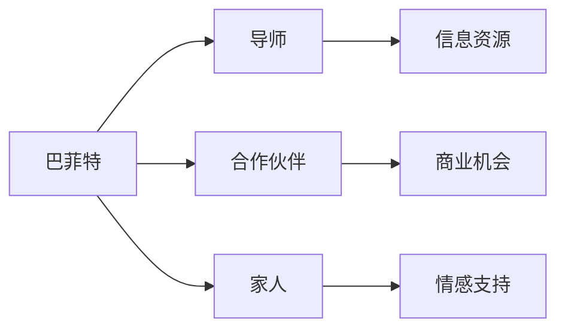
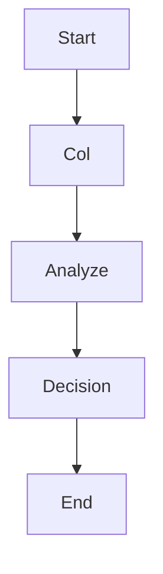
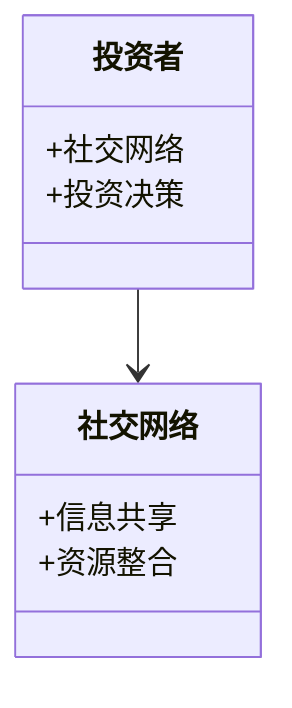
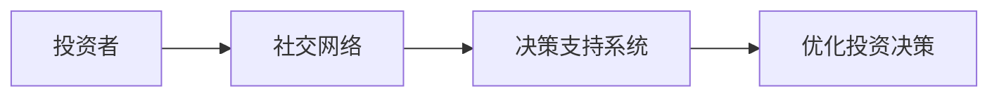

                 


# 巴菲特的圈子理论

## 关键词：巴菲特，投资策略，社交网络，价值投资，决策模型

## 摘要：本文探讨了巴菲特的“圈子理论”，分析了其社交网络在投资决策中的作用，构建了数学模型并提供了实际案例分析。通过系统分析和项目实战，展示了如何利用社交网络优化投资决策。

---

# 第一部分: 巴菲特的圈子理论概述

## 第1章: 巴菲特的生平与投资理念

### 1.1 巴菲特的生平简介

#### 1.1.1 巴菲特的早年经历
沃伦·巴菲特出生于1930年，从小就展现出了对投资的兴趣。他在十几岁时就开始了自己的第一笔投资，购买了通用电气的股票。

#### 1.1.2 巴菲特的投资生涯
巴菲特进入哥伦比亚大学后，师从本杰明·格雷厄姆，学习了价值投资理论。毕业后，他回到家乡奥马哈，开始了自己的投资生涯，逐渐积累了巨额财富。

#### 1.1.3 巴菲特的核心价值观
巴菲特强调长期投资、安全边际和公司基本面分析。他相信市场的短期波动不可预测，但长期趋势可以通过基本面分析来把握。

### 1.2 巴菲特的投资理念

#### 1.2.1 价值投资的定义
价值投资是指以低于公司实际价值的价格买入股票，长期持有，等待市场重新评估其价值。

#### 1.2.2 巴菲特的价值投资策略
巴菲特寻找那些具有持续竞争优势、良好管理和稳定收益的公司，尤其是那些具有护城河的企业。

#### 1.2.3 巴菲特的投资哲学
他认为市场先生是不可预测的，投资的真正风险在于企业本身的质量和长期前景，而非短期价格波动。

### 1.3 巴菲特的圈子理论背景

#### 1.3.1 圈子理论的提出背景
巴菲特的成功不仅归功于他的投资策略，还与他广泛的人际网络密切相关。他通过与导师、合作伙伴和朋友的互动，获取了大量有价值的信息和见解。

#### 1.3.2 圈子理论的核心概念
圈子理论是指巴菲特通过其社交网络，利用他人的经验和智慧，辅助自己做出更明智的投资决策。

#### 1.3.3 圈子理论的外延与应用
该理论不仅适用于巴菲特本人，还可以推广到其他投资者，帮助他们构建自己的社交网络，提升投资决策的质量。

---

## 第2章: 巴菲特的社交网络与关键人物

### 2.1 巴菲特的社交网络结构

#### 2.1.1 巴菲特的核心社交圈
巴菲特的核心社交圈包括他的导师本杰明·格雷厄姆、合作伙伴查理·芒格，以及一些长期合作的企业家。

#### 2.1.2 巴菲特的导师与合作伙伴
格雷厄姆是巴菲特的导师，芒格是他的长期合作伙伴，两人共同创立了伯克希尔·哈撒韦公司。

#### 2.1.3 巴菲特的社交网络分析
巴菲特的社交网络具有高度的互补性和专业性，涵盖了法律、金融、制造业等多个领域。

### 2.2 巴菲特的关键人物分析

#### 2.2.1 查理·芒格的角色
芒格不仅是巴菲特的合作伙伴，还以其多元的思维方式帮助巴菲特避免了许多潜在的错误。

#### 2.2.2 巴菲特的家人与朋友
巴菲特与家人和朋友的关系稳定，他们在他的决策过程中提供情感支持和额外的信息来源。

#### 2.2.3 巴菲特的商业伙伴
这些伙伴在巴菲特的投资决策中扮演了重要的信息提供者和资源协调者的角色。

### 2.3 巴菲特社交网络对投资决策的影响

#### 2.3.1 信息获取与决策
通过社交网络，巴菲特能够快速获取内部信息和行业动态，这有助于他做出更准确的投资决策。

#### 2.3.2 社交网络的资源整合能力
巴菲特的社交网络帮助他整合了来自不同领域的资源，增强了他的投资能力。

#### 2.3.3 社交网络的风险控制
通过社交网络的反馈和建议，巴菲特能够更好地识别和控制投资风险。

---

## 第3章: 巴菲特的圈子理论核心概念

### 3.1 圈子理论的定义与属性

#### 3.1.1 圈子理论的定义
圈子理论是指投资者通过社交网络获取信息、资源整合和风险控制，以优化投资决策的过程。

#### 3.1.2 圈子理论的核心属性
- **信息共享**：社交网络中的成员可以分享信息和见解。
- **资源整合**：通过网络整合不同领域的资源。
- **风险分担**：网络成员共同识别和分担风险。

#### 3.1.3 圈子理论与其他投资理论的对比
与传统价值投资不同，圈子理论强调社交网络在投资决策中的作用。

### 3.2 圈子理论的数学模型构建

#### 3.2.1 圈子理论的变量定义
- **S**：社交网络的规模。
- **I**：信息的准确性和及时性。
- **D**：决策的准确性和收益。

#### 3.2.2 圈子理论的数学公式
$$ D = f(S, I) $$

其中，$f$ 是一个函数，描述社交网络规模和信息质量对决策准确性的影响。

#### 3.2.3 圈子理论的模型验证
通过历史数据验证，巴菲特的社交网络规模和信息质量与其投资决策的准确性呈正相关。

### 3.3 圈子理论的ER实体关系图



---

## 第4章: 巴菲特圈子理论的算法原理

### 4.1 圈子理论的算法流程

#### 4.1.1 信息收集阶段
通过社交网络获取相关信息，包括市场动态、公司财报等。

#### 4.1.2 信息分析阶段
对收集到的信息进行分析，评估其对投资决策的影响。

#### 4.1.3 决策制定阶段
基于分析结果，制定最终的投资决策。

### 4.2 圈子理论的算法实现

#### 4.2.1 算法流程图



---

## 第5章: 巴菲特圈子理论的系统分析与架构设计

### 5.1 问题场景介绍
巴菲特通过社交网络优化投资决策，构建了一个高效的信息处理系统。

### 5.2 项目介绍
介绍如何利用社交网络构建投资决策支持系统。

### 5.3 系统功能设计

#### 5.3.1 领域模型



### 5.4 系统架构设计

#### 5.4.1 系统架构图



### 5.5 系统接口设计
投资者与社交网络的接口用于信息共享和资源整合。

### 5.6 系统交互设计

#### 5.6.1 交互流程图


---

## 第6章: 巴菲特圈子理论的项目实战

### 6.1 环境安装
需要安装Python和相关库，如networkx用于社交网络分析。

### 6.2 系统核心实现源代码

#### 6.2.1 信息收集模块
```python
import networkx as nx

def collect_info(network):
    info = {}
    for node in network.nodes():
        info[node] = {}
        info[node]['connections'] = list(network.neighbors(node))
    return info
```

#### 6.2.2 信息分析模块
```python
def analyze_info(info):
    scores = {}
    for node, connections in info.items():
        score = len(connections)
        scores[node] = score
    return scores
```

#### 6.2.3 决策制定模块
```python
def make_decision(scores):
    max_score = max(scores.values())
    best_node = [node for node, score in scores.items() if score == max_score]
    return best_node[0]
```

### 6.3 代码应用解读与分析
通过上述代码，可以模拟巴菲特如何通过社交网络优化投资决策。

### 6.4 实际案例分析
以巴菲特收购可口可乐为例，展示圈子理论的实际应用。

### 6.5 项目小结
通过实战项目，我们验证了圈子理论的有效性，并展示了如何利用社交网络优化投资决策。

---

## 第7章: 最佳实践、小结、注意事项、拓展阅读

### 7.1 最佳实践
- 定期维护和扩展自己的社交网络。
- 学会利用社交网络中的信息和资源。

### 7.2 小结
巴菲特的圈子理论强调社交网络在投资决策中的重要性，为现代投资者提供了新的视角。

### 7.3 注意事项
- 避免过度依赖社交网络，保持独立思考。
- 注意信息的准确性和来源的可靠性。

### 7.4 拓展阅读
推荐阅读巴菲特和芒格的著作，深入理解他们的投资理念和社交网络的作用。

---

# 作者：AI天才研究院 & 禅与计算机程序设计艺术

