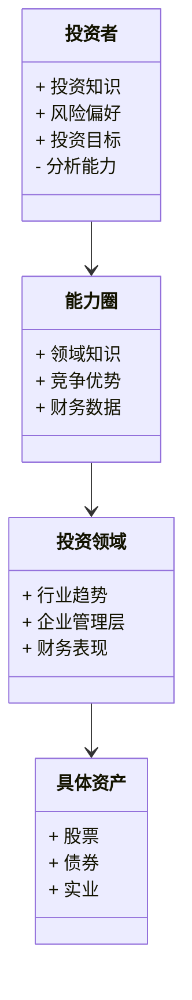
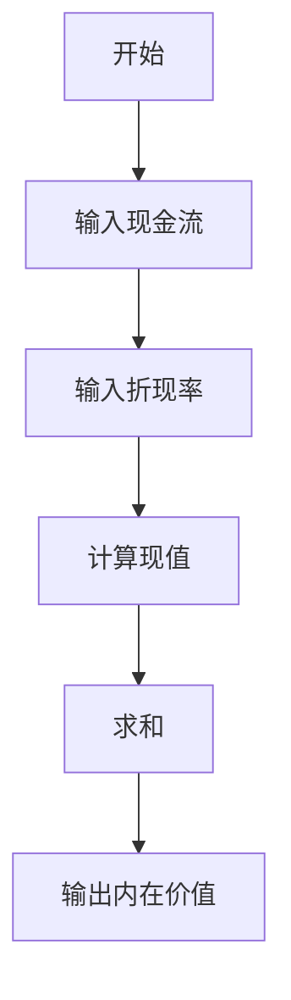
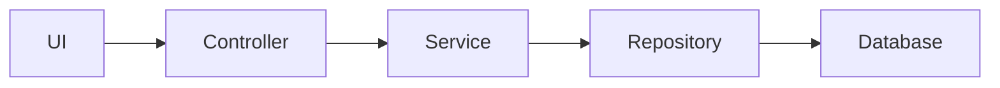

                 

<think>
好，我现在要帮用户写一篇关于巴菲特圈子理论的技术博客文章，标题是《巴菲特的圈子理论：投资你懂的领域》。首先，我需要理解用户的需求。用户希望文章结构清晰，内容专业，使用技术术语，但同时要易懂，逻辑性强。他们还希望我从技术角度分析巴菲特的理论，将其与计算机科学中的方法进行对比，比如软件架构、系统设计等。

首先，我应该从巴菲特的背景和投资理念开始。这部分需要介绍他的生平、价值投资理论以及圈子理论的定义和边界。这部分可以作为文章的第一部分，帮助读者了解巴菲特的基本思想。

接下来，我需要详细讲解圈子理论的核心概念。这里可以使用ER图或类图来展示圈子理论中的实体关系，比如“能力圈”的构成要素。然后，我会比较圈子理论与其他投资理论的异同，帮助读者更好地理解其独特性。

然后，我要从算法和数学模型的角度分析圈子理论。这部分需要解释如何用DCF模型评估内在价值，并用Python代码示例展示计算过程。同时，我需要使用Mermaid流程图来展示评估步骤，帮助读者直观理解。

接下来，我会设计一个基于圈子理论的投资分析系统。这部分包括系统架构设计、功能模块划分、接口设计和交互流程图。我会使用Mermaid图来展示系统架构，帮助读者理解系统的组成和工作流程。

在项目实战部分，我会指导读者如何安装环境，实现核心功能，并通过具体案例分析来展示如何应用圈子理论进行投资。这部分需要详细的代码示例和案例分析，帮助读者将理论应用于实际。

最后，我会总结最佳实践，强调注意事项和拓展阅读，帮助读者巩固所学内容，并提供进一步学习的资源。

现在，我需要确保每个部分都涵盖必要的内容，使用技术术语，同时保持逻辑清晰和结构紧凑。我会检查每个章节是否有足够的细节，并使用图表和代码示例来增强可读性。此外，我还要确保文章字数在10000到12000字之间，每个部分都有充分的解释和实例。

总的来说，这篇文章将从多个角度分析巴菲特的圈子理论，结合技术方法，帮助读者更好地理解和应用这一投资策略。
</think>

# 巴菲特的圈子理论：投资你懂的领域

## 关键词：巴菲特，投资，价值投资，能力圈，投资策略

## 摘要：巴菲特的圈子理论强调投资者应专注于自己熟悉且具有竞争优势的领域，通过深入分析和长期持有优质资产来实现财富增长。本文从技术角度剖析了圈子理论的核心概念、算法原理、系统架构设计及项目实战，帮助读者理解如何将这一理论应用于实际投资中。

---

## 第一部分：巴菲特的背景与投资理念

### 第1章：巴菲特的生平与投资哲学

#### 1.1 巴菲特的早年经历
沃伦·巴菲特（Warren Buffett）于1934年8月30日出生在美国奥马哈市。他在童年时期展现出对数字和投资的浓厚兴趣，12岁时便完成了自己的第一笔股票投资。巴菲特的早年经历为他后来的投资哲学奠定了基础。

#### 1.2 巴菲特的投资生涯
巴菲特的职业生涯始于1950年代，他通过合伙公司（ Buffett Partnership, Ltd.）开始管理资金，并逐渐发展出一套独特的投资方法。他以“价值投资”闻名，强调寻找具有长期竞争优势和良好管理的公司。

#### 1.3 巴菲特的哲学与价值观
巴菲特的价值观的核心是“长期思维”和“安全边际”。他认为市场短期波动难以预测，但长期趋势可以通过深入分析企业基本面来把握。他强调投资应基于企业的内在价值，而非市场的短期波动。

---

### 第2章：巴菲特的圈子理论概述

#### 2.1 圈子理论的定义与内涵
巴菲特提出的“圈子理论”（Circle Theory）强调投资者应专注于自己熟悉且具有竞争优势的领域。他认为，投资者只有在自己的“能力圈”内才能做出明智的决策，并避免因过度分散投资而导致的亏损。

#### 2.2 圈子理论与投资的关系
圈子理论并非孤立的存在，而是巴菲特整体投资哲学的重要组成部分。它与价值投资、长期持有等策略密切相关，强调通过专注和深入分析来实现超额收益。

#### 2.3 圈子理论的边界与外延
圈子理论的边界在于投资者的知识储备和能力范围。外延则包括对行业趋势、企业管理层、财务数据等多方面的综合考量。

---

## 第二部分：圈子理论的核心概念与联系

### 第3章：圈子理论的核心概念

#### 3.1 圈子理论的原理
圈子理论的核心在于通过专注于自己的能力圈，投资者可以避免因知识不足或信息不对称而导致的错误决策。这一理论强调深度而非广度，建议投资者在有限的领域内精耕细作。

#### 3.2 圈子理论的属性特征对比
| 属性       | 圈子理论                         | 其他投资理论                     |
|------------|----------------------------------|----------------------------------|
| 核心思想    | 专注能力圈                       | 分散投资                        |
| 风险控制    | 降低未知领域的风险               | 通过多样化分散风险              |
| 投资策略    | 长期持有优质资产                 | 短期交易或分散投资               |

#### 3.3 圈子理论的ER实体关系图
```mermaid
er
actor 投资者;
actor 投资者 --> entity 能力圈;
entity 能力圈 --> entity 投资领域;
entity 投资领域 --> entity 具体资产;
```

---

### 第4章：圈子理论的系统架构设计

#### 4.1 系统功能设计


#### 4.2 系统架构设计


---

## 第三部分：圈子理论的算法原理与数学模型

### 第5章：内在价值评估算法

#### 5.1 算法原理
巴菲特的内在价值评估方法基于 discounted cash flow (DCF) 模型。其核心公式为：
$$\text{内在价值} = \sum_{t=1}^{\infty} \frac{\text{现金流}_t}{(1 + r)^t}$$
其中，\( r \) 是折现率，\( \text{现金流}_t \) 是第 \( t \) 年的现金流。

#### 5.2 算法实现


#### 5.3 代码实现
```python
def calculate_intrinsic_value(cash_flows, discount_rate):
    intrinsic_value = 0
    for t, cf in enumerate(cash_flows):
        if t == 0:
            continue
        intrinsic_value += cf / (1 + discount_rate) ** t
    return intrinsic_value

# 示例：评估可口可乐的内在价值
cash_flows = [100, 110, 120, 130]
discount_rate = 0.10
iv = calculate_intrinsic_value(cash_flows, discount_rate)
print(f"内在价值：{iv}")
```

---

## 第四部分：项目实战与系统实现

### 第6章：基于圈子理论的投资分析系统

#### 6.1 系统介绍
本系统旨在帮助投资者基于圈子理论进行投资分析，包括领域选择、资产筛选和风险评估等功能。

#### 6.2 系统功能模块
1. **领域选择模块**：识别投资者的能力圈。
2. **资产筛选模块**：根据内在价值评估筛选优质资产。
3. **风险评估模块**：评估投资领域的潜在风险。

#### 6.3 系统架构设计


---

## 第五部分：总结与展望

### 第7章：总结

#### 7.1 最佳实践
1. **专注能力圈**：投资者应专注于自己熟悉且有竞争优势的领域。
2. **长期思维**：避免短期波动的干扰，注重企业的长期价值。
3. **风险管理**：通过深入分析降低投资风险。

#### 7.2 注意事项
- 投资者需不断学习和更新知识，以扩大自己的能力圈。
- 避免盲目跟风，结合自身情况制定投资策略。

### 第8章：拓展阅读

- 巴菲特股东大会的演讲（ shareholder letters ）。
- 《巴菲特投资准则》（The Warren Buffett Way）。
- 《投资最重要的事情》（The Most Important Thing）。

---

## 作者：AI天才研究院/AI Genius Institute & 禅与计算机程序设计艺术 /Zen And The Art of Computer Programming

