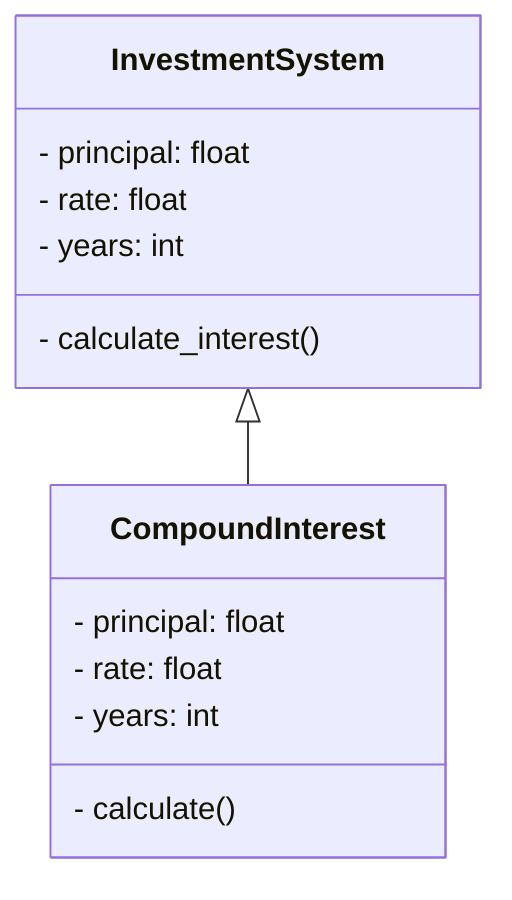
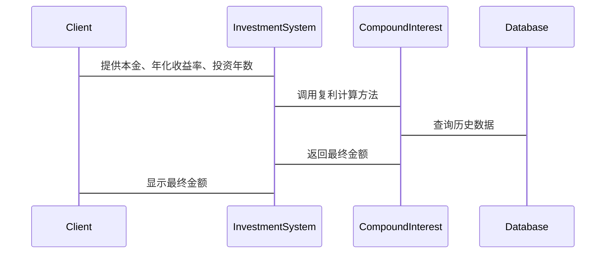

                 


# 巴菲特的复利效应投资观

> 关键词：复利效应，巴菲特，投资策略，价值投资，长期回报，资产增值

> 摘要：本文从巴菲特的复利效应投资观出发，详细分析复利效应的核心概念、算法原理、系统架构，并结合实际案例，探讨复利效应在投资中的应用与实践。文章结合技术视角，使用专业术语与实际代码示例，深入剖析复利效应的数学模型与投资策略，为读者提供全面而深入的理论与实践指导。

---

# 第1章: 复利效应的背景与重要性

## 1.1 复利效应的定义与特点

### 1.1.1 复利效应的定义

复利效应（Compound Interest）是指在投资中，本金产生的收益再次加入本金，成为新的本金，以此类推，从而实现收益的指数级增长。其核心公式为：

$$
A = P \times (1 + r)^n
$$

其中：
- $A$ 是最终金额
- $P$ 是初始本金
- $r$ 是年化收益率
- $n$ 是投资年数

复利效应的特征是“利滚利”，即收益再投资，从而实现几何级数的增长。

### 1.1.2 复利效应的核心特点

| 特性 | 描述 |
|------|------|
| 时间敏感性 | 复利效应的时间价值越长，资产增值越显著 |
| 收益递增性 | 随着时间推移，收益增长呈指数级 |
| 资本放大性 | 小额投资通过复利效应可以实现资产的大幅增值 |

### 1.1.3 复利效应在投资中的重要性

复利效应是巴菲特投资成功的核心理念之一。他强调长期持有优质资产，通过复利效应实现财富的指数级增长。巴菲特曾说：“时间是伟大企业的朋友，是平庸企业的敌人。”复利效应的长期性与巴菲特的价值投资理念高度契合。

---

## 1.2 巴菲特的背景与投资哲学

### 1.2.1 巴菲特的生平简介

沃伦·巴菲特（Warren Buffett）是世界著名投资家、慈善家，被誉为“股神”。他通过长期价值投资和复利效应，从一个普通的投资者成长为全球最成功的投资者之一。巴菲特的投资理念以“买入并持有”为核心，注重企业的内在价值。

### 1.2.2 巴菲特的投资理念

巴菲特的投资哲学可以概括为以下几个方面：
1. **价值投资**：寻找具有持续竞争优势的企业，长期持有。
2. **安全边际**：以低于内在价值的价格买入资产。
3. **复利效应**：通过长期持有优质资产，实现财富的指数级增长。

### 1.2.3 巴菲特与复利效应的关联

巴菲特将复利效应视为投资成功的关键因素。他认为，复利效应不仅适用于金融投资，也适用于企业管理和个人生活。通过长期复利效应，投资者可以实现财富的稳步增长。

---

## 1.3 复利效应的数学模型与公式

### 1.3.1 复利计算公式

复利计算的核心公式为：

$$
A = P \times (1 + r)^n
$$

其中：
- $P$ 是初始本金
- $r$ 是年化收益率
- $n$ 是投资年数

通过上述公式，我们可以计算出投资的最终价值。例如，假设初始本金为10000元，年化收益率为10%，投资20年，最终价值为：

$$
A = 10000 \times (1 + 0.10)^{20} \approx 469,693.21 \text{元}
$$

### 1.3.2 复利与单利的对比

| 对比维度 | 单利 | 复利 |
|----------|------|------|
| 计算方式 | $I = P \times r \times t$ | $A = P \times (1 + r)^t$ |
| 收益来源 | 只有本金产生的利息 | 利息再投资产生的利息 |

### 1.3.3 复利的三要素（本金、利率、时间）

复利效应的三要素中，时间是最重要的因素。长期投资通过复利效应可以实现资产的几何级数增长。

---

## 1.4 复利效应在投资中的应用

### 1.4.1 股票投资中的复利效应

通过长期持有优质股票，投资者可以享受复利效应带来的收益。例如，投资于苹果公司（AAPL）的股票，长期持有可以获得指数级的资本增值。

### 1.4.2 债券投资中的复利效应

债券投资也可以通过复利效应实现收益最大化。例如，购买年利率为5%的债券，每年的利息收入再投资债券，可以实现复利增长。

### 1.4.3 复利效应与长期投资的关系

长期投资是复利效应实现的前提条件。通过长期持有优质资产，投资者可以最大化复利效应的收益。

---

## 1.5 本章小结

本章从复利效应的定义、特点、数学模型等方面进行了详细分析，并结合巴菲特的投资哲学，探讨了复利效应在投资中的重要性。通过本章的学习，读者可以理解复利效应的核心概念及其在投资中的应用。

---

# 第2章: 复利效应的核心概念与联系

## 2.1 复利效应的原理

### 2.1.1 复利的数学模型

复利效应的数学模型可以表示为：

$$
A = P \times (1 + r)^n
$$

其中，$P$ 是初始本金，$r$ 是年化收益率，$n$ 是投资年数。

### 2.1.2 复利的三要素分析

复利效应的三要素分别是本金、利率和时间。其中，时间是影响复利效应的最关键因素。

### 2.1.3 复利的几何增长特性

复利效应的增长是几何级数的，即每期的收益都加入本金，从而实现指数级增长。

---

## 2.2 复利效应与投资回报的关系

### 2.2.1 投资回报的复利公式

投资回报的复利公式为：

$$
A = P \times (1 + r)^n
$$

其中，$A$ 是最终的资产价值，$P$ 是初始本金，$r$ 是年化收益率，$n$ 是投资年数。

### 2.2.2 复利效应与资产增值的关系

通过复利效应，资产可以在长期内实现指数级增长。例如，100元的投资，年化收益率为10%，投资30年后，最终价值为：

$$
A = 100 \times (1 + 0.10)^{30} \approx 19,523.56 \text{元}
$$

### 2.2.3 复利效应的长期效应

长期投资是复利效应实现的关键。通过长期持有优质资产，投资者可以最大化复利效应的收益。

---

## 2.3 复利效应与风险控制的结合

### 2.3.1 风险对复利效应的影响

风险是复利效应的最大敌人。投资中的风险可能导致本金亏损，从而打断复利效应的增长。

### 2.3.2 如何通过分散投资降低风险

分散投资是降低风险的重要策略。通过投资不同类型的资产，可以降低单一资产波动对整体投资的影响。

### 2.3.3 巴菲特的风险控制策略

巴菲特强调安全边际和优质资产。他通过选择具有持续竞争优势的企业，降低投资风险。

---

## 2.4 本章小结

本章从复利效应的原理、与投资回报的关系以及风险控制三个方面进行了详细分析。通过本章的学习，读者可以理解复利效应的核心机制及其在投资中的应用。

---

# 第3章: 复利效应的算法原理与数学模型

## 3.1 复利计算的算法流程

### 3.1.1 复利计算的基本步骤

复利计算的基本步骤如下：
1. 确定初始本金 $P$。
2. 确定年化收益率 $r$。
3. 确定投资年数 $n$。
4. 计算最终金额 $A$，公式为：
   $$
   A = P \times (1 + r)^n
   $$

### 3.1.2 复利计算的实现代码

以下是一个简单的复利计算代码：

```python
def compound_interest(P, r, n):
    return P * (1 + r) ** n

# 示例计算
P = 10000
r = 0.10
n = 20
A = compound_interest(P, r, n)
print(f"最终金额为：{A:.2f}元")
```

### 3.1.3 复利计算的流程图

```mermaid
graph TD
    A[开始] -> B[输入本金P]
    B -> C[输入年化收益率r]
    C -> D[输入投资年数n]
    D -> E[计算A = P*(1+r)^n]
    E -> F[输出结果]
```

---

## 3.2 复利效应的数学模型

### 3.2.1 复利计算公式

复利计算公式为：

$$
A = P \times (1 + r)^n
$$

### 3.2.2 复利的几何增长模型

复利效应的增长模型是几何级数增长，即每期的收益都加入本金，从而实现指数级增长。

### 3.2.3 复利的年金现值公式

年金现值公式为：

$$
PV = \frac{P \times (1 - (1 + r)^{-n})}{r}
$$

---

## 3.3 复利效应的算法实现

### 3.3.1 复利计算的Python代码实现

```python
def compound_interest(P, r, n):
    return P * (1 + r) ** n

# 示例计算
P = 10000
r = 0.10
n = 20
A = compound_interest(P, r, n)
print(f"最终金额为：{A:.2f}元")
```

### 3.3.2 复利计算的流程图

```mermaid
graph TD
    A[开始] -> B[输入本金P]
    B -> C[输入年化收益率r]
    C -> D[输入投资年数n]
    D -> E[计算A = P*(1+r)^n]
    E -> F[输出结果]
```

---

## 3.4 本章小结

本章从复利效应的算法原理、数学模型和Python代码实现三个方面进行了详细分析。通过本章的学习，读者可以掌握复利效应的具体计算方法和实现技巧。

---

# 第4章: 复利效应的系统分析与架构设计

## 4.1 问题场景介绍

本章将从系统架构的角度，分析复利效应在投资管理系统中的应用。我们假设一个投资管理系统，旨在帮助投资者实现复利效应的长期投资。

---

## 4.2 项目介绍

### 4.2.1 项目目标

本项目旨在通过复利效应的算法，实现投资金额的长期增值。

### 4.2.2 项目范围

本项目涉及投资金额的复利计算、投资策略的制定以及投资回报的分析。

### 4.2.3 项目约束

- 投资金额必须为正数
- 年化收益率必须为正数
- 投资年数必须大于等于1

---

## 4.3 系统功能设计

### 4.3.1 领域模型（mermaid类图）



### 4.3.2 系统架构设计（mermaid架构图）


### 4.3.3 系统接口设计

- 输入接口：
  - 本金（principal）
  - 年化收益率（rate）
  - 投资年数（years）

- 输出接口：
  - 最终金额（final_amount）

### 4.3.4 系统交互流程（mermaid序列图）



---

## 4.4 本章小结

本章从系统架构的角度，分析了复利效应在投资管理系统中的应用。通过类图、架构图和交互图的绘制，我们详细描述了系统的功能模块和交互流程。

---

# 第5章: 复利效应的项目实战

## 5.1 环境安装

### 5.1.1 安装Python

请确保已经安装了Python 3.8或更高版本。

### 5.1.2 安装必要的库

```bash
pip install pandas numpy
```

---

## 5.2 系统核心实现

### 5.2.1 复利计算的Python实现

```python
import numpy as np
import pandas as pd

def compound_interest(P, r, n):
    return P * (1 + r) ** n

# 示例数据
P = [10000, 20000, 30000]
r = 0.10
n = 20

# 计算复利
results = [compound_interest(p, r, n) for p in P]

# 输出结果
df = pd.DataFrame({'本金': P, '最终金额': results})
print(df)
```

### 5.2.2 代码应用解读与分析

上述代码通过循环计算不同本金的复利效应，并将结果存储在DataFrame中。通过这种方法，我们可以直观地看到本金对复利效应的影响。

---

## 5.3 实际案例分析

### 5.3.1 投资金额的复利计算

假设我们投资10000元，年化收益率为10%，投资20年，最终金额为：

$$
A = 10000 \times (1 + 0.10)^{20} \approx 469,693.21 \text{元}
$$

### 5.3.2 投资回报分析

通过上述计算，我们可以看到复利效应的长期性与指数级增长的特点。

---

## 5.4 本章小结

本章通过实际案例分析，展示了复利效应在投资中的具体应用。通过Python代码的实现，我们能够直观地看到复利效应的长期回报。

---

# 第6章: 复利效应的最佳实践

## 6.1 小结

复利效应是投资成功的关键因素之一。通过长期持有优质资产，投资者可以实现财富的指数级增长。

## 6.2 注意事项

- 投资有风险，需谨慎选择投资标的
- 长期投资是复利效应实现的前提
- 风险控制是投资成功的重要保障

## 6.3 拓展阅读

- 《巴菲特致股东的信》
- 《穷爸爸富爸爸》
- 《投资学》

---

# 作者

作者：AI天才研究院/AI Genius Institute & 禅与计算机程序设计艺术/Zen And The Art of Computer Programming

---

以上是关于《巴菲特的复利效应投资观》的完整目录大纲和文章内容。

