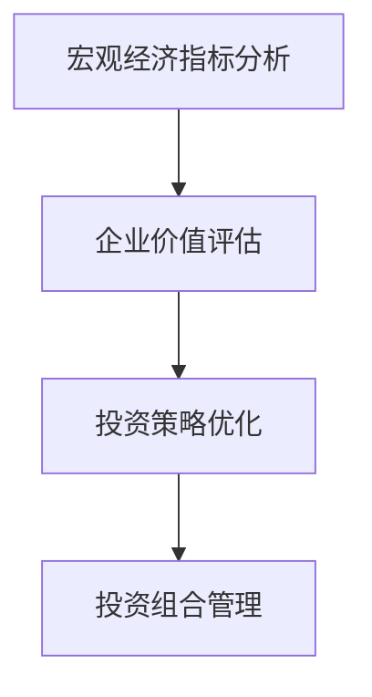
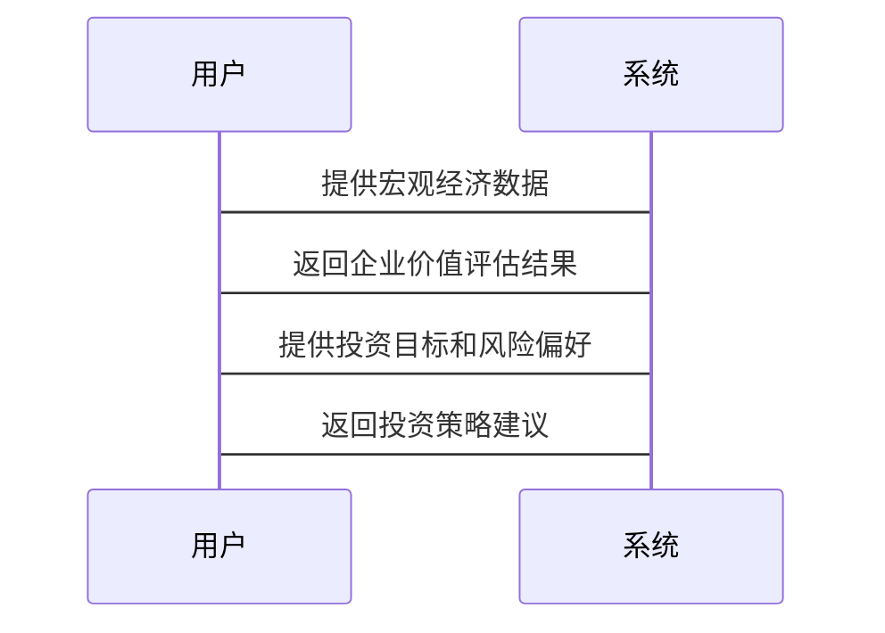

                 

<think>
好，现在我需要帮助用户完成他们请求的《巴菲特的宏观经济分析：全球化背景下的投资策略》一书的目录大纲。用户明确要求使用逻辑清晰、结构紧凑、简单易懂的专业技术语言，并且每个章节都要有详细的分析和推理。此外，用户还提供了一些具体的格式要求，包括关键词、摘要以及目录结构等。

首先，我应该先明确这本书的核心主题是什么。用户希望探讨巴菲特的宏观经济分析方法，并将其应用到全球化背景下的投资策略中。因此，我需要确保目录能够涵盖巴菲特的宏观经济分析基础、其投资策略在全球化环境下的应用，以及具体的算法和模型。

接下来，我需要思考如何将这些内容分成若干章节。从用户的目录大纲来看，已经分为七个部分，包括背景、核心概念、算法模型、全球化影响、投资策略、风险管理以及系统架构。这基本上覆盖了巴菲特投资方法的各个方面。

让我再仔细分析每一章的内容。第一章主要是背景介绍，包括巴菲特的宏观经济分析的起源、核心要素以及全球化对投资策略的影响。这部分需要详细解释宏观经济分析的基本概念，以及巴菲特独特的方法如何在全球化背景下显得尤为重要。

第二章深入探讨巴菲特宏观经济分析的核心框架，包括经济指标、行业周期分析和企业财务状况评估。我需要确保这些部分能够清晰地展示巴菲特的方法，并且与传统的宏观经济分析有所区别。此外，还需要引入一些数学模型，如现金流折现模型，来具体说明他的投资决策逻辑。

第三章则聚焦于全球化背景下的宏观经济分析，探讨全球化对企业成本、收入增长以及竞争优势的影响。这部分需要分析全球化如何改变企业的经营环境，并且如何影响宏观经济指标，如经济增长率和通货膨胀率。我还需要考虑如何将这些因素融入到巴菲特的投资策略中。

第四章是关于算法与模型的详细讲解。这里需要具体说明巴菲特使用的数学模型，如企业价值评估公式和现金流折现模型。我需要确保这些模型不仅被描述，还要通过实际案例来说明它们的应用，这样读者能够更好地理解这些模型的实际操作。

第五章讨论全球化背景下的投资策略，包括投资组合的构建与优化。这里需要探讨如何在全球化的背景下分散投资风险，并利用对冲工具来降低宏观经济波动带来的影响。同时，还需要分析巴菲特的投资策略如何在全球化背景下进行调整和优化。

第六章则是风险管理与投资策略的结合。这里需要详细阐述风险管理的核心原则，以及如何将风险管理融入到投资策略中。我需要讨论风险与收益的平衡，对冲工具的使用，以及在投资组合中进行风险管理的具体方法。

第七章是系统架构，这部分需要设计一个完整的系统来支持巴菲特的宏观经济分析。我需要包括系统架构的设计、功能模块的划分、接口设计以及系统交互流程。这部分可能需要使用Mermaid图来展示系统的结构和流程，确保读者能够清晰理解系统的运作方式。

在编写过程中，我需要确保每一章的内容都符合用户的格式要求，包括使用markdown格式，数学公式用latex表示，并且在适当的地方使用Mermaid图来展示流程和架构。此外，用户还要求在文章末尾加上特定的作者信息，这一点也需要被注意到。

最后，我需要确保整篇文章的逻辑连贯，结构紧凑，每一章节的内容都能紧密围绕主题展开，并且能够为读者提供深入的分析和实用的见解。通过这样的思考过程，我相信能够为用户提供一份符合要求的目录大纲，帮助他们完成《巴菲特的宏观经济分析：全球化背景下的投资策略》一书的撰写工作。
</think>

# 巴菲特的宏观经济分析：全球化背景下的投资策略

## 关键词
- 巴菲特宏观经济分析
- 投资策略
- 全球化
- 企业价值评估
- 风险管理

## 摘要
本文系统地探讨了巴菲特的宏观经济分析方法，并将其应用到全球化背景下的投资策略中。通过分析巴菲特的核心理念、宏观经济指标与企业价值的关系，以及全球化对企业竞争优势的影响，本文构建了一个基于巴菲特思想的宏观经济分析框架。结合实际案例和数学模型，本文详细阐述了如何在全球化背景下优化投资组合，进行风险管理，并构建高效的投资系统。

---

## 第一章 巴菲特宏观经济分析概述

### 1.1 巴菲特宏观经济分析的背景
#### 1.1.1 宏观经济分析的核心概念
- 宏观经济分析：研究整体经济运行状况，包括GDP、通货膨胀率、利率等指标。
- 巴菲特的投资理念：寻找具有持续竞争优势的企业，关注长期价值而非短期波动。

#### 1.1.2 巴菲特投资理念的起源与演变
- 起源：巴菲特早期的投资理念受到本杰明·格雷厄姆的影响，注重安全边际和内在价值。
- 演变：逐步发展出“企业护城河”概念，强调竞争优势的可持续性。

#### 1.1.3 全球化背景下的宏观经济挑战
- 全球化对经济周期的影响：全球化使得经济周期更加复杂，区域经济联动性增强。
- 全球化对企业的影响：企业可以通过全球化扩展市场，但也面临更大的竞争压力。

---

## 第二章 巴菲特宏观经济分析的核心框架

### 2.1 宏观经济指标与企业价值的关系
#### 2.1.1 经济增长对企业利润的影响
- 经济增长：GDP增长通常带来企业收入增长。
- 通货膨胀：适度通胀对企业有利，但过高的通胀会侵蚀利润。

#### 2.1.2 行业周期分析
- 行业周期：从幼稚期到成熟期，不同阶段的投资策略不同。
- 巴菲特的选择：倾向于投资处于成熟期但具有稳定现金流的企业。

#### 2.1.3 企业财务状况评估
- 财务健康度：关注企业的盈利能力、资产负债情况和现金流。
- 安全边际：确保投资价格低于企业内在价值。

### 2.2 巴菲特投资决策的逻辑模型
#### 2.2.1 企业价值评估公式
$$
\text{内在价值} = \frac{\text{未来现金流}}{\text{折现率}}
$$

#### 2.2.2 经济指标对企业估值的影响
- 利率对企业估值的传导机制：低利率环境通常抬高资产的估值。
- 通货膨胀对企业利润的影响：适度通胀增加企业利润，但过高通胀会侵蚀利润。

#### 2.2.3 投资组合优化的数学模型
$$
\text{最优投资组合} = \argmin_w \left( w^T \Sigma w \right)
$$
其中，\( w \) 是投资组合权重，\( \Sigma \) 是资产之间的协方差矩阵。

---

## 第三章 全球化背景下的宏观经济分析

### 3.1 全球化对企业的影响
#### 3.1.1 全球化对企业成本结构的优化
- 全球化采购：降低原材料成本。
- 跨境生产：利用不同地区的成本优势。

#### 3.1.2 全球化对企业收入增长的推动
- 全球市场扩展：扩大销售规模。
- 品牌影响力：全球化提升品牌价值。

#### 3.1.3 全球化对企业风险的放大
- 汇率风险：跨国经营面临汇率波动。
- 政治风险：不同国家的政治环境差异。

### 3.2 全球化背景下的经济周期分析
#### 3.2.1 全球经济周期的联动性
- 经济周期的同步性：全球化使得全球经济周期趋于同步。
- 区域差异：不同国家的经济周期可能不同，需关注区域差异。

#### 3.2.2 区域经济差异对投资策略的影响
- 发达国家与新兴市场：发达国家市场稳定，新兴市场增长快但风险高。
- 区域经济政策：关注各国货币政策和财政政策对企业的影响。

#### 3.2.3 全球化背景下企业的竞争优势分析
- 核心竞争力：企业的技术、品牌、成本优势。
- 全球化战略：企业的全球布局和资源整合能力。

---

## 第四章 巴菲特宏观经济分析的算法与模型

### 4.1 宏观经济指标的量化分析
#### 4.1.1 经济增长模型的建立
$$
\text{GDP} = C + I + G + X - M
$$
其中，C为消费，I为投资，G为政府支出，X为出口，M为进口。

#### 4.1.2 通货膨胀对企业利润的影响
- 通胀对企业成本的影响：原材料价格上涨影响利润。
- 通胀对收入的影响：适度通胀可能提升企业收入。

#### 4.1.3 利率对企业估值的传导机制
- 利率对企业融资成本的影响：利率上升会增加企业的融资成本。
- 利率对资产价格的影响：低利率环境通常抬高资产价格。

### 4.2 企业价值评估的数学模型
#### 4.2.1 企业价值公式
$$
\text{企业价值} = \text{息税折旧及摊销前利润} \times \text{EV/EBITDA倍数}
$$

#### 4.2.2 现金流折现模型
$$
\text{企业价值} = \sum_{t=1}^{n} \frac{\text{现金流}_t}{(1 + r)^t}
$$

#### 4.2.3 市盈率与市净率的对比分析
- 市盈率：$$ P/E = \frac{\text{股价}}{\text{每股收益}} $$
- 市净率：$$ P/B = \frac{\text{股价}}{\text{每股净资产}} $$

---

## 第五章 全球化背景下的投资策略

### 5.1 投资组合的构建与优化
#### 5.1.1 投资组合的分散化策略
- 分散化：通过投资不同行业、不同地区的资产降低风险。
- 资产配置：根据经济周期调整股票、债券、现金的比例。

#### 5.1.2 宏观经济风险的对冲机制
- 对冲工具：利用期货、期权等工具对冲利率、汇率等风险。
- 风险分散：通过全球化布局分散区域风险。

#### 5.1.3 全球化背景下资产配置的动态调整
- 动态调整：根据全球经济形势变化调整投资组合。
- 长期视角：关注企业的长期竞争优势，而非短期波动。

### 5.2 巴菲特投资策略的实际应用
#### 5.2.1 企业基本面分析的实际案例
- 案例：可口可乐的全球竞争优势。
- 分析：可口可乐的全球品牌影响力和稳定的现金流。

#### 5.2.2 经济周期分析在投资决策中的应用
- 经济周期与投资策略：在经济衰退期寻找被低估的企业，经济复苏期投资周期性行业。

#### 5.2.3 全球化背景下企业的竞争优势分析
- 全球化企业的竞争优势：全球供应链、品牌影响力、技术研发能力。

---

## 第六章 风险管理与投资策略的结合

### 6.1 风险管理的核心原则
#### 6.1.1 风险的定义与分类
- 系统性风险：市场风险、利率风险等。
- 非系统性风险：企业特定风险、行业风险等。

#### 6.1.2 风险评估的方法
- 定性分析：评估风险的性质和影响。
- 定量分析：通过数据量化风险。

#### 6.1.3 风险控制的策略
- 风险分散：通过投资多样化降低风险。
- 风险对冲：利用金融工具对冲特定风险。

### 6.2 投资策略中的风险管理
#### 6.2.1 风险与收益的平衡
- 风险厌恶：投资者的风险偏好影响投资策略。
- 风险溢价：高风险投资需要更高的回报。

#### 6.2.2 风险对冲的工具与方法
- 期货对冲：利用期货市场对冲价格波动风险。
- 期权对冲：利用期权对冲特定资产的价格风险。

#### 6.2.3 风险管理在投资组合中的应用
- 投资组合的风险调整：根据风险承受能力调整投资组合。
- 风险监控：定期评估投资组合的风险敞口。

---

## 第七章 巴菲特宏观经济分析的系统架构

### 7.1 系统架构的总体设计
#### 7.1.1 系统目标
- 构建一个基于巴菲特宏观经济分析的投资决策支持系统。
- 提供全球化背景下的投资策略建议。

#### 7.1.2 系统功能模块
- 宏观经济指标分析模块：分析GDP、通货膨胀率等指标。
- 企业价值评估模块：评估企业的内在价值。
- 投资策略优化模块：根据宏观经济环境优化投资组合。

### 7.2 系统架构设计
#### 7.2.1 系统架构图

#### 7.2.2 系统接口设计
- 输入接口：宏观经济数据、企业财务数据。
- 输出接口：投资建议、风险评估报告。

#### 7.2.3 系统交互流程

---

## 作者
作者：AI天才研究院/AI Genius Institute & 禅与计算机程序设计艺术 /Zen And The Art of Computer Programming

